# AZV Motors Backend — Архитектура системы

> Версия документа: 2026-01-28
> Стек: Python 3.12 · FastAPI · PostgreSQL 15 · APScheduler · MinIO (S3) · Telegram Bot · WebSocket
> Деплой: Docker Compose · Uvicorn · порт 7139

---

## Оглавление

1. [Обзор системы](#1-обзор-системы)
2. [Компонентная диаграмма](#2-компонентная-диаграмма)
3. [Входные точки (Entry Points)](#3-входные-точки)
4. [Application Layer](#4-application-layer)
5. [Domain Layer](#5-domain-layer)
6. [Infrastructure Layer](#6-infrastructure-layer)
7. [Async / Background Processing](#7-async--background-processing)
8. [Auth / Security](#8-auth--security)
9. [Logging / Monitoring / Error Handling](#9-logging--monitoring--error-handling)
10. [Configuration и ENV](#10-configuration-и-env)
11. [Data Flow диаграммы](#11-data-flow-диаграммы)
12. [Sequence-диаграммы ключевых сценариев](#12-sequence-диаграммы-ключевых-сценариев)
13. [Структура директорий](#13-структура-директорий)
14. [Summary — Как читать эту архитектуру](#14-summary--как-читать-эту-архитектуру)

---

## 1. Обзор системы

AZV Motors — платформа каршеринга в Алматы (Казахстан). Backend обслуживает:

- **Мобильное приложение** (iOS/Android) — клиенты арендуют автомобили
- **Админ-панель** (Web) — управление парком, пользователями, финансами
- **Telegram-ботов** — мониторинг ошибок, техподдержка
- **GPS-сервис** — внешний микросервис для телеметрии автомобилей

### Ключевые бизнес-потоки

| Поток | Описание |
|-------|----------|
| Регистрация | SMS-верификация → загрузка документов → проверка финансистом → проверка МВД |
| Аренда | Бронирование → старт (selfie) → поминутный биллинг → завершение → расчёт |
| Доставка | Механик доставляет авто клиенту по координатам |
| Поддержка | Telegram-бот принимает сообщения → операторы отвечают через веб-панель |
| Кошелёк | Пополнение через ForteBank → списание за аренду → история транзакций |

---

## 2. Компонентная диаграмма

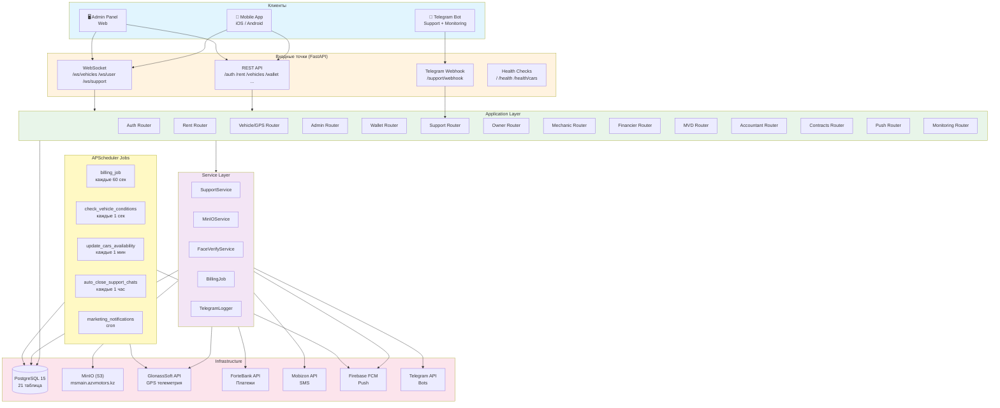

---

## 3. Входные точки

### 3.1 REST API Routers

Все роутеры регистрируются в `main.py` через `app.include_router(...)`.

| Router | Prefix | Роль | Кол-во эндпоинтов |
|--------|--------|------|-------------------|
| `Auth_router` | `/auth` | Регистрация, SMS, JWT, документы | ~12 |
| `Vehicle_Router` | `/vehicles` | GPS, телеметрия, команды авто | ~5 |
| `RentRouter` | `/rent` | Бронирование, аренда, биллинг | ~8 |
| `PushRouter` | `/notifications` | FCM токены, broadcast | ~4 |
| `WalletRouter` | `/wallet` | Баланс, транзакции, выписки | ~5 |
| `ContractsRouter` | `/contracts` | Загрузка/подпись договоров | ~6 |
| `HTMLContractsRouter` | `/contracts` | HTML-генерация договоров | ~3 |
| `SupportRouter` | `/support` | Чаты поддержки, Telegram | ~5 |
| `OwnerRouter` | `/owner` | Управление авто для владельцев | ~4 |
| `MechanicRouter` | `/mechanic` | Инспекции, обслуживание | ~3 |
| `MechanicDeliveryRouter` | `/mechanic-delivery` | Доставка авто | ~4 |
| `guarantor_router` | `/guarantor` | Поручительство | ~5 |
| `FinancierRouter` | `/financier` | Проверка заявок | ~3 |
| `MvdRouter` | `/mvd` | Проверка МВД | ~3 |
| `accountant_router` | `/accountant` | Финансовые отчёты | ~3 |
| `admin_router` | `/admin` | Админ-панель (cars, users, rentals, analytics) | ~20+ |
| `MonitoringRouter` | `/monitoring` | Метрики, статус сервисов | ~3 |
| `AppVersionsRouter` | `/app-versions` | Версии мобильного приложения | ~3 |
| `ErrorLogsRouter` | `/admin/error_logs` | Логи ошибок | ~3 |
| `websocket_router` | `/ws` | WebSocket подключения | 3 |

### 3.2 WebSocket

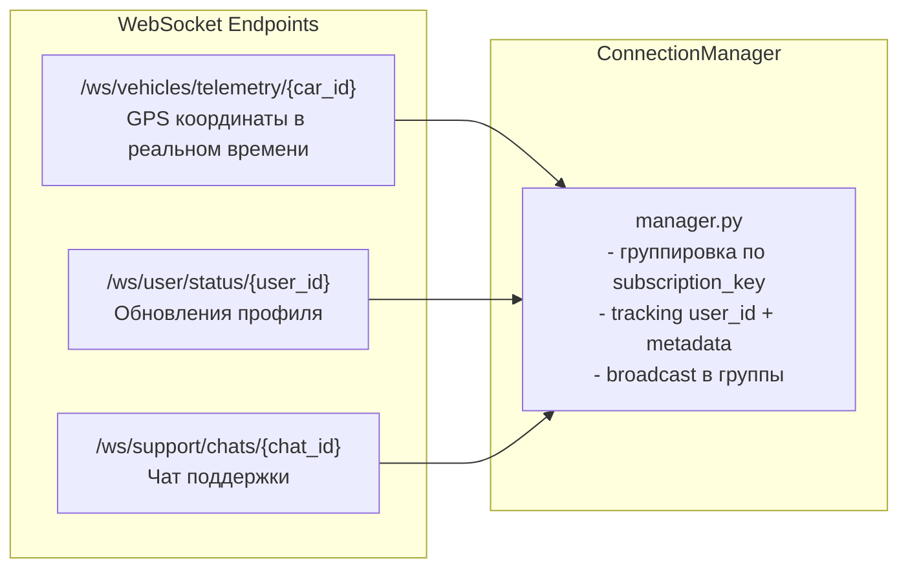

**Файлы:**
- `app/websocket/manager.py` — менеджер соединений
- `app/websocket/router.py` — WebSocket роутер
- `app/websocket/handlers.py` — обработчики сообщений
- `app/websocket/auth.py` — аутентификация WebSocket
- `app/websocket/notifications.py` — push в WebSocket-каналы

### 3.3 Telegram Webhook

Telegram-бот поддержки принимает входящие сообщения от пользователей:

1. Пользователь пишет боту в Telegram
2. Telegram отправляет webhook на `/support/webhook`
3. `telegram_bot.py` создаёт/обновляет `SupportChat` в БД
4. Операторы видят сообщение в веб-панели через WebSocket

### 3.4 Health Checks

| Endpoint | Назначение |
|----------|-----------|
| `GET /` | Базовая проверка (`{"message": "salam?"}`) |
| `GET /health` | Статус с timestamp |
| `GET /health/cars` | Проверка GPS-сервиса, алерт в Telegram при недоступности |
| `GET /test-websocket` | Список WebSocket эндпоинтов |
| `GET /list_routes` | Все зарегистрированные маршруты |

---

## 4. Application Layer

### 4.1 Архитектурный паттерн

Проект использует **Router-centric** архитектуру (не Clean Architecture). Бизнес-логика находится непосредственно в обработчиках роутеров. Сервисный слой выделен частично — только для сложных интеграций.

```
Request → Middleware Chain → Router Handler → SQLAlchemy ORM → Response
                                    ↓
                              Service (при необходимости)
                                    ↓
                        External API / MinIO / Telegram
```

### 4.2 Ответственности роутеров

**Auth Router** (`app/auth/router.py`):
- Отправка SMS через Mobizon API
- Верификация SMS-кода, создание JWT
- Загрузка документов (ID, права, selfie) → MinIO
- Управление профилем, refresh token, email-верификация

**Rent Router** (`app/rent/router.py`):
- Калькулятор стоимости аренды
- Бронирование с предоплатой
- Старт/завершение аренды (с фото)
- Продление, отмена, штрафы
- Верификация платежей ForteBank

**Vehicle/GPS Router** (`app/gps_api/router.py`):
- Список доступных автомобилей с телеметрией
- Команды GPS (lock/unlock, engine on/off, двери)
- Интеграция с GlonassSoft API

**Admin Router** (`app/admin/router.py`):
- CRUD автомобилей, пользователей, аренд
- Аналитика (депозиты, расходы, доходы)
- Управление поручителями, SMS-рассылки

### 4.3 Зависимости между слоями

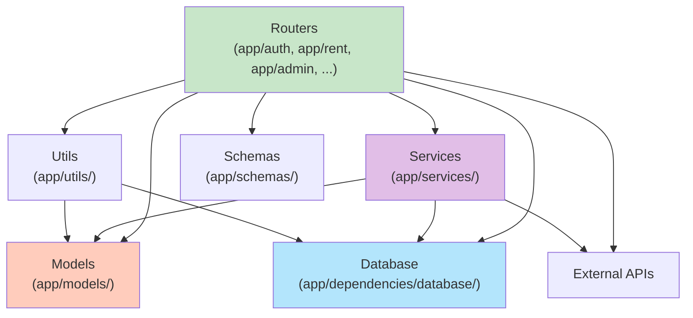

**Допустимые зависимости:**
- Router → Service, Model, Schema, Utils, DB
- Service → Model, DB, External API
- Utils → Model, DB (вспомогательные функции)

**Недопустимые зависимости:**
- Model → Router (модели не знают о роутерах)
- Schema → Service (схемы — чистые DTO)
- DB config → бизнес-логика

---

## 5. Domain Layer

### 5.1 Доменные сущности (21 таблица)

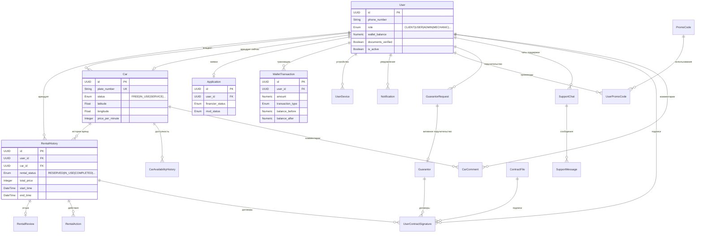

### 5.2 Ключевые бизнес-правила

**Регистрация пользователя — конечный автомат ролей:**

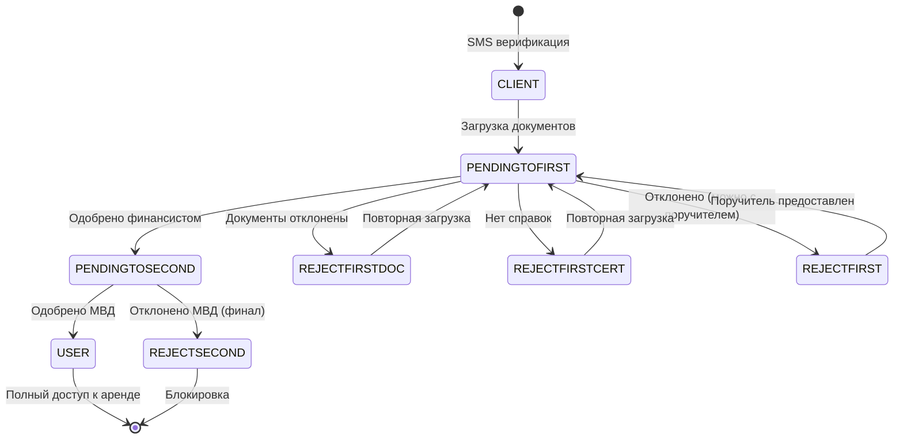

**Жизненный цикл аренды:**

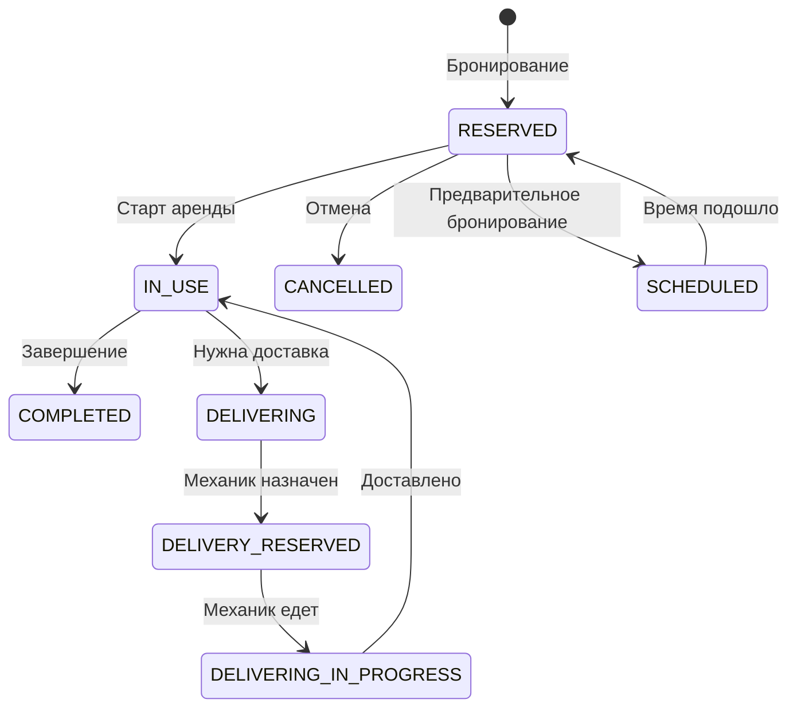

**Статусы автомобиля:**

| Статус | Значение |
|--------|---------|
| `FREE` | Доступен для аренды |
| `PENDING` | Ожидает подтверждения |
| `IN_USE` | В аренде |
| `DELIVERING` | Доставляется механиком |
| `SERVICE` | На обслуживании |
| `RESERVED` | Забронирован |
| `SCHEDULED` | Запланирована аренда |
| `OWNER` | У владельца |
| `OCCUPIED` | Занят (другая причина) |

### 5.3 Идентификаторы

Все сущности используют **UUID** как внутренний PK, но для API отдают **Short ID (SID)** — компактное представление UUID. Конвертация через `app/utils/sid_converter.py` и миксин `SidMixin` в Pydantic-схемах.

---

## 6. Infrastructure Layer

### 6.1 PostgreSQL

```
Engine: postgresql+psycopg2
Pool size: 50 connections
Max overflow: 50 (итого до 100)
Pool timeout: 10 сек
Pool recycle: 1800 сек (30 мин)
Statement timeout: 180 сек
Lock timeout: 60 сек
```

**Файлы:**
- `app/dependencies/database/database.py` — engine, SessionLocal, `get_db()`
- `app/dependencies/database/base.py` — SQLAlchemy `declarative_base()`
- `migrations/` — Alembic миграции

**Dependency Injection:**
```python
# FastAPI Depends
def get_db():
    db = SessionLocal()
    try:
        yield db
    finally:
        db.close()

# Использование в роутере
@router.get("/something")
async def handler(db: Session = Depends(get_db)):
    ...
```

### 6.2 MinIO (S3-совместимое хранилище)

| Параметр | Значение |
|----------|---------|
| Endpoint | `https://msmain.azvmotors.kz` |
| Buckets | `uploads` (основной), `backups` (архив) |
| Формат | WebP (конвертация из JPEG/PNG, качество 85%) |
| Клиент | boto3 S3, singleton pattern |

**Обработка изображений:**
1. Получение файла через multipart form
2. Чтение EXIF-ориентации → коррекция поворота (Pillow)
3. Конвертация в WebP
4. Загрузка в MinIO
5. Возврат публичного URL: `https://msmain.azvmotors.kz/uploads/...`

### 6.3 Внешние API

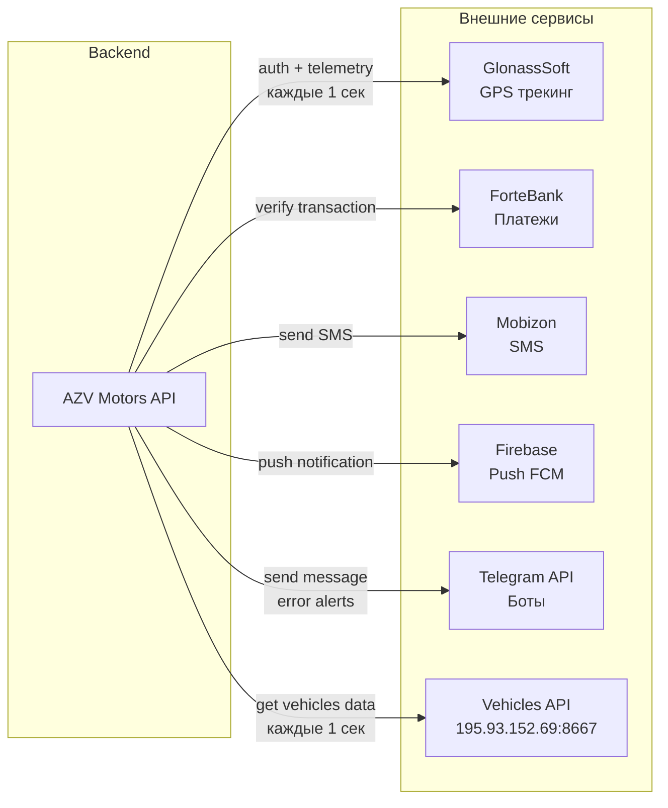

**GlonassSoft (GPS):**
- Аутентификация по логину/паролю, токен обновляется каждые 30 мин
- Телеметрия: координаты, топливо, пробег, скорость, курс
- Команды: блокировка/разблокировка двигателя, двери
- HTTP-клиент с rate limiting: `app/RateLimitedHTTPClient.py`

**ForteBank (Платежи):**
- Endpoint: `https://gateway.fortebank.com/v2/transactions/tracking_id/{id}`
- Верификация: проверка `tracking_id` → подтверждение суммы → зачисление на кошелёк
- Авторизация: `FORTE_SHOP_ID` + `FORTE_SECRET_KEY`

**Mobizon (SMS):**
- Endpoint: `https://api.mobizon.kz/service/message/sendsmsmessage`
- Rate limiting: 60 сек cooldown, максимум 5 SMS/час на номер
- Тест-режим: `SMS_TOKEN=6666` — SMS не отправляются

**Firebase (Push):**
- `firebase-admin` SDK
- Device token management: `app/push/`
- Семафор: максимум 10 одновременных push-отправок
- Локализованные уведомления: ru/en/kz/zh

---

## 7. Async / Background Processing

Проект **не использует Celery**. Вместо него — **APScheduler** (AsyncIOScheduler) с часовым поясом GMT+5 (Алматы).

### 7.1 Scheduled Jobs

```mermaid
gantt
    title APScheduler — периодические задачи
    dateFormat X
    axisFormat %s

    section Критические
    billing_job (60 сек)           :active, 0, 60
    check_vehicle_conditions (1 сек) :active, 0, 1

    section Регулярные
    update_cars_availability (1 мин) :active, 0, 60
    auto_close_support_chats (1 час) :active, 0, 3600

    section Маркетинг (cron)
    check_birthdays (09:00)        :milestone, 0, 0
    check_holidays (08:00)         :milestone, 0, 0
    check_weekend_promotions       :milestone, 0, 0
    check_new_cars (каждый час)    :milestone, 0, 0
```

| Job | Интервал | Что делает | Файл |
|-----|----------|-----------|------|
| `billing_job` | 60 сек | Поминутное списание за аренду | `app/rent/utils/billing.py` |
| `check_vehicle_conditions` | 1 сек | Опрос GPS-сервера, обновление координат/топлива/пробега, детекция заправки | `main.py` |
| `update_cars_availability_job` | 1 мин | Обновление доступности автомобилей | `app/owner/availability.py` |
| `auto_close_support_chats` | 1 час | Закрытие resolved-чатов через 12 часов | `main.py` |
| `check_birthdays` | cron 09:00 | Push-уведомления в день рождения | `app/scheduler/marketing_notifications.py` |
| `check_holidays` | cron 08:00 | Поздравления с праздниками | `app/scheduler/marketing_notifications.py` |
| `check_weekend_promotions` | Пт 19:00, Пн 08:00 | Промо выходного дня | `app/scheduler/marketing_notifications.py` |
| `check_new_cars` | cron каждый час | Уведомления о новых авто | `app/scheduler/marketing_notifications.py` |

### 7.2 Паттерн выполнения фоновых задач

Так как APScheduler работает в asyncio event loop, CPU-bound операции выполняются через `run_in_executor`:

```
APScheduler trigger
    → async function (coroutine)
        → loop.run_in_executor(None, sync_function)
            → sync_function получает новый DB session
            → выполняет ORM-операции
            → commit / rollback
            → session.close()
```

### 7.3 HangWatchdog

Отдельный фоновый процесс мониторит отзывчивость event loop:
- Проверка каждые 5 сек
- Порог зависания: 10 сек
- При обнаружении — логирование активных запросов

---

## 8. Auth / Security

### 8.1 Аутентификация

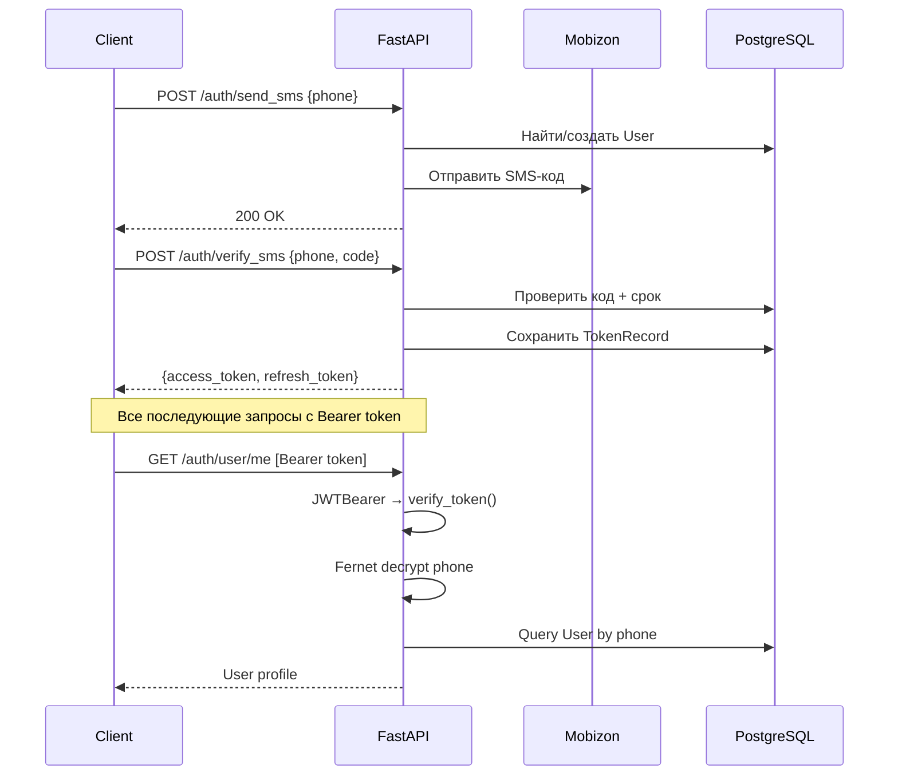

**JWT конфигурация:**
- Алгоритм: HS256
- Access token: 140 минут
- Refresh token: 30 дней
- Номер телефона шифруется Fernet в payload токена
- Токены хранятся в таблице `token_records` для отзыва

### 8.2 Авторизация (RBAC)

16 ролей. Проверка в роутерах через `get_current_user()` + проверка `user.role`:

| Роль | Доступ |
|------|--------|
| `CLIENT` | Только профиль, загрузка документов |
| `USER` | Полный доступ: аренда, кошелёк, поддержка |
| `MECHANIC` | Инспекции, обслуживание |
| `OWNER` | Управление своими автомобилями |
| `FINANCIER` | Проверка заявок на регистрацию |
| `MVD` | Проверка по базам МВД |
| `ADMIN` | Полный доступ ко всем ресурсам |
| `ACCOUNTANT` | Финансовые отчёты |
| `SUPPORT` | Чаты поддержки |
| `DRIVER` | Аренда с водителем |
| `GARANT` | Поручительство |

### 8.3 Swagger UI Protection

- HTTP Basic Auth для `/docs`, `/redoc`, `/openapi.json`
- Middleware `SwaggerAuthMiddleware` проверяет credentials
- Логин/пароль из ENV: `SWAGGER_USERNAME`, `SWAGGER_PASSWORD`

### 8.4 CORS

```python
CORSMiddleware(
    allow_origins=["*"],       # Все источники
    allow_credentials=True,
    allow_methods=["*"],
    allow_headers=["*"],
)
```

### 8.5 Системные номера

Захардкожены в коде — обходят SMS-верификацию, фиксированный код. Используются для тестирования и служебных аккаунтов:

```
70000000000  — admin
71234567890  — mechanic
71234567898  — MVD
71234567899  — financier
79999999999  — accountant
71231111111  — owner
```

---

## 9. Logging / Monitoring / Error Handling

### 9.1 Middleware Chain

Middleware выполняются в **обратном порядке** регистрации (последний добавленный — первый в цепочке).

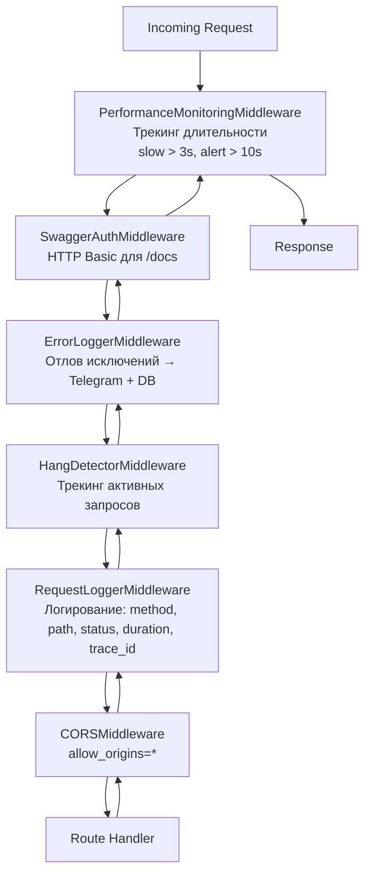

### 9.2 Logging

Два формата, переключаемых через `LOG_FORMAT`:

| Формат | Когда | Описание |
|--------|-------|---------|
| `ColoredFormatter` | development (default) | Цветной вывод: время, уровень, модуль.функция, сообщение |
| `JSONFormatter` | production (`LOG_FORMAT=json`) | Структурированный JSON для агрегации |

**Extra fields:** `user_id`, `phone`, `rental_id`, `car_id`, `amount`, `status`, `duration`, `request_id`

**Файл:** `app/core/logging_config.py`

### 9.3 Error Handling

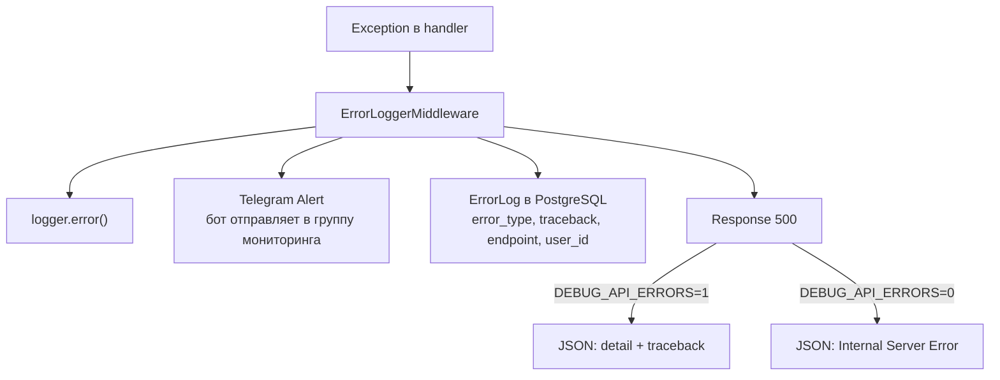

**Telegram Alert формат:**
```
🚨 Error: ValueError
📍 Endpoint: POST /rent/start-rental
👤 User: +7777XXXXXXX
📋 Traceback: ...
```

Длинные сообщения (>4096 символов) разбиваются на несколько Telegram-сообщений.

**Файлы:**
- `app/middleware/error_logger_middleware.py` — middleware
- `app/utils/telegram_logger.py` — отправка в Telegram
- `app/models/error_log_model.py` — модель ErrorLog

### 9.4 Action Logging

Административные действия записываются в `action_logs`:

```python
ActionLog(
    actor_id=admin.id,
    action="approve_user",
    entity_type="User",
    entity_id=user.id,
    details={"old_role": "PENDING", "new_role": "USER"}
)
```

### 9.5 HangWatchdog

Независимый поток мониторинга:
- Проверяет отзывчивость asyncio event loop каждые 5 сек
- Если loop не ответил за 10 сек — лог с перечнем активных запросов
- Настраивается через ENV: `HANG_WATCHDOG_CHECK_INTERVAL`, `HANG_WATCHDOG_THRESHOLD`

---

## 10. Configuration и ENV

### 10.1 Файл конфигурации

`app/core/config.py` — все переменные окружения читаются через `os.getenv()` с `python-dotenv`.

### 10.2 Переменные окружения

| Группа | Переменные |
|--------|-----------|
| **Database** | `POSTGRES_USER`, `POSTGRES_PASSWORD`, `POSTGRES_HOST`, `POSTGRES_PORT`, `POSTGRES_DB` |
| **JWT** | `SECRET_KEY`, `ALGORITHM` |
| **GPS** | `GLONASSSOFT_USERNAME`, `GLONASSSOFT_PASSWORD`, `VEHICLES_API_URL` |
| **SMS** | `SMS_TOKEN` |
| **Telegram** | `TELEGRAM_BOT_TOKEN`, `TELEGRAM_BOT_TOKEN_2`, `TELEGRAM_BOT_MONITOR`, `SUPPORT_GROUP_ID`, `MONITOR_GROUP_ID` |
| **MinIO** | `MINIO_ENDPOINT`, `MINIO_ACCESS_KEY`, `MINIO_SECRET_KEY`, `MINIO_BUCKET_UPLOADS`, `MINIO_BUCKET_BACKUPS`, `MINIO_PUBLIC_URL`, `MINIO_USE_SSL` |
| **Payments** | `FORTE_SHOP_ID`, `FORTE_SECRET_KEY` |
| **Swagger** | `SWAGGER_USERNAME`, `SWAGGER_PASSWORD` |
| **Debug** | `DEBUG_API_ERRORS`, `LOG_LEVEL`, `LOG_FORMAT` |
| **Watchdog** | `HANG_WATCHDOG_CHECK_INTERVAL`, `HANG_WATCHDOG_THRESHOLD` |

### 10.3 Feature Flags

| Flag | Значение | Эффект |
|------|---------|--------|
| `SMS_TOKEN=6666` | Тест-режим | SMS не отправляются, любой код проходит |
| `DEBUG_API_ERRORS=1` | Debug | Полные трейсбеки в HTTP-ответах |
| `LOG_FORMAT=json` | Production | JSON-формат логов |

### 10.4 Docker

```yaml
# docker-compose.yml
services:
  back:
    build: .                            # Dockerfile → Python 3.12
    ports: ["7139:7139"]
    command: uvicorn main:app --host 0.0.0.0 --port 7139 --ws auto
    healthcheck:
      test: curl -sf http://localhost:7139/health
      interval: 15s
    depends_on: [db]

  db:
    image: postgres:15
    ports: ["5434:5432"]               # Внешний порт 5434
    volumes: [postgres_data_v2:/var/lib/postgresql/data]
```

**Startup sequence:**
1. PostgreSQL запускается
2. Backend ждёт DB → запускает Alembic миграции
3. Инициализирует MinIO клиент
4. Запускает APScheduler jobs
5. Запускает Telegram Support bot
6. Запускает HangWatchdog

---

## 11. Data Flow диаграммы

### 11.1 Поток аренды автомобиля

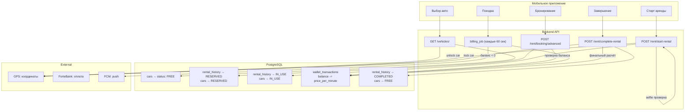

### 11.2 Поток регистрации пользователя

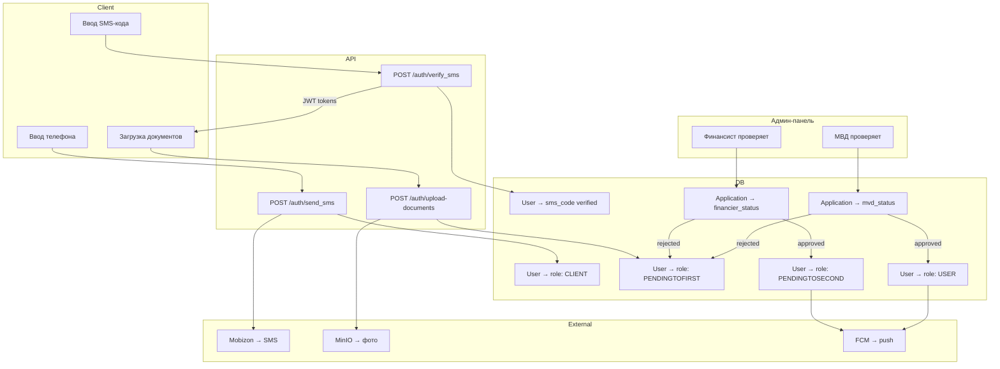

### 11.3 Поток данных GPS-телеметрии

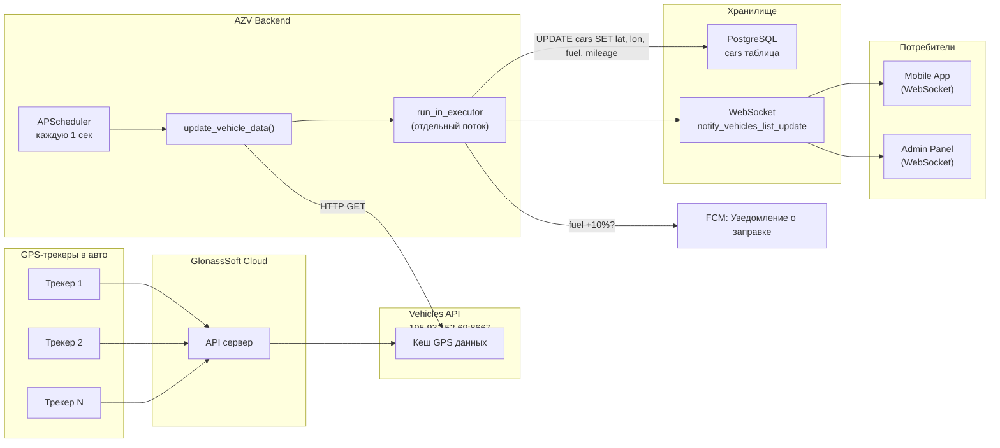

---

## 12. Sequence-диаграммы ключевых сценариев

### 12.1 Полный цикл аренды

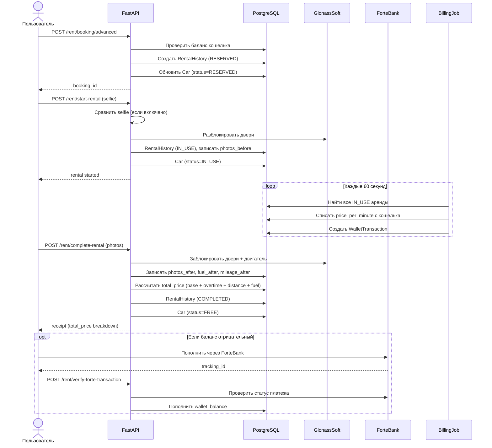

### 12.2 Поддержка через Telegram

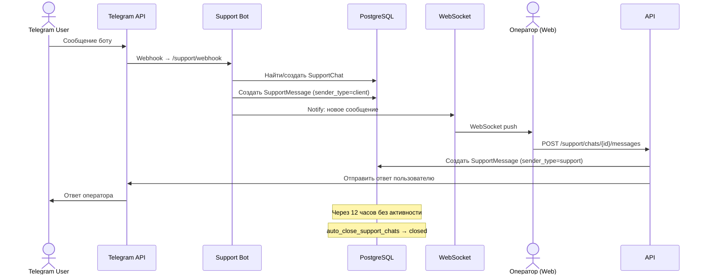

---

## 13. Структура директорий

```
azv_motors_backend_v2/
├── main.py                          # Entry point: FastAPI app, middleware, scheduler
├── alembic.ini                      # Alembic config
├── requirements.txt                 # Python dependencies
├── Dockerfile                       # Python 3.12 image
├── docker-compose.yml               # back + db services
├── docker-compose.test.yml          # Test environment
│
├── app/
│   ├── core/
│   │   ├── config.py                # ENV variables, constants, polygon coords
│   │   └── logging_config.py        # JSON/Colored formatters, setup_logging()
│   │
│   ├── dependencies/
│   │   └── database/
│   │       ├── database.py          # Engine, SessionLocal, get_db()
│   │       └── base.py              # SQLAlchemy declarative_base()
│   │
│   ├── models/                      # SQLAlchemy ORM models (21 таблица)
│   │   ├── user_model.py            # User (16 ролей, документы, кошелёк)
│   │   ├── car_model.py             # Car (GPS, статус, цены)
│   │   ├── history_model.py         # RentalHistory + RentalReview
│   │   ├── wallet_transaction_model.py  # WalletTransaction (20+ типов)
│   │   ├── application_model.py     # Application (финансист + МВД)
│   │   ├── guarantor_model.py       # GuarantorRequest + Guarantor
│   │   ├── contract_model.py        # ContractFile + UserContractSignature
│   │   ├── notification_model.py    # Notification
│   │   ├── support_chat_model.py    # SupportChat
│   │   ├── support_message_model.py # SupportMessage
│   │   ├── rental_actions_model.py  # RentalAction (open/close/lock/unlock)
│   │   ├── promo_codes_model.py     # PromoCode + UserPromoCode
│   │   ├── car_comment_model.py     # CarComment
│   │   ├── token_model.py           # TokenRecord
│   │   ├── user_device_model.py     # UserDevice (FCM tokens)
│   │   ├── verification_code_model.py # VerificationCode (SMS/email)
│   │   ├── action_log_model.py      # ActionLog (audit)
│   │   ├── error_log_model.py       # ErrorLog
│   │   ├── app_version_model.py     # AppVersion
│   │   └── support_action_model.py  # SupportAction
│   │
│   ├── schemas/                     # Pydantic DTO
│   │   ├── base.py                  # SidMixin, SidField (UUID ↔ ShortID)
│   │   └── support_schemas.py       # Support chat/message schemas
│   │
│   ├── services/                    # Сервисный слой
│   │   ├── support_service.py       # CRUD чатов, auto-close, Telegram relay
│   │   ├── minio_service.py         # S3 upload, WebP conversion, EXIF
│   │   └── face_verify.py           # DeepFace verification (отключено)
│   │
│   ├── middleware/                   # HTTP middleware
│   │   ├── error_logger_middleware.py    # Exception → Telegram + DB
│   │   ├── request_logger_middleware.py  # Request logging с trace_id
│   │   ├── hang_detector_middleware.py   # Active request tracking
│   │   └── performance_monitor.py       # Slow/alert request detection
│   │
│   ├── auth/                        # Аутентификация
│   │   └── router.py                # SMS, JWT, документы, профиль
│   │
│   ├── rent/                        # Аренда
│   │   ├── router.py                # Booking, start, complete, extend
│   │   └── utils/
│   │       └── billing.py           # Поминутный биллинг (APScheduler job)
│   │
│   ├── gps_api/                     # GPS / Vehicles
│   │   ├── router.py                # Vehicle list, GPS commands
│   │   ├── schemas.py               # Vehicle DTOs
│   │   ├── schemas_telemetry.py     # Telemetry DTOs
│   │   └── utils/
│   │       └── get_active_rental.py # Helper: найти активную аренду по car_id
│   │
│   ├── wallet/                      # Кошелёк
│   │   ├── router.py                # Balance, transactions, statement
│   │   ├── schemas.py               # Wallet DTOs
│   │   └── utils.py                 # Transaction helpers
│   │
│   ├── admin/                       # Админ-панель
│   │   ├── router.py                # Cars, users, rentals, analytics
│   │   ├── analytics/               # Отчёты: deposits, expenses
│   │   └── error_logs/
│   │       └── router.py            # Error log browser
│   │
│   ├── support/                     # Поддержка
│   │   ├── router.py                # Chat API endpoints
│   │   ├── telegram_bot.py          # Telegram webhook handler
│   │   └── notification_service.py  # WebSocket notifications
│   │
│   ├── websocket/                   # WebSocket
│   │   ├── manager.py               # ConnectionManager
│   │   ├── router.py                # WS endpoints
│   │   ├── handlers.py              # Message handlers
│   │   ├── admin_handlers.py        # Admin-specific handlers
│   │   ├── auth.py                  # WS auth
│   │   └── notifications.py         # Broadcast helpers
│   │
│   ├── push/                        # Push-уведомления
│   │   ├── router.py                # FCM token management
│   │   └── utils.py                 # send_localized_notification
│   │
│   ├── contracts/                   # Договоры
│   │   ├── router.py                # Upload, sign, download
│   │   ├── html_router.py           # HTML generation
│   │   ├── schemas.py               # Contract DTOs
│   │   └── utils.py                 # PDF/DOCX helpers
│   │
│   ├── guarantor/                   # Поручительство
│   │   ├── router.py                # Request, accept, reject
│   │   ├── schemas.py               # Guarantor DTOs
│   │   └── sms_utils.py             # SMS приглашение поручителю
│   │
│   ├── owner/                       # Владельцы авто
│   │   ├── router.py                # Car management
│   │   ├── schemas.py               # Owner DTOs
│   │   ├── availability.py          # Car availability tracking
│   │   └── utils.py                 # Owner helpers
│   │
│   ├── mechanic/                    # Механики
│   │   ├── router.py                # Inspections
│   │   └── utils.py                 # Mechanic helpers
│   │
│   ├── mechanic_delivery/           # Доставка авто
│   │   └── router.py                # Delivery management
│   │
│   ├── financier/                   # Финансисты
│   │   └── router.py                # Application review
│   │
│   ├── mvd/                         # МВД проверки
│   │   └── router.py                # MVD review
│   │
│   ├── accountant/                  # Бухгалтерия
│   │   └── router.py                # Financial reports
│   │
│   ├── monitoring/                  # Мониторинг
│   │   └── router.py                # Service health, metrics
│   │
│   ├── app_versions/                # Версии приложения
│   │   ├── router.py                # Version management
│   │   └── schemas.py               # Version DTOs
│   │
│   ├── scheduler/                   # Планировщик
│   │   └── marketing_notifications.py  # Birthday, holiday, promo pushes
│   │
│   ├── translations/                # Локализация
│   │   ├── notifications.py         # Push-уведомления ru/en/kz/zh
│   │   └── excel_headers.py         # Заголовки Excel-отчётов
│   │
│   ├── utils/                       # Утилиты
│   │   ├── telegram_logger.py       # Error → Telegram group
│   │   ├── sid_converter.py         # UUID ↔ Short ID
│   │   ├── short_id.py              # Short ID generation
│   │   ├── time_utils.py            # get_local_time() (GMT+5)
│   │   ├── action_logger.py         # ActionLog writer
│   │   ├── digital_signature.py     # Digital signature generation
│   │   ├── plate_normalizer.py      # License plate normalization
│   │   ├── fcm_token.py             # FCM helpers
│   │   ├── user_activity.py         # Last activity tracker
│   │   ├── user_data.py             # User data helpers
│   │   ├── atomic_operations.py     # DB atomic operation helpers
│   │   ├── hang_watchdog.py         # Event loop watchdog
│   │   ├── hang_logger.py           # Hang event logger
│   │   └── error_logger_decorator.py # Error logging decorator
│   │
│   ├── seed/                        # Seed data
│   │   └── init_data.py             # Test data initialization
│   │
│   └── RateLimitedHTTPClient.py     # HTTP client с rate limiting
│
├── migrations/                      # Alembic migrations
│   ├── env.py                       # Migration environment
│   └── versions/                    # Migration files
│       ├── 001_initial_migration.py
│       ├── 002_add_speed_to_cars.py
│       ├── 003_add_accountant_role.py
│       └── 004_add_open_fee_to_cars.py
│
└── scripts/                         # Maintenance scripts
    ├── convert_car_photos_jpeg_to_webp.py
    ├── convert_images_to_webp.py
    ├── fix_selfie_orientation.py
    └── backfill_availability_history.py
```

---

## 14. Summary — Как читать эту архитектуру

### Принципы организации

1. **Router-centric**: бизнес-логика живёт в роутерах (не в сервисах). Сервисы выделены только для сложных интеграций (MinIO, Support, Face Verify).

2. **Feature-based folders**: каждый модуль (rent, auth, wallet, support) — отдельная папка с router.py + utils. Не слоёная архитектура (не Clean Architecture).

3. **Shared models**: все ORM-модели в `app/models/`, все DTO в `app/schemas/`. Роутеры импортируют модели напрямую.

4. **Scheduled jobs вместо очередей**: APScheduler заменяет Celery/RabbitMQ. Все фоновые задачи выполняются в том же процессе.

5. **Монолит в одном контейнере**: API, WebSocket, Scheduler, Telegram bot — всё в одном Uvicorn-процессе.

### Lifecycle запроса: от входа до БД и обратно

```
1. HTTP Request приходит на порт 7139 (Uvicorn)
      ↓
2. PerformanceMonitoringMiddleware: засекает время
      ↓
3. SwaggerAuthMiddleware: проверка Basic Auth для /docs
      ↓
4. ErrorLoggerMiddleware: try/except → Telegram + DB при ошибке
      ↓
5. HangDetectorMiddleware: регистрирует активный запрос
      ↓
6. RequestLoggerMiddleware: генерирует trace_id, логирует
      ↓
7. CORSMiddleware: добавляет CORS headers
      ↓
8. FastAPI Router: сопоставление URL → handler function
      ↓
9. Dependencies: get_db() → SessionLocal, get_current_user() → JWT verify
      ↓
10. Handler: бизнес-логика
    - Валидация Pydantic (автоматическая)
    - ORM-запросы к PostgreSQL
    - Вызовы внешних API (HTTP)
    - Загрузка файлов в MinIO
      ↓
11. Response: Pydantic → JSON (ORJSONResponse)
      ↓
12. Middleware chain (обратный путь):
    - RequestLogger: логирует status + duration
    - PerformanceMonitor: предупреждает, если > 3 сек
      ↓
13. HTTP Response → клиент
```

### Как онбордить нового разработчика

1. **Начни с `main.py`** — здесь видно все роутеры, middleware, scheduler jobs
2. **Изучи `app/models/`** — 21 модель = полная схема данных
3. **Прочитай интересующий роутер** (например, `app/rent/router.py`) — вся логика внутри
4. **Посмотри middleware** — поймёшь как работает error handling и logging
5. **Настрой `.env`** по списку из раздела 10 этого документа
6. **Запусти `docker-compose up`** — поднимется API + PostgreSQL

### Известные архитектурные решения, которые стоит учитывать

| Решение | Следствие |
|---------|----------|
| Бизнес-логика в роутерах | Тестирование требует HTTP-вызовов, нельзя протестировать логику изолированно |
| Нет репозиторного слоя | ORM-запросы разбросаны по всем роутерам |
| Один процесс для всего | Scheduler и API делят один event loop; тяжёлая задача может заблокировать API |
| APScheduler вместо Celery | Нет retry, нет distributed workers, нет приоритетов задач |
| `CORS allow_origins=["*"]` | Открыто для любых доменов |
| GPS-опрос каждую 1 секунду | Высокая нагрузка на GPS-сервис и БД |
| Wallet balance в User модели | Критичные финансовые данные без optimistic locking |