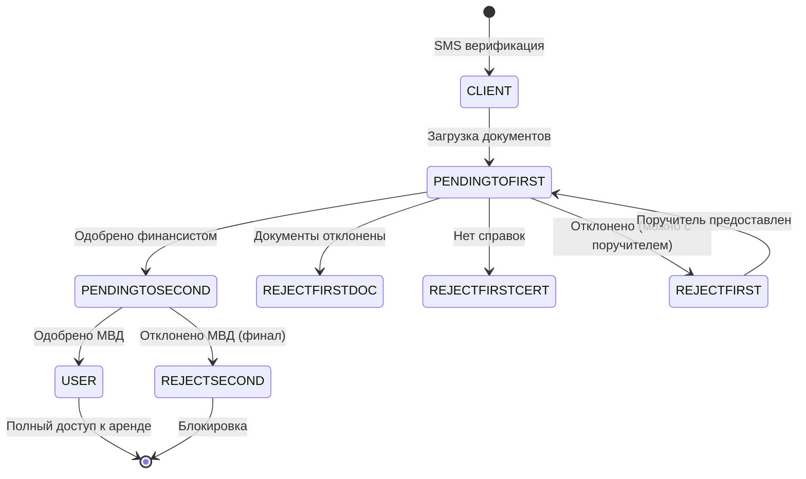
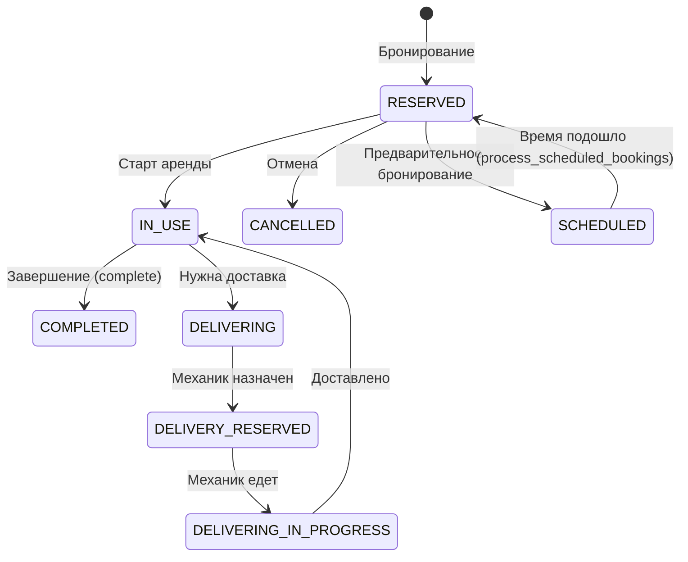
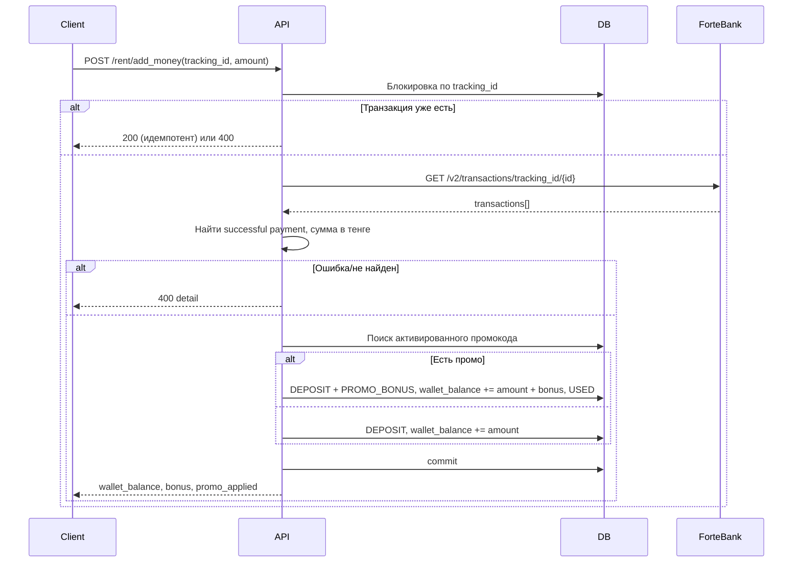
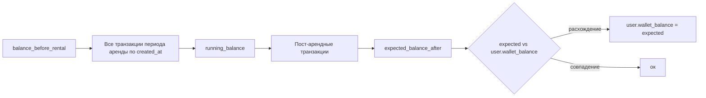

# Извлечение алгоритмов бизнес-логики — AZV Motors Backend

> Документ сформирован по результатам анализа кодовой базы. Фокус: последовательности действий, правила и вычисления, реализующие бизнес-функции (регистрация, аренда, биллинг, верификация документов, уведомления и т.д.).

---

## Содержание документа (переход к модулям)

Для возврата сюда из любого раздела: [↑ К содержанию](#toc).

| Модуль | Ссылка |
|--------|--------|
| Аутентификация и регистрация | [→ Аутентификация и регистрация](#module-auth) |
| Аренда и биллинг | [→ Аренда и биллинг](#module-rent) |
| GPS / Телеметрия и команды авто | [→ GPS / Телеметрия](#module-gps) |
| Кошелёк и платежи | [→ Кошелёк и платежи](#module-wallet) |
| Поддержка пользователей | [→ Поддержка пользователей](#module-support) |
| Администрирование и панель управления | [→ Администрирование](#module-admin) |
| Владельцы автомобилей | [→ Владельцы автомобилей](#module-owner) |
| Механики и доставка | [→ Механики и доставка](#module-mechanic) |
| Финансисты, МВД, Бухгалтерия | [→ Финансисты, МВД, Бухгалтерия](#module-financier) |
| Уведомления (Push, WebSocket) | [→ Уведомления](#module-notifications) |
| Договоры и подписи | [→ Договоры и подписи](#module-contracts) |
| Middleware и глобальная обработка | [→ Middleware](#module-middleware) |

### Связанные документы (потоки данных и sequence-диаграммы)

| Документ | Описание |
|----------|----------|
| [data_flow_registration_analysis.md](data_flow_registration_analysis.md) | Анализ потоков данных: регистрация и верификация |
| [data_flow_rental_analysis.md](data_flow_rental_analysis.md) | Анализ потоков данных: аренда |
| [data_flow_rental_sequence_analysis.md](data_flow_rental_sequence_analysis.md) | Анализ sequence-диаграммы: полный цикл аренды |
| [data_flow_telemetry_analysis.md](data_flow_telemetry_analysis.md) | Анализ потоков данных: телеметрия |
| [data_flow_support_telegram_sequence_analysis.md](data_flow_support_telegram_sequence_analysis.md) | Анализ sequence-диаграммы: поддержка через Telegram |

---

# Алгоритмы бизнес-логики: Аутентификация и регистрация

Ниже — декомпозиция модуля «Аутентификация и регистрация»: все алгоритмы бизнес-логики, реализованные в `app/auth/`, `app/guarantor/`, связанных моделях и утилитах.

## Оглавление модуля «Аутентификация и регистрация»

| № | Название | Файл/эндпоинт |
|---|----------|----------------|
| A1 | Отправка SMS-кода | `app/auth/router.py` — `POST /auth/send_sms/` |
| A2 | Rate limiting для SMS | `app/auth/rate_limit.py` — `SMSRateLimit.check`, `SMSRateLimit.update` |
| A3 | Верификация SMS-кода и выдача JWT | `app/auth/router.py` — `POST /auth/verify_sms/` |
| A4 | Генерация и валидация JWT (access/refresh) | `app/auth/security/tokens.py` — `create_access_token`, `create_refresh_token`, `verify_token` |
| A5 | Шифрование телефона в JWT | `app/auth/security/tokens.py` — `encrypt_phone_number`, `decrypt_phone_number` |
| A6 | Получение текущего пользователя по токену | `app/auth/dependencies/get_current_user.py` — `get_current_user` |
| A7 | Генерация цифровой подписи пользователя | `app/utils/digital_signature.py` — `generate_digital_signature` |
| A8 | Верификация кода email | `app/auth/router.py` — `POST /auth/verify_email/` |
| A9 | Повторная отправка кода на email | `app/auth/router.py` — `POST /auth/resend_email_code/` |
| A10 | Загрузка файла в MinIO (документы/селфи) | `app/auth/dependencies/save_documents.py` — `save_file`; MinIO — `save_file_to_minio` |
| A11 | Загрузка селфи профиля | `app/auth/router.py` — `POST /auth/upload-selfie/` |
| A12 | Загрузка документов и подача заявки (PENDINGTOFIRST) | `app/auth/router.py` — `POST /auth/upload-documents/` |
| A13 | Связывание заявок гаранта при верификации SMS | `app/auth/router.py` — внутри `verify_sms` (GuarantorRequest.guarantor_id) |
| A14 | Обновление имени/фамилии до верификации документов | `app/auth/router.py` — `PATCH /auth/user/name` |
| A15 | Запрос смены email и верификация смены | `app/auth/router.py` — `POST /auth/change_email/request`, `POST /auth/change_email/verify` |
| A16 | Обновление локали | `app/auth/router.py` — `POST /auth/set_locale/` |
| A17 | Refresh токена | `app/auth/router.py` — `POST /auth/refresh_token/` |
| A18 | Мягкое удаление аккаунта | `app/auth/router.py` — `DELETE /auth/delete_account/` |
| A19 | Приглашение гаранта (invite) | `app/guarantor/router.py` — `POST /guarantor/invite` |
| A20 | Принятие/отклонение заявки гаранта | `app/guarantor/router.py` — `POST /guarantor/{id}/accept`, `POST /guarantor/{id}/reject` |
| A21 | Отмена заявок гаранта при отклонении пользователя | `app/guarantor/router.py` — `cancel_guarantor_requests_on_rejection` |
| A22 | Верификация лица (selfie vs профиль) | `app/services/face_verify.py` — `verify_user_upload_against_profile` (в коде отключена) |
| A23 | Конвертация UUID ↔ Short ID (SID) в ответах | `app/utils/sid_converter.py` — `convert_uuid_response_to_sid`; `app/utils/short_id.py` |
| A24 | Извлечение IP клиента для rate limit | `app/auth/router.py` — `_get_client_ip` |
| A25 | Системные и тестовые номера (обход SMS/срок кода) | `app/auth/router.py` — константы SYSTEM_PHONE_NUMBERS, TEST_PHONE_CODES; `SMS_TOKEN=6666` |

---

## Детальное описание алгоритмов модуля «Аутентификация и регистрация»

### A1. Отправка SMS-кода (регистрация/вход)

**Файл/модуль**: `app/auth/router.py` — эндпоинт `POST /auth/send_sms/`

**Бизнес-цель**: Выдать пользователю одноразовый код для входа/регистрации; при необходимости создать или восстановить учётную запись по номеру телефона; отправить код по SMS (и опционально на email).

**Входные данные**: Тело: `phone_number`, опционально `first_name`, `last_name`, `middle_name`, `email`. Из запроса: IP клиента (`X-Forwarded-For` или `X-Real-IP`).

**Выходные данные**: `SendSmsResponse`: `message`, `fcm_token`. В БД: создание/обновление `User`, поля `last_sms_code`, `sms_code_valid_until` (срок 1 час); при новом пользователе — генерация `digital_signature`; при email — запись `VerificationCode` (purpose=email_verification).

**Алгоритмические шаги**:
1. Извлечение IP: `_get_client_ip(http_request)`.
2. Генерация 4-значного кода: для тестовых номеров (`70123456789` … `70123456798`) — фиксированные коды `1111`…`0000`; иначе `pyotp.TOTP(..., digits=4, interval=1000).now()`.
3. Валидация: `phone_number` только цифры → иначе 400.
4. **Системные номера** (`70000000000`, `71234567890`, …): сразу возврат успеха без отправки SMS, без rate limit; при наличии пользователя в БД возвращается его `fcm_token`.
5. **Rate limit**: `SMSRateLimit.check(phone_number, client_ip)` → при превышении 429 с сообщением.
6. **Блокировка REJECTSECOND**: поиск пользователя с этим номером и ролью `UserRole.REJECTSECOND` (независимо от is_active) → 403 с текстом отказа в регистрации.
7. Поиск активного пользователя по `phone_number` и `is_active == True`:
   - **Если найден**: проверка, что не переданы first_name/last_name/middle_name (для существующего — только номер) → иначе 400; обновление `last_sms_code`, `sms_code_valid_until = now + 1 hour`.
   - **Если не найден**: поиск неактивного (`is_active == False`). Если найден: проверка не REJECTSECOND → 403; не is_blocked → 403; не is_deleted → 403; не переданы имя/фамилия → 400; восстановление: `is_active = True`, обновление кода и срока. Если не найден: обязательны `first_name`, `last_name` → иначе 400; создание `User` (role=CLIENT), `db.flush()`, генерация `digital_signature` через `generate_digital_signature(...)`, запись в `user.digital_signature`.
8. Если у пользователя нет `digital_signature` — генерация и commit.
9. Формирование текста SMS: `{sms_code}-Ваш код\nЭлектронная подпись:{user.digital_signature}`.
10. **Отправка SMS**: для системных номеров (без тестовых) — лог, без вызова Mobizon; иначе при наличии `SMS_TOKEN` — `send_sms_mobizon(phone_number, sms_text, SMS_TOKEN, sender="AZV Motors")`, затем `SMSRateLimit.update(phone_number, client_ip)`. При отсутствии SMS_TOKEN — только warning. Исключения Mobizon логируются и при возможности отправляются в Telegram.
11. **Email**: при указании `request.email` — проверка уникальности email (кроме текущего user); генерация кода (тестовые почты test1@… — фиксированные коды); создание `VerificationCode` (purpose=email_verification, expires 15 мин); обновление `user.email`, `user.is_verified_email = False` при смене; отправка письма через `send_email_with_fallback`; при ошибке — логирование и Telegram.
12. Commit; возврат `SendSmsResponse(message="SMS code sent successfully", fcm_token=user.fcm_token)`.

**Обработка ошибок**: 400 (формат номера, дубликат email, лишние поля для существующего пользователя, нет имени для нового), 403 (REJECTSECOND, блокировка, удаление), 429 (rate limit).

**Зависимости**: `SMSRateLimit`, `send_sms_mobizon` (Mobizon), `generate_digital_signature`, `send_email_with_fallback`, модели `User`, `VerificationCode`, `get_local_time`.

**Примечания**: Feature flags: системные номера не получают SMS; тестовые номера имеют фиксированные коды; при `SMS_TOKEN` не настроен SMS не отправляются.

---

### A2. Rate limiting для SMS

**Файл/модуль**: `app/auth/rate_limit.py` — класс `SMSRateLimit`

**Бизнес-цель**: Ограничить частоту отправки SMS по номеру телефона и по IP (защита от SMS bombing и злоупотреблений).

**Входные данные**: `check(phone_number, client_ip)` — номер и опционально IP; `update(phone_number, client_ip)` — после успешной отправки.

**Выходные данные**: `check` возвращает `(can_send: bool, error_message: str)`. В Redis или in-memory: ключи/счётчики для cooldown и лимитов.

**Алгоритмические шаги**:
1. Системные номера (`SYSTEM_PHONE_NUMBERS`) — всегда разрешено, update не делается.
2. **Проверка (check)**: сначала IP-лимит (если IP передан и не в TRUSTED_IPS): Redis или in-memory — минута (10 SMS), час (50), сутки (200); при превышении — (False, сообщение). Затем phone-лимит: cooldown 60 сек после последней отправки; 5 SMS в час на номер; при превышении — (False, сообщение).
3. **Обновление (update)**: после успешной отправки — обновление времени последней отправки по номеру; инкремент счётчика за час (или сброс при новом часе); инкремент счётчиков по IP (минута, час, сутки). Реализация через Redis с TTL или in-memory словари при недоступности Redis.

**Обработка ошибок**: При ошибке Redis в IP check — «fail open» (разрешить отправку), логирование.

**Зависимости**: `app.services.redis_service.get_redis_service`, `get_local_time`; константы SMS_COOLDOWN_SECONDS, SMS_HOURLY_LIMIT, IP_*_LIMIT, TTL.

**Примечания**: Двухуровневая защита (телефон + IP); graceful degradation на in-memory при отсутствии Redis.

---

### A3. Верификация SMS-кода и выдача JWT

**Файл/модуль**: `app/auth/router.py` — `POST /auth/verify_sms/`

**Бизнес-цель**: Подтвердить владение номером по коду, выдать access и refresh токены, при необходимости связать ожидающие заявки гаранта с пользователем, обновить устройство (координаты).

**Входные данные**: Тело: `phone_number`, `sms_code`, опционально `latitude`, `longitude`.

**Выходные данные**: `VerifySmsResponse`: access_token, refresh_token, token_type, linked_guarantor_requests, digital_signature, client_info, fcm_token, role. В БД: обновление `user.last_activity_at`; создание записей `TokenRecord` (access, refresh); при наличии — связывание `GuarantorRequest` (guarantor_phone == user.phone_number, guarantor_id == None) с user.id; обновление `UserDevice` (координаты, last_active_at).

**Алгоритмические шаги**:
1. Валидация номера (только цифры) → 400.
2. **Поиск пользователя по коду**:
   - Спецкод `1010`: поиск только по phone_number и is_active == True (тест).
   - Системные номера: поиск по phone_number, last_sms_code == sms_code, is_active (время кода не проверяется).
   - Остальные: phone_number, last_sms_code == sms_code, sms_code_valid_until > get_local_time(), is_active.
3. Если пользователь не найден → 401 "Invalid SMS code or code expired".
4. Проверки доступа: role == REJECTSECOND → 403 (отказ в регистрации); is_blocked → 403; is_deleted → 403.
5. Обновление last_activity_at, commit.
6. Генерация токенов: `create_access_token(data={"sub": user.phone_number})`, `create_refresh_token(...)`; создание двух записей `TokenRecord` (token_type access/refresh), commit (при ошибке rollback).
7. Связывание заявок гаранта: поиск `GuarantorRequest` где guarantor_phone == user.phone_number, guarantor_id == None, status == PENDING; для каждой установка guarantor_id = user.id, при необходимости обновление guarantor_phone; commit.
8. При переданных latitude/longitude — поиск или создание активного `UserDevice` для user_id, обновление last_lat, last_lng, last_active_at.
9. Формирование ответа с client_info (full_name, phone_number, user_id, digital_signature), role=user.role.value.

**Обработка ошибок**: 400 (формат номера), 401 (неверный/просроченный код), 403 (REJECTSECOND, блокировка, удаление).

**Зависимости**: `create_access_token`, `create_refresh_token`, модели `User`, `TokenRecord`, `GuarantorRequest`, `UserDevice`, `get_current_user` не используется (эндпоинт без Bearer).

**Примечания**: Тестовый код 1010 и системные номера меняют логику проверки срока кода.

---

### A4. Генерация и валидация JWT (access/refresh)

**Файл/модуль**: `app/auth/security/tokens.py` — `create_access_token`, `create_refresh_token`, `verify_token`

**Бизнес-цель**: Выдать JWT с зашифрованным телефоном в payload и проверить токен с извлечением номера; различать тип токена (access/refresh).

**Входные данные**: create_*: словарь `data` с ключом `"sub"` (номер телефона). verify_token: строка токена, expected_token_type (`"access"`, `"refresh"` или `"any"`).

**Выходные данные**: create_* возвращают строку JWT. verify_token возвращает payload с расшифрованным `sub` (phone_number); при неверном типе или ошибке декодирования — HTTPException 403.

**Алгоритмические шаги**:
1. **create_access_token**: из data["sub"] шифрование через Fernet → encrypted_phone_number; to_encode = {sub: encrypted_phone_number, token_type: "access"}; jwt.encode(to_encode, SECRET_KEY, algorithm=ALGORITHM). Аналогично create_refresh_token с token_type "refresh". Срок действия в конфиге (ACCESS_TOKEN_EXPIRE_MINUTES, REFRESH_TOKEN_EXPIRE_DAYS) в коде не передаётся в encode (options verify_exp: False при verify).
2. **verify_token**: jwt.decode(..., options={"verify_exp": False}); проверка token_type == expected_token_type (если expected != "any"); расшифровка sub через decrypt_phone_number; подмена payload["sub"] на номер; возврат payload. При PyJWTError — 403.

**Обработка ошибок**: Некорректный/поддельный токен или неверный тип → 403.

**Зависимости**: PyJWT, cryptography.fernet (фиксированный ключ в коде), SECRET_KEY, ALGORITHM из config.

**Примечания**: Телефон в JWT хранится в зашифрованном виде; срок истечения при верификации отключён (verify_exp: False), управление жизнью токенов через БД (TokenRecord) и кэш.

---

### A5. Шифрование телефона в JWT

**Файл/модуль**: `app/auth/security/tokens.py` — `encrypt_phone_number`, `decrypt_phone_number`

**Бизнес-цель**: Не хранить номер телефона в открытом виде в payload JWT.

**Входные данные**: Строка (номер или зашифрованная строка).

**Выходные данные**: encrypt — base64-строка шифротекста; decrypt — исходный номер.

**Алгоритмические шаги**: Fernet (симметричное шифрование) с константным ключом в коде; encode/decode UTF-8.

**Зависимости**: cryptography.fernet.Fernet.

---

### A6. Получение текущего пользователя по токену

**Файл/модуль**: `app/auth/dependencies/get_current_user.py` — `get_current_user`; используется как Depends в защищённых эндпоинтах.

**Бизнес-цель**: По заголовку Authorization: Bearer <token> определить пользователя, проверить активность и наличие токена в БД/кэше.

**Входные данные**: Зависимости: db (get_db), token payload от JWTBearer(expected_token_type="any") — в payload передаётся raw_token и sub (phone_number после verify_token).

**Выходные данные**: Объект User (is_active == True). При неудаче — HTTPException 401/403/404.

**Алгоритмические шаги**:
1. Из payload: phone_number = token.get("sub"), raw_token = token.get("raw_token"). Отсутствие sub или raw_token → 403/401.
2. **Кэш (TokenCache)**: get_token_user_id(raw_token). При наличии — загрузка User по id, фильтр is_active == True; если пользователь найден — возврат; иначе инвалидация кэша.
3. **БД**: поиск User по phone_number и is_active == True; отсутствие → 404. Поиск TokenRecord по user_id, token_type in (access, refresh), token == raw_token; отсутствие → 401 "Token is not valid".
4. Запись в кэш: TokenCache.set_token_user_id(raw_token, user.id).
5. Обновление token_row.last_used_at, commit. Возврат user.

**Обработка ошибок**: 401 (токен не передан или не найден в БД), 403 (невалидные credentials), 404 (пользователь не найден или неактивен).

**Зависимости**: JWTBearer, TokenCache, User, TokenRecord, verify_token (в JWTBearer).

**Примечания**: Поддержка нескольких устройств (несколько записей TokenRecord на пользователя); кэш снижает нагрузку на БД.

---

### A7. Генерация цифровой подписи пользователя

**Файл/модуль**: `app/utils/digital_signature.py` — `generate_digital_signature`, `validate_digital_signature`, `format_digital_signature_for_display`

**Бизнес-цель**: Сформировать уникальную строку-идентификатор пользователя для документов и SMS (в формате UUID-like), без криптографической подписи.

**Входные данные**: user_id, phone_number, first_name, last_name, middle_name (опционально).

**Выходные данные**: Строка вида XXXXXXXX-XXXX-XXXX-XXXX-XXXXXXXXXXXX (первые 32 символа SHA256 от строки user_id_phone_first_middle_last_iso_timestamp, отформатированные как UUID).

**Алгоритмические шаги**: Конкатенация полей и get_local_time().isoformat(); hashlib.sha256; hexdigest()[:32]; разбивка по позициям и вставка дефисов. validate_digital_signature проверяет, что строка — валидный UUID. format_digital_signature_for_display возвращает первые 8 символов + "-...".

**Зависимости**: hashlib, get_local_time, uuid (для валидации формата).

---

### A8. Верификация кода email

**Файл/модуль**: `app/auth/router.py` — `POST /auth/verify_email/`

**Бизнес-цель**: Подтвердить email по коду, отправленному на почту (при регистрации или смене email).

**Входные данные**: Тело: code, опционально email (иначе берётся из current_user). Требуется авторизация (get_current_user).

**Выходные данные**: Сообщение об успехе. В БД: VerificationCode.is_used = True; при отличии request.email от текущего — user.email = email_to_verify; user.is_verified_email = True; commit; WebSocket notify_user_status_update.

**Алгоритмические шаги**: Определение email_to_verify (из запроса или current_user). Поиск VerificationCode по email, code, purpose="email_verification", is_used=False, expires_at >= now; порядок по id desc. Отсутствие записи → 400. Пометка is_used = True; при request.email — обновление current_user.email; current_user.is_verified_email = True; commit; уведомление по WebSocket.

**Обработка ошибок**: 400 (email не указан или неверный/просроченный код).

**Зависимости**: VerificationCode, User, get_local_time, notify_user_status_update.

---

### A9. Повторная отправка кода на email

**Файл/модуль**: `app/auth/router.py` — `POST /auth/resend_email_code/`

**Бизнес-цель**: Отправить новый 6-значный код на email пользователя (purpose=email_verification, срок 15 мин).

**Входные данные**: Авторизованный пользователь; email берётся из current_user.email.

**Выходные данные**: Сообщение. В БД: новая запись VerificationCode; отправка письма через SMTP (send_email_with_fallback); при неудаче SMTP — логирование кода и при возможности Telegram.

**Алгоритмические шаги**: Проверка наличия current_user.email → 400. Генерация кода (random 100000–999999); создание VerificationCode (email, purpose=email_verification, expires_at=now+15 мин); отправка письма; commit; возврат ответа.

**Обработка ошибок**: 400 (у пользователя не указан email).

**Зависимости**: generate_email_verification_code (в router), VerificationCode, send_email_with_fallback, log_error_to_telegram.

---

### A10. Загрузка файла в MinIO (документы/селфи)

**Файл/модуль**: `app/auth/dependencies/save_documents.py` — `save_file`; вызывается из upload-selfie и upload-documents.

**Бизнес-цель**: Сохранить загруженный файл в MinIO (S3-совместимое хранилище) и вернуть публичный URL.

**Входные данные**: file (UploadFile), user_id (UUID), folder (строка, например "uploads/profile", "uploads/documents").

**Выходные данные**: Строка — URL файла в MinIO. Нормализация папки: убирается префикс "uploads/" если есть, лишние слэши.

**Алгоритмические шаги**: Нормализация folder; вызов save_file_to_minio(file, user_id, normalized_folder) из MinIO-сервиса (внутри обычно конвертация в WebP для изображений, загрузка в bucket). Возврат URL. validate_photos в том же файле: проверка количества файлов (1–10) и content_type (image/jpeg, png, webp, jpg).

**Обработка ошибок**: Исключения из MinIO пробрасываются выше; вызывающий код делает rollback и при необходимости логирование в Telegram.

**Зависимости**: app.services.minio_service.save_file_to_minio.

**Примечания**: Конвертация в WebP и ограничение размера выполняются на уровне MinIO-сервиса (см. ARCHITECTURE).

---

### A11. Загрузка селфи профиля

**Файл/модуль**: `app/auth/router.py` — `POST /auth/upload-selfie/`

**Бизнес-цель**: Обновить селфи пользователя в профиле (selfie_url).

**Входные данные**: Файл selfie (File), авторизованный пользователь.

**Выходные данные**: SelfieUploadResponse (message, selfie_url, user_id). В БД: current_user.selfie_url = url; commit; WebSocket notify.

**Алгоритмические шаги**: Проверка content_type (jpeg, png, webp, jpg) → 400; чтение содержимого, проверка размера ≤ 10 MB → 400; seek(0); save_file(selfie, current_user.id, "uploads/profile"); обновление current_user.selfie_url; commit; notify_user_status_update; конвертация ответа с uuid_to_sid для user_id.

**Обработка ошибок**: 400 (тип файла, размер), 500 при ошибке сохранения (rollback, Telegram, ответ с деталью).

**Зависимости**: save_file, User, convert_uuid_response_to_sid, notify_user_status_update.

---

### A12. Загрузка документов и подача заявки (PENDINGTOFIRST)

**Файл/модуль**: `app/auth/router.py` — `POST /auth/upload-documents/`

**Бизнес-цель**: Принять комплект документов (ID, права, селфи, справки при is_citizen_kz), персональные данные; сохранить файлы в MinIO; создать или обновить заявку Application; перевести пользователя в роль PENDINGTOFIRST (ожидание проверки финансистом), если заявка ещё не была полностью одобрена.

**Входные данные**: Форма: обязательные файлы id_front, id_back, drivers_license, selfie_with_license, selfie; опционально psych_neurology_certificate, pension_contributions_certificate; поля first_name, last_name, middle_name, birth_date, iin или passport_number, id_card_expiry, drivers_license_expiry, email, is_citizen_kz. Требуется авторизация.

**Выходные данные**: JSON с сообщением и данными профиля (включая URL документов, даты, is_verified_email и т.д.). В БД: обновление полей User (ФИО, даты, URL документов, справок, email, is_citizen_kz, iin/passport_number); создание Application при отсутствии или обновление updated_at; при условиях — сброс financier_status в PENDING (для повторной подачи после REJECTFIRSTDOC/REJECTFIRSTCERT); user.role = PENDINGTOFIRST (если заявка не одобрена полностью); user.documents_verified = True; user.upload_document_at = now; при смене/новом email — сброс is_verified_email и флаг email_needs_verification; обновление guarantor_requests.guarantor_phone для заявок, где пользователь гарант.

**Алгоритмические шаги** (сокращённо):
1. Валидация типов файлов (ALLOWED_TYPES для изображений, CERT_ALLOWED_TYPES для справок — jpeg, png, webp, pdf).
2. Нормализация iin, passport_number, middle_name (пустые строки → None); валидация через DocumentUploadRequest (даты, ИИН 12 цифр и т.д.).
3. Для is_citizen_kz == True: обязательность psych_neurology_certificate и pension_contributions_certificate → иначе 400.
4. Проверка уникальности email (кроме текущего пользователя).
5. Сохранение файлов через save_file в "uploads/documents"; запись путей в поля User.
6. Проверка блокировки по ИИН/паспорту: наличие другого пользователя с role=REJECTSECOND и тем же ИИН/паспортом → 403; уникальность ИИН/паспорта среди активных (кроме текущего) → 400 при дубликате.
7. Обновление всех полей пользователя (ФИО, даты, URL, email, is_citizen_kz, iin, passport_number).
8. Заявка: если Application нет — создание (user_id, created_at, updated_at). Если есть: при полном одобрении (financier + mvd APPROVED) — should_reset_role = False; при REJECTED и роли REJECTFIRSTDOC/REJECTFIRSTCERT — should_reset_application = True (сброс financier_status, дат, reason). При should_reset_role — user.role = PENDINGTOFIRST. user.documents_verified = True.
9. Логика email: при смене email или повторной подаче после отказа — is_verified_email = False, email_needs_verification = True.
10. Обновление guarantor_phone в GuarantorRequest где guarantor_id == current_user.id; upload_document_at = now; commit; push "documents_uploaded"; expire_all + refresh; notify_user_status_update.

**Обработка ошибок**: 400 (дубликат email/ИИН/паспорт, отсутствующие справки для КЗ), 401 (нет пользователя), 403 (блокировка по ИИН/паспорту), 422 (ошибка валидации данных), 500 (ошибка при сохранении, rollback, Telegram).

**Зависимости**: save_file, User, Application, ApplicationStatus, GuarantorRequest, DocumentUploadRequest, get_local_time, send_localized_notification_to_user_async, notify_user_status_update.

**Примечания**: Идемпотентность по заявке: при повторной загрузке после отказа по документам заявка переводится в PENDING; при уже одобренной заявке роль не меняется.

---

### A13. Связывание заявок гаранта при верификации SMS

**Файл/модуль**: `app/auth/router.py` — внутри `verify_sms` (блок после создания TokenRecord).

**Бизнес-цель**: Когда пользователь впервые входит по SMS и его номер совпадает с guarantor_phone в ожидающих заявках (без guarantor_id), привязать эти заявки к нему.

**Входные данные**: user (найденный по коду), сессия БД.

**Выходные данные**: Количество связанных заявок (linked_count) возвращается в VerifySmsResponse. В БД: GuarantorRequest.guarantor_id = user.id, при необходимости guarantor_phone = user.phone_number; commit.

**Алгоритмические шаги**: Запрос GuarantorRequest где guarantor_phone == user.phone_number, guarantor_id == None, status == PENDING. Для каждой записи: guarantor_id = user.id; при наличии user.phone_number обновление guarantor_phone. linked_count += 1. Commit при linked_count > 0. Исключения логируются, основной флоу verify_sms не прерывается.

**Зависимости**: GuarantorRequest, GuarantorRequestStatus.

---

### A14. Обновление имени/фамилии до верификации документов

**Файл/модуль**: `app/auth/router.py` — `PATCH /auth/user/name`

**Бизнес-цель**: Разрешить изменить first_name и last_name только до того, как документы верифицированы (documents_verified == False).

**Входные данные**: Тело: first_name, last_name (опционально). Авторизация обязательна.

**Выходные данные**: UpdateNameResponse (message, first_name, last_name). В БД: обновление current_user.first_name, last_name; commit; WebSocket notify.

**Алгоритмические шаги**: Проверка !current_user.documents_verified → иначе 403. Нормализация строк; хотя бы одно поле должно быть непустым → 400; длина 1–50 символов → 422. Обновление полей, commit, refresh; notify_user_status_update; возврат ответа. При исключении — rollback, 500.

**Обработка ошибок**: 400 (нечего обновлять), 403 (документы уже верифицированы), 422 (длина полей).

**Зависимости**: User, notify_user_status_update.

---

### A15. Запрос смены email и верификация смены

**Файл/модуль**: `app/auth/router.py` — `POST /auth/change_email/request`, `POST /auth/change_email/verify`

**Бизнес-цель**: Запросить смену email (отправка кода на новый адрес) и подтвердить смену по коду.

**Входные данные (request)**: new_email. **Входные данные (verify)**: new_email, code. Авторизация обязательна.

**Выходные данные**: Сообщение и новый email. В БД (request): запись VerificationCode (purpose=email_change, 15 мин); (verify): is_used = True, user.email = new_email, user.is_verified_email = True; commit; WebSocket notify.

**Алгоритмические шаги (request)**: Нормализация new_email; совпадение с текущим → 400; проверка уникальности email (другой активный пользователь) → 400; генерация кода; создание VerificationCode (email=new_email, purpose=email_change, expires 15 мин); отправка письма; commit. **(verify)**: Поиск VerificationCode по new_email, code, purpose=email_change, !is_used, expires_at >= now; отсутствие → 400; повторная проверка занятости email; vc.is_used = True; current_user.email = new_email; is_verified_email = True; commit; notify_user_status_update.

**Обработка ошибок**: 400 (email совпадает, занят, неверный/просроченный код).

**Зависимости**: VerificationCode, User, send_email_with_fallback, generate_email_verification_code, notify_user_status_update.

---

### A16. Обновление локали

**Файл/модуль**: `app/auth/router.py` — `POST /auth/set_locale/`

**Бизнес-цель**: Сохранить предпочитаемый язык (ru/en/kz/zh) в профиле пользователя.

**Входные данные**: Тело: locale. Авторизация обязательна.

**Выходные данные**: message, locale. В БД: user.locale = payload.locale; commit; WebSocket notify.

**Алгоритмические шаги**: Проверка locale in ["ru", "en", "kz", "zh"] → иначе 400; обновление current_user.locale; commit; refresh; notify_user_status_update.

**Зависимости**: User, notify_user_status_update.

---

### A17. Refresh токена

**Файл/модуль**: `app/auth/router.py` — `POST /auth/refresh_token/`; зависимость JWTBearer(expected_token_type="refresh").

**Бизнес-цель**: По валидному refresh-токену выдать новую пару access и refresh, обновить last_activity_at.

**Входные данные**: Заголовок Authorization: Bearer <refresh_token>.

**Выходные данные**: access_token, refresh_token, token_type. В БД: создание двух новых TokenRecord (access, refresh); обновление user.last_activity_at; commit.

**Алгоритмические шаги**: Из payload (после verify_token) извлечение sub (phone_number); поиск User по номеру и is_active; отсутствие → 404. Обновление last_activity_at; генерация новых access и refresh; создание двух TokenRecord; commit (при ошибке rollback). Возврат новой пары токенов.

**Обработка ошибок**: 401 (невалидный токен), 404 (пользователь не найден или неактивен).

**Зависимости**: JWTBearer, create_access_token, create_refresh_token, User, TokenRecord.

---

### A18. Мягкое удаление аккаунта

**Файл/модуль**: `app/auth/router.py` — `DELETE /auth/delete_account/`

**Бизнес-цель**: Деактивировать аккаунт (is_active = False), инвалидировать все токены в кэше; история и связи не удаляются.

**Входные данные**: Авторизованный пользователь.

**Выходные данные**: Сообщение. В БД: user.is_active = False; commit. В Redis: TokenCache.invalidate_all_user_tokens(user.id). WebSocket notify.

**Алгоритмические шаги**: Проверка wallet_balance >= 0 → иначе 402. current_user.is_active = False; commit; await TokenCache.invalidate_all_user_tokens(current_user.id); notify_user_status_update.

**Обработка ошибок**: 402 при отрицательном балансе.

**Зависимости**: TokenCache, User.

---

### A19. Приглашение гаранта (invite)

**Файл/модуль**: `app/guarantor/router.py` — `POST /guarantor/invite`

**Бизнес-цель**: Создать заявку на поручителя: либо по номеру, не зарегистрированному в системе (создание заявки с guarantor_id=None, отправка SMS), либо по пользователю с ролью USER (создание заявки, отправка push).

**Входные данные**: Тело: guarantor_info.phone_number, reason. Авторизация обязательна.

**Выходные данные**: message, user_exists, request_id, sms_result. В БД: запись GuarantorRequest (requestor_id, guarantor_id или None, guarantor_phone, reason, PENDING); commit.

**Алгоритмические шаги**:
1. Запрет назначить себя гарантом (phone == current_user.phone_number) → 400.
2. Проверка права приглашать: по Application пользователя — при APPROVED или PENDING финансиста → 403; при REJECTED — только роль REJECTFIRST (финансовые причины) может приглашать → иначе 403.
3. Проверка дубликата активной заявки на тот же номер/пользователя → 400.
4. Поиск пользователя по guarantor_phone и is_active.
5. **Если пользователя нет**: создание GuarantorRequest (guarantor_id=None, guarantor_phone=…); commit; send_guarantor_invitation_sms(...); возврат user_exists=False.
6. **Если пользователь есть**: проверка role == USER → иначе 400; проверка отсутствия активной заявки между парой и отсутствия взаимного гарантства (Guarantor is_active) → 400. Создание GuarantorRequest (guarantor_id=user.id); commit; отправка push гаранту (send_push_to_user_by_id); возврат user_exists=True.

**Обработка ошибок**: 400 (самостоятельное приглашение, дубликат, роль не USER, взаимное гарантство), 403 (нет права на услугу гаранта).

**Зависимости**: Application, ApplicationStatus, GuarantorRequest, Guarantor, User, send_guarantor_invitation_sms, send_push_to_user_by_id.

**Примечания**: SMS отправляется только когда гарант ещё не в системе; для зарегистрированных — только push. В коде вызов SMS для зарегистрированного гаранта закомментирован.

---

### A20. Принятие/отклонение заявки гаранта

**Файл/модуль**: `app/guarantor/router.py` — `POST /guarantor/{id}/accept`, `POST /guarantor/{id}/reject`

**Бизнес-цель**: Гарант принимает или отклоняет заявку; при принятии создаётся связь Guarantor (is_active=True), заявка переводится в ACCEPTED.

**Входные данные**: id — SID заявки. Авторизация: текущий пользователь должен быть гарантом по этой заявке.

**Выходные данные (accept)**: message, guarantor_relationship_id. В БД: GuarantorRequest.status = ACCEPTED, responded_at; создание Guarantor (guarantor_id, client_id, request_id, is_active=True); commit; WebSocket notify обеим сторонам; push гаранту (guarantor_accepted). **(reject)**: status = REJECTED, responded_at; commit.

**Алгоритмические шаги (accept)**: Конвертация id в UUID; поиск GuarantorRequest по id, guarantor_id == current_user.id, status == PENDING; отсутствие → 404. Проверка отсутствия уже активной связи Guarantor для этой пары → 409. Обновление заявки; создание Guarantor; commit; уведомления. **(reject)**: Поиск заявки; обновление status, responded_at; commit.

**Обработка ошибок**: 404 (заявка не найдена или не принадлежит пользователю), 409 (уже есть активная связь).

**Зависимости**: GuarantorRequest, Guarantor, GuarantorRequestStatus, notify_user_status_update, send_localized_notification_to_user_async.

---

### A21. Отмена заявок гаранта при отклонении пользователя

**Файл/модуль**: `app/guarantor/router.py` — `cancel_guarantor_requests_on_rejection(guarantor_user_id, db)`

**Бизнес-цель**: При отклонении пользователя МВД/финансистом отменить все его заявки как гаранта (PENDING → REJECTED) и деактивировать связи Guarantor, где он гарант.

**Входные данные**: guarantor_user_id (строка UUID), сессия БД.

**Выходные данные**: True при успехе, False при ошибке. В БД: GuarantorRequest.status = REJECTED, responded_at для всех заявок с guarantor_id == user; Guarantor.is_active = False для всех связей с guarantor_id == user; commit.

**Алгоритмические шаги**: Выборка GuarantorRequest (guarantor_id == user, status == PENDING); для каждой status = REJECTED, responded_at = now. Выборка Guarantor (guarantor_id == user, is_active == True); для каждой is_active = False. Commit. При исключении — rollback, логирование, Telegram, возврат False.

**Зависимости**: GuarantorRequest, Guarantor, GuarantorRequestStatus, get_local_time, log_error_to_telegram.

**Примечания**: Вызывается из MVD reject и при необходимости из других сценариев отклонения.

---

### A22. Верификация лица (selfie vs профиль)

**Файл/модуль**: `app/services/face_verify.py` — `verify_faces`, `verify_user_upload_against_profile`

**Бизнес-цель**: Сравнить загруженное селфи с селфи из профиля пользователя (например при старте аренды), чтобы убедиться, что это тот же человек. В текущей реализации **отключено** — всегда возвращается (True, "ok").

**Входные данные**: user (с selfie_url), upload_file (новое фото).

**Выходные данные**: (is_same: bool, message: str). При False message — причина для 400.

**Алгоритмические шаги (в коде отключены)**: Резолв пути к файлу профиля по selfie_url; сохранение upload во временный файл; вызов DeepFace.verify (ArcFace, threshold 0.40); сравнение; удаление временного файла. При ошибке AI в закомментированном коде — возврат True (не блокировать пользователя). Переменная окружения ENABLE_FACE_VERIFICATION (в закомментированном коде) — отключение проверки.

**Зависимости**: DeepFace (закомментировано), пути к файлам, временные файлы.

**Примечания**: В коде явно возврат True, "ok" для экономии RAM; весь рабочий код закомментирован.

---

### A23. Конвертация UUID ↔ Short ID (SID) в ответах

**Файл/модуль**: `app/utils/sid_converter.py` — `convert_uuid_response_to_sid`; `app/utils/short_id.py` — uuid_to_sid, sid_to_uuid, safe_sid_to_uuid.

**Бизнес-цель**: В ответах API отдавать короткие строковые идентификаторы (SID) вместо UUID для удобства клиентов; при приёме запросов конвертировать SID обратно в UUID.

**Входные данные**: data (dict), uuid_fields (список ключей для конвертации), keep_uuid_fields (опционально — поля оставить UUID).

**Выходные данные**: Копия словаря с полями из uuid_fields, значения которых — UUID, заменёнными на строку SID (кроме keep_uuid_fields).

**Алгоритмические шаги**: Обход uuid_fields; для каждого значения — если UUID, то result[field] = uuid_to_sid(value); если строка-UUID — конвертация в UUID и затем в SID. Модель User и другие модели имеют property sid → uuid_to_sid(self.id).

**Зависимости**: short_id.uuid_to_sid (алгоритм короткого кодирования UUID).

---

### A24. Извлечение IP клиента для rate limit

**Файл/модуль**: `app/auth/router.py` — `_get_client_ip(http_request)`

**Бизнес-цель**: Определить реальный IP клиента при работе за прокси (Nginx и т.д.).

**Входные данные**: Request (Starlette/FastAPI).

**Выходные данные**: Строка IP. Порядок: X-Forwarded-For (первый элемент списка), X-Real-IP, request.client.host, иначе "".

**Алгоритмические шаги**: Чтение заголовка X-Forwarded-For; при наличии — split по запятой, первый элемент, strip. Иначе X-Real-IP. Иначе client.host. Иначе пустая строка.

---

### A25. Системные и тестовые номера (обход SMS/срок кода)

**Файл/модуль**: `app/auth/router.py` — константы и ветвления в send_sms и verify_sms.

**Бизнес-цель**: Для внутренних и тестовых номеров не отправлять реальные SMS, использовать фиксированные коды и не проверять срок действия кода при верификации.

**Входные данные**: Номер телефона в запросе.

**Логика**:
- **Системные номера** (админ, механик, МВД, финансист, бухгалтер, владелец): в send_sms — немедленный успех без вызова Mobizon и без rate limit; в verify_sms — поиск по номеру и коду без проверки sms_code_valid_until.
- **Тестовые номера** (70123456789 … 70123456798): в send_sms — фиксированные коды 1111…0000, rate limit и Mobizon выполняются; в verify_sms для не-системных — проверка срока как у обычных. Отдельно код **1010** в verify_sms — тестовая верификация только по номеру (код не проверяется).
- **SMS_TOKEN**: Если не задан, в send_sms SMS не отправляются (warning). Значение "6666" в других модулях (например guarantor) используется как тест-режим SMS.

**Зависимости**: Нет внешних; константы заданы в router.

---

## Конец модуля «Аутентификация и регистрация»

---

# Алгоритмы бизнес-логики: Аренда и биллинг

Ниже — декомпозиция модуля «Аренда и биллинг»: алгоритмы бронирования, старта/завершения аренды, поминутного биллинга, расчёта стоимости, верификации баланса, интеграции с GPS и платежами.

## Оглавление модуля «Аренда и биллинг»

| № | Название | Файл / эндпоинт |
|---|----------|------------------|
| B1 | Расчёт требуемого баланса для аренды | `app/rent/utils/calculate_price.py` — `calc_required_balance` |
| B2 | Расчёт итоговой стоимости (часы/дни, скидки) | `app/rent/utils/calculate_price.py` — `calculate_total_price`, `get_days_discount_multiplier` |
| B3 | Разбивка стоимости для калькулятора | `app/rent/utils/calculate_price.py` — `calculate_rental_cost_breakdown` |
| B4 | Бронирование автомобиля (reserve-car) | `app/rent/router.py` — `POST /rent/reserve-car/{car_id}` |
| B5 | Бронирование с доставкой (reserve-delivery) | `app/rent/router.py` — `POST /rent/reserve-delivery/{car_id}` |
| B6 | Старт аренды (start) | `app/rent/router.py` — `POST /rent/start/{car_id}` |
| B7 | Периодическая задача биллинга (billing_job) | `app/rent/utils/billing.py` — `billing_job`, `_billing_job_impl` |
| B8 | Распределённая блокировка биллинга | `app/rent/utils/billing_lock.py` — `BillingLock.acquire` |
| B9 | Синхронная обработка аренд (process_rentals_sync) | `app/rent/utils/billing.py` — `process_rentals_sync` |
| B10 | Завершение аренды (complete) | `app/rent/router.py` — `POST /rent/complete` |
| B11 | Верификация и исправление баланса по аренде | `app/rent/utils/balance_utils.py` — `verify_and_fix_rental_balance` |
| B12 | Отмена бронирования (cancel) | `app/rent/router.py` — `POST /rent/cancel` |
| B13 | Продление аренды (extend) | `app/rent/router.py` — `POST /rent/extend` |
| B14 | Верификация платежа ForteBank и пополнение кошелька | `app/rent/router.py` — `verify_forte_transaction`, `POST /rent/add_money` |
| B15 | Запись кошелёчной транзакции | `app/wallet/utils.py` — `record_wallet_transaction` |
| B16 | Проверка состояния ТС перед завершением | `app/rent/router.py` — `check_vehicle_status_for_completion` |
| B17 | Обработка предварительных бронирований | `app/rent/utils/scheduler.py` — `process_scheduled_bookings` |
| B18 | Поиск активной аренды пользователя/авто | `app/gps_api/utils/get_active_rental.py` — `get_active_rental`, `get_active_rental_car` |
| B19 | Логирование действий с авто (RentalAction) и команды GPS | `app/gps_api/router.py`, `app/mechanic_delivery/router.py` |
| B20 | Проверка доступа к классу автомобиля | `app/rent/router.py` — `check_user_trips_for_class_access` |
| B21 | Расчёт стоимости аренды (API калькулятор) | `app/rent/router.py` — `calculate_rental_cost` |
| B22 | Отмена бронирования по ID (cancel-booking) | `app/rent/router.py` — `POST /rent/cancel-booking/{rental_id}` |

---

## Детальное описание алгоритмов модуля «Аренда и биллинг»

### B1. Расчёт требуемого баланса для аренды

**Файл/модуль**: `app/rent/utils/calculate_price.py` — `calc_required_balance`

**Бизнес-цель**: Определить минимальный баланс кошелька для допуска к бронированию (без фактического списания). Учитывает тип аренды (минуты/часы/дни), доставку, водителя, топливо.

**Входные данные**: `rental_type` (MINUTES/HOURS/DAYS), `duration` (для HOURS/DAYS), `car`, `include_delivery`, `is_owner`, `with_driver`.

**Выходные данные**: Сумма в тенге (int). Для владельца — 0.

**Алгоритмические шаги**:
1. Если `is_owner` — возврат 0.
2. `open_fee` = `car.open_fee` или 4000; `delivery_fee` = 10_000 при `include_delivery`.
3. **MINUTES**: open_fee + price_per_minute×60 + delivery_fee; при with_driver + 2×DRIVER_FEE_PER_HOUR.
4. **HOURS**: open_fee + price_per_hour×duration + полный бак топлива (ДВС 20×400₸, электрокар 50×100₸) + delivery_fee + водитель по часам.
5. **DAYS**: база = price_per_day×duration с множителем скидки (≥30 дней 0.85, ≥7 — 0.90, ≥3 — 0.95) + топливо + delivery_fee + водитель по суткам (DRIVER_FEE_PER_DAY×duration).
6. Возврат целого числа.

**Обработка ошибок**: HTTPException 400 при отсутствии duration для HOURS/DAYS.

**Зависимости**: Модель Car, константы FUEL_*, DRIVER_FEE_*, MINUTE_TARIFF_MIN_MINUTES (60).

---

### B2. Расчёт итоговой стоимости аренды (часы/дни, скидки)

**Файл/модуль**: `app/rent/utils/calculate_price.py` — `calculate_total_price`, `get_days_discount_multiplier`

**Бизнес-цель**: Посчитать итоговую цену аренды по типу и длительности с учётом скидок за длительный срок (дни).

**Входные данные**: `rental_type`, `duration`, `price_per_hour`, `price_per_day`.

**Выходные данные**: Сумма (float/int). Для MINUTES — 0.

**Алгоритмические шаги**: MINUTES → 0. HOURS → price_per_hour×duration. DAYS → price_per_day×duration с множителем: ≥30 дней 15% скидка, ≥7 — 10%, ≥3 — 5%.

**Зависимости**: Нет внешних API.

---

### B3. Разбивка стоимости для калькулятора

**Файл/модуль**: `app/rent/utils/calculate_price.py` — `calculate_rental_cost_breakdown`

**Бизнес-цель**: Вернуть детализированную разбивку стоимости (base_price, open_fee, fuel_cost, delivery_fee, driver_fee, total_minimum_balance) для отображения в приложении. Для владельца — нули.

**Входные данные**: rental_type, duration, car, include_delivery, is_owner, with_driver.

**Выходные данные**: Словарь с полями breakdown и total_minimum_balance.

**Зависимости**: get_open_price, константы топлива, get_days_discount_multiplier.

---

### B4. Бронирование автомобиля (reserve-car)

**Файл/модуль**: `app/rent/router.py` — `POST /rent/reserve-car/{car_id}`

**Бизнес-цель**: Зарезервировать автомобиль для текущего пользователя: проверить доступность, класс доступа, баланс; создать RentalHistory (RESERVED или SCHEDULED); при необходимости списать rebooking_fee.

**Входные данные**: car_id, rental_type, duration (для HOURS/DAYS), with_driver; текущий пользователь, сессия БД.

**Выходные данные**: Данные созданной аренды. В БД: запись RentalHistory (rental_status=RESERVED или SCHEDULED), обновление Car.status (RESERVED/SCHEDULED), current_renter_id; при rebooking_fee — списание и WalletTransaction.

**Алгоритмические шаги**:
1. Загрузка Car; проверка статуса (FREE или допустимый для брони); проверка класса доступа пользователя — `check_user_trips_for_class_access(db, current_user, target_car_class)`.
2. При предварительном бронировании — проверка конфликтов `check_booking_conflicts`; при необходимости scheduled_start_time/scheduled_end_time, is_advance_booking.
3. Для не-владельца: `required_balance = calc_required_balance(...)`, учёт rebooking_fee; при wallet_balance < total_required_balance — InsufficientBalanceException (402).
4. Расчёт базовой стоимости: MINUTES — 0; HOURS/DAYS — `calculate_total_price(...)`.
5. Создание RentalHistory: user_id, car_id, rental_type, duration, reservation_time, base_price, open_fee, координаты (из машины), rental_status=RESERVED или SCHEDULED; при доставке — delivery_latitude/longitude.
6. При rebooking_fee > 0 — списание с баланса, record_wallet_transaction (RESERVATION_REBOOKING_FEE).
7. Car.status = RESERVED (или SCHEDULED), current_renter_id = current_user.id; commit; уведомления (WebSocket и т.д.).

**Обработка ошибок**: 404 (машина не найдена), 400 (занята, нет duration), 402 (недостаточно средств), 403 (нет доступа к классу).

**Зависимости**: calc_required_balance, calculate_total_price, check_user_trips_for_class_access, check_booking_conflicts, record_wallet_transaction, Car, RentalHistory, User.

---

### B5. Бронирование с доставкой (reserve-delivery)

**Файл/модуль**: `app/rent/router.py` — `POST /rent/reserve-delivery/{car_id}`

**Бизнес-цель**: То же, что B4, с учётом доставки: проверка баланса включает delivery_fee (10_000 для не-владельца, 5_000 для владельца); в RentalHistory записываются delivery_latitude, delivery_longitude; статусы аренды могут быть DELIVERING/DELIVERY_RESERVED при дальнейшем назначении механика.

**Входные данные**: car_id, rental_type, duration, delivery_latitude, delivery_longitude, with_driver; текущий пользователь.

**Выходные данные**: Аналогично B4; в аренде заполнены поля доставки.

**Зависимости**: Те же, что B4; дополнительно учёт include_delivery=True в calc_required_balance.

---

### B6. Старт аренды (start)

**Файл/модуль**: `app/rent/router.py` — `POST /rent/start/{car_id}`

**Бизнес-цель**: Перевести бронирование в статус IN_USE: проверить, что аренда в RESERVED и принадлежит пользователю; списать оплату (база + open_fee + delivery_fee для часового/суточного; для минутного — только open_fee при старте); обновить Car (IN_USE, current_renter_id); записать start_time, при необходимости photos_before; отправить push.

**Входные данные**: car_id, текущий пользователь; опционально загрузка фото (photos_before). Владелец — без списаний.

**Выходные данные**: Данные аренды. В БД: RentalHistory.rental_status=IN_USE, start_time, already_payed, URL фото; списания через record_wallet_transaction (RENT_BASE_CHARGE, open_fee, delivery_fee); Car.status=IN_USE, current_renter_id; User.wallet_balance уменьшен.

**Алгоритмические шаги**:
1. Поиск активной аренды пользователя для данной машины (RESERVED).
2. Для владельца — минимум списаний (или только доставка).
3. Для не-владельца: расчёт total_cost (base_price + open_fee + delivery_fee для HOURS/DAYS); проверка wallet_balance >= total_cost → иначе 402.
4. Отдельные транзакции: RENT_BASE_CHARGE (база), open_fee, при доставке delivery_fee; обновление wallet_balance, record_wallet_transaction для каждой; already_payed = сумма списанного.
5. rental_status = IN_USE; start_time при первом старте; photos_before при загрузке.
6. Car.status = IN_USE, current_renter_id = current_user.id; commit; push/WebSocket.

**Обработка ошибок**: 404 (аренда не найдена), 402 (недостаточно средств).

**Зависимости**: get_open_price, record_wallet_transaction, RentalHistory, Car, User, push.

---

### B7. Периодическая задача биллинга (billing_job)

**Файл/модуль**: `app/rent/utils/billing.py` — `billing_job`, `_billing_job_impl`; запуск из `main.py` по расписанию (интервал 60 сек).

**Бизнес-цель**: Один раз в минуту выполнить синхронную обработку всех активных аренд (списания, уведомления, штрафы), затем отправить накопленные push и Telegram-алерты, при нулевом балансе 10+ мин — запросить блокировку двигателя через GPS API.

**Входные данные**: Нет (читает из БД). Используется распределённый лок BillingLock.

**Выходные данные**: Нет. Побочные эффекты: обновление аренд и балансов в process_rentals_sync; отправка push батчами (по 20, с задержкой 2 сек); отправка сообщений в Telegram (оба бота, TELEGRAM_BILLING_CHAT_IDS); при lock_requests — вызов send_lock_engine для каждого IMEI; WebSocket notify по затронутым user_id.

**Алгоритмические шаги**:
1. Попытка захвата лока: `async with BillingLock.acquire() as acquired`; при not acquired — выход (другой инстанс выполняет).
2. Вызов `process_rentals_sync` в потоке: `await asyncio.to_thread(process_rentals_sync)` → (push_notifications, telegram_alerts, lock_requests).
3. Отправка push: батчами по 20, с семафором и повторными попытками при ошибках БД (до 3 раз с экспоненциальной задержкой).
4. Отправка telegram_alerts в оба бота (TELEGRAM_BOT_TOKEN, TELEGRAM_BOT_TOKEN_2) для каждого chat_id из TELEGRAM_BILLING_CHAT_IDS.
5. Обработка lock_requests: получение auth_token GlonassSoft; для каждого (imei, car_name, user_id) вызов send_lock_engine(imei, auth_token); при успехе — сообщение в Telegram о блокировке; при ошибке — лог и отправка ошибки в Telegram, telegram_error_logger.
6. WebSocket: выборка активных аренд (RESERVED, IN_USE, DELIVERING, …), сбор user_id и owner_id; для каждого user_id — notify_user_status_update с семафором (10 параллельных).

**Обработка ошибок**: Ошибки по одной аренде в process_rentals_sync не прерывают цикл (rollback, логирование). Ошибки отправки push — retry; при блокировке двигателя — логирование и уведомление в Telegram.

**Зависимости**: BillingLock, process_rentals_sync, send_localized_notification_to_user_async, send_push_to_user_by_id_async, Telegram API, get_auth_token, send_lock_engine, notify_user_status_update, Redis (для лока).

**Примечания**: Выполнение в asyncio.to_thread гарантирует, что тяжёлая синхронная работа не блокирует event loop.

---

### B8. Распределённая блокировка биллинга

**Файл/модуль**: `app/rent/utils/billing_lock.py` — `BillingLock.acquire`

**Бизнес-цель**: Гарантировать, что только один инстанс приложения в кластере выполняет billing одновременно (защита от дублирования списаний и двойных уведомлений).

**Входные данные**: Нет. Контекстный менеджер используется как `async with BillingLock.acquire() as acquired`.

**Выходные данные**: Yield True если лок получен, False если другой инстанс уже держит лок. При недоступности Redis — yield True (single-instance fallback). При ошибке Redis — yield True (лучше дублирование, чем пропуск).

**Алгоритмические шаги**: Вызов redis.lock(BILLING_LOCK_NAME, timeout=120, blocking_timeout=0.1). timeout 120 сек — автоосвобождение при падении инстанса; blocking_timeout 0.1 — не ждём, сразу пропуск при занятом локе.

**Зависимости**: app.services.redis_service.get_redis_service.

---

### B9. Синхронная обработка аренд (process_rentals_sync)

**Файл/модуль**: `app/rent/utils/billing.py` — `process_rentals_sync`

**Бизнес-цель**: За один проход обработать все активные аренды (RESERVED, IN_USE, DELIVERING, DELIVERY_RESERVED, DELIVERING_IN_PROGRESS): начислять платное ожидание, поминутные списания, овертайм, топливо, водителя; формировать списки push и Telegram; при нулевом балансе 10+ мин добавлять запрос на блокировку двигателя; начислять штрафы механикам за задержку доставки.

**Входные данные**: Нет. Создаётся новая сессия БД (SessionLocal()). Время — get_local_time() (Almaty).

**Выходные данные**: Кортеж (push_notifications, telegram_alerts, lock_requests). В БД: обновления rental.waiting_fee, overtime_fee, base_price (минуты), driver_fee, fuel (RENT_FUEL_FEE), total_price, already_payed; user.wallet_balance; новые или обновлённые WalletTransaction; rental.delivery_penalty_fee, mechanic.wallet_balance для штрафов доставки.

**Алгоритмические шаги** (сокращённо):
1. Выборка аренд: rental_status in (RESERVED, IN_USE, DELIVERING, DELIVERY_RESERVED, DELIVERING_IN_PROGRESS), исключая аренды владельца собственного авто (user_id != owner_id или owner_id is null).
2. Для каждой аренды — словарь флагов уведомлений (pre_waiting, waiting, overtime, low_balance_1000, low_balance_zero, telegram_10min_alert, low_fuel_alert, driver_hours_paid, fuel_finalized и т.д.) в _notification_flags[rental.id].
3. **RESERVED** (без доставки или с delivery_end_time): расчёт waited (минуты от base_time); при 14≤waited<15 — push pre_waiting_alert; при waited>15 — начисление платного ожидания (0.5×price_per_minute за каждую минуту свыше 15), списание RENT_WAITING_FEE, обновление rental.waiting_fee, total_price, already_payed; при балансе ≤0 — push balance_exhausted + telegram; при 0<balance≤1000 — low_balance push; при первом начислении ожидания — push waiting_started.
4. **RESERVED** (DELIVERING/DELIVERY_* с delivery_end_time): аналогично платное ожидание после 15 мин.
5. **IN_USE**: расчёт elapsed от start_time. Низкое топливо — алерт в Telegram (электрокар ≤10%, ДВС ≤5 л). При with_driver — списание RENT_DRIVER_FEE почасово (2000₸/ч) или посуточно (20000₸/сут). **MINUTES**: floor(elapsed) минут; списание не более 1 минуты за один запуск job; RENT_MINUTE_CHARGE, обновление overtime_fee (для минутного тарифа это накопленная сумма), total_price, already_payed; при балансе ≤0 — фиксация времени нуля, через 10 мин добавление (gps_imei, car_name, user_id) в lock_requests; уведомления low_balance, telegram за 10 мин до конца. **HOURS/DAYS**: planned_minutes = duration×60 или ×1440; при elapsed>planned_minutes — запись fuel_after, при потреблении топлива — RENT_FUEL_FEE; овертайм floor(overtime) минут, не более 1 минуты за запуск; RENT_OVERTIME_FEE; предуведомление basic_tariff_ending за 10 мин до конца; при нулевом балансе — push и telegram.
6. **Штрафы доставки**: аренды DELIVERING_IN_PROGRESS с delivery_start_time и delivery_penalty_fee==0; при длительности доставки >90 мин — штраф (минуты−90)×1000₸ с механика (DELIVERY_PENALTY), rental.delivery_penalty_fee; push механику, сообщение в Telegram.
7. Очистка _notification_flags для аренд, не входящих в текущий список активных. db.close(). Возврат списков.

**Обработка ошибок**: В цикле по арендам — try/except; при ошибке rollback, логирование, продолжение со следующей арендой.

**Зависимости**: RentalHistory, User, Car, WalletTransaction, record_wallet_transaction, get_local_time, константы FUEL_PRICE_*, DRIVER_FEE_*, push/telegram (возвращаются списками, отправка в billing_job).

**Примечания**: Флаги в _notification_flags предотвращают повторную отправку однотипных уведомлений в рамках одной аренды. Ограничение «не более 1 минуты за запуск» для поминутного и овертаймного списания снижает риск массового списания при пропуске нескольких запусков job.

---

### B10. Завершение аренды (complete)

**Файл/модуль**: `app/rent/router.py` — `POST /rent/complete`

**Бизнес-цель**: Завершить поездку: проверить состояние ТС (двигатель, двери, окна, ручник, фары); пересчитать итоговые суммы (минуты, база, овертайм, топливо, ожидание); синхронизировать транзакции и баланс пользователя (verify_and_fix_rental_balance); перевести аренду в COMPLETED, автомобиль в PENDING; отправить уведомления механикам.

**Входные данные**: Текущий пользователь; опционально отзыв (RentalReviewInput), фото. Сессия БД. Аренда блокируется с with_for_update().

**Выходные данные**: Результат завершения, итоговый баланс. В БД: RentalHistory.rental_status=COMPLETED, end_time, total_price, already_payed, фото; пересчёт полей аренды и баланса в verify_and_fix_rental_balance; Car.status=PENDING, current_renter_id=None; при необходимости создание/обновление RentalReview.

**Алгоритмические шаги**:
1. Поиск активной аренды пользователя (IN_USE) с блокировкой for_update.
2. Загрузка Car; вызов check_vehicle_status_for_completion(vehicle_imei, plate_number) — при ошибках или списке errors возврат 400.
3. Для владельца — минимум логики списания.
4. Перерасчёт овертайма и поминутных сумм (MINUTES: сравнение фактически списанного с ожидаемым по минутам от start_time; при расхождении — корректирующие транзакции, обновление wallet_balance, rental.base_price/overtime_fee/already_payed). Аналогично для HOURS/DAYS — база и овертайм.
5. Вызов verify_and_fix_rental_balance: пересчёт баланса до аренды, учёт всех транзакций за период аренды (в т.ч. пополнения), обновление balance_before/balance_after у транзакций, приведение user.wallet_balance к расчётному.
6. rental.rental_status=COMPLETED, end_time; Car.status=PENDING, current_renter_id=None; запись отзыва при наличии; commit; обновление рейтинга пользователя; уведомления механикам (send_localized_notification_to_all_mechanics и т.д.).

**Обработка ошибок**: 404 (нет активной аренды), 400 (ошибка проверки ТС или список errors).

**Зависимости**: check_vehicle_status_for_completion, verify_and_fix_rental_balance, VEHICLES_API_URL (внешний API состояния ТС), push, WebSocket.

---

### B11. Верификация и исправление баланса по аренде

**Файл/модуль**: `app/rent/utils/balance_utils.py` — `verify_and_fix_rental_balance`, `recalculate_user_balance_before_rental`

**Бизнес-цель**: Привести в соответствие баланс пользователя и цепочку транзакций: пересчитать balance_before/balance_after по хронологии с учётом всех операций за период аренды (включая пополнения); при расхождении установить user.wallet_balance = expected_balance_after.

**Входные данные**: user, rental, car, db.

**Выходные данные**: Словарь (success, corrected, balance_before_rental, expected_balance_after, …). В БД: обновлённые WalletTransaction.balance_before/balance_after; при расхождении — user.wallet_balance.

**Алгоритмические шаги**: См. раздел 2.8 в общем перечне алгоритмов (тот же алгоритм). Кратко: recalculate_user_balance_before_rental → все транзакции за период аренды (включая не-арендные) в порядке created_at → пост-арендные транзакции → expected_balance_after; сравнение с user.wallet_balance; при abs(diff)>0.01 присвоение user.wallet_balance = expected_balance_after.

**Зависимости**: User, RentalHistory, Car, WalletTransaction, get_local_time.

**Примечания**: Вызывается из complete_rental и из админских сценариев завершения аренды/ревью.

---

### B12. Отмена бронирования (cancel)

**Файл/модуль**: `app/rent/router.py` — `POST /rent/cancel`

**Бизнес-цель**: Отменить активную бронь (RESERVED): начислить платное ожидание (>15 мин), при отмене после начала ожидания — комиссию; списать с баланса; 50% платного ожидания перечислить владельцу; перевести аренду в COMPLETED, автомобиль в FREE; записать end_time, total_price, duration.

**Входные данные**: Текущий пользователь. Активная аренда в статусе RESERVED (с блокировкой).

**Выходные данные**: Результат отмены. В БД: rental_status=COMPLETED, end_time, total_price=итог платного ожидания (и комиссии при необходимости), списания и транзакции (RENT_WAITING_FEE, RESERVATION_CANCELLATION_FEE), владельцу OWNER_WAITING_FEE_SHARE; Car.status=FREE, current_renter_id=None.

**Алгоритмические шаги**: Поиск аренды RESERVED по user_id; расчёт платного ожидания (waited>15 мин); при необходимости списание cancellation_penalty или доп. комиссии; начисление 50% ожидания владельцу; rental.rental_status=COMPLETED, end_time, total_price, already_payed; fuel_after/fuel_after_main_tariff, duration; Car.status=FREE; commit.

**Обработка ошибок**: 404 (нет активной брони), 400 (недостаточно средств для комиссии).

**Зависимости**: record_wallet_transaction, RentalHistory, Car, User, владелец для доли ожидания.

---

### B13. Продление аренды (extend)

**Файл/модуль**: `app/rent/router.py` — `POST /rent/extend`

**Бизнес-цель**: Продлить суточную аренду (DAYS) на указанное количество дней: доступно только когда до конца тарифа осталось менее 2 часов или тариф уже закончился; списать стоимость продления с кошелька; обновить rental.duration и rental.base_price.

**Входные данные**: Тело: days (количество дней). Аренда IN_USE, тип DAYS.

**Выходные данные**: Сообщение и новые duration/base_price. В БД: списание RENT_BASE_CHARGE; rental.duration += days; rental.base_price += extension_cost; rental.total_price и already_payed пересчитаны; user.wallet_balance уменьшен.

**Алгоритмические шаги**: Поиск аренды IN_USE по user_id; проверка rental_type==DAYS; проверка start_time; расчёт elapsed и remaining_minutes; при remaining_minutes > 120 (более 2 часов до конца) — 400. extension_cost = calculate_total_price(DAYS, days, 0, price_per_day); проверка wallet_balance >= extension_cost → иначе 402; списание, record_wallet_transaction; обновление rental.duration, base_price, total_price, already_payed; commit; push "rental_extended"; WebSocket notify.

**Обработка ошибок**: 404 (нет активной аренды), 400 (не DAYS или рано продлевать), 402 (недостаточно средств), 500 при ошибке записи (rollback, восстановление баланса).

**Зависимости**: calculate_total_price, record_wallet_transaction, send_localized_notification_to_user_async, notify_user_status_update.

---

### B14. Верификация платежа ForteBank и пополнение кошелька

**Файл/модуль**: `app/rent/router.py` — `verify_forte_transaction`, `POST /rent/add_money`

**Бизнес-цель**: По tracking_id проверить платёж через API ForteBank; зачислить верифицированную сумму на кошелёк; при активированном промокоде — начислить бонус и пометить промокод использованным.

**Входные данные**: amount, tracking_id; текущий пользователь. Блокировка по tracking_id (with_for_update) для идемпотентности.

**Выходные данные**: wallet_balance, bonus, promo_applied, message. В БД: одна или две транзакции (DEPOSIT, PROMO_BONUS); user.wallet_balance увеличен; при промо — UserPromoCode.status=USED.

**Алгоритмические шаги**: Проверка tracking_id; выборка существующей транзакции с этим tracking_id (for_update) — при наличии возврат идемпотентный или 400 если другой пользователь. GET ForteBank v2/transactions/tracking_id/{id}, Basic Auth; поиск успешной транзакции type=payment; сумма в тийинах/100 → тенге. При ошибке API — 400 с сообщением. Поиск активированного промокода пользователя; при наличии: bonus = amount×discount_percent/100; две транзакции (DEPOSIT + PROMO_BONUS), атомарное обновление wallet_balance (SQL UPDATE users SET wallet_balance = wallet_balance + :amount); иначе одна транзакция DEPOSIT. Статус промокода USED, used_at; commit.

**Обработка ошибок**: 400 (нет tracking_id, повтор для другого пользователя, неуспех ForteBank, таймаут/сеть); исключения в verify_forte_transaction возвращают (False, None, error_message).

**Зависимости**: ForteBank API (SECRET_KEY, SHOP_ID), User, WalletTransaction, UserPromoCode, PromoCode, record_wallet_transaction.

---

### B15. Запись кошелёчной транзакции

**Файл/модуль**: `app/wallet/utils.py` — `record_wallet_transaction`

**Бизнес-цель**: Создать запись WalletTransaction с balance_before/balance_after и привязкой к аренде; баланс пользователя вызывающий код обновляет сам.

**Входные данные**: db, user, amount, ttype (WalletTransactionType), description, related_rental, balance_before_override, tracking_id.

**Выходные данные**: Созданный WalletTransaction. В БД — новая запись.

**Алгоритмические шаги**: balance_before = balance_before_override или user.wallet_balance; balance_after = balance_before + amount; нормализация типа; создание WalletTransaction (user_id, amount, transaction_type, description, balance_before, balance_after, related_rental_id, tracking_id, created_at); db.add(tx). Обновление user.wallet_balance не входит в функцию.

**Зависимости**: WalletTransaction, User, RentalHistory, get_local_time.

---

### B16. Проверка состояния ТС перед завершением

**Файл/модуль**: `app/rent/router.py` — `check_vehicle_status_for_completion`

**Бизнес-цель**: Перед завершением аренды убедиться, что автомобиль готов к завершению: капот закрыт, зажигание выключено, багажник и двери закрыты, окна закрыты, ручник включён, фары выключены или в AUTO. Для части IMEI/номеров проверки дверей и фар пропускаются (feature).

**Входные данные**: vehicle_imei, plate_number (опционально).

**Выходные данные**: Словарь с ключом "error" (строка) при ошибке запроса или "errors" (список сообщений для пользователя); при успехе — "vehicle" с данными. Запрос к VEHICLES_API_URL/vehicles/ — поиск авто по vehicle_imei.

**Алгоритмические шаги**: GET внешнего API; поиск vehicle по vehicle_imei; проверки is_hood_open, is_ignition_on, is_trunk_open, front/rear doors, windows, is_handbrake_on, are_lights_on (с исключениями для IMEI 860803068155890, 800298270, 860803068151105 и plate F980802; для фар — исключение IMEI 860803068139548). Накопление списка errors; возврат {"errors": errors, "vehicle": vehicle} или {"error": "..."}.

**Обработка ошибок**: Исключения при запросе → возврат {"error": "Ошибка при проверке..."}.

**Зависимости**: VEHICLES_API_URL (внешний API телеметрии/состояния ТС), httpx.

---

### B17. Обработка предварительных бронирований

**Файл/модуль**: `app/rent/utils/scheduler.py` — `process_scheduled_bookings`; вызов из задачи в `app/rent/tasks.py` (интервал 5 мин).

**Бизнес-цель**: Активировать бронирования SCHEDULED, у которых наступило время старта (scheduled_start_time в окне [now−15 мин, now]); отменить просроченные SCHEDULED (старт был более 15 мин назад); автоматически завершить advance-бронирования с scheduled_end_time <= now.

**Входные данные**: Сессия БД (в задаче создаётся в run_in_executor).

**Выходные данные**: Словарь activated_bookings, cancelled_bookings, completed_bookings, processed_at. В БД: обновление rental_status (RESERVED/CANCELLED/COMPLETED), Car.status (RESERVED/FREE), current_renter_id.

**Алгоритмические шаги**: Выборка SCHEDULED с scheduled_start_time в [now−15, now] → rental_status=RESERVED, Car.status=RESERVED. Выборка SCHEDULED с scheduled_start_time < now−15 → CANCELLED, Car=FREE, current_renter_id=None. Выборка RESERVED с scheduled_end_time<=now и is_advance_booking — COMPLETED, end_time=now, Car=FREE. Commit; WebSocket notify_vehicles_list_update, notify_user_status_update по затронутым user_id.

**Зависимости**: RentalHistory, Car, RentalStatus, get_local_time, WebSocket уведомления.

---

### B18. Поиск активной аренды пользователя/авто

**Файл/модуль**: `app/gps_api/utils/get_active_rental.py` — `get_active_rental`, `get_active_rental_car`, `get_active_rental_by_car_id`

**Бизнес-цель**: Найти текущую аренду для пользователя или для автомобиля (IN_USE, DELIVERING, DELIVERING_IN_PROGRESS) для использования в командах GPS, доставке и т.д.

**Входные данные**: db, user_id (или current_user для get_active_rental_car), или car_id для get_active_rental_by_car_id.

**Выходные данные**: Объект RentalHistory или Car. При отсутствии — HTTPException 404.

**Алгоритмические шаги**: Запрос RentalHistory по user_id (или car_id) и rental_status in (IN_USE, DELIVERING_IN_PROGRESS, DELIVERING), order_by start_time desc, first(). get_active_rental_car — JOIN Car и RentalHistory по car_id, фильтр по user_id и IN_USE; при отсутствии car или gps_id — 404.

**Зависимости**: RentalHistory, Car, User, RentalStatus.

---

### B19. Логирование действий с авто (RentalAction) и команды GPS

**Файл/модуль**: `app/gps_api/router.py` (команды open/close, give_key/take_key, lock_engine/unlock_engine); `app/mechanic_delivery/router.py` (открытие/закрытие при доставке).

**Бизнес-цель**: При каждой команде пользователя или механика на открытие/закрытие дверей, выдачу/приём ключа, блокировку/разблокировку двигателя — создать запись RentalAction (rental_id, user_id, action_type, status PENDING затем SUCCESS/FAILED) и отправить команду во внешний GPS/телеметрию; по ответу обновить status действия.

**Входные данные**: Идентификатор аренды/авто, текущий пользователь или механик. Эндпоинты принимают параметры команды (например action_id для коллбэка).

**Выходные данные**: Результат команды (успех/ошибка). В БД: новая запись RentalAction (action_type: OPEN_VEHICLE, CLOSE_VEHICLE, GIVE_KEY, TAKE_KEY, LOCK_ENGINE, UNLOCK_ENGINE; status PENDING → SUCCESS/FAILED после ответа GPS).

**Алгоритмические шаги**: Поиск активной аренды (get_active_rental или по car_id); создание RentalAction(rental_id, user_id, action_type, status=PENDING); db.add, flush; вызов send_open/send_close/send_give_key/send_take_key/send_lock_engine/send_unlock_engine (GlonassSoft API); при коллбэке или ответе — обновление action.status = SUCCESS или FAILED; commit.

**Обработка ошибок**: 404 при отсутствии активной аренды; ошибки GPS логируются, action может остаться PENDING или переведён в FAILED.

**Зависимости**: RentalAction, ActionType, ActionStatus, get_active_rental, GlonassSoft (auth_api, car_data: send_open, send_close, send_lock_engine, send_unlock_engine и т.д.).

---

### B20. Проверка доступа к классу автомобиля

**Файл/модуль**: `app/rent/router.py` — `check_user_trips_for_class_access`

**Бизнес-цель**: Не допустить бронирование автомобиля класса (auto_class), к которому у пользователя нет доступа: у пользователя должен быть соответствующий класс в user.auto_class (список строк A, B, C); при первом доступе к классу могут учитываться дополнительные правила (например наличие завершённых поездок).

**Входные данные**: db, user, target_car_class (строка, например "A").

**Выходные данные**: None при успехе; при отсутствии доступа — HTTPException 403 с сообщением.

**Алгоритмические шаги**: Проверка user.auto_class на вхождение target_car_class; при необходимости проверка истории аренд для «повышения» класса; при несоответствии — raise HTTPException(403, detail="...").

**Зависимости**: User, Car (auto_class), при необходимости RentalHistory и get_user_available_auto_classes (user_utils).

---

### B21. Расчёт стоимости аренды (API калькулятор)

**Файл/модуль**: `app/rent/router.py` — эндпоинт расчёта стоимости (например `calculate_rental_cost` или аналог).

**Бизнес-цель**: По переданным параметрам (car_id, rental_type, duration, доставка и т.д.) вернуть разбивку стоимости и итог для отображения в приложении до бронирования.

**Входные данные**: Параметры запроса (car_id, rental_type, duration, with_driver, координаты доставки при необходимости). Текущий пользователь (для проверки владельца).

**Выходные данные**: JSON с полями разбивки (base_price, open_fee, delivery_fee, fuel_cost, total_minimum_balance и т.д.) и, при необходимости, required_balance.

**Алгоритмические шаги**: Загрузка Car; определение is_owner (car.owner_id == current_user.id); вызов calculate_rental_cost_breakdown или calc_required_balance + calculate_total_price; формирование ответа с конвертацией UUID в SID при необходимости.

**Зависимости**: calculate_rental_cost_breakdown, calc_required_balance, calculate_total_price, Car, User.

---

### B22. Отмена бронирования по ID (cancel-booking)

**Файл/модуль**: `app/rent/router.py` — `POST /rent/cancel-booking/{rental_id}`

**Бизнес-цель**: Отменить конкретное бронирование по идентификатору (для сценариев отмены из списка бронирований). Проверка, что аренда принадлежит пользователю и в допустимом статусе (RESERVED/SCHEDULED); при наличии предоплаты — возврат на кошелёк (REFUND); перевод в CANCELLED, освобождение автомобиля.

**Входные данные**: rental_id (SID), тело запроса (причина и т.д. при наличии). Текущий пользователь.

**Выходные данные**: Сообщение об отмене. В БД: rental_status=CANCELLED; при возврате — record_wallet_transaction REFUND, user.wallet_balance += refund_amount; rental.already_payed=0; Car.status=FREE, current_renter_id=None.

**Алгоритмические шаги**: Загрузка RentalHistory по rental_id; проверка user_id == current_user.id и статус RESERVED или SCHEDULED; расчёт возврата (если есть уже списанные суммы); списание REFUND, увеличение баланса; обновление аренды и машины; commit.

**Обработка ошибок**: 404 (аренда не найдена или не принадлежит пользователю), 400 (неверный статус для отмены).

**Зависимости**: record_wallet_transaction, RentalHistory, Car, User.

---

## Статусы и переходы (модуль «Аренда и биллинг»)

**RentalHistory.rental_status**: RESERVED → IN_USE (старт) или CANCELLED/COMPLETED (отмена/завершение); SCHEDULED → RESERVED (process_scheduled_bookings) или CANCELLED; IN_USE → COMPLETED (complete); при доставке: RESERVED → DELIVERING → DELIVERY_RESERVED → DELIVERING_IN_PROGRESS → IN_USE.

**Car.status**: FREE ↔ RESERVED (бронирование/отмена); RESERVED/SCHEDULED → IN_USE (старт); IN_USE → PENDING (после complete, ожидание осмотра механиком) или FREE (при отмене до старта); DELIVERING и др. — при сценариях доставки.

**Финансовая консистентность**: Списания выполняются через record_wallet_transaction с последующим обновлением user.wallet_balance в той же транзакции БД; при продлении и отмене при ошибке записи выполняется rollback и восстановление баланса. Billing job выполняется под распределённым локом (Redis), чтобы только один инстанс в минуту пересчитывал аренды.

---

## Конец модуля «Аренда и биллинг»

---

# Алгоритмы бизнес-логики: GPS / Телеметрия и команды авто

Ниже — декомпозиция модуля «GPS / Телеметрия и команды авто»: опрос телеметрии, обновление БД, детекция заправки, команды на автомобиль (GlonassSoft), WebSocket-трансляция, утилиты доступа и уведомления от cars-сервиса.

## Оглавление модуля «GPS / Телеметрия и команды авто»

| № | Название | Файл / эндпоинт |
|---|----------|------------------|
| G1 | Периодический опрос телеметрии (check_vehicle_conditions) | `main.py` — `check_vehicle_conditions`, `update_vehicle_data` |
| G2 | Получение данных с Vehicles API и обновление БД с кэшем | `main.py` — `get_last_vehicles_data`, `_update_vehicle_data_sync`; `app/gps_api/utils/car_data.py` — `get_last_vehicles_data` (альт.) |
| G3 | Кэш телеметрии и пороги значимых изменений | `app/services/telemetry_cache.py` — `is_significant_change`, `load_telemetry_batch`, `save_telemetry_batch` |
| G4 | Детекция заправки и push-уведомление | `main.py` — `_update_vehicle_data_sync` (блок fuel_increase) |
| G5 | WebSocket-уведомление об обновлении списка машин | `app/websocket/notifications.py` — `notify_vehicles_list_update` |
| G6 | Аутентификация в GlonassSoft (токен) | `app/gps_api/utils/auth_api.py` — `get_auth_token`; `app/gps_api/router.py` — `start_token_refresh` |
| G7 | Отправка команд на автомобиль (open/close, key, lock/unlock engine) | `app/gps_api/router.py` — `/open`, `/close`, `/give_key`, `/take_key`, `/lock_engine`, `/unlock_engine`; `app/gps_api/utils/car_data.py` — `send_*` |
| G8 | Команды по car_id (для админов/механиков) | `app/gps_api/router.py` — `/{car_id}/open`, `/{car_id}/close`, `/{car_id}/lock_engine`, `/{car_id}/unlock_engine`, `/{car_id}/give_key`, `/{car_id}/take_key` |
| G9 | Валидация прав на управление автомобилем | `app/gps_api/router.py` — `validate_user_can_control_car` (не вызывается в текущих эндпоинтах команд) |
| G10 | Получение списка машин с телеметрией (get_vehicles) | `app/gps_api/router.py` — `GET /vehicles/get_vehicles` |
| G11 | Поиск машин (search), часто используемые (frequently-used) | `app/gps_api/router.py` — `GET /vehicles/search`, `GET /vehicles/frequently-used` |
| G12 | Получение телеметрии по car_id (админ, GlonassSoft) | `app/gps_api/router.py` — `GET /vehicles/telemetry/{car_id}`; `glonassoft_client`, `process_glonassoft_data` |
| G13 | Служебные эндпоинты: rented, renter-by-plate, occupied, is-owner-trip, excluded-from-alerts, zone-exit-allowed, notifications-disabled | `app/gps_api/router.py` |
| G14 | Уведомления от cars_v2 (fuel_empty, zone_exit, impact, fuel_refill, locks_open) | `app/gps_api/router.py` — `POST /vehicles/notify/{notification_type}` |
| G15 | Отслеживание просмотра машины и уведомление «car_viewed_exit» | `app/gps_api/router.py` — `POST /vehicles/track-view/{car_id}`, `_trigger_car_view_notifications` |
| G16 | Rate-limited HTTP-клиент для GlonassSoft | `app/RateLimitedHTTPClient.py` — `RateLimitedHTTPClient.send_request`, `_worker` |
| G17 | Поиск активной аренды по user_id / car_id | `app/gps_api/utils/get_active_rental.py` — `get_active_rental`, `get_active_rental_car`, `get_active_rental_by_car_id` |
| G18 | Маппинг IMEI → vehicle_id и команд по IMEI | `app/gps_api/utils/car_data.py` — `get_vehicle_id_by_imei`, `get_commands_by_imei`; отправка через `send_command_to_terminal` |
| G19 | WebSocket: список машин в реальном времени | `app/websocket/router.py` — `/ws/vehicles/list`; `app/websocket/handlers.py` — `get_vehicles_data_for_user` |
| G20 | WebSocket: телеметрия одного автомобиля | `app/websocket/router.py` — `/ws/vehicles/telemetry/{car_id}` |
| G21 | Проверка точки в полигоне зоны обслуживания | `app/gps_api/utils/point_in_polygon.py` — `is_point_inside_polygon` |
| G22 | Обработка данных GlonassSoft в структуру телеметрии | `app/gps_api/utils/telemetry_processor.py` — `process_glonassoft_data` |

---

## Детальное описание алгоритмов модуля «GPS / Телеметрия и команды авто»

### G1. Периодический опрос телеметрии (check_vehicle_conditions)

**Файл/модуль**: `main.py` — `check_vehicle_conditions`, `update_vehicle_data`; планировщик: `scheduler.add_job(check_vehicle_conditions, "interval", seconds=1, coalesce=True)`.

**Бизнес-цель**: Каждую секунду получать актуальные данные по всем автомобилям с внешнего Vehicles API, обновлять БД только при значимых изменениях, обновлять Redis-кэш телеметрии и при наличии изменений в БД рассылать WebSocket-уведомление об обновлении списка машин.

**Входные данные**: Нет (задача запускается по таймеру).

**Выходные данные**: Побочные эффекты: обновление полей `Car` (latitude, longitude, fuel_level, mileage, updated_at); при детекции заправки — push пользователю; при updated > 0 — вызов `notify_vehicles_list_update()`; обновление Redis-кэша телеметрии.

**Алгоритмические шаги**:
1. `check_vehicle_conditions()` вызывает `update_vehicle_data()`.
2. `update_vehicle_data()`: запрос `get_last_vehicles_data()` к VEHICLES_API_URL/vehicles/?skip=0&limit=100 (в `main.py` дублируется локальная реализация с httpx; в `car_data.py` — аналогичный GET). Получение списка машин с полями vehicle_id, latitude, longitude, fuel_level, mileage.
3. Сбор gps_id из ответа; загрузка кэша телеметрии из Redis: `load_telemetry_batch(gps_ids)`.
4. В потоке (run_in_executor): вызов `_update_in_thread(vehicles_data, telemetry_cache, loop)` → внутри `_update_vehicle_data_sync(vehicles_data, db, telemetry_cache, loop)`. Для каждого vehicle: поиск Car по gps_id; сравнение с кэшем через `is_significant_change`; при значимом изменении — запись в Car (координаты, fuel_level, mileage), при росте топлива >10% — детекция заправки и отправка push; формирование cache_updates.
5. Сохранение кэша: `save_telemetry_batch(cache_updates)`.
6. При updated > 0: `asyncio.create_task(notify_vehicles_list_update())`.

**Обработка ошибок**: Исключения в update_vehicle_data логируются; при ошибке в _update_vehicle_data_sync — rollback БД, возврат (0, []). Ошибки получения данных с API возвращают пустой список — цикл не выполняется.

**Зависимости**: VEHICLES_API_URL (195.93.152.69:8667 или аналог), Redis (telemetry_cache), Car, get_local_time, notify_vehicles_list_update, push (send_localized_notification_to_user_async), get_active_rental_by_car_id.

**Примечания**: Интервал 1 сек; тяжёлая работа выполняется в run_in_executor, чтобы не блокировать event loop. coalesce=True — пропущенные запуски сливаются в один.

---

### G2. Получение данных с Vehicles API и обновление БД с кэшем

**Файл/модуль**: `main.py` — `get_last_vehicles_data`, `_update_vehicle_data_sync`, `_update_in_thread`; `app/gps_api/utils/car_data.py` — `get_last_vehicles_data` (альтернативная реализация для GlonassSoft).

**Бизнес-цель**: Получить последние координаты, топливо, пробег по всем машинам; обновить таблицу Car только при значимых изменениях (координаты >1 м, топливо >0.5 л, пробег, либо принудительный sync раз в 60 сек).

**Входные данные**: vehicles_data — список словарей с vehicle_id, latitude, longitude, fuel_level, mileage; telemetry_cache — словарь gps_id → TelemetryData; db — сессия БД; loop — для асинхронной отправки push из синхронного кода.

**Выходные данные**: (updated_count, cache_updates). В БД: Car.latitude, longitude, fuel_level, mileage, updated_at; при заправке — push арендатору.

**Алгоритмические шаги**:
1. Для каждого vehicle: car = db.query(Car).filter(Car.gps_id == vehicle_id).first(); при отсутствии — continue.
2. cached = telemetry_cache.get(vehicle_id, TelemetryData()); should_update, reason = is_significant_change(cached, lat, lon, fuel, mileage).
3. TelemetryStats.record_update(should_update).
4. При should_update: запись координат (игнорируя 0,0); обновление fuel_level; при увеличении топлива более чем на 10% от старого значения — get_active_rental_by_car_id, поиск user, асинхронная отправка push "fuel_refill_detected" через run_coroutine_threadsafe; запись mileage; updated += 1; logger.debug.
5. cache_updates.append((vehicle_id, lat, lon, fuel, mileage, should_update)).
6. При updated > 0: db.commit(). При исключении: db.rollback().

**Обработка ошибок**: try/except с rollback и логированием; ошибки push не прерывают цикл.

**Зависимости**: telemetry_cache (is_significant_change), Car, get_local_time, get_active_rental_by_car_id, User, send_localized_notification_to_user_async, get_global_push_notification_semaphore.

---

### G3. Кэш телеметрии и пороги значимых изменений

**Файл/модуль**: `app/services/telemetry_cache.py` — `is_significant_change`, `load_telemetry_batch`, `save_telemetry_batch`, TelemetryData, TelemetryStats.

**Бизнес-цель**: Снизить нагрузку на PostgreSQL: обновлять БД только при «значимых» изменениях; хранить последнее состояние в Redis (gps:vehicle:{gps_id}); учитывать пороги по расстоянию (≥1 м), топливу (≥0.5 л), времени (≥60 сек с последнего DB update).

**Входные данные**: is_significant_change(cached, new_lat, new_lon, new_fuel, new_mileage); load/save_telemetry_batch — списки gps_id или кортежи (gps_id, lat, lon, fuel, mileage, db_updated).

**Выходные данные**: is_significant_change → (bool, reason); load_telemetry_batch → dict[gps_id, TelemetryData]; save_telemetry_batch → количество сохранённых.

**Алгоритмические шаги** (is_significant_change):
1. Первое обновление (cached.lat/lon None) → True, "first_update".
2. Координаты: при new_lat, new_lon не 0,0 — haversine distance; при distance ≥ 1.0 м → True, "coords_changed_*".
3. Время: при last_db_update и (now - last_db_update) ≥ 60 сек → True, "time_sync_*"; при отсутствии last_db_update → True, "no_previous_db_update".
4. Топливо: при изменении ≥ 0.5 л → True, "fuel_changed_*".
5. Иначе False, "no_significant_change".

**Зависимости**: Redis (get_redis_service), get_local_time. При недоступности Redis load возвращает пустые структуры, save возвращает 0.

---

### G4. Детекция заправки и push-уведомление

**Файл/модуль**: `main.py` — внутри `_update_vehicle_data_sync` (блок с fuel_increase_percent > 10).

**Бизнес-цель**: При обнаружении роста уровня топлива более чем на 10% от предыдущего значения отправить арендатору push «Обнаружена заправка» (fuel_refill_detected).

**Входные данные**: car (с old_fuel), новые fuel, db, loop; активная аренда и пользователь.

**Выходные данные**: Push через send_localized_notification_to_user_async(user.id, "fuel_refill_detected", "fuel_refill_detected"). В БД не меняется (кроме уже выполняемого обновления fuel_level).

**Алгоритмические шаги**: При should_update и обновлении fuel: если old_fuel > 0 и fuel > old_fuel, то fuel_increase_percent = (fuel - old_fuel) / old_fuel * 100; при > 10: get_active_rental_by_car_id(db, car.id), user по rental.user_id, при наличии user и loop — run_coroutine_threadsafe для отправки push с семафором. Ошибки перехватываются try/except и не прерывают цикл.

**Зависимости**: get_active_rental_by_car_id, User, send_localized_notification_to_user_async, get_global_push_notification_semaphore.

---

### G5. WebSocket-уведомление об обновлении списка машин

**Файл/модуль**: `app/websocket/notifications.py` — `notify_vehicles_list_update`.

**Бизнес-цель**: После обновления телеметрии в БД разослать всем подключённым по WebSocket клиентам (или одному user_id) актуальный список машин с координатами и статусами.

**Входные данные**: user_id: Optional[str] — если None, рассылка всем подключённым к vehicles_list.

**Выходные данные**: Нет. Побочный эффект: для каждого целевого пользователя вызывается get_vehicles_data_for_user; отправка персонального сообщения через connection_manager (type "vehicles_list", data: vehicles_data).

**Алгоритмические шаги**: При user_id — один user, получение vehicles_data, send_personal_message. Без user_id — get_connected_users("vehicles_list"), для каждого uid — загрузка user, vehicles_data, send_personal_message. Сессия БД SessionLocal(), в finally db.close().

**Обработка ошибок**: Исключения логируются, не пробрасываются.

**Зависимости**: connection_manager, get_vehicles_data_for_user, SessionLocal, User, get_local_time.

---

### G6. Аутентификация в GlonassSoft (токен)

**Файл/модуль**: `app/gps_api/utils/auth_api.py` — `get_auth_token`; `app/gps_api/router.py` — `start_token_refresh` (on_event("startup")).

**Бизнес-цель**: Получить и поддерживать актуальный токен GlonassSoft для API команд и телеметрии; использовать единую очередь запросов (RateLimitedHTTPClient) для ограничения нагрузки на API.

**Входные данные**: base_url, login, password (GLONASSSOFT_USERNAME, GLONASSSOFT_PASSWORD); при старте приложения — фоновый цикл обновления токена каждые 1800 сек.

**Выходные данные**: AuthId (строка токена) или None при ошибке. Глобальная переменная AUTH_TOKEN в router обновляется в фоне.

**Алгоритмические шаги**: POST base_url/api/v3/auth/login с json {login, password}; при 200 — return response.json().get("AuthId"). Запрос идёт через RateLimitedHTTPClient.send_request. В start_token_refresh: бесконечный цикл — get_auth_token(...), AUTH_TOKEN = результат, await asyncio.sleep(1800); при исключении — логирование, сон 1800.

**Обработка ошибок**: При не-200 или исключении возвращается None; исключения в цикле не останавливают задачу.

**Зависимости**: RateLimitedHTTPClient, httpx.

---

### G7. Отправка команд на автомобиль (open/close, key, lock/unlock engine)

**Файл/модуль**: `app/gps_api/router.py` — эндпоинты POST /vehicles/open, /close, /give_key, /take_key, /lock_engine, /unlock_engine; `app/gps_api/utils/car_data.py` — send_open, send_close, send_give_key, send_take_key, send_lock_engine, send_unlock_engine, send_command_to_terminal, get_vehicle_id_by_imei, get_commands_by_imei.

**Бизнес-цель**: По активной аренде текущего пользователя определить автомобиль, отправить команду в GlonassSoft (открыть/закрыть замки, выдать/забрать ключ, заблокировать/разблокировать двигатель), зафиксировать действие в RentalAction (PENDING → SUCCESS/FAILED).

**Входные данные**: Текущий пользователь (get_current_user), сессия БД. Права не проверяются через validate_user_can_control_car в этих эндпоинтах — достаточно наличия активной аренды (get_active_rental).

**Выходные данные**: Ответ GlonassSoft (command_id или skipped). В БД: новая запись RentalAction (rental_id, user_id, action_type, status PENDING затем SUCCESS или FAILED).

**Алгоритмические шаги** (типичный эндпоинт, например open):
1. rental = get_active_rental(db, current_user.id) (404 при отсутствии).
2. car = db.get(Car, rental.car_id). При отсутствии AUTH_TOKEN — get_auth_token(...); при ошибке — 500 и log_error_to_telegram.
3. Создание RentalAction(rental_id, user_id, action_type=OPEN_VEHICLE, status=PENDING); db.add(action); db.commit(); action_id = action.id.
4. Вызов send_open(car.gps_imei, AUTH_TOKEN): get_commands_by_imei(imei), get_vehicle_id_by_imei(imei), send_command_to_terminal(vehicle_id, command, token). Для open/close при requires_double_send — повторная отправка через 1 сек.
5. При успехе: загрузка action по id, action.status = SUCCESS, db.commit(); return cmd. При исключении: action.status = FAILED, db.commit(); log_error_to_telegram; HTTPException 500.

**Обработка ошибок**: get_active_rental при отсутствии аренды — 404. Ошибка токена — 500. Ошибка отправки команды — 500, RentalAction → FAILED, уведомление в Telegram.

**Зависимости**: get_active_rental, Car, RentalAction, ActionType, ActionStatus, get_auth_token, send_* (car_data), RateLimitedHTTPClient, log_error_to_telegram. GlonassSoft API: POST .../api/v3/Vehicles/cmd/create.

**Примечания**: send_lock_engine для части IMEI/vehicle_id возвращает {"skipped": True, "reason": "lock_engine_disabled"} (LOCK_ENGINE_DISABLED_IMEIS, LOCK_ENGINE_DISABLED_VEHICLE_IDS). Для open/close у части авто используется requires_double_send с паузой 1 сек.

---

### G8. Команды по car_id (для админов/механиков)

**Файл/модуль**: `app/gps_api/router.py` — POST /vehicles/{car_id}/open, /{car_id}/close, /{car_id}/lock_engine, /{car_id}/unlock_engine, /{car_id}/give_key, /{car_id}/take_key.

**Бизнес-цель**: Отправка тех же команд на автомобиль по его ID; допускается при отсутствии активной аренды (для админов/механиков). При наличии активной аренды — запись RentalAction; для админа — log_action (admin_gps_*).

**Входные данные**: car_id (SID), текущий пользователь. Аренда опциональна: get_active_rental_by_car_id при HTTPException — rental = None.

**Выходные данные**: Сообщение и result от API. В БД: при rental — RentalAction; при role ADMIN — log_action(..., action="admin_gps_open_vehicle" и т.д.).

**Алгоритмические шаги**: safe_sid_to_uuid(car_id); загрузка Car; при отсутствии — 404. rental = get_active_rental_by_car_id или None. Получение/проверка AUTH_TOKEN. Отправка команды (send_open/send_close/...); при успехе и rental — создание RentalAction(SUCCESS); при ADMIN — log_action; при ошибке и rental — RentalAction(FAILED). take_key_by_id дополнительно: перед take_key запрос телеметрии (glonassoft_client.get_vehicle_data), при is_engine_on — предварительный send_lock_engine.

**Зависимости**: Те же, что G7; плюс get_active_rental_by_car_id, log_action, glonassoft_client, process_glonassoft_data для take_key.

---

### G9. Валидация прав на управление автомобилем

**Файл/модуль**: `app/gps_api/router.py` — `validate_user_can_control_car`.

**Бизнес-цель**: Проверить, что пользователь имеет право управлять автомобилем (открывать/закрывать, блокировать двигатель): роль ADMIN/MECHANIC — разрешено; REJECTSECOND — 403; CLIENT — 403 (нужны документы); REJECTFIRSTDOC/REJECTFIRSTCERT — 403 с сообщением; REJECTFIRST — разрешено только при активном поручителе; PENDINGTOFIRST/PENDINGTOSECOND — 403; USER — нужны documents_verified и одобренная заявка (financier_status, mvd_status = APPROVED).

**Входные данные**: current_user: User, db: Session.

**Выходные данные**: None при успехе; при нарушении — HTTPException 403 с текстом.

**Примечания**: В текущем коде эндпоинты команд (G7, G8) не вызывают validate_user_can_control_car; проверка сводится к наличию активной аренды или к роли (админ/механик при вызове по car_id).

---

### G10. Получение списка машин с телеметрией (get_vehicles)

**Файл/модуль**: `app/gps_api/router.py` — GET /vehicles/get_vehicles.

**Бизнес-цель**: Вернуть клиенту список автомобилей с координатами, статусом, ценами, флагами загрузки фото до/после; для механика — все машины (с исключением части номеров); для обычного пользователя — либо только машина активной аренды, либо все машины с исключением 666AZV02 для не-привилегированных номеров; для специального номера 77017347719 — дополнительно до 25 машин со статусом OCCUPIED, отображаемых как FREE, с подстановкой координат внутри полигона при отсутствии или выходе за зону.

**Входные данные**: user_latitude, user_longitude (опционально), db, current_user.

**Выходные данные**: { "vehicles": vehicles_data, "fcm_token": token }. Дополнительно: при машинах в радиусе 500 м — push "car_nearby"; при пользователе в радиусе 2 км от аэропорта и наличии свободных машин — push "airport_location".

**Алгоритмические шаги**: Построение query Car в зависимости от роли (MECHANIC — все, иначе при active_rental — одна машина, иначе все с фильтром по plate_number). Для специального пользователя 77017347719 — добавление до 25 машин OCCUPIED с подменой статуса на FREE и координат из generate_coordinate_inside_polygon() при необходимости. Для каждой машины — проверка фото до/после по путям (before/selfie, before/car, before/interior, after/...); формирование элемента с uuid_to_sid, get_open_price(car), sort_car_photos. Расстояние до пользователя (haversine); при ≤500 м — nearby_cars; отправка push car_nearby при наличии токенов. Проверка расстояния до аэропорта (43.3522, 77.0405); при ≤2 км и наличии FREE/RESERVED — push airport_location. Возврат vehicles и fcm_token.

**Обработка ошибок**: Общее исключение → 500.

**Зависимости**: Car, RentalHistory, RentalStatus, POLYGON_COORDS, is_point_inside_polygon, sort_car_photos, get_open_price, user_has_push_tokens, send_localized_notification_to_user_async, get_user_push_tokens.

**Примечания**: Feature: специальный номер 77017347719 видит OCCUPIED как FREE с координатами в полигоне; ряд номеров (71011111111, 71234567890, …) не фильтруют 666AZV02.

---

### G11. Поиск машин (search), часто используемые (frequently-used)

**Файл/модуль**: `app/gps_api/router.py` — GET /vehicles/search, GET /vehicles/frequently-used.

**Бизнес-цель**: Search — поиск по имени или номеру: для механика — по всем машинам; для пользователя — при активной аренде только по своей машине, иначе по FREE и OCCUPIED. Frequently-used — при активной аренде одна машина; иначе топ часто арендуемых (RentalHistory.group_by car_id, count, order by count desc), фильтр по Car.status == FREE.

**Входные данные**: query (строка), db, current_user; для frequently-used — только db, current_user.

**Выходные данные**: { "vehicles": vehicles_data }. REJECTFIRST/REJECTFIRSTCERT — пустой список.

**Зависимости**: Car, RentalHistory, RentalStatus, get_open_price, sort_car_photos.

---

### G12. Получение телеметрии по car_id (админ, GlonassSoft)

**Файл/модуль**: `app/gps_api/router.py` — GET /vehicles/telemetry/{car_id}; `app/gps_api/utils/glonassoft_client.py` — GlonassoftClient.get_vehicle_data; `app/gps_api/utils/telemetry_processor.py` — process_glonassoft_data.

**Бизнес-цель**: Для админа вернуть полную телеметрию автомобиля (скорость, двери, замки, капот, багажник, свет, ручник, зажигание и т.д.) из GlonassSoft API в формате VehicleTelemetryResponse.

**Входные данные**: car_id (SID), current_user, db. Доступ только при current_user.role == UserRole.ADMIN (иначе 403).

**Выходные данные**: VehicleTelemetryResponse (Pydantic). При отсутствии данных от GlonassSoft — 503; при ошибке — 500.

**Алгоритмические шаги**: safe_sid_to_uuid(car_id); проверка роли ADMIN; загрузка Car; получение vehicle_imei (gps_imei или imei или vehicle_imei или маппинг по uuid для двух тестовых машин). glonassoft_client.get_vehicle_data(vehicle_imei) — при отсутствии токена authenticate(); GET .../api/v2.0/monitoringVehicles/devicestatebyimei?imei=...&timezone=5. process_glonassoft_data(glonassoft_data, car.name) — разбор PackageItems, RegistredSensors, UnregisteredSensors, GeneralSensors, param64, формирование VehicleTelemetryResponse.

**Зависимости**: GlonassoftClient, process_glonassoft_data, Car, UserRole.

---

### G13. Служебные эндпоинты (rented, renter-by-plate, occupied, is-owner-trip, excluded-from-alerts, zone-exit-allowed, notifications-disabled)

**Файл/модуль**: `app/gps_api/router.py`.

**Бизнес-цель**: Предоставить внешнему сервису (azv_motors_cars_v2) и другим потребителям данные для кэширования и проверок: список машин в аренде (rented), арендатор по номеру и флаг выезда за зону (renter-by-plate), список OCCUPIED (occupied), поездка владельца по номеру (is-owner-trip), список машин исключённых из алертов (excluded-from-alerts), список с разрешением выезда за зону (zone-exit-allowed), список с отключёнными уведомлениями (notifications-disabled). Доступ по ключу RENTED_CARS_ENDPOINT_KEY (query key).

**Входные данные**: key (обязательный для всех), plate_number или car_id где нужно.

**Выходные данные**: Rented: список {id, name, plate_number}; renter-by-plate: {user_id, can_exit_zone}; occupied: [{plate_number}]; is-owner-trip: {is_owner_trip, reason}; excluded-from-alerts: [{plate_number}]; zone-exit-allowed: [{plate_number}]; notifications-disabled: [{plate_number, gps_imei}]. При неверном key — 401.

**Алгоритмические шаги (кратко)**: rented — объединение выборок по RentalHistory (статусы RESERVED, IN_USE, DELIVERING, DELIVERY_RESERVED, DELIVERING_IN_PROGRESS) и по Car (status IN_USE, current_renter_id not null, RESERVED, DELIVERING), distinct по car_id. renter-by-plate — Car по plate_number; can_exit_zone из car или user; user_id из current_renter_id или активной аренды. excluded-from-alerts — объединение множеств: в аренде, OWNER, SERVICE+mechanic_inspection, OCCUPIED, PENDING, SCHEDULED, IN_USE/RESERVED/DELIVERING, SERVICE, notifications_disabled. Остальные — простые фильтры по статусу или флагу.

**Зависимости**: Car, RentalHistory, RentalStatus, User, RENTED_CARS_ENDPOINT_KEY.

---

### G14. Уведомления от cars_v2 (fuel_empty, zone_exit, impact, fuel_refill, locks_open)

**Файл/модуль**: `app/gps_api/router.py` — POST /vehicles/notify/{notification_type}.

**Бизнес-цель**: Принять от сервиса azv_motors_cars_v2 событие (fuel_empty, zone_exit, rpm_spikes, impact_weak/medium/strong, fuel_refill_detected, locks_open) и отправить арендатору соответствующее локализованное push; при zone_exit не отправлять, если у машины или пользователя can_exit_zone=True.

**Входные данные**: notification_type, car_id (Query), secret_key (Query), db. Проверка secret_key == RENTED_CARS_ENDPOINT_KEY (иначе 403).

**Выходные данные**: { "message": "...", "user_id": "..." } или сообщение о пропуске (zone_exit при can_exit_zone).

**Алгоритмические шаги**: По car_id найти Car и get_active_rental_by_car_id; при отсутствии аренды — ответ без отправки. user_has_push_tokens проверка. Маппинг notification_type в (translation_key, status_key). Для zone_exit при car.can_exit_zone или user.can_exit_zone — return без отправки. asyncio.create_task(send_localized_notification_to_user_async(user.id, translation_key, status_key)).

**Зависимости**: Car, get_active_rental_by_car_id, User, user_has_push_tokens, send_localized_notification_to_user_async.

---

### G15. Отслеживание просмотра машины и уведомление «car_viewed_exit»

**Файл/модуль**: `app/gps_api/router.py` — POST /vehicles/track-view/{car_id}, _trigger_car_view_notifications.

**Бизнес-цель**: Зафиксировать просмотр карточки автомобиля пользователем; через 4 минуты проверить, что пользователь не забронировал эту машину и машина всё ещё FREE — тогда отправить push «car_viewed_exit» (напоминание вернуться к выбору).

**Входные данные**: car_id, user_latitude, user_longitude (опционально), db, current_user. Только для ролей CLIENT, USER.

**Выходные данные**: { "message": "Просмотр отслежен" }. Побочный эффект: отложенная задача send_notification_after_delay (asyncio.sleep(240), проверка аренды и статуса машины, при условиях — send_localized_notification_to_user_async).

**Алгоритмические шаги**: Загрузка Car по car_id; проверка активной аренды пользователя на эту машину. Вызов _trigger_car_view_notifications: для CLIENT/USER создаётся asyncio.create_task(send_notification_after_delay()). В задаче: sleep(240); новая сессия БД; проверка, что нет аренды (RESERVED/IN_USE) на эту машину для этого user; проверка, что машина FREE; при выполнении условий — send_localized_notification_to_user_async(user_id, "car_viewed_exit", "car_viewed_exit").

**Зависимости**: RentalHistory, Car, RentalStatus, SessionLocal, send_localized_notification_to_user_async.

---

### G16. Rate-limited HTTP-клиент для GlonassSoft

**Файл/модуль**: `app/RateLimitedHTTPClient.py` — RateLimitedHTTPClient (singleton), _worker, send_request.

**Бизнес-цель**: Ограничить частоту запросов к GlonassSoft: один запрос в секунду; при ответе 429 — пауза 2 сек и повтор; очередь запросов обрабатывается воркером.

**Входные данные**: send_request(method, url, **kwargs) — произвольный HTTP-запрос.

**Выходные данные**: httpx.Response (future.set_result) или исключение.

**Алгоритмические шаги**: Запрос кладётся в asyncio.Queue с future. _worker: из очереди task; await asyncio.sleep(1); цикл: client.request(...); при 429 — sleep(2), continue; иначе set_result(response), break. При исключении — set_exception(e), break; task_done().

**Зависимости**: httpx.AsyncClient (timeout 10, connect 5).

---

### G17. Поиск активной аренды по user_id / car_id

**Файл/модуль**: `app/gps_api/utils/get_active_rental.py` — get_active_rental, get_active_rental_car, get_active_rental_by_car_id.

**Бизнес-цель**: Найти текущую аренду для пользователя или для автомобиля (статусы IN_USE, DELIVERING_IN_PROGRESS, DELIVERING) для проверки прав на команды и уведомления.

**Входные данные**: db, user_id (или current_user для get_active_rental_car), или car_id для get_active_rental_by_car_id.

**Выходные данные**: RentalHistory или Car (get_active_rental_car). При отсутствии — HTTPException 404.

**Алгоритмические шаги**: Запрос RentalHistory по user_id (или car_id) и rental_status.in_([IN_USE, DELIVERING_IN_PROGRESS, DELIVERING]), order_by start_time.desc(), first(). get_active_rental_car — JOIN Car и RentalHistory по car_id, фильтр user_id и IN_USE; при отсутствии car или gps_id — 404.

**Зависимости**: RentalHistory, Car, RentalStatus.

---

### G18. Маппинг IMEI → vehicle_id и команд по IMEI

**Файл/модуль**: `app/gps_api/utils/car_data.py` — get_vehicle_id_by_imei, get_commands_by_imei, send_command_to_terminal.

**Бизнес-цель**: Преобразовать IMEI трекера в vehicle_id GlonassSoft и получить строку команды (open, close, give_key, take_key, lock_engine, unlock_engine) для данной модели авто; отправить команду POST .../api/v3/Vehicles/cmd/create с X-Auth токеном.

**Входные данные**: imei (строка); для send_command_to_terminal — vehicle_id, command, token, retries, id_template.

**Выходные данные**: get_vehicle_id_by_imei — int (404 при неизвестном IMEI); get_commands_by_imei — dict (400 при неизвестном IMEI); send_command_to_terminal — {"command_id": ...} или HTTPException 500, при ошибке — log_error_to_telegram.

**Примечания**: Команды захардкожены по IMEI (разные последовательности OUTPUT/chat для разных марок). LOCK_ENGINE_DISABLED_IMEIS / LOCK_ENGINE_DISABLED_VEHICLE_IDS — блокировка двигателя для части машин отключена (возврат skipped).

---

### G19. WebSocket: список машин в реальном времени

**Файл/модуль**: `app/websocket/router.py` — WebSocket /ws/vehicles/list; `app/websocket/handlers.py` — get_vehicles_data_for_user.

**Бизнес-цель**: Поддерживать постоянное соединение и каждую секунду отправлять клиенту актуальный список машин (с координатами, статусами, скоростями из VEHICLES_API_URL/vehicles при возможности).

**Входные данные**: WebSocket, token (Query) для аутентификации; db, user после authenticate_websocket.

**Выходные данные**: После подключения — initial_data (get_vehicles_data_for_user); далее в цикле раз в 1 сек — обновлённый vehicles_data (type "vehicles_list"); поддержка ping/pong.

**Алгоритмические шаги**: authenticate_websocket(websocket, token, db); connection_manager.connect(connection_type="vehicles_list", subscription_key="all", user_id); отправка initial_data; цикл: db.refresh(user), get_vehicles_data_for_user, send_json(vehicles_list), sleep(1). Параллельно receive_messages для ping/pong. В get_vehicles_data_for_user: фильтрация Car по роли и активной аренде; для USER — фильтр по auto_class; опционально запрос к VEHICLES_API_URL/vehicles для скоростей по gps_imei; формирование списка с uuid_to_sid, get_open_price, флаги фото.

**Обработка ошибок**: WebSocketDisconnect, общие исключения — логирование, disconnect, db.close(). При ошибке в цикле — send error, sleep(1).

**Зависимости**: connection_manager, authenticate_websocket, get_vehicles_data_for_user, SessionLocal, VEHICLES_API_URL, Car, RentalHistory, get_user_available_auto_classes, sort_car_photos, get_open_price.

---

### G20. WebSocket: телеметрия одного автомобиля

**Файл/модуль**: `app/websocket/router.py` — WebSocket /ws/vehicles/telemetry/{car_id}.

**Бизнес-цель**: Подключить клиента к каналу телеметрии конкретного автомобиля; при необходимости получать данные из внутреннего API кэша (get_telemetry_from_internal_api по vehicle_imei) и рассылать по WebSocket.

**Входные данные**: car_id (path), token (Query), websocket.

**Выходные данные**: Подключение к connection_manager (connection_type="telemetry", subscription_key=car_id); при наличии логики рассылки — персональные сообщения с телеметрией (в коде может использоваться внутренний API или внешний GlonassSoft).

**Зависимости**: connection_manager, authenticate_websocket, Car, get_telemetry_from_internal_api (INTERNAL_VEHICLES_API), RentalHistory, User.

---

### G21. Проверка точки в полигоне зоны обслуживания

**Файл/модуль**: `app/gps_api/utils/point_in_polygon.py` — is_point_inside_polygon.

**Бизнес-цель**: Определить, находится ли точка (широта, долгота) внутри многоугольника зоны обслуживания (POLYGON_COORDS). Используется для подстановки координат машинам OCCUPIED для специального пользователя и для генерации случайных точек внутри зоны.

**Входные данные**: lat, lon (float), polygon_coords — список (lon, lat).

**Выходные данные**: True/False (алгоритм Ray-Casting).

**Зависимости**: Нет внешних.

---

### G22. Обработка данных GlonassSoft в структуру телеметрии

**Файл/модуль**: `app/gps_api/utils/telemetry_processor.py` — process_glonassoft_data; вспомогательные parse_numeric, extract_sensor_value, decode_param64_flags и др.

**Бизнес-цель**: Преобразовать сырой ответ GlonassSoft (PackageItems, RegistredSensors, UnregisteredSensors, GeneralSensors, param64) в единую структуру VehicleTelemetryResponse: координаты, скорость, курс, топливо, пробег, двери/замки/стекла, капот/багажник, свет, ручник, зажигание, блокировка двигателя и т.д. Учтены особенности отдельных авто (special_car для G63, Range Rover); для части машин замки принудительно «закрыты» (Range Rover).

**Входные данные**: glonassoft_data (dict), car_name (строка).

**Выходные данные**: VehicleTelemetryResponse (Pydantic).

**Зависимости**: app.gps_api.schemas_telemetry.VehicleTelemetryResponse.

---

## Статусы и интеграции (модуль «GPS / Телеметрия»)

**Источники телеметрии**: Основной опрос — VEHICLES_API_URL (в main.get_last_vehicles_data), раз в 1 сек. Для админской телеметрии по car_id используется GlonassSoft API (devicestatebyimei) через GlonassoftClient.

**Обновление Car**: Поля latitude, longitude, fuel_level, mileage, updated_at обновляются только при значимых изменениях (telemetry_cache.is_significant_change). Заправка детектируется при росте топлива >10%; арендатору отправляется push.

**Команды**: Отправляются в GlonassSoft (api/v3/Vehicles/cmd/create) через RateLimitedHTTPClient; токен обновляется в фоне каждые 30 мин. Для части IMEI блокировка двигателя отключена (skipped). Все команды от пользователя требуют активной аренды (get_active_rental); по car_id команды доступны и без аренды (админ/механик).

**WebSocket**: Список машин — раз в 1 сек + вызов notify_vehicles_list_update после обновления БД в check_vehicle_conditions. Телеметрия по машине — подписка по car_id, данные из внутреннего API или GlonassSoft.

---

## Конец модуля «GPS / Телеметрия и команды авто»

---

# Алгоритмы бизнес-логики: Кошелёк и платежи

Ниже — декомпозиция модуля «Кошелёк и платежи»: пополнение через ForteBank, запись транзакций, история и выписки, админские операции с балансом, типы транзакций и обеспечение консистентности.

## Оглавление модуля «Кошелёк и платежи»

| № | Название | Файл / эндпоинт |
|---|----------|------------------|
| W1 | Запись кошелёчной транзакции | `app/wallet/utils.py` — `record_wallet_transaction` |
| W2 | Нормализация типа транзакции | `app/wallet/utils.py` — `_normalize_wallet_transaction_type` |
| W3 | Верификация платежа ForteBank и пополнение кошелька | `app/rent/router.py` — `verify_forte_transaction`, `POST /rent/add_money` |
| W4 | Получение баланса и последней транзакции | `app/wallet/router.py` — `GET /wallet/balance` |
| W5 | Список транзакций с фильтрами и пагинацией | `app/wallet/router.py` — `GET /wallet/transactions` |
| W6 | Применение фильтров по дате (год/месяц/день, from-to) | `app/wallet/router.py` — `_apply_date_filters` |
| W7 | Экспорт транзакций в CSV | `app/wallet/router.py` — `GET /wallet/transactions/export` |
| W8 | Сводка по транзакциям (income, outcome, by_type) | `app/wallet/router.py` — `GET /wallet/transactions/summary` |
| W9 | Выписка по месяцам | `app/wallet/router.py` — `GET /wallet/transactions/statement` |
| W10 | Список санкций (штрафов) пользователя | `app/wallet/router.py` — `GET /wallet/sanctions` |
| W11 | Детали одной транзакции | `app/wallet/router.py` — `GET /wallet/transactions/{transaction_id}` |
| W12 | Админ: транзакции по пользователю, сводка по пользователю | `app/wallet/router.py` — `GET /wallet/transactions/by-user/{user_id}`, `GET /wallet/transactions/summary/by-user/{user_id}` |
| W13 | Админ: список балансов пользователей с фильтрами | `app/wallet/router.py` — `GET /wallet/users/balances` |
| W14 | Админ: пополнение баланса пользователя | `app/admin/users/router.py` — `POST /admin/users/{user_id}/balance/topup` |
| W15 | Админ: списание с баланса пользователя | `app/admin/users/router.py` — `POST /admin/users/{user_id}/balance/deduct` |
| W16 | Админ: установка нового баланса (MANUAL_ADJUSTMENT) | `app/admin/users/router.py` — `PUT /admin/users/{user_id}/balance` |
| W17 | Админ: пересчёт балансов по цепочке транзакций | `app/admin/users/router.py` — `POST /admin/users/{user_id}/balance/recalculate` |
| W18 | Возврат средств при отмене бронирования | `app/rent/router.py` — внутри cancel_booking (REFUND) |

---

## Типы транзакций (WalletTransactionType)

Используются в `app/models/wallet_transaction_model.py`. Краткое назначение:

| Тип | Назначение |
|-----|------------|
| DEPOSIT | Пополнение через ForteBank (или админ) |
| PROMO_BONUS | Бонус по промокоду при пополнении |
| COMPANY_BONUS | Бонус от компании |
| REFUND | Возврат (отмена бронирования, ошибочное списание) |
| RENT_OPEN_FEE | Открытие аренды (open_fee) |
| RENT_WAITING_FEE | Платное ожидание (>15 мин) |
| RENT_MINUTE_CHARGE | Поминутная оплата (MINUTES) |
| RENT_OVERTIME_FEE | Овертайм (часы/дни) |
| RENT_DISTANCE_FEE | Плата за расстояние |
| RENT_BASE_CHARGE | Базовая оплата (часы/дни, продление) |
| RENT_FUEL_FEE | Топливо после тарифа |
| DELIVERY_FEE | Доставка авто |
| DELIVERY_PENALTY | Штраф механика за задержку доставки |
| MANUAL_ADJUSTMENT | Ручная корректировка баланса админом (установка нового баланса) |
| ADMIN_DEDUCTION | Списание админом |
| DAMAGE_PENALTY, FINE_PENALTY, SANCTION_PENALTY | Штрафы (повреждения, ГАИ, санкции) |
| OWNER_WAITING_FEE_SHARE | Доля владельцу от платного ожидания при отмене |
| RESERVATION_REBOOKING_FEE | Повторное бронирование того же авто |
| RESERVATION_CANCELLATION_FEE | Комиссия за отмену бронирования |
| RENT_DRIVER_FEE | Услуги водителя |

---

## Детальное описание алгоритмов модуля «Кошелёк и платежи»

### W1. Запись кошелёчной транзакции

**Файл/модуль**: `app/wallet/utils.py` — `record_wallet_transaction`

**Бизнес-цель**: Создать запись WalletTransaction с balance_before/balance_after и привязкой к аренде/ tracking_id. Обновление user.wallet_balance выполняет вызывающий код — функция только добавляет запись в БД.

**Входные данные**: db, user, amount (int|float), ttype (WalletTransactionType или строка), description (опционально), related_rental (опционально), balance_before_override (опционально), tracking_id (опционально).

**Выходные данные**: Созданный объект WalletTransaction (db.add(tx)). В БД — новая строка в wallet_transactions. Баланс пользователя не меняется внутри функции.

**Алгоритмические шаги**:
1. balance_before = balance_before_override если передан, иначе user.wallet_balance or 0.
2. new_balance = balance_before + amount (float).
3. normalized_type = _normalize_wallet_transaction_type(ttype).
4. Создание WalletTransaction(user_id, amount, transaction_type, description, balance_before, balance_after=new_balance, related_rental_id, tracking_id, created_at=get_local_time()).
5. db.add(tx). return tx.

**Обработка ошибок**: При неизвестном ttype _normalize_wallet_transaction_type выбрасывает ValueError.

**Зависимости**: WalletTransaction, User, RentalHistory, get_local_time. Вызывается из rent (add_money, start_rental, cancel, extend, complete, billing), admin (topup, deduct, пересчёты).

**Примечания**: Атомарность обеспечивается на уровне вызывающего кода: типичный порядок — обновить user.wallet_balance, затем record_wallet_transaction в той же сессии и commit. В add_money баланс обновляется атомарно через SQL UPDATE, затем создаются одна или две транзакции (DEPOSIT, PROMO_BONUS).

---

### W2. Нормализация типа транзакции

**Файл/модуль**: `app/wallet/utils.py` — `_normalize_wallet_transaction_type`

**Бизнес-цель**: Привести переданный тип (enum или строка — имя или value) к WalletTransactionType для единообразного сохранения в БД.

**Входные данные**: raw_type — WalletTransactionType или str (например "RENT_BASE_CHARGE" или "rent_base_charge").

**Выходные данные**: WalletTransactionType. При несовпадении — ValueError.

**Алгоритмические шаги**: Если уже enum — вернуть как есть. Иначе поиск по имени (case-insensitive), затем по value (сначала как есть, затем lower()).

---

### W3. Верификация платежа ForteBank и пополнение кошелька

**Файл/модуль**: `app/rent/router.py` — `verify_forte_transaction`, `POST /rent/add_money`

**Бизнес-цель**: По tracking_id проверить платёж в ForteBank, зачислить верифицированную сумму на кошелёк; при активированном промокоде начислить бонус и пометить промокод использованным. Идемпотентность по tracking_id: повторный вызов для того же пользователя возвращает текущий баланс без повторного зачисления.

**Входные данные**: amount (int), tracking_id (обязательный); current_user, db. Блокировка по tracking_id: существующая транзакция с этим tracking_id выбирается с with_for_update().

**Выходные данные**: { wallet_balance, bonus, promo_applied [, message ] }. В БД: при первом проходе — одна или две записи WalletTransaction (DEPOSIT, при промо — PROMO_BONUS); UPDATE users SET wallet_balance = wallet_balance + :amount WHERE id = :user_id; при промо — UserPromoCode.status = USED, used_at.

**Алгоритмические шаги**:
1. Проверка tracking_id (400 при отсутствии).
2. Поиск существующей транзакции с tracking_id (with_for_update()). Если есть: для того же user_id — возврат идемпотентный (текущий баланс); для другого user_id — 400.
3. verify_forte_transaction(tracking_id): GET https://gateway.fortebank.com/v2/transactions/tracking_id/{tracking_id} с Basic Auth (FORTE_SHOP_ID:FORTE_SECRET_KEY). В ответе ищется транзакция со status=="successful" и type=="payment"; amount в тийинах → amount_kzt = amount_tiyin/100. Возврат (True, amount_kzt, None) или (False, None, error_message).
4. При неуспехе верификации — 400 с error_message.
5. Если verified_amount != amount — подставить verified_amount.
6. Поиск активированного промокода пользователя (UserPromoCode + PromoCode). При наличии: bonus = amount * discount_percent / 100; before = current_user.wallet_balance; record_wallet_transaction(DEPOSIT, balance_before_override=before, tracking_id=tracking_id); record_wallet_transaction(PROMO_BONUS, balance_before_override=before+amount); db.execute(UPDATE users SET wallet_balance = wallet_balance + (amount+bonus) WHERE id = ...); up.status = USED, up.used_at = now.
7. Без промо: record_wallet_transaction(DEPOSIT, tracking_id=tracking_id); db.execute(UPDATE users SET wallet_balance = wallet_balance + amount WHERE id = ...).
8. db.commit(); db.refresh(current_user); notify_user_status_update; при наличии push-токенов — send_localized_notification_to_user_async("balance_top_up", "balance_top_up").

**Обработка ошибок**: 400 — нет tracking_id, дубль для другого пользователя, неуспех ForteBank, таймаут/сеть. При отсутствии FORTE_SHOP_ID/FORTE_SECRET_KEY verify_forte_transaction возвращает (False, None, "ForteBank credentials not configured").

**Зависимости**: ForteBank API (Basic Auth), WalletTransaction, User, UserPromoCode, PromoCode, record_wallet_transaction, get_local_time, notify_user_status_update, send_localized_notification_to_user_async, user_has_push_tokens.

**Примечания**: Атомарность: блокировка по tracking_id (SELECT FOR UPDATE) предотвращает двойное зачисление; обновление баланса через один UPDATE. Тестовый режим: при не настроенных учётных данных ForteBank пополнение через add_money невозможно (верификация не пройдёт).

---

### W4. Получение баланса и последней транзакции

**Файл/модуль**: `app/wallet/router.py` — `GET /wallet/balance`

**Бизнес-цель**: Вернуть текущий баланс кошелька пользователя и дату последней транзакции.

**Входные данные**: current_user, db.

**Выходные данные**: WalletBalanceOut(wallet_balance=float(user.wallet_balance or 0), last_transaction_at=created_at последней транзакции или None).

**Алгоритмические шаги**: Запрос последней WalletTransaction по user_id, order_by created_at.desc(), first(). Баланс берётся из user.wallet_balance (источник истины — поле в users).

---

### W5. Список транзакций с фильтрами и пагинацией

**Файл/модуль**: `app/wallet/router.py` — `GET /wallet/transactions`

**Бизнес-цель**: Вернуть список транзакций текущего пользователя с фильтрами по rental_id, типу, датам и пагинацией.

**Входные данные**: limit (1–1000), offset, rental_id (опционально), type (WalletTransactionType), date_from, date_to, year, month, day (опционально); current_user, db.

**Выходные данные**: { "transactions": [ WalletTransactionOut, ... ] }. Каждый элемент содержит id (sid), user_id, amount, type, description, balance_before, balance_after, created_at, related_rental_id, tracking_id, first_name, last_name, phone_number.

**Алгоритмические шаги**: Базовый фильтр WalletTransaction.user_id == current_user.id. При rental_id — safe_sid_to_uuid, фильтр по related_rental_id (при ValueError — 400). При type — фильтр по transaction_type. _apply_date_filters(...). order_by(created_at.desc()).offset(offset).limit(limit). Формирование списка WalletTransactionOut (sid через uuid_to_sid).

**Обработка ошибок**: 400 при неверном формате rental_id.

---

### W6. Применение фильтров по дате

**Файл/модуль**: `app/wallet/router.py` — `_apply_date_filters`

**Бизнес-цель**: Применить к запросу WalletTransaction фильтры по периоду: либо date_from/date_to, либо сформированный период по year, month, day (день целиком, месяц целиком, год целиком).

**Входные данные**: query q, date_from, date_to, year, month, day (опционально).

**Выходные данные**: Модифицированный query (q.filter(...)).

**Алгоритмические шаги**: Если заданы date_from/date_to — фильтр created_at >= date_from и <= date_to. Если date_from/date_to не заданы, но заданы year/month/day: при year+month+day — один день; при year+month — весь месяц (calendar.monthrange); при только year — весь год. Применение q.filter(WalletTransaction.created_at >= start, <= end).

---

### W7. Экспорт транзакций в CSV

**Файл/модуль**: `app/wallet/router.py` — `GET /wallet/transactions/export` (и дубликат по тому же пути в legacy)

**Бизнес-цель**: Выдать CSV-файл с транзакциями пользователя за выбранный период; заголовки локализованы по user.locale (ru/en/kk/zh); экранирование полей по RFC 4180.

**Входные данные**: Те же фильтры дат, что в W5; current_user, db.

**Выходные данные**: StreamingResponse (text/csv; charset=utf-8), UTF-8 BOM, Content-Disposition attachment. Строки: заголовок из get_excel_header_row(user_locale), затем по одной строке на транзакцию (id, created_at, transaction_type.value, amount, balance_before, balance_after, related_rental_id, tracking_id, description).

**Зависимости**: get_excel_header_row (translations.excel_headers), _escape_csv_field.

---

### W8. Сводка по транзакциям (income, outcome, by_type)

**Файл/модуль**: `app/wallet/router.py` — `GET /wallet/transactions/summary`

**Бизнес-цель**: Подсчитать за период суммарные входящие (amount > 0), исходящие (|amount| при amount < 0) и разбивку по типам транзакций.

**Входные данные**: type, date_from, date_to, year, month, day (опционально); current_user, db.

**Выходные данные**: WalletTransactionsSummaryOut(income, outcome, by_type, count). income = sum(amount для amount > 0); outcome = sum(-amount для amount < 0); by_type[transaction_type.value] += amount.

---

### W9. Выписка по месяцам

**Файл/модуль**: `app/wallet/router.py` — `GET /wallet/transactions/statement`

**Бизнес-цель**: Сформировать выписку по месяцам: для каждого месяца (year, month) — income, outcome, count, first_transaction_at, last_transaction_at. Период задаётся year и опционально month.

**Входные данные**: year, month (опционально); current_user, db.

**Выходные данные**: WalletStatementOut(months=[ { year, month, income, outcome, count, first_transaction_at, last_transaction_at }, ... ]). Месяца отсортированы по убыванию (последний сначала).

**Алгоритмические шаги**: Определение date_from/date_to по year (и month при наличии). Выборка транзакций за период, order_by created_at.asc(). Группировка по ключу "YYYY-MM"; для каждой группы накопление income/outcome/count и границ first/last_transaction_at.

---

### W10. Список санкций (штрафов) пользователя

**Файл/модуль**: `app/wallet/router.py` — `GET /wallet/sanctions`

**Бизнес-цель**: Вернуть транзакции типа SANCTION_PENALTY с обогащением данными аренды и автомобиля (rental_id, car_id, car_name, plate_number).

**Входные данные**: limit, offset; current_user, db.

**Выходные данные**: { "sanctions": [ SanctionItem(id, amount=abs(amount), description, created_at, rental_id, car_id, car_name, plate_number), ... ] }. amount в ответе — положительное (abs).

**Алгоритмические шаги**: Фильтр user_id и transaction_type == SANCTION_PENALTY; order_by created_at.desc(); offset/limit. Сбор related_rental_id, загрузка RentalHistory и Car; формирование SanctionItem для каждой транзакции.

---

### W11. Детали одной транзакции

**Файл/модуль**: `app/wallet/router.py` — `GET /wallet/transactions/{transaction_id}`

**Бизнес-цель**: Вернуть одну транзакцию по id (sid) при условии, что она принадлежит текущему пользователю.

**Входные данные**: transaction_id (sid), current_user, db.

**Выходные данные**: WalletTransactionOut. 404 если транзакция не найдена или user_id != current_user.id. 400 при неверном формате id.

---

### W12. Админ: транзакции по пользователю, сводка по пользователю

**Файл/модуль**: `app/wallet/router.py` — `GET /wallet/transactions/by-user/{user_id}`, `GET /wallet/transactions/summary/by-user/{user_id}`

**Бизнес-цель**: Те же выборки, что W5 и W8, но для произвольного user_id; доступ только ADMIN (_ensure_admin).

**Входные данные**: user_id (sid), те же параметры фильтров и пагинации; current_user, db.

**Выходные данные**: Аналогично W5 и W8; в списке транзакций подставляются first_name, last_name, phone_number из users_map по user_id.

**Обработка ошибок**: 403 при роли не ADMIN; 400 при неверном формате user_id.

---

### W13. Админ: список балансов пользователей с фильтрами

**Файл/модуль**: `app/wallet/router.py` — `GET /wallet/users/balances`

**Бизнес-цель**: Вернуть список пользователей с полями id, phone_number, role, wallet_balance, first_name, last_name; фильтры по min_balance, max_balance, phone_search (contains); пагинация limit/offset.

**Входные данные**: limit, offset, min_balance, max_balance, phone_search (опционально); current_user, db. Доступ только ADMIN.

**Выходные данные**: { "users": [ { id, phone_number, role, wallet_balance, first_name, last_name }, ... ] }.

---

### W14. Админ: пополнение баланса пользователя

**Файл/модуль**: `app/admin/users/router.py` — `POST /admin/users/{user_id}/balance/topup`

**Бизнес-цель**: Увеличить баланс пользователя на указанную сумму; создать транзакцию DEPOSIT с описанием от админа; залогировать действие и отправить push пользователю.

**Входные данные**: user_id (sid), payload (amount, description опционально); current_user (ADMIN), db.

**Выходные данные**: { success, transaction_id, user_id, amount, balance_before, balance_after, description }. В БД: новая WalletTransaction (DEPOSIT, balance_before, balance_after); user.wallet_balance = balance_after; log_action("balance_topup"); Notification + push.

**Алгоритмические шаги**: Проверка роли ADMIN. Загрузка user по user_id; 404 если не найден. balance_before = user.wallet_balance or 0; balance_after = balance_before + payload.amount. Создание WalletTransaction(DEPOSIT, amount=payload.amount, balance_before, balance_after, description=...). user.wallet_balance = balance_after. log_action(..., action="balance_topup", details=...). commit; refresh. Отправка push и создание записи Notification. Отрицательный баланс допустим (пополнение может вывести из минуса).

**Зависимости**: WalletTransaction, User, log_action, send_push_to_user_by_id, Notification.

---

### W15. Админ: списание с баланса пользователя

**Файл/модуль**: `app/admin/users/router.py` — `POST /admin/users/{user_id}/balance/deduct`

**Бизнес-цель**: Уменьшить баланс пользователя на указанную сумму; создать транзакцию ADMIN_DEDUCTION; залогировать и уведомить пользователя.

**Входные данные**: user_id, payload (amount > 0, description опционально); current_user (ADMIN или SUPPORT), db.

**Выходные данные**: Аналогично W14; amount в ответе отрицательный. В БД: WalletTransaction(amount=-payload.amount, ADMIN_DEDUCTION); user.wallet_balance = balance_after (может стать отрицательным).

**Алгоритмические шаги**: Проверка роли ADMIN или SUPPORT. amount в payload должен быть > 0 (400 иначе). balance_after = balance_before - payload.amount; создание транзакции с amount=-payload.amount; log_action("balance_deduct"); push и Notification.

**Примечания**: Отрицательный баланс после списания допускается (явной проверки balance_after >= 0 нет).

---

### W16. Админ: установка нового баланса (MANUAL_ADJUSTMENT)

**Файл/модуль**: `app/admin/users/router.py` — `PUT /admin/users/{user_id}/balance`

**Бизнес-цель**: Установить баланс пользователя в точное значение (например после пересчёта или ручной корректировки); создать одну транзакцию MANUAL_ADJUSTMENT с amount = new_balance - old_balance (если diff != 0).

**Входные данные**: user_id, new_balance (Form), description (Form, опционально); current_user (ADMIN или SUPPORT), db.

**Выходные данные**: { success, user_id, old_balance, new_balance, difference, description }. В БД: при diff != 0 — одна WalletTransaction(MANUAL_ADJUSTMENT, amount=diff, balance_before=old_balance, balance_after=new_balance); user.wallet_balance = new_balance; log_action("balance_set").

**Примечания**: Позволяет выставить любой баланс (в т.ч. отрицательный). Используется для «пересчёта» вручную или исправления расхождений.

---

### W17. Админ: пересчёт балансов по цепочке транзакций

**Файл/модуль**: `app/admin/users/router.py` — `POST /admin/users/{user_id}/balance/recalculate`

**Бизнес-цель**: Пересчитать balance_before и balance_after для всех транзакций пользователя в хронологическом порядке, начиная с initial_balance; установить user.wallet_balance равным balance_after последней транзакции. Исправляет расхождения после ручного вмешательства или багов.

**Входные данные**: user_id, initial_balance (Form, по умолчанию 0); current_user (ADMIN или SUPPORT), db.

**Выходные данные**: { success, user_id, old_balance, new_balance, updated_transactions_count }. В БД: все транзакции пользователя обновлены (balance_before, balance_after); user.wallet_balance = running_balance после последней транзакции.

**Алгоритмические шаги**: Получение всех WalletTransaction по user_id, order_by created_at.asc(). running_balance = initial_balance. Для каждой транзакции: balance_before = running_balance; balance_after = running_balance + amount; обновление полей tx; running_balance = balance_after. user.wallet_balance = running_balance. commit; log_action.

**Зависимости**: WalletTransaction, User, get_local_time, log_action.

---

### W18. Возврат средств при отмене бронирования

**Файл/модуль**: `app/rent/router.py` — внутри сценария отмены бронирования по rental_id (cancel_booking и др.)

**Бизнес-цель**: При отмене бронирования вернуть пользователю ранее списанную сумму (например rebooking_fee или предоплату), если по правилам возврат предусмотрен; создать транзакцию REFUND и увеличить wallet_balance.

**Входные данные**: Контекст отмены: user, rental, refund_amount (вычисленная сумма к возврату); db.

**Выходные данные**: В БД: record_wallet_transaction(REFUND, amount=refund_amount, description="Возврат предоплаты при отмене бронирования"); current_user.wallet_balance += refund_amount; в рамках той же транзакции отмены.

**Алгоритмические шаги**: Расчёт refund_amount (например уже списанная сумма по данной аренде). record_wallet_transaction(db, user=current_user, amount=refund_amount, ttype=WalletTransactionType.REFUND, description=...). current_user.wallet_balance += refund_amount. Выполняется в общем commit с остальными изменениями отмены (статус аренды, машины и т.д.).

**Зависимости**: record_wallet_transaction, WalletTransactionType.REFUND, User.

---

## Консистентность и отрицательный баланс

**Атомарность**: В модуле аренды списания выполняются в порядке: изменение user.wallet_balance (или расчёт new_balance), затем record_wallet_transaction в той же сессии и commit. В add_money используется один SQL UPDATE для баланса и одна или две записи транзакций под блокировкой по tracking_id (with_for_update), что обеспечивает идемпотентность и отсутствие двойного зачисления.

**Отрицательный баланс**: Разрешён. В биллинге и аренде при нулевом/отрицательном балансе предусмотрены уведомления и блокировка двигателя через 10 минут (см. модуль «Аренда и биллинг»). Жёсткой блокировки «запретить списание при балансе < 0» в record_wallet_transaction нет — проверка достаточности средств выполняется на уровне сценариев (бронирование, старт, продление, отмена с комиссией). Админские списание и установка баланса могут явно выставить отрицательное значение.

**Блокировки**: В add_money используется with_for_update() по строке с tracking_id для предотвращения двойной обработки одного и того же платежа. В остальных местах блокировка строк User (SELECT FOR UPDATE) при операциях с балансом в коде не показана — консистентность обеспечивается последовательностью операций в одной транзакции и тем, что billing_job выполняется под глобальным локом (BillingLock).

---

## Конец модуля «Кошелёк и платежи»

---

# Алгоритмы бизнес-логики: Поддержка пользователей (Telegram + WebSocket)

Ниже — декомпозиция модуля «Поддержка пользователей»: Telegram-бот (polling), создание и ведение чатов, сообщения клиента и ответы операторов, назначение чатов, авто-закрытие, REST API и уведомления в группу поддержки.

**Примечание**: В коде используется **long polling** Telegram Bot API (не webhook). Отдельного WebSocket-эндпоинта для чата поддержки в реальном времени (`/ws/support/chats/{chat_id}`) нет; есть WebSocket для списков support (машины, пользователи) — `/ws/support/cars/list`, `/ws/support/users/list`.

---

## Оглавление модуля «Поддержка пользователей»

| № | Название | Файл / эндпоинт |
|---|----------|------------------|
| S1 | Запуск бота поддержки (polling) | `app/support/__init__.py` — `setup_support_system`; `app/support/telegram_bot.py` — `SupportBot.run`, `start_support_bot` |
| S2 | Команды /start, /help, /cancel и кнопка «Обратиться в техподдержку» | `app/support/telegram_bot.py` — `start_command`, `help_command`, `cancel_command`, `button_callback` (start_support) |
| S3 | Создание обращения: сбор ФИО, телефона, текста и создание чата | `app/support/telegram_bot.py` — `start_support_process`, `handle_name_input`, `handle_phone_input`, `handle_message_input`; `SupportService.create_chat` |
| S4 | Обработка текстового сообщения клиента в активном чате | `app/support/telegram_bot.py` — `handle_message`, `handle_chat_message`; `SupportService.add_message` |
| S5 | Обработка медиа (фото, документ, видео, аудио, голос) и загрузка в MinIO | `app/support/telegram_bot.py` — `handle_media`, `download_telegram_file` |
| S6 | Уведомления в группу поддержки (новый чат, новое сообщение, медиа, fallback) | `app/support/telegram_bot.py` — `send_notification_to_support_group`, `send_message_notification_to_support_group`, `send_media_to_support_group`, `send_to_support_group` |
| S7 | Ответ оператора из группы Telegram (кнопка «Ответить») | `app/support/telegram_bot.py` — `handle_reply_button`, `handle_support_reply` |
| S8 | REST: создание чата, список чатов, чат по ID, сообщения | `app/support/router.py` — `POST /api/support/chats`, `GET /api/support/chats`, `GET /api/support/chats/{chat_id}`, `GET /api/support/chats/{chat_id}/messages`; `SupportService` |
| S9 | REST: взять чат в работу, назначить чат сотруднику | `app/support/router.py` — `POST /api/support/chats/{chat_id}/take`, `POST /api/support/chats/{chat_id}/assign` |
| S10 | REST: обновление статуса чата и уведомление клиенту в Telegram | `app/support/router.py` — `PUT /api/support/chats/{chat_id}/status`, `send_status_change_notification_to_client` |
| S11 | REST: отправка ответа оператора (сообщение в чат + в Telegram клиенту) | `app/support/router.py` — `POST /api/support/messages`, `send_message_to_client` |
| S12 | Автоматическое закрытие неактивных чатов (resolved → closed) | `main.py` — `auto_close_support_chats`, `_auto_close_support_chats_sync`; `SupportService.auto_close_resolved_chats` |
| S13 | Проверка прав доступа к чатам (SUPPORT/ADMIN) | `app/support/deps.py` — `require_support_role`, `require_admin_role`; проверки в роутере по assigned_to и статусу NEW |
| S14 | Статистика поддержки и список сотрудников | `app/support/router.py` — `GET /api/support/stats`, `GET /api/support/staff`; `SupportService.get_support_stats`, `get_support_staff` |
| S15 | Создание чата и первого сообщения в БД | `app/services/support_service.py` — `create_chat` |
| S16 | Назначение чата и обновление статуса (IN_PROGRESS, RESOLVED, CLOSED) | `app/services/support_service.py` — `assign_chat`, `assign_chat_by_sid`, `update_chat_status`, `update_chat_status_by_sid` |
| S17 | Пометка сообщений как прочитанных | `app/services/support_service.py` — `mark_messages_as_read` |

---

## Модели и статусы

**SupportChat**: user_telegram_id, user_telegram_username, user_name, user_phone, azv_user_id (связь с User по номеру телефона), status, assigned_to, created_at, updated_at, closed_at. **SupportChatStatus**: NEW → IN_PROGRESS (при назначении) → RESOLVED (ручное) → CLOSED (ручное или авто-закрытие).

**SupportMessage**: chat_id, sender_type (client/support/system), sender_user_id, message_text, telegram_message_id, telegram_chat_id, is_from_bot, is_read, media_type, media_url, media_file_name, media_file_size, created_at.

**SupportAction**: модель есть (user_id, action, entity_type, entity_id, created_at); в текущем коде запись в SupportAction при действиях оператора не выполняется — используется общий `log_action` (ActionLog) только при назначении чата админом.

---

## Детальное описание алгоритмов модуля «Поддержка пользователей»

### S1. Запуск бота поддержки (polling)

**Файл/модуль**: `app/support/__init__.py` — `setup_support_system`; `app/support/telegram_bot.py` — `SupportBot`, `start_support_bot`, `run`.

**Бизнес-цель**: При старте приложения запустить Telegram-бота поддержки в фоне; бот получает обновления через long polling (не webhook). При отсутствии TELEGRAM_BOT_TOKEN_2 бот не стартует (ValueError при создании SupportBot).

**Входные данные**: app (FastAPI), db_session_factory. При инициализации SupportBot — проверка TELEGRAM_BOT_TOKEN_2.

**Выходные данные**: Фоновая задача asyncio (start_support_bot_task), которая создаёт SupportBot и вызывает run() → application.updater.start_polling(); await asyncio.Event().wait() (бесконечное ожидание). Ошибки задачи логируются в add_done_callback.

**Алгоритмические шаги**: setup_support_system возвращает корутину start_support_bot_task. В startup вызывается await start_support_task(). Внутри: db_session_gen() — генератор сессий БД; asyncio.create_task(start_support_bot(db_session_gen)). В start_support_bot: SupportBot(db_session_factory) — при отсутствии токена ValueError; bot.run() — initialize, start, updater.start_polling(), Event().wait().

**Зависимости**: TELEGRAM_BOT_TOKEN_2, python-telegram-bot (Application, CommandHandler, MessageHandler, CallbackQueryHandler), asyncio.

**Примечания**: Webhook на `/support/webhook` в коде не используется; все входящие сообщения приходят через polling.

---

### S2. Команды /start, /help, /cancel и кнопка «Обратиться в техподдержку»

**Файл/модуль**: `app/support/telegram_bot.py` — `start_command`, `help_command`, `cancel_command`, `button_callback` (callback_data "start_support").

**Бизнес-цель**: При /start показать приветствие и кнопку «Обратиться в техподдержку»; при /help — справку по командам; при /cancel — отменить текущее состояние (ввод ФИО/телефона/сообщения у клиента или режим ответа в группе у оператора). В группах не обрабатывать /start.

**Входные данные**: Update (message или callback_query), context. user_states / support_reply_states — in-memory словари (по telegram user_id).

**Выходные данные**: Ответы в Telegram (reply_text, edit_message_text). При "start_support" — переход к start_support_process (проверка активного чата или переход в WAITING_FOR_NAME).

**Алгоритмические шаги**: start_command: если chat.type group/supergroup — return. Кнопка InlineKeyboardButton("Обратиться в техподдержку", callback_data="start_support"); reply_text с приветствием и reply_markup. help_command: reply_text со списком команд. cancel_command: в группе — сброс support_reply_states[user_id]; в личке — сброс user_states[user_id]; reply_text. button_callback: query.answer(); при query.data == "start_support" — start_support_process(query).

---

### S3. Создание обращения: сбор ФИО, телефона, текста и создание чата

**Файл/модуль**: `app/support/telegram_bot.py` — `start_support_process`, `handle_name_input`, `handle_phone_input`, `handle_message_input`; `app/services/support_service.py` — `create_chat`.

**Бизнес-цель**: Пошагово собрать от пользователя ФИО (≥3 символов), телефон (+7 и 11 цифр), текст обращения (≥10 символов); найти пользователя AZV по номеру телефона; создать SupportChat (status=NEW) и первое SupportMessage (sender_type=CLIENT); отправить уведомление в группу поддержки; перевести пользователя в состояние IN_CHAT.

**Входные данные**: Telegram user_id, сообщения с текстом. Состояние хранится в user_states[user_id]: state (WAITING_FOR_NAME / WAITING_FOR_PHONE / WAITING_FOR_MESSAGE), name, phone, chat_id.

**Выходные данные**: В БД: SupportChat (user_telegram_id, user_telegram_username, user_name, user_phone, azv_user_id при совпадении номера с User.phone_number), SupportMessage (первое сообщение). В Telegram: подтверждение клиенту; уведомление в SUPPORT_GROUP_ID с кнопкой «Ответить». user_states[user_id] = { state: IN_CHAT, chat_id: chat.sid }.

**Алгоритмические шаги**: start_support_process: новая сессия БД; get_chat_by_telegram_id(user_id) — активный чат в статусах NEW/IN_PROGRESS/RESOLVED. Если есть — edit_message_text с информацией о текущем обращении, user_states[user_id] = { state: IN_CHAT, chat_id: existing_chat.sid }; return. Иначе user_states[user_id] = { state: WAITING_FOR_NAME }; edit_message_text с запросом ФИО. handle_name_input: валидация длины ≥3; user_states[user_id].name, state = WAITING_FOR_PHONE; запрос телефона. handle_phone_input: нормализация (пробелы, скобки, дефисы); проверка +7 и длина 12; user_states[user_id].phone, state = WAITING_FOR_MESSAGE; запрос текста проблемы. handle_message_input: валидация ≥10 символов; SupportChatCreate(user_telegram_id, user_telegram_username, user_name, user_phone, message_text); support_service.create_chat(chat_data). В create_chat: поиск User по phone_number (без +); создание SupportChat (azv_user_id при совпадении), flush; создание первого SupportMessage (CLIENT, message_text); commit, refresh. После создания: send_notification_to_support_group(chat); user_states[user_id] = { state: IN_CHAT, chat_id: chat.sid }; reply с номером обращения и статусом.

**Обработка ошибок**: При ошибке в create_chat — reply «Произошла ошибка при создании обращения»; исключения логируются. При ошибке в start_support_process — логирование, db.close() в finally.

**Зависимости**: SupportService, SupportChatCreate, get_chat_by_telegram_id, create_chat, User (поиск по phone_number), SUPPORT_GROUP_ID, send_notification_to_support_group.

---

### S4. Обработка текстового сообщения клиента в активном чате

**Файл/модуль**: `app/support/telegram_bot.py` — `handle_message`, `handle_chat_message`; `app/services/support_service.py` — `add_message`.

**Бизнес-цель**: Если пользователь в состоянии IN_CHAT или имеет активный чат в БД — сохранить текст как SupportMessage (sender_type=CLIENT), обновить chat.updated_at, отправить уведомление в группу поддержки с кнопкой «Ответить»; ответить клиенту «Сообщение отправлено!». Если нет состояния и нет активного чата — показать /start.

**Входные данные**: Update (message.text), user_id. user_states или результат get_chat_by_telegram_id.

**Выходные данные**: В БД: SupportMessage(chat_id, sender_type=CLIENT, message_text), chat.updated_at; telegram_message_id, telegram_chat_id сохраняются в сообщении. В Telegram: клиенту — «Сообщение отправлено!»; в группу — send_message_notification_to_support_group (или send_fallback_notification_to_support_group при отсутствии чата).

**Алгоритмические шаги**: handle_message: в группе — при user_id in support_reply_states вызвать handle_support_reply; return. В личке: при user_id not in user_states — проверить get_chat_by_telegram_id; при наличии — выставить IN_CHAT и вызвать handle_chat_message; иначе start_command. При state == IN_CHAT — handle_chat_message. handle_chat_message: chat_id из user_states; SupportMessageCreate(chat_id, sender_type=CLIENT, message_text); support_service.add_message(message_data); запись telegram_message_id, telegram_chat_id в saved_message; commit; get_chat_by_sid для уведомления; reply «Сообщение отправлено!». После try/finally (db.close()) всегда вызывать send_message_notification_to_support_group(chat) или send_fallback_notification_to_support_group при отсутствии chat.

**Зависимости**: SupportService.add_message, get_chat_by_sid, send_message_notification_to_support_group, send_fallback_notification_to_support_group, SUPPORT_GROUP_ID, TELEGRAM_BOT_TOKEN_2.

---

### S5. Обработка медиа (фото, документ, видео, аудио, голос) и загрузка в MinIO

**Файл/модуль**: `app/support/telegram_bot.py` — `handle_media`, `download_telegram_file`.

**Бизнес-цель**: При получении медиа в личном чате от клиента с активным чатом — скачать файл из Telegram, загрузить в MinIO (bucket, папка "support"), сохранить SupportMessage с media_type, media_url, media_file_name, media_file_size и caption (или "[PHOTO]" и т.д.); отправить медиа в группу поддержки (send_photo/send_document/...) с подписью и кнопкой «Ответить». При ошибке загрузки в MinIO — отправить в группу текстовое fallback-уведомление.

**Входные данные**: Update (message.photo, document, video, audio, voice), user_id. Требуется состояние IN_CHAT или активный чат по get_chat_by_telegram_id.

**Выходные данные**: В БД: SupportMessage с message_text=caption или "[MEDIA_TYPE]", media_type, media_url (URL из MinIO), media_file_name, media_file_size. В Telegram: клиенту — «Медиа файл отправлен!»; в группу — медиа с подписью (клиент, телефон, telegram, подпись, ID чата) и InlineKeyboardButton «Ответить», или при ошибке — send_fallback_media_notification_to_support_group.

**Алгоритмические шаги**: handle_media: в группе — return. Проверка активного чата (user_states или get_chat_by_telegram_id); при state != IN_CHAT — reply с просьбой создать обращение. Определение file_obj и media_type по message.photo/document/video/audio/voice; file_name, file_size где есть. download_telegram_file: bot.get_file(file_id); при необходимости file_path для photo; скачивание по URL api.telegram.org/file/bot{token}/{file_path}; загрузка в MinIO (upload_file_sync, folder="support", content_type по media_type); возврат URL. Создание SupportMessageCreate с media_type, media_url, media_file_name, media_file_size; add_message; запись telegram_message_id, telegram_chat_id; commit. Отправка в группу: send_media_to_support_group(chat, file_obj, media_type, file_name, caption) через bot.send_photo/send_document/send_video/send_audio/send_voice с chat_id=SUPPORT_GROUP_ID; при ошибке — send_message_notification_to_support_group с текстом о медиа или send_fallback_media_notification_to_support_group.

**Обработка ошибок**: При ошибке скачивания/MinIO — reply «Ошибка при сохранении файла» и при возможности fallback в группу. Исключения логируются.

**Зависимости**: MinIO (get_minio_service, upload_file_sync), TELEGRAM_BOT_TOKEN_2, SUPPORT_GROUP_ID, SupportService, send_media_to_support_group, send_fallback_media_notification_to_support_group.

---

### S6. Уведомления в группу поддержки (новый чат, новое сообщение, медиа, fallback)

**Файл/модуль**: `app/support/telegram_bot.py` — `send_notification_to_support_group`, `send_message_notification_to_support_group`, `send_media_to_support_group`, `send_fallback_notification_to_support_group`, `send_fallback_media_notification_to_support_group`, `send_to_support_group`.

**Бизнес-цель**: Единообразно отправлять в Telegram-группу (SUPPORT_GROUP_ID) уведомления о новом чате, новом сообщении, медиа; при длинном тексте разбивать на части до 4096 символов; добавлять кнопку «Ответить» (callback_data reply_{chat.sid}). Fallback-уведомления — при отсутствии полных данных чата (user_id, chat_id, текст/медиа).

**Входные данные**: chat (или user_id, chat_id, message_text / media_type, file_name, caption); reply_markup с InlineKeyboardButton.

**Выходные данные**: POST на api.telegram.org/bot{TELEGRAM_BOT_TOKEN_2}/sendMessage (или send_photo/send_document/...) с chat_id=SUPPORT_GROUP_ID. При длине текста > 4096 — несколько сообщений, клавиатура только к последней части; пауза 0.1 сек между частями.

**Зависимости**: TELEGRAM_BOT_TOKEN_2, SUPPORT_GROUP_ID (из app.core.config), httpx или application.bot.

**Примечания**: При отсутствии SUPPORT_GROUP_ID отправка не выполняется (warning в лог). Ошибки отправки логируются, исключения не пробрасываются в вызывающий код (уведомление вторично).

---

### S7. Ответ оператора из группы Telegram (кнопка «Ответить»)

**Файл/модуль**: `app/support/telegram_bot.py` — `handle_reply_button`, `handle_support_reply`.

**Бизнес-цель**: Оператор в группе нажимает «Ответить» по чату; бот переводит его в режим ответа (support_reply_states[user_id] = { chat_id, client_telegram_id }). Следующее текстовое сообщение оператора в группе отправляется клиенту в личку (sendMessage с текстом «Поддержка: …»), сохраняется как SupportMessage (sender_type=SUPPORT); при статусе чата NEW — обновление на IN_PROGRESS. Подтверждение в группе «Ответ отправлен клиенту!»; сброс support_reply_states.

**Входные данные**: callback_data "reply_{chat_id}"; затем текстовое сообщение в группе от того же user_id. support_reply_states — in-memory.

**Выходные данные**: В Telegram: клиенту — сообщение с префиксом «Поддержка:»; в группу — инструкция при нажатии кнопки и подтверждение после отправки. В БД: SupportMessage(sender_type=SUPPORT); при status==NEW — update_chat_status_by_sid(chat_id, IN_PROGRESS).

**Алгоритмические шаги**: handle_reply_button: из callback_data извлечь chat_id; get_chat_by_sid(chat_id); при отсутствии чата — query.answer("Чат не найден", show_alert=True). support_reply_states[user_id] = { chat_id, client_telegram_id: chat.user_telegram_id }; answer «Теперь отправьте ваш ответ…»; отправить в группу инструкцию (reply_to_message_id). handle_support_reply: при user_id not in support_reply_states — return. Отправка sendMessage клиенту (client_telegram_id) с full_text = "Поддержка:\n\n" + message_text. Сохранение в БД: SupportMessageCreate(chat_id, sender_type=SUPPORT, message_text); add_message; при chat.status == NEW — update_chat_status_by_sid(chat_id, IN_PROGRESS). Удаление support_reply_states[user_id]; reply в группу «Ответ отправлен клиенту!». При исключении: если сообщение клиенту уже отправлено — сообщение «отправлено клиенту, но ошибка при сохранении в БД»; иначе «Ошибка при отправке ответа».

**Зависимости**: SupportService (get_chat_by_sid, add_message, update_chat_status_by_sid), TELEGRAM_BOT_TOKEN_2, httpx.

---

### S8. REST: создание чата, список чатов, чат по ID, сообщения

**Файл/модуль**: `app/support/router.py` — `POST /api/support/chats`, `GET /api/support/chats`, `GET /api/support/chats/all`, `GET /api/support/chats/new`, `GET /api/support/chats/{chat_id}`, `GET /api/support/chats/{chat_id}/messages`; `app/services/support_service.py`.

**Бизнес-цель**: REST API для операторов (SUPPORT/ADMIN): создание чата (извне, с телом SupportChatCreate); получение списка чатов с фильтрами и пагинацией; получение только новых (не назначенных); получение одного чата с сообщениями; получение сообщений чата с пометкой прочитанными.

**Входные данные**: JWT (require_support_role или require_admin_role). Для списка: page, per_page, status, assigned_to. Для SUPPORT без админа — принудительно assigned_to = current_user.id (только свои чаты). Для /chats/all — только require_admin_role. Для /chats/new — support_user_id=None, status=NEW. Для чата по ID — проверка прав: SUPPORT может открыть только свой назначенный чат или чат в статусе NEW (до назначения доступ ограничен). При открытии сообщений — mark_messages_as_read(chat.id, current_user.id).

**Выходные данные**: SupportChatResponse, SupportChatListResponse (chats, total, page, per_page), SupportChatWithMessages, List[SupportMessageResponse]. 403 при отказе в доступе, 404 если чат не найден.

**Алгоритмические шаги**: create_support_chat: support_service.create_chat(chat_data); при ошибке — log_error_to_telegram, 400. get_support_chats: при role==SUPPORT — assigned_to = uuid_to_sid(current_user.id); support_service.get_chats_for_support(support_user_id, status, page, per_page). get_support_chat: get_chat_by_sid(chat_id); если SUPPORT и (assigned_to != current_user.id и status==NEW) — 403. get_chat_messages: те же проверки прав; support_service.get_chat_messages(chat.id); support_service.mark_messages_as_read(chat.id, current_user.id); возврат сообщений.

**Зависимости**: SupportService, require_support_role, require_admin_role, log_error_to_telegram.

---

### S9. REST: взять чат в работу, назначить чат сотруднику

**Файл/модуль**: `app/support/router.py` — `POST /api/support/chats/{chat_id}/take`, `POST /api/support/chats/{chat_id}/assign`; `SupportService.assign_chat_by_sid`.

**Бизнес-цель**: Взять чат в работу (назначить на себя) или назначить другому сотруднику (только ADMIN). Назначение возможно только для чатов в статусе NEW; после назначения статус меняется на IN_PROGRESS, assigned_to заполняется. Проверка, что назначаемый пользователь имеет роль SUPPORT.

**Входные данные**: chat_id (path), для assign — body assigned_to (sid). current_user (SUPPORT или ADMIN). Для assign: если роль SUPPORT, разрешено только assigned_to == current_user.id (иначе 403).

**Выходные данные**: { "message": "Chat taken successfully" } / "Chat assigned successfully". В БД: chat.assigned_to, chat.status = IN_PROGRESS, chat.updated_at. При ADMIN и assign — log_action(db, ..., action="admin_assign_support_chat", ...), db инжектируется через Depends(get_db).

**Алгоритмические шаги**: take_chat: assign_chat_by_sid(chat_id, uuid_to_sid(current_user.id)); при not success — 400. assign_chat: при SUPPORT и assign_data.assigned_to != self — 403; assign_chat_by_sid(chat_id, assign_data.assigned_to). В assign_chat (сервис): чат должен быть в статусе NEW; проверка User по support_user_id с role==SUPPORT; chat.assigned_to = support_user_id; chat.status = IN_PROGRESS; commit.

**Зависимости**: SupportService, UserRole.SUPPORT, log_action, get_db (db инжектируется в assign_chat для log_action).

---

### S10. REST: обновление статуса чата и уведомление клиенту в Telegram

**Файл/модуль**: `app/support/router.py` — `PUT /api/support/chats/{chat_id}/status`, `send_status_change_notification_to_client`; `SupportService.update_chat_status_by_sid`.

**Бизнес-цель**: Изменить статус чата (new, in_progress, resolved, closed). Только назначенный оператор (или админ) может менять статус. При переходе в RESOLVED или CLOSED — отправить клиенту в Telegram соответствующее сообщение (решено / закрыто).

**Входные данные**: chat_id (path), body status (SupportChatStatusUpdate). current_user. Проверка: SUPPORT может менять только свой чат (assigned_to == current_user.id).

**Выходные данные**: { "message": "Status updated successfully" }. В БД: chat.status, chat.updated_at; при status==CLOSED — chat.closed_at. В Telegram: при new_status in (RESOLVED, CLOSED) — sendMessage с текстом из status_messages (решено / закрыто).

**Алгоритмические шаги**: get_chat_by_sid(chat_id); при SUPPORT и chat.assigned_to != current_user.id — 403. old_status = chat.status; update_chat_status_by_sid(chat_id, status_data.status). При old_status != new_status и new_status in (RESOLVED, CLOSED) — send_status_change_notification_to_client(chat.user_telegram_id, new_status, chat.sid). В send_status_change_notification_to_client: при отсутствии TELEGRAM_BOT_TOKEN_2 или telegram_id — return; текст из status_messages (RESOLVED / CLOSED); POST sendMessage.

**Зависимости**: TELEGRAM_BOT_TOKEN_2, httpx, SupportChatStatus.

---

### S11. REST: отправка ответа оператора (сообщение в чат + в Telegram клиенту)

**Файл/модуль**: `app/support/router.py` — `POST /api/support/messages` (body SupportMessageReply), `send_message_to_client`.

**Бизнес-цель**: Оператор отправляет ответ из веб-интерфейса; создаётся SupportMessage (sender_type=support, sender_user_id=current_user.id); текст отправляется клиенту в Telegram с префиксом «Поддержка:». Длинные сообщения (>4096) разбиваются на части с пометкой «часть N из M».

**Входные данные**: body: chat_id, message_text. current_user (SUPPORT/ADMIN). Проверка: чат должен быть назначен текущему оператору (или доступ админа не ограничен тем же правилом — в коде проверка assigned_to для SUPPORT).

**Выходные данные**: SupportMessageResponse. В БД: SupportMessage (chat_id, sender_type=support, message_text); chat.updated_at. В Telegram: send_message_to_client(chat.user_telegram_id, message_text) — POST sendMessage с текстом "Поддержка:\n\n" + message_text; при длине > 4096 — разбивка по строкам, несколько запросов с паузой 0.1 сек.

**Обработка ошибок**: Ошибки отправки в Telegram логируются и отправляются в log_error_to_telegram; ответ API всё равно возвращает созданное сообщение (сообщение сохранено в БД).

**Зависимости**: SupportService.add_message, get_chat_by_sid, TELEGRAM_BOT_TOKEN_2, httpx, log_error_to_telegram.

---

### S12. Автоматическое закрытие неактивных чатов (resolved → closed)

**Файл/модуль**: `main.py` — `auto_close_support_chats`, `_auto_close_support_chats_sync`; `app/services/support_service.py` — `auto_close_resolved_chats`.

**Бизнес-цель**: Раз в час закрывать чаты в статусе RESOLVED, у которых updated_at старше 12 часов; установить status=CLOSED, closed_at=now; отправить каждому клиенту уведомление в Telegram об авто-закрытии.

**Входные данные**: Нет (задача по расписанию). Параметр hours_threshold=12 зашит в вызов.

**Выходные данные**: closed_count (int). В БД: для каждого такого чата — status=CLOSED, closed_at, updated_at; commit. В Telegram: при наличии TELEGRAM_BOT_TOKEN_2 и user_telegram_id — POST sendMessage с текстом о закрытии обращения. Синхронная отправка (httpx.Client) в цикле; ошибки по одному чату логируются, не прерывают цикл.

**Алгоритмические шаги**: _auto_close_support_chats_sync: новая сессия БД (get_db); SupportService(db).auto_close_resolved_chats(hours_threshold=12). В сервисе: threshold_time = get_local_time() - timedelta(hours=hours_threshold); выборка SupportChat где status==RESOLVED и updated_at < threshold_time; для каждого — status=CLOSED, closed_at=now, updated_at=now; closed_count += 1; при closed_count > 0 — commit; затем цикл отправки уведомлений в Telegram (sync httpx). auto_close_support_chats: run_in_executor(_auto_close_support_chats_sync); при closed_count > 0 — logger.info.

**Зависимости**: get_local_time, timedelta, SupportChat, TELEGRAM_BOT_TOKEN_2, httpx. Планировщик: interval hours=1, max_instances=1, coalesce=True.

---

### S13. Проверка прав доступа к чатам (SUPPORT/ADMIN)

**Файл/модуль**: `app/support/deps.py` — `require_support_role`, `require_admin_role`; проверки в `app/support/router.py` по assigned_to и статусу NEW.

**Бизнес-цель**: Все эндпоинты /api/support/* требуют роль SUPPORT или ADMIN (require_support_role). Часть эндпоинтов (все чаты, назначение другому) — только ADMIN (require_admin_role). Оператор SUPPORT видит только чаты, назначенные ему (assigned_to = current_user.id); чат в статусе NEW без назначения SUPPORT может только «взять» (take), но не открыть детали до взятия (при попытке открыть чужой NEW — 403). Назначить чат другому может только ADMIN (или себе — через take).

**Входные данные**: current_user из get_current_user (JWT). Для require_support_role: role in (SUPPORT, ADMIN); иначе 403. Для require_admin_role: role == ADMIN; иначе 403.

**Выходные данные**: При успехе — current_user. При отказе — HTTPException 403.

---

### S14. Статистика поддержки и список сотрудников

**Файл/модуль**: `app/support/router.py` — `GET /api/support/stats`, `GET /api/support/staff`; `SupportService.get_support_stats`, `get_support_staff`.

**Бизнес-цель**: Вернуть сводку по количеству чатов по статусам (new, in_progress, resolved, closed) и по сотрудникам (количество чатов на каждого SUPPORT). Список сотрудников — пользователи с ролью SUPPORT (id, first_name, last_name, phone_number в виде sid и полей).

**Входные данные**: current_user (require_support_role). БД.

**Выходные данные**: SupportStatsResponse (total_chats, new_chats, in_progress_chats, resolved_chats, closed_chats, avg_response_time_minutes=None в коде, chats_per_support_staff). Список staff — массив объектов с id (sid), first_name, last_name, phone_number.

**Алгоритмические шаги**: get_support_stats: group_by status, count; join User и SupportChat по assigned_to, role==SUPPORT, group_by user_id, count. get_support_staff: query User где role==SUPPORT.

---

### S15. Создание чата и первого сообщения в БД

**Файл/модуль**: `app/services/support_service.py` — `create_chat`.

**Бизнес-цель**: Создать SupportChat и первое SupportMessage атомарно; связать с пользователем AZV по номеру телефона при совпадении.

**Входные данные**: SupportChatCreate (user_telegram_id, user_telegram_username, user_name, user_phone, message_text).

**Выходные данные**: SupportChat (id, status=NEW, azv_user_id при совпадении User.phone_number с user_phone без «+»); SupportMessage (chat_id, sender_type=CLIENT, message_text, is_from_bot=True). commit, refresh(chat).

---

### S16. Назначение чата и обновление статуса (IN_PROGRESS, RESOLVED, CLOSED)

**Файл/модуль**: `app/services/support_service.py` — `assign_chat`, `assign_chat_by_sid`, `update_chat_status`, `update_chat_status_by_sid`.

**Бизнес-цель**: assign_chat: назначить чат пользователю с ролью SUPPORT только если чат в статусе NEW; установить assigned_to, status=IN_PROGRESS, updated_at. update_chat_status: установить status и updated_at; при status==CLOSED — closed_at=now.

**Входные данные**: chat_id (uuid или sid), для assign — support_user_id (uuid или sid). Проверка в assign: chat.status == NEW; User.id == support_user_id и role == SUPPORT.

**Выходные данные**: bool (success). В БД: chat.assigned_to, chat.status, chat.updated_at; при closed — chat.closed_at. commit.

---

### S17. Пометка сообщений как прочитанных

**Файл/модуль**: `app/services/support_service.py` — `mark_messages_as_read`.

**Бизнес-цель**: Пометить все непрочитанные сообщения от клиентов в данном чате как прочитанные (is_read=True). Вызывается при открытии списка сообщений оператором (GET /api/support/chats/{chat_id}/messages).

**Входные данные**: chat_id (uuid), support_user_id (uuid). Фильтр: SupportMessage.chat_id == chat_id, sender_type == CLIENT, is_read == False.

**Выходные данные**: UPDATE support_messages SET is_read = True WHERE ...; commit.

---

## Статусы и интеграции (модуль «Поддержка»)

**SupportChatStatus**: NEW → IN_PROGRESS (при назначении или при первом ответе из группы); IN_PROGRESS → RESOLVED (ручное); RESOLVED → CLOSED (ручное или авто-закрытие через 12 часов неактивности).

**Идентификация клиента**: По user_telegram_id (обязательно); опционально azv_user_id при совпадении номера телефона с User.phone_number. Анонимные чаты не создаются — всегда запрашиваются ФИО и телефон.

**Feature flags**: При отсутствии TELEGRAM_BOT_TOKEN_2 бот не запускается; при отсутствии SUPPORT_GROUP_ID уведомления в группу не отправляются (warning в лог). Оценка качества после закрытия чата в коде не реализована.

**WebSocket**: Отдельного эндпоинта для real-time чата поддержки (/ws/support/chats/{chat_id}) нет. Используются REST и Telegram; списки для панели поддержки обновляются через /ws/support/cars/list и /ws/support/users/list (другие контексты).

---

## Конец модуля «Поддержка пользователей»

---

## Алгоритмы бизнес-логики: Администрирование и панель управления

Модуль объединяет эндпоинты префикса `/admin` и обеспечивает управление автомобилями, пользователями, арендами, аналитикой, поручителями, SMS, логами ошибок, промокодами, тарифами, версиями приложения и бэкапами. Доступ ограничен ролями **ADMIN** и (где указано) **SUPPORT**; проверка выполняется через `get_current_user` и проверку `current_user.role`.

### Оглавление модуля (администрирование)

| № | Название алгоритма | Файл / эндпоинт |
|---|--------------------|------------------|
| A1 | Проверка прав доступа администратора | Все роутеры: `get_current_user` + `UserRole.ADMIN` / `UserRole.SUPPORT` |
| A2 | Создание автомобиля (с опциональными фото) | `app/admin/cars/router.py` — `POST /admin/cars/`, `POST /admin/cars/with-photos` |
| A3 | Редактирование автомобиля | `app/admin/cars/router.py` — `PATCH /admin/cars/{car_id}`, `PUT /admin/cars/{car_id}` |
| A4 | Изменение статуса автомобиля | `app/admin/cars/router.py` — `PATCH /admin/cars/{car_id}/status` |
| A5 | Удаление автомобиля | `app/admin/cars/router.py` — `DELETE /admin/cars/{car_id}` |
| A6 | Загрузка/удаление фотографий автомобиля | `app/admin/cars/router.py` — `POST /admin/cars/{car_id}/photos`, `DELETE /admin/cars/{car_id}/photos/one`, `DELETE /admin/cars/{car_id}/photos` |
| A7 | Список пользователей с фильтрацией и пагинацией | `app/admin/users/router.py` — `GET /admin/users/list` |
| A8 | Одобрение/отклонение пользователя (ручная верификация) | `app/admin/users/router.py` — `POST /admin/users/{user_id}/approve` |
| A9 | Изменение роли пользователя | `app/admin/users/router.py` — `PATCH /admin/users/{user_id}/role` |
| A10 | Блокировка/разблокировка пользователя | `app/admin/users/router.py` — `PATCH /admin/users/{user_id}/block` |
| A11 | Пополнение баланса пользователя (админ) | `app/admin/users/router.py` — `POST /admin/users/{user_id}/balance/topup` |
| A12 | Списание баланса пользователя (админ) | `app/admin/users/router.py` — `POST /admin/users/{user_id}/balance/deduct` |
| A13 | Установка баланса пользователя | `app/admin/users/router.py` — `PUT /admin/users/{user_id}/balance` |
| A14 | Пересчёт баланса пользователя | `app/admin/users/router.py` — `POST /admin/users/{user_id}/balance/recalculate` |
| A15 | Просмотр истории действий (ActionLog) | `app/admin/users/router.py` — `GET /admin/users/action-logs` |
| A16 | Список завершённых аренд с фильтрацией | `app/admin/rentals/router.py` — `GET /admin/rentals/completed` |
| A17 | Удаление аренды по ID | `app/admin/rentals/router.py` — `DELETE /admin/rentals/{rental_id}` |
| A18 | Отчёт по депозитам (пополнениям) | `app/admin/analytics/router.py` — `GET /admin/analytics/deposits` |
| A19 | Отчёт по расходам | `app/admin/analytics/router.py` — `GET /admin/analytics/expenses` |
| A20 | Полная история транзакций с фильтрами | `app/admin/analytics/router.py` — `GET /admin/transactions` |
| A21 | Список заявок поручителей | `app/admin/guarantors/router.py` — `GET /admin/guarantors/requests` |
| A22 | Одобрение заявки поручителя | `app/admin/guarantors/router.py` — `POST /admin/guarantors/requests/{request_id}/approve` |
| A23 | Отклонение заявки поручителя | `app/admin/guarantors/router.py` — `POST /admin/guarantors/requests/{request_id}/reject` |
| A24 | Отправка SMS по номеру (админ) | `app/admin/sms/router.py` — `POST /admin/sms/send` |
| A25 | Список логов ошибок с фильтрацией | `app/admin/error_logs/router.py` — `GET /admin/error-logs/list` |
| A26 | Статистика по ошибкам | `app/admin/error_logs/router.py` — `GET /admin/error-logs/stats` |
| A27 | Детализация ошибки (traceback, context) | `app/admin/error_logs/router.py` — `GET /admin/error-logs/{error_id}` |
| A28 | Запись действия в ActionLog | `app/utils/action_logger.py` — `log_action`; вызовы из admin/cars, admin/users, admin/guarantors, admin/sms, admin/app_versions |
| A29 | Создание промокода | `app/admin/promo/router.py` — `POST /admin/promo` |
| A30 | Список и обновление промокода | `app/admin/promo/router.py` — `GET /admin/promo`, `PATCH /admin/promo/{promo_id}` |
| A31 | Настройки тарифов по машине | `app/admin/tariff_settings/router.py` — `GET/PATCH /admin/tariff-settings/{car_id}` |
| A32 | Управление статусом AI (app versions) | `app/admin/app_versions/router.py` — `GET/PATCH /admin/app-versions/ai-status` |
| A33 | Создание/восстановление/удаление бэкапов | `app/admin/backup/router.py` — `POST /admin/backup/backup`, `POST /admin/backup/backup/{name}/restore`, `DELETE /admin/backup/backup/{name}`, `POST /admin/backup/backups/cleanup` |
| A34 | Список действий поддержки и профиль пользователя поддержки | `app/admin/support/router.py` — `GET /admin/support/actions`, `GET /admin/support/users/{user_id}` |

*В модуле также реализованы: генерация токена и списки pending/all/clients, карточка пользователя, транзакции и поездки пользователя, редактирование поездок и аренд (время/цена/топливо), резерв/старт/завершение аренды за клиента, контракты, загрузка фото до/после аренды, назначение механика, удаление пользователя, массовый сброс заявок, отправка SMS/email/push пользователю и др. — см. `app/admin/users/router.py` и `app/admin/cars/router.py`.*

---

### Детальное описание алгоритмов

#### A1. Проверка прав доступа администратора

**Файл/модуль**: все роутеры в `app/admin/` (например `app/admin/auth/router.py`, `app/admin/cars/router.py`).  
**Бизнес-цель**: ограничить доступ к админ-функциям только ролям ADMIN и (где разрешено) SUPPORT.  
**Входные данные**: зависимость `current_user: User = Depends(get_current_user)` — пользователь из JWT.  
**Выходные данные**: при недостаточных правах — `HTTPException(403, "Недостаточно прав")`; иначе выполнение эндпоинта.  
**Алгоритмические шаги**:
1. Эндпоинт получает `current_user` через `get_current_user` (общая авторизация по JWT).
2. Проверка: `current_user.role not in [UserRole.ADMIN, UserRole.SUPPORT]` (или только `UserRole.ADMIN` для части эндпоинтов: создание авто, аналитика deposits/expenses, промо, бэкапы).
3. При несоответствии — `raise HTTPException(status_code=403, detail="Недостаточно прав")`.
**Обработка ошибок**: 403 при отсутствии роли; 401 при невалидном/отсутствующем JWT (в `get_current_user`).  
**Зависимости**: `app/auth/dependencies/get_current_user.py`, `app/models/user_model.UserRole`.  
**Примечания**: единого `get_current_admin` нет — в каждом эндпоинте проверяется `current_user.role`. Аналитика deposits/expenses — только ADMIN; транзакции и часть остальных — ADMIN и SUPPORT.

---

#### A2. Создание автомобиля (с опциональными фото)

**Файл/модуль**: `app/admin/cars/router.py` — `create_car`, `create_car_with_photos`.  
**Бизнес-цель**: добавить новый автомобиль в систему (госномер, VIN, тарифы, координаты, при необходимости — фото в MinIO).  
**Входные данные**: `CarCreateSchema` (name, plate_number, gps_imei, price_*, open_fee, auto_class, engine_volume, year, drive_type, transmission_type, body_type, vin, color, description, owner_id, minutes_tariff_enabled, hourly_tariff_enabled, hourly_min_hours); опционально — список файлов `photos`.  
**Выходные данные**: запись в БД `Car`, при наличии `gps_imei` — запрос к Glonass API и (при успехе) отправка данных в azv_motors_cars_v2; фото сохраняются в MinIO; запись в ActionLog; ответ с `CarCreateResponseSchema`.  
**Алгоритмические шаги**:
1. Проверка прав: только `UserRole.ADMIN`.
2. Проверка уникальности `plate_number` и при наличии — `gps_imei`; при дубликате — 400.
3. При указанном `gps_imei`: аутентификация в Glonass, запрос данных по IMEI (vehicle_id, lat/lon, пробег param68, топливо param70); при ошибке Glonass создание машины не прерывается.
4. Преобразование `owner_id` (SID→UUID), проверка существования владельца.
5. Загрузка фото в MinIO: папка `cars/{plate_number}`, имена front_1, interior_1, rear_1, photo_N.
6. Создание записи `Car` (status=FREE, остальные поля из схемы), `db.add` + `commit`.
7. При наличии `vehicle_id` и `gps_imei` — POST в azv_motors_cars_v2 (vehicle_id, vehicle_imei, name, plate_number); при ошибке только логирование.
8. `log_action(db, actor_id, "create_car", entity_type="car", entity_id=new_car.id, details={...})`, commit.
**Обработка ошибок**: 400 при дубликате номера/IMEI или несуществующем владельце; 500 при ошибке записи в БД (rollback); ошибки Glonass/cars_v2 не откатывают создание авто.  
**Зависимости**: Glonass API, MinIO (`save_file`), azv_motors_cars_v2, модели Car, User, `action_logger`.  
**Примечания**: эндпоинт `POST /with-photos` принимает параметры через Query + File; логика создания аналогична, с загрузкой фото.

---

#### A3. Редактирование автомобиля

**Файл/модуль**: `app/admin/cars/router.py` — `PATCH /admin/cars/{car_id}`, `PUT /admin/cars/{car_id}`.  
**Бизнес-цель**: обновить данные автомобиля (в т.ч. тарифы, описание).  
**Входные данные**: `car_id` (SID), тело запроса (частичное или полное).  
**Выходные данные**: обновлённая запись `Car` в БД, при необходимости — ActionLog; ответ с данными авто.  
**Алгоритмические шаги**:
1. Проверка прав (ADMIN/SUPPORT), получение авто по `car_id`.
2. Применение переданных полей к объекту `Car`, commit/refresh.
3. В части эндпоинтов — вызов `log_action` (например изменение описания, фото).  
**Обработка ошибок**: 403 при недостатке прав, 404 если авто не найден.  
**Зависимости**: модель Car, при необходимости — ActionLog, MinIO для фото.

---

#### A4. Изменение статуса автомобиля

**Файл/модуль**: `app/admin/cars/router.py` — `change_car_status_impl`, `PATCH /admin/cars/{car_id}/status`.  
**Бизнес-цель**: перевести автомобиль в статус FREE, SERVICE, OWNER и т.д.  
**Входные данные**: `car_id` (SID), `new_status` (enum CarStatus).  
**Выходные данные**: обновление `car.status`, запись в ActionLog и при роли SUPPORT — в SupportAction; ответ с old/new status.  
**Алгоритмические шаги**:
1. Проверка прав (ADMIN/SUPPORT), загрузка авто по `car_id`; 404 если не найден.
2. Если новый статус не FREE: проверка отсутствия активной аренды (RESERVED, IN_USE, DELIVERING, …); при наличии — 400.
3. Сохранение старого статуса, присвоение `car.status = new_status`, commit.
4. Для SUPPORT — создание записи SupportAction (change_car_status, entity_type=car).
5. `log_action(..., action="change_car_status", entity_type="car", entity_id=car.id, details={old_status, new_status})`, commit.
**Обработка ошибок**: 400 при активной аренде; 500 с rollback и при необходимости — уведомление в Telegram.  
**Зависимости**: Car, RentalHistory, ActionLog, SupportAction, `log_error_to_telegram`.

---

#### A5. Удаление автомобиля

**Файл/модуль**: `app/admin/cars/router.py` — `delete_car`.  
**Бизнес-цель**: безвозвратно удалить автомобиль из системы.  
**Входные данные**: `car_id` (SID).  
**Выходные данные**: удаление связанных комментариев (CarComment), удаление записи Car, запись в ActionLog; ответ с информацией об удалённом авто.  
**Алгоритмические шаги**:
1. Проверка прав (ADMIN/SUPPORT), получение авто; 404 если не найден.
2. Проверка отсутствия активной аренды (статусы RESERVED, IN_USE, DELIVERING, …); при наличии — 400.
3. Удаление комментариев: `db.query(CarComment).filter(CarComment.car_id == car.id).delete()`.
4. `db.delete(car)`.
5. `log_action(..., action="delete_car", entity_type="car", entity_id=car.id, details={car_info})`, commit.
**Обработка ошибок**: 400 при активной аренде; при любой другой ошибке — rollback, логирование в Telegram, 500.  
**Зависимости**: Car, RentalHistory, CarComment, ActionLog.

---

#### A6. Загрузка и удаление фотографий автомобиля

**Файл/модуль**: `app/admin/cars/router.py` — `POST /admin/cars/{car_id}/photos`, `DELETE .../photos/one`, `DELETE .../photos`.  
**Бизнес-цель**: добавить фото автомобиля в MinIO и обновить поле `Car.photos` или удалить одно/все фото.  
**Входные данные**: `car_id`, для загрузки — файлы; для удаления одной — идентификатор/индекс фото.  
**Выходные данные**: обновлённый список URL в `Car.photos`, запись в ActionLog при изменении.  
**Алгоритмические шаги**:
1. Проверка прав, получение авто по `car_id`.
2. Загрузка: сохранение файлов в MinIO (папка по plate_number), добавление URL в список `car.photos`, commit.
3. Удаление одного: удаление из MinIO (при наличии), удаление URL из списка, commit.
4. Удаление всех: очистка списка и при необходимости объектов в MinIO.
5. В соответствующих эндпоинтах — `log_action` с action вида update_car_photos / delete_car_photo.  
**Обработка ошибок**: 403/404 по стандартной схеме; ошибки MinIO логируются.  
**Зависимости**: MinIO (`save_file`), модель Car, ActionLog.

---

#### A7. Список пользователей с фильтрацией и пагинацией

**Файл/модуль**: `app/admin/users/router.py` — `get_users_list`, `GET /admin/users/list` (реализация в `get_users_list_impl`).  
**Бизнес-цель**: отдать постраничный список пользователей с фильтрами для админ-панели.  
**Входные данные**: Query-параметры: role, search_query (имя, фамилия, телефон, ИИН, паспорт), has_active_rental, is_blocked, mvd_approved, car_status, auto_class, balance_filter (positive/negative), documents_verified, is_active, is_verified_email, has_guarantor, is_guarantor_for, sort_by (wallet_asc/wallet_desc), page, limit.  
**Выходные данные**: JSON с полями items (список пользователей), total, page, limit, pages.  
**Алгоритмические шаги**:
1. Проверка прав (ADMIN/SUPPORT).
2. Построение запроса к User с джойнами/подзапросами по фильтрам (роль, блокировка, активная аренда, МВД, класс авто, баланс, гарант и т.д.).
3. Применение поиска по search_query (по полям ФИО, телефон, ИИН, паспорт).
4. Сортировка (при sort_by — по балансу), пагинация offset/limit.
5. Формирование списка DTO с short_id (SID) для ответа.  
**Обработка ошибок**: 403 при недостатке прав.  
**Зависимости**: User, RentalHistory, GuarantorRequest, кошелёк и др. по фильтрам.

---

#### A8. Одобрение/отклонение пользователя (ручная верификация)

**Файл/модуль**: `app/admin/users/router.py` — `approve_or_reject_user`, `POST /admin/users/{user_id}/approve`.  
**Бизнес-цель**: вручную одобрить или отклонить пользователя после проверки документов.  
**Входные данные**: `user_id` (SID), `approved` (bool).  
**Выходные данные**: при одобрении — `user.role = CLIENT`, `user.documents_verified = True`, создание Application со статусом APPROVED; при отклонении — `user.role = REJECTED`; запись в ActionLog; commit.  
**Алгоритмические шаги**:
1. Проверка прав (ADMIN/SUPPORT), загрузка пользователя по user_id; 404 если не найден.
2. Если approved: установка role=CLIENT, documents_verified=True; создание Application(status=APPROVED).
3. Если не approved: установка role=REJECTED.
4. db.commit(); log_action(approve_or_reject_user, entity_type=user, details={approved, new_role}); commit.  
**Обработка ошибок**: 403/404.  
**Зависимости**: User, Application, ApplicationStatus, ActionLog.

---

#### A9. Изменение роли пользователя

**Файл/модуль**: `app/admin/users/router.py` — `update_employee_role`, `PATCH /admin/users/{user_id}/role`.  
**Бизнес-цель**: назначить пользователю роль (ADMIN, SUPPORT, CLIENT, USER, MECHANIC и т.д.).  
**Входные данные**: `user_id` (SID), тело с `role` (UserRole).  
**Выходные данные**: обновление `user.role`; при смене на USER — обновление application.financier_status и mvd_status на APPROVED; запись в ActionLog.  
**Алгоритмические шаги**:
1. Проверка прав (ADMIN/SUPPORT), загрузка пользователя; 404 если не найден.
2. Сохранение old_role; log_action(update_user_role, details={old_role, new_role}); установка user.role = role_data.role.
3. Если новая роль USER и роль изменилась: обновление Application (financier_status, mvd_status = APPROVED) для данного user_id.
4. db.commit().  
**Обработка ошибок**: 403/404.  
**Зависимости**: User, Application, ApplicationStatus, ActionLog.

---

#### A10. Блокировка/разблокировка пользователя

**Файл/модуль**: `app/admin/users/router.py` — `block_user`, `PATCH /admin/users/{user_id}/block`.  
**Бизнес-цель**: заблокировать или разблокировать пользователя с указанием причины.  
**Входные данные**: `user_id` (SID), тело (is_blocked: bool, block_reason: optional).  
**Выходные данные**: обновление user.is_blocked; при блокировке — добавление причины в admin_comment; запись в ActionLog; уведомление пользователя через notify_user_status_update.  
**Алгоритмические шаги**:
1. Проверка прав (ADMIN/SUPPORT), загрузка пользователя; 404 если не найден.
2. При is_blocked=True и пустом block_reason — 400.
3. user.is_blocked = block_data.is_blocked; при блокировке — дописать в admin_comment строку "Блокировка: {block_reason}".
4. db.commit(); log_action(block_user, details={is_blocked, reason}); commit.
5. asyncio.create_task(notify_user_status_update(user.id)).  
**Обработка ошибок**: 400 при блокировке без причины; 403/404 по стандарту.  
**Зависимости**: User, ActionLog, websocket/notify_user_status_update.

---

#### A11–A14. Операции с балансом пользователя (админ)

**Файл/модуль**: `app/admin/users/router.py` — topup_user_balance, deduct_user_balance, set_user_balance, recalculate_user_balance.  
**Бизнес-цель**: пополнение, списание, установка баланса и пересчёт баланса по транзакциям.  
**Входные данные**: user_id (SID); для topup/deduct — amount, description; для set — new_balance, description; для recalculate — initial_balance (опционально).  
**Выходные данные**: создание/обновление записей WalletTransaction, обновление user.wallet_balance; для topup/deduct — push и запись Notification; запись в ActionLog (balance_topup, balance_deduct, balance_set, balance_recalculate).  
**Краткие шаги**:
- **Topup**: проверка прав → пользователь → balance_before/after, создание WalletTransaction(DEPOSIT), обновление wallet_balance, log_action, commit, push + Notification.
- **Deduct**: аналогично, amount &lt; 0, тип ADMIN_DEDUCTION, проверка amount &gt; 0.
- **Set**: разница old/new balance; при diff != 0 — транзакция MANUAL_ADJUSTMENT; обновление wallet_balance; log_action.
- **Recalculate**: пересчёт баланса по всем транзакциям пользователя от первой до последней с перезаписью balance_before/balance_after и финального user.wallet_balance; log_action.  
**Обработка ошибок**: 403/404; для deduct — 400 при amount ≤ 0.  
**Зависимости**: WalletTransaction, User, Notification, push (send_push_to_user_by_id), ActionLog.  
*Подробнее алгоритмы баланса описаны в разделе «Кошелёк» данного документа.*

---

#### A15. Просмотр истории действий (ActionLog)

**Файл/модуль**: `app/admin/users/router.py` — `get_action_logs`, `GET /admin/users/action-logs`.  
**Бизнес-цель**: показать аудит действий админов и поддержки с фильтрами.  
**Входные данные**: Query: page, limit, actor_id, action, entity_type, entity_id, date_from, date_to (YYYY-MM-DD).  
**Выходные данные**: постраничный список записей ActionLog с данными об акторе (id, ФИО, phone, role), action, entity_type, entity_id, details, created_at.  
**Алгоритмические шаги**:
1. Проверка прав (ADMIN/SUPPORT).
2. Запрос к ActionLog с join на User (actor); применение фильтров по actor_id, action, entity_type, entity_id, date_from/date_to.
3. Сортировка по created_at desc, offset/limit, подсчёт total.
4. Формирование ответа с SID для id и entity_id.  
**Обработка ошибок**: 403; 400 при неверном формате дат.  
**Зависимости**: ActionLog, User (`app/models/action_log_model.py`).

---

#### A16. Список завершённых аренд с фильтрацией

**Файл/модуль**: `app/admin/rentals/router.py` — `get_completed_rentals`, `GET /admin/rentals/completed`.  
**Бизнес-цель**: отдать список завершённых аренд с полной информацией (машина, арендатор, транзакции, расчёт топлива и заработка владельца).  
**Входные данные**: Query: page, limit, rental_id (опционально).  
**Выходные данные**: JSON: rentals (массив с car, renter, reservation_time, start_time, end_time, duration, суммы base_price, open_fee, delivery_fee, fuel_fee, waiting_fee, overtime_fee, distance_fee, driver_fee, total_price, total_owner_earnings, fuel_before/after, transactions), total, page, limit, pages.  
**Алгоритмические шаги**:
1. Проверка прав (ADMIN/SUPPORT).
2. Запрос RentalHistory где rental_status=COMPLETED; при наличии rental_id — фильтр по ID; сортировка по reservation_time desc; joinedload(car, user); пагинация.
3. Для каждой аренды: расчёт fuel_fee (по fuel_before/fuel_after и типу кузова), total_price_without_fuel, выборка транзакций по related_rental_id, расчёт total_owner_earnings (50% * 0.97 от base+waiting+overtime).
4. Сборка словарей car_info, renter_info, transactions.  
**Обработка ошибок**: 403; 400 при некорректном rental_id.  
**Зависимости**: RentalHistory, Car, User, WalletTransaction, константы цен на топливо.

---

#### A17. Удаление аренды по ID

**Файл/модуль**: `app/admin/rentals/router.py` — `delete_rental_by_id`, `DELETE /admin/rentals/{rental_id}`.  
**Бизнес-цель**: безвозвратно удалить аренду и все связанные данные (транзакции кошелька, подписи договоров, действия по аренде, отзыв).  
**Входные данные**: rental_id (SID).  
**Выходные данные**: удаление WalletTransaction (related_rental_id), UserContractSignature (rental_id), RentalAction (rental_id), RentalReview (rental_id), запись RentalHistory; ответ с счётчиками удалённых записей.  
**Алгоритмические шаги**:
1. Проверка прав (ADMIN/SUPPORT), парсинг rental_id в UUID; 400 при ошибке.
2. Блокировка строки аренды: query(RentalHistory).filter(id=rental_uuid).with_for_update().first(); 404 если не найдена.
3. В одной транзакции: delete WalletTransaction, UserContractSignature, RentalAction, RentalReview, затем delete RentalHistory (mass delete, synchronize_session=False); expunge(rental); commit.
4. Логирование в application log (rental_id, admin_id); в ответе — deleted_wallet_transactions, deleted_contract_signatures, deleted_rental_actions, deleted_rental_review.  
**Обработка ошибок**: 403/404/400; при любой ошибке — rollback, запись в stdout и logger, 500.  
**Зависимости**: RentalHistory, WalletTransaction, UserContractSignature, RentalAction, RentalReview.  
**Примечания**: ActionLog для удаления аренды в коде не вызывается — только application-лог.

---

#### A18. Отчёт по депозитам (пополнениям)

**Файл/модуль**: `app/admin/analytics/router.py` — `get_deposits_analytics`, `GET /admin/analytics/deposits`.  
**Бизнес-цель**: дать сводку пополнений за день/неделю/месяц и постраничный список транзакций.  
**Входные данные**: Query: period (day|week|month), page, limit.  
**Выходные данные**: summary (today, week, month — суммы по типам DEPOSIT, PROMO_BONUS, COMPANY_BONUS, REFUND), period, total_count, page, limit, transactions (transaction_id, user_id, user_name, phone, amount, type, description, created_at).  
**Алгоритмические шаги**:
1. Проверка прав — только ADMIN.
2. Расчёт summary через _calculate_summary(db, DEPOSIT_TYPES): суммы abs(amount) за день, неделю, месяц по типам из DEPOSIT_TYPES.
3. period_start = _get_period_start(period); запрос WalletTransaction + User по transaction_type in DEPOSIT_TYPES и created_at >= period_start; сортировка по created_at desc; пагинация.
4. Формирование items с short_id и полями пользователя.  
**Обработка ошибок**: 403 при не ADMIN.  
**Зависимости**: WalletTransaction, User, константы DEPOSIT_TYPES.

---

#### A19. Отчёт по расходам

**Файл/модуль**: `app/admin/analytics/router.py` — `get_expenses_analytics`, `GET /admin/analytics/expenses`.  
**Бизнес-цель**: сводка расходов за период и список транзакций (аренда, штрафы, доставка и т.д.) с привязкой к машине и аренде.  
**Входные данные**: Query: period, page, limit.  
**Выходные данные**: summary (today, week, month по EXPENSE_TYPES), period, total_count, page, limit, transactions (дополнительно car_name, plate_number, rental_id).  
**Алгоритмические шаги**:
1. Только ADMIN.
2. Summary через _calculate_summary(db, EXPENSE_TYPES).
3. Запрос WalletTransaction + User + outerjoin RentalHistory + outerjoin Car по EXPENSE_TYPES и period_start; пагинация; в items добавляются car_name, plate_number, rental_id.  
**Обработка ошибок**: 403.  
**Зависимости**: WalletTransaction, User, RentalHistory, Car, EXPENSE_TYPES.

---

#### A20. Полная история транзакций с фильтрами

**Файл/модуль**: `app/admin/analytics/router.py` — `get_all_transactions`, `GET /admin/transactions`.  
**Бизнес-цель**: единый отчёт по всем транзакциям с фильтрами и сводками по типам.  
**Входные данные**: Query: page, limit, transaction_type, filter_type (deposits|expenses|deposits_with_tracking_id|deposits_without_tracking_id), user_phone, date_from, date_to.  
**Выходные данные**: transactions (сгруппированные по типу транзакции), summary (total_deposits, total_deposits_without_tracking_id, total_expenses, by_type), total, page, limit, pages, available_types, filter_type.  
**Алгоритмические шаги**:
1. Права: ADMIN или SUPPORT.
2. Базовый запрос WalletTransaction + User + RentalHistory + Car; применение filter_type и transaction_type, user_phone, date_from/date_to; пагинация.
3. Группировка результата по transaction_type в словарь transactions_by_type.
4. Отдельные запросы для summary: общая сумма пополнений, сумма пополнений без tracking_id, сумма расходов, суммы по каждому типу WalletTransactionType с учётом date_from/date_to.  
**Обработка ошибок**: 403; 400 при неизвестном filter_type или transaction_type.  
**Зависимости**: WalletTransaction, User, RentalHistory, Car.  
**Примечания**: выгрузка в Excel/CSV в этом модуле не найдена — только JSON.

---

#### A21–A23. Управление поручителями (Guarantor)

**Файл/модуль**: `app/admin/guarantors/router.py`.  
**Бизнес-цель**: просмотр заявок на поручительство и их одобрение/отклонение с уведомлением пользователей.  

- **A21. Список заявок** (`GET /admin/guarantors/requests`): проверка прав (ADMIN/SUPPORT) → выборка всех GuarantorRequest, для каждой — данные guarantor и requestor (User), формирование GuarantorRequestAdminSchema (id, guarantor_id, requestor_id, имена, телефоны, verification_status, created_at, verified_at, admin_notes).  
- **A22. Одобрение** (`POST .../requests/{request_id}/approve`): проверка прав → загрузка заявки по request_id; request.verification_status = "verified", admin_notes, verified_at; requestor.auto_class = approval_data.auto_classes (список строк); commit; log_action(approve_guarantor_request); отправка SMS гаранту (send_guarantor_approval_sms), push клиенту (guarantor_connected); при ошибке SMS — log_error_to_telegram.  
- **A23. Отклонение** (`POST .../requests/{request_id}/reject`): request.verification_status = "rejected", admin_notes, verified_at; commit; log_action(reject_guarantor_request); отправка SMS заявителю (send_user_rejection_with_guarantor_sms) с причиной; при ошибке — log_error_to_telegram.  

**Входные данные**: для approve — AdminApproveGuarantorSchema (admin_notes, auto_classes); для reject — AdminRejectGuarantorSchema (admin_notes, rejection_reason).  
**Обработка ошибок**: 403/404; ошибки SMS не прерывают одобрение/отклонение.  
**Зависимости**: GuarantorRequest, User, ActionLog, Mobizon (SMS), push (send_localized_notification_to_user_async), notify_user_status_update.

---

#### A24. Отправка SMS по номеру (админ)

**Файл/модуль**: `app/admin/sms/router.py` — `send_custom_sms`, `POST /admin/sms/send`.  
**Бизнес-цель**: отправить произвольное SMS на указанный номер (одиночная рассылка).  
**Входные данные**: SendSmsRequest (phone_number, message_text).  
**Выходные данные**: вызов Mobizon (send_sms_mobizon); при SMS_TOKEN=="1010" — тестовый режим (SMS не отправляется); запись в ActionLog (admin_send_sms); ответ success/error.  
**Алгоритмические шаги**:
1. Проверка прав (ADMIN/SUPPORT).
2. Валидация номера: только цифры, длина 10–15; валидация текста (не пустой).
3. Если SMS_TOKEN == "1010" — возврат успеха без отправки (test mode).
4. await send_sms_mobizon(phone_number, message_text, SMS_TOKEN); log_action(admin_send_sms, details={phone_number, message, result}); commit.
5. При исключении — log_error_to_telegram, ответ с success=False и error.  
**Обработка ошибок**: 403; 400 при невалидном номере или пустом тексте; при ошибке Mobizon — ответ с error, без отката БД (ActionLog не пишется).  
**Зависимости**: `app/guarantor/sms_utils.send_sms_mobizon`, ActionLog, telegram_logger.  
**Примечания**: массовая рассылка с фильтрацией получателей в приложенных файлах не реализована — только один номер на запрос.

---

#### A25–A27. Просмотр и статистика логов ошибок

**Файл/модуль**: `app/admin/error_logs/router.py`, модель `app/models/error_log_model.ErrorLog`.  
**Бизнес-цель**: мониторинг ошибок бэкенда: список с фильтрами, сводная статистика, детализация по записи.  

- **A25. Список** (`GET /admin/error-logs/list`): права ADMIN/SUPPORT; фильтры period (day|week|month|all), error_type, endpoint (ilike); пагинация page, per_page; сортировка по created_at desc. При недостатке прав возвращается пустой список (data=[], total=0).  
- **A26. Статистика** (`GET /admin/error-logs/stats`): за период — total_errors; по типу (top 10); по endpoint (top 10); по дням (последние 7 дней). При недостатке прав — нулевые значения.  
- **A27. Детали** (`GET /admin/error-logs/{error_id}`): одна запись ErrorLog с полями traceback и context.  

**Входные данные**: для list — period, error_type, endpoint, page, per_page; для stats — period.  
**Обработка ошибок**: при не-ADMIN/SUPPORT — пустой/нулевой ответ без 403 (для list и stats); для detail при недостатке прав возвращается None.  
**Зависимости**: ErrorLog (error_type, message, endpoint, method, user_id, user_phone, source, traceback, context, created_at).  
**Примечания**: поле «разобрано» (resolved) в модели и эндпоинтах не найдено.

---

#### A28. Запись действия в ActionLog

**Файл/модуль**: `app/utils/action_logger.py` — `log_action(db, actor_id, action, entity_type=None, entity_id=None, details=None)`.  
**Бизнес-цель**: единообразная запись аудита действий администратора/поддержки.  
**Входные данные**: сессия БД, actor_id (UUID пользователя-исполнителя), action (строка), entity_type (например "user", "car", "guarantor_request"), entity_id (UUID сущности), details (dict, опционально).  
**Выходные данные**: добавление записи в таблицу action_logs (actor_id, action, entity_type, entity_id, details, created_at); commit не выполняется — вызывающий код делает commit.  
**Использование в admin**: create_car, delete_car, change_car_status; approve_or_reject_user, update_user_role, block_user, balance_topup/deduct/set/recalculate, edit-full, upload-documents, send-sms/send-email/send-notification; approve/reject guarantor; admin_send_sms; update_ai_status; комментарии и фото авто; механики и аренды (назначение механика, загрузка фото и т.д.).  
**Зависимости**: модель ActionLog (`app/models/action_log_model.py`).

---

#### A29–A30. Управление промокодами

**Файл/модуль**: `app/admin/promo/router.py`, сервис `app/promo/service.py`.  
**Бизнес-цель**: создание, просмотр и обновление бонусных промокодов.  

- **A29. Создание** (`POST /admin/promo`): только ADMIN; проверка уникальности кода (BonusPromoCode); при дубликате — 409; create_promo_code(db, code, description, bonus_amount, valid_from, valid_to, max_uses); ответ PromoOut.  
- **A30. Список** (`GET /admin/promo`): только ADMIN; get_promo_list(db, limit, offset); для каждого промо — get_unique_users_count; ответ PromoListResponse. **Деталь** (`GET /admin/promo/{promo_id}`): get_promo_detail(db, promo_uuid); список использований (usages) с пользователями; ответ PromoDetailResponse. **Обновление** (`PATCH /admin/promo/{promo_id}`): только ADMIN; обновление полей из PromoUpdateRequest; commit; _invalidate_promo_cache(promo.code); ответ PromoOut.  

**Обработка ошибок**: 403; 409 при дубликате кода; 404 при отсутствии промо; 400 при неверном формате promo_id.  
**Зависимости**: BonusPromoCode, promo.service, Redis (инвалидация кэша).

---

#### A31. Настройки тарифов по машине

**Файл/модуль**: `app/admin/tariff_settings/router.py` — `GET/PATCH /admin/tariff-settings/{car_id}`.  
**Бизнес-цель**: просмотр и изменение настроек тарификации для автомобиля (минутный/часовой доступны, минимум часов для часового).  
**Входные данные**: car_id (SID); для PATCH — TariffSettingsUpdate (minutes_tariff_enabled, hourly_tariff_enabled, hourly_min_hours 1–168).  
**Выходные данные**: GET — TariffSettingsResponse (car_id, minutes_tariff_enabled, hourly_tariff_enabled, hourly_min_hours) из get_tariff_settings_for_car(car); PATCH — обновление полей Car, commit, refresh, тот же ответ.  
**Алгоритмические шаги** (PATCH): проверка прав (ADMIN/SUPPORT) → загрузка Car → применение переданных полей (hourly_min_hours = max(1, value)) → commit, refresh, логирование.  
**Обработка ошибок**: 403/404.  
**Зависимости**: Car, `app/rent/utils/tariff_settings.get_tariff_settings_for_car`.

---

#### A32. Управление статусом AI (App Versions)

**Файл/модуль**: `app/admin/app_versions/router.py` — `GET/PATCH /admin/app-versions/ai-status`.  
**Бизнес-цель**: включить/выключить флаг AI в конфигурации приложения (одна запись AppVersion).  
**Входные данные**: для PATCH — UpdateAIStatusRequest (ai_is_worked: bool).  
**Выходные данные**: обновление app_version.ai_is_worked, update_timestamp(); commit; log_action(update_ai_status, entity_type=app_version, details={ai_is_worked}); ответ с полями версий и ai_is_worked.  
**Алгоритмические шаги**: проверка прав (ADMIN/SUPPORT) → загрузка первой записи AppVersion; 404 если нет; присвоение ai_is_worked; commit; log_action; commit; refresh.  
**Обработка ошибок**: 403/404.  
**Зависимости**: AppVersion, ActionLog.  
**Примечания**: загрузка новых версий приложения (android_version, ios_version, force update) в этом роутере не реализована — только переключатель AI.

---

#### A33. Создание, восстановление и удаление бэкапов

**Файл/модуль**: `app/admin/backup/router.py`, `app/services/backup_service`.  
**Бизнес-цель**: создание бэкапа БД, список бэкапов, восстановление из бэкапа, удаление бэкапа, очистка старых бэкапов.  
**Входные данные**: для create — опционально backup_name (Query); для restore/delete — backup_name; для cleanup — keep_count (Query).  
**Выходные данные**: create — запуск задачи в BackgroundTasks (run_backup в executor), ответ in_progress; list — список имён/метаданных бэкапов; restore — запуск restore в фоне, ответ in_progress + предупреждение; delete — удаление файла бэкапа; cleanup — удаление старых бэкапов, оставив последние keep_count.  
**Алгоритмические шаги**:
1. Все эндпоинты: только ADMIN (_ensure_admin).
2. Create: background_tasks.add_task(create_backup_task); внутри — get_backup_service().create_backup(backup_name) в run_in_executor.
3. List: get_backup_service().list_backups(limit).
4. Restore: background_tasks.add_task(restore_task); внутри — service.restore_backup(backup_name).
5. Delete: service.delete_backup(backup_name); при неудаче — 404.
6. Cleanup: service.cleanup_old_backups(keep_count); ответ deleted_count, kept_count.  
**Обработка ошибок**: 403; 404 при неудачном удалении.  
**Зависимости**: BackupService (create_backup, list_backups, restore_backup, delete_backup, cleanup_old_backups).

---

#### A34. Список действий поддержки и профиль пользователя поддержки

**Файл/модуль**: `app/admin/support/router.py` — `GET /admin/support/actions`, `GET /admin/support/users/{user_id}`.  
**Бизнес-цель**: просмотр действий техподдержки (SupportAction) с фильтрами и просмотр профиля пользователя с ролью ADMIN/SUPPORT.  
**Входные данные**: для actions — page, page_size, user_id, action (подстрока); для users/{user_id} — user_id (SID).  
**Выходные данные**: actions — постраничный список записей (id, user, action, entity_type, entity_id, created_at); users/{user_id} — данные пользователя с ролью ADMIN или SUPPORT (SupportUserSchema).  
**Алгоритмические шаги**:
1. Проверка прав (ADMIN/SUPPORT).
2. Actions: запрос SupportAction с фильтрами по user_id и action (ilike); пагинация; подгрузка User для каждого action; формирование SupportActionItemSchema.
3. User: запрос User по user_id с фильтром role in (ADMIN, SUPPORT); 404 если не найден.  
**Обработка ошибок**: 403/404.  
**Зависимости**: SupportAction, User.

---

### Модели и утилиты

- **ActionLog** (`app/models/action_log_model.py`): id, actor_id (FK users.id), action, entity_type, entity_id, details (JSONB), created_at.  
- **ErrorLog** (`app/models/error_log_model.py`): id, error_type, message, endpoint, method, user_id, user_phone, traceback, context (JSONB), source, created_at.  
- **action_logger** (`app/utils/action_logger.py`): `log_action(...)` — создаёт запись ActionLog, не делает commit.  
- **telegram_logger** (`app/utils/telegram_logger.py`): используется для отправки сведений об ошибках в Telegram при сбоях (SMS, guarantor, cars и т.д.).  

Выгрузка отчётов в Excel/CSV в модуле администрирования не реализована; переводы заголовков Excel (`app/translations/excel_headers.py`) и `app/utils/excel_helpers.py` в анализируемых файлах админки не задействованы.

---

## Конец модуля «Администрирование и панель управления»

---

## Алгоритмы бизнес-логики: Владельцы автомобилей

Модуль реализует API для владельцев автомобилей (префикс `/my-auto`): просмотр своих машин, смена статуса доступности, отчёты по поездкам и заработку, таймер доступности за месяц. Права определяются не ролью `OWNER`, а привязкой автомобиля: доступ только к тем машинам, у которых `Car.owner_id == current_user.id`. Добавление автомобиля в парк выполняется в админке; в этом модуле CRUD автомобилей и комментарии к авто не реализованы.

### Оглавление модуля (владельцы)

| № | Название алгоритма | Файл / эндпоинт |
|---|--------------------|------------------|
| O1 | Проверка прав владельца (только свои авто) | `app/owner/router.py` — везде по условию `Car.owner_id == current_user.id` |
| O2 | Список своих автомобилей с доступными минутами | `app/owner/router.py` — `GET /my-auto/` |
| O3 | Ручное изменение статуса авто (FREE ↔ OCCUPIED) | `app/owner/router.py` — `POST /my-auto/{vehicle_id}/status` |
| O4 | Список машин с таймером доступности за месяц | `app/owner/router.py` — `GET /my-auto/cars-with-availability-timer` |
| O5 | Поездки по месяцам и заработок за месяц | `app/owner/router.py` — `GET /my-auto/{vehicle_id}` |
| O6 | Детали поездки (фото, маршрут, механик, заработок) | `app/owner/router.py` — `GET /my-auto/{vehicle_id}/{trip_id}` |
| O7 | Расчёт заработка владельца с поездки | `app/owner/router.py` — `calculate_owner_earnings`, `calculate_fuel_cost`, `calculate_delivery_cost` |
| O8 | Накопительный таймер доступности (одна машина) | `app/owner/availability.py` — `update_car_availability_snapshot` |
| O9 | Scheduled job: обновление доступности всех машин | `app/owner/availability.py` — `update_cars_availability_job` (вызов из `main.py`, каждые 1 мин) |
| O10 | Backfill истории доступности при старте | `app/owner/availability.py` — `backfill_availability_history` |
| O11 | Расчёт доступных минут за месяц (по арендам) | `app/owner/utils.py` — `calculate_month_availability_minutes` |
| O12 | Расчёт общего времени недоступности (интервалы аренд) | `app/owner/utils.py` — `calculate_total_unavailable_seconds`, `merge_overlapping_intervals` |

*Не реализовано в модуле владельцев: добавление/редактирование/удаление автомобиля (только в админке); комментарии к автомобилям (модель CarComment есть, эндпоинты — в админке); история выплат/вывод на карту; push-уведомления владельцу; заявки на обслуживание.*

---

### Детальное описание алгоритмов

#### O1. Проверка прав владельца (только свои авто)

**Файл/модуль**: `app/owner/router.py` (во всех эндпоинтах с `vehicle_id` или при выборке машин).  
**Бизнес-цель**: разрешить операции только над автомобилями, принадлежащими текущему пользователю.  
**Входные данные**: `current_user: User` (из `get_current_user`), при необходимости `vehicle_id` (SID) или список машин из БД.  
**Выходные данные**: при несовпадении владельца — `HTTPException(404, "Автомобиль не найден или не принадлежит вам")`; иначе выполнение операции.  
**Алгоритмические шаги**:
1. Запрос к `Car` с фильтром `Car.owner_id == current_user.id` (и при наличии — `Car.id == vehicle_uuid`).
2. Если запись не найдена — `raise HTTPException(status_code=404, detail="Автомобиль не найден или не принадлежит вам")`.
3. Роль `UserRole.OWNER` в коде не проверяется — достаточно того, что у пользователя есть машины с `owner_id == current_user.id`.  
**Обработка ошибок**: 404 при чужом или несуществующем авто; 401 при неавторизованном запросе (в `get_current_user`).  
**Зависимости**: `get_current_user`, модель `Car`.  
**Примечания**: любой пользователь, указанный владельцем хотя бы одного авто, получает доступ к эндпоинтам `/my-auto` для своих машин.

---

#### O2. Список своих автомобилей с доступными минутами

**Файл/модуль**: `app/owner/router.py` — `get_my_cars`, `GET /my-auto/`.  
**Бизнес-цель**: вернуть список автомобилей владельца, по которым есть хотя бы одна завершённая поездка, с актуальным значением доступных минут в текущем месяце.  
**Входные данные**: сессия БД, текущий пользователь (из зависимостей).  
**Выходные данные**: `MyAutosResponse` с полем `cars`: массив `CarOwnerResponse` (id, name, plate_number, available_minutes, vin, color, rating).  
**Алгоритмические шаги**:
1. Подзапрос: `RentalHistory.car_id` где `rental_status == COMPLETED`, distinct.
2. Выборка `Car` где `Car.owner_id == current_user.id` и `Car.id.in_(car_ids_with_history)`.
3. Для каждой машины: вызов `update_car_availability_snapshot(car)`, `db.flush()`; чтение `car.available_minutes`.
4. Формирование списка `CarOwnerResponse` с short_id (SID) для id.  
**Обработка ошибок**: без дополнительных исключений; пустой список, если у пользователя нет машин с завершёнными поездками.  
**Зависимости**: Car, RentalHistory, RentalStatus, `app/owner/availability.update_car_availability_snapshot`.  
**Примечания**: показываются только машины, у которых уже есть завершённые поездки; машины без истории в ответ не попадают.

---

#### O3. Ручное изменение статуса автомобиля (FREE ↔ OCCUPIED)

**Файл/модуль**: `app/owner/router.py` — `update_car_status`, `POST /my-auto/{vehicle_id}/status`.  
**Бизнес-цель**: позволить владельцу перевести машину в статус «свободна для аренды» (FREE) или «занята мной» (OCCUPIED).  
**Входные данные**: `vehicle_id` (SID), тело `CarStatusUpdateRequest` (поле `status`: FREE или OCCUPIED).  
**Выходные данные**: обновление `Car.status` и `Car.availability_updated_at` в БД; ответ с сообщением и новым статусом.  
**Алгоритмические шаги**:
1. Поиск авто: `Car.id == vehicle_uuid and Car.owner_id == current_user.id`; при отсутствии — 404.
2. Разрешённые статусы только `{CarStatus.FREE, CarStatus.OCCUPIED}`; при ином значении в запросе — 400.
3. Текущий статус машины тоже должен быть из `{FREE, OCCUPIED}`; иначе 400 (из других статусов менять нельзя).
4. Если новый статус совпадает с текущим — ответ «Статус уже установлен» без изменения БД.
5. `update_car_availability_snapshot(car, now)` (фиксация накопленных минут до смены статуса), `db.flush()`.
6. Присвоение `car.status = new_status`, `car.availability_updated_at = now`, `db.commit()`.  
**Обработка ошибок**: 404 — авто не найдено или не своё; 400 — недопустимый или текущий статус.  
**Зависимости**: Car, CarStatus, `update_car_availability_snapshot`.  
**Примечания**: статусы SERVICE, OWNER (и др.) в этом эндпоинте недоступны; они задаются в админке.

---

#### O4. Список машин с таймером доступности за месяц

**Файл/модуль**: `app/owner/router.py` — `get_owner_cars_with_availability_timer`, `GET /my-auto/cars-with-availability-timer`.  
**Бизнес-цель**: для каждой машины владельца вернуть полные данные авто, таймер «сколько минут с начала месяца машина была доступна для аренды», и статистику (процент доступности, число аренд владельца и клиентов).  
**Входные данные**: текущий пользователь; «сейчас» и начало месяца берутся в алматинском времени (ALMATY_TZ).  
**Выходные данные**: список объектов: `car` (поля машины + open_price, owned_car=True), `timer` (minutes, seconds, total_seconds доступности), `statistics` (availability_percentage, total_rentals, owner_rentals, client_rentals, unavailable_seconds), `period` (from, to).  
**Алгоритмические шаги**:
1. Все машины владельца: `Car.owner_id == current_user.id`.
2. Все аренды по этим машинам за окно [month_start, now]: `rental_status != CANCELLED`, пересечение с окном по reservation_time и end_time.
3. Группировка аренд по car_id.
4. Для каждой машины: сбор интервалов недоступности (reservation_time, end_time; end_time=None — аренда ещё идёт).
5. `calculate_total_unavailable_seconds(unavailable_intervals, month_start, now)` с объединением перекрывающихся интервалов (`merge_overlapping_intervals`).
6. available_seconds = max(0, total_window_seconds - unavailable_seconds); разложение на minutes/seconds.
7. Расчёт availability_percentage, подсчёт owner_rentals и client_rentals.  
**Обработка ошибок**: без исключений; пустой список при отсутствии машин.  
**Зависимости**: Car, RentalHistory, `app/owner/utils.calculate_total_unavailable_seconds`, `merge_overlapping_intervals`, сортировка фото из admin.cars.utils.  
**Примечания**: недоступность складывается из всех аренд (владельца и клиентов), кроме отменённых; интервалы объединяются, чтобы не учитывать перекрытия дважды.

---

#### O5. Поездки по месяцам и заработок за месяц

**Файл/модуль**: `app/owner/router.py` — `get_trips_by_month`, `GET /my-auto/{vehicle_id}`.  
**Бизнес-цель**: календарь поездок по выбранному месяцу и году, заработок владельца за месяц, доступные минуты за месяц, список всех месяцев с заработком для этого авто.  
**Входные данные**: `vehicle_id` (SID), опционально `month` (1–12), `year`; при отсутствии — текущий месяц/год.  
**Выходные данные**: `TripsForMonthResponse`: vehicle_id, vehicle_name, vehicle_plate_number, month_earnings (MonthEarnings для выбранного месяца), trips (список TripResponse), available_months (список MonthEarnings по месяцам с поездками).  
**Алгоритмические шаги**:
1. Проверка владельца: `Car.id == vehicle_uuid and Car.owner_id == current_user.id`; 404 если не своё.
2. Валидация месяца 1–12.
3. Поездки за выбранный месяц: RentalHistory по car_id, rental_status=COMPLETED, год/месяц по end_time, исключение поездок механиков (`User.role != UserRole.MECHANIC`).
4. Для каждой поездки: длительность, fuel_cost и delivery_cost (для поездок владельца), earnings через `calculate_owner_earnings`; формирование TripResponse (при поездке владельца — добавление fuel_cost, delivery_cost).
5. Агрегация за месяц: month_base_earnings (база от клиентских поездок), month_delivery_costs (топливо и доставка поездок владельца); month_total_earnings = int(month_base_earnings * 0.5 * 0.97) - int(month_delivery_costs).
6. Запрос доступных месяцев: group by year, month по завершённым поездкам (без механиков); для каждого месяца — `calculate_month_availability_minutes`, пересчёт corrected_total_earnings с учётом топлива и доставки; формирование MonthEarnings (year, month, total_earnings, trip_count, available_minutes).
7. Текущий выбранный месяц: current_month_available_minutes и current_month_earnings.  
**Обработка ошибок**: 404 при чужом авто; 400 при неверном месяце; при прочих ошибках — логирование и проброс исключения.  
**Зависимости**: Car, RentalHistory, User, UserRole, `calculate_fuel_cost`, `calculate_delivery_cost`, `calculate_owner_earnings`, `calculate_month_availability_minutes`.  
**Примечания**: поездки механиков исключаются из заработка и из списка поездок.

---

#### O6. Детали поездки (фото, маршрут, механик, заработок)

**Файл/модуль**: `app/owner/router.py` — `get_trip_details`, `GET /my-auto/{vehicle_id}/{trip_id}`.  
**Бизнес-цель**: детальная карточка завершённой поездки: время, заработок/топливо/доставка, фото до/после (без селфи), маршрут из GPS, данные о доставке и осмотре механика, отзывы.  
**Входные данные**: `vehicle_id`, `trip_id` (SID).  
**Выходные данные**: `TripDetailResponse` (id, vehicle_*, duration_minutes, earnings, rental_type, start_time, end_time, fuel_cost, delivery_cost при поездке владельца, photos, route_map, mechanic_delivery, mechanic_inspection, rating).  
**Алгоритмические шаги**:
1. Проверка владельца по Car; 404 если авто не своё.
2. Поиск поездки: RentalHistory по trip_id, car_id, rental_status=COMPLETED; 404 если не найдена.
3. Расчёт duration_minutes, fuel_cost, delivery_cost, earnings через функции из роутера.
4. Фото: из trip.photos_before/photos_after исключаются URL с "/selfie/" и "\\selfie\\"; формирование TripPhotos (client_before, client_after).
5. Маршрут: при наличии car.gps_id и start_time/end_time — запрос `get_gps_route_data(device_id=car.gps_id, start_date, end_date)`; при ошибке — логирование и при необходимости log_error_to_telegram, route_data=None.
6. route_map: start/end координаты поездки, duration_over_24h, route_data.
7. mechanic_delivery: при trip.delivery_mechanic_id — данные механика, время доставки, фото до/после, отзыв из RentalReview.
8. mechanic_inspection: при trip.mechanic_inspector_id — данные механика, время осмотра, статус, комментарий, фото, отзывы клиента и механика из RentalReview.  
**Обработка ошибок**: 404 при чужом авто или отсутствующей поездке; ошибки GPS не прерывают ответ (маршрут остаётся пустым).  
**Зависимости**: Car, RentalHistory, RentalReview, User, `app/gps_api/utils/route_data.get_gps_route_data`, telegram_logger.  
**Примечания**: асинхронный эндпоинт из-за вызова GPS API.

---

#### O7. Расчёт заработка владельца с поездки

**Файл/модуль**: `app/owner/router.py` — функции `calculate_owner_earnings`, `calculate_fuel_cost`, `calculate_delivery_cost`.  
**Бизнес-цель**: единые правила расчёта дохода владельца, стоимости топлива и доставки для его поездок.  
**Входные данные**: экземпляры RentalHistory, Car, User (current_user); для `calculate_owner_earnings` — опционально `return_components=True`.  
**Выходные данные**: числа (тенге): earnings, fuel_cost, delivery_cost; при return_components — dict с base_earnings и delivery_cost.  
**Алгоритмические шаги**:

- **calculate_fuel_cost**: если fuel_before/fuel_after отсутствуют или fuel_after ≥ fuel_before — 0. Иначе: округление fuel_before вверх, fuel_after вниз; fuel_consumed = разница. Если поездка владельца (rental.user_id == car.owner_id): цена за литр по body_type (ELECTRIC — 100₸, иначе 450₸), возврат fuel_consumed * price. Для клиентов — 0 (топливо уже в стоимости).
- **calculate_delivery_cost**: если поездка владельца и rental.delivery_fee > 0 — возврат delivery_fee; иначе 0.
- **calculate_owner_earnings**: если поездка владельца или total_price ≤ 0 — 0 (при return_components — {base_earnings: 0, delivery_cost: 0}). Иначе: base_earnings = base_price + overtime_fee + waiting_fee; delivery_cost = calculate_delivery_cost(...); при return_components возврат {base_earnings, delivery_cost}; иначе owner_earnings = int(base_earnings * 0.5 * 0.97) - delivery_cost.

**Обработка ошибок**: не бросают исключений; при отсутствии данных возвращают 0.  
**Зависимости**: RentalHistory, Car, CarBodyType; константы FUEL_PRICE_PER_LITER, ELECTRIC_FUEL_PRICE_PER_LITER в роутере.  
**Примечания**: 50% и коэффициент 0.97 зафиксированы в коде; доход считается только от базовых услуг (без open_fee, delivery_fee, distance_fee).

---

#### O8. Накопительный таймер доступности (одна машина)

**Файл/модуль**: `app/owner/availability.py` — `update_car_availability_snapshot(car, now=None)`.  
**Бизнес-цель**: пересчитать для машины накопленные минуты доступности в текущем месяце: пока статус не OWNER и не OCCUPIED, каждую минуту добавлять к `car.available_minutes`; в начале месяца сбросить счётчик и сохранить итог прошлого месяца в историю.  
**Входные данные**: объект `Car` (в контексте сессии), опционально `now` (datetime; по умолчанию get_local_time()).  
**Выходные данные**: изменение полей `car.available_minutes`, `car.availability_updated_at`; при смене месяца — возможная вставка записи в `CarAvailabilityHistory` за предыдущий месяц (без commit внутри функции; commit делает вызывающий код).  
**Алгоритмические шаги**:
1. Приведение времени к UTC, определение начала текущего месяца в локальном и UTC.
2. last_update = car.availability_updated_at или начало месяца; если last_update &lt; month_start_utc (переход на новый месяц): при наличии сессии — проверка, есть ли запись в CarAvailabilityHistory за (year, month) предыдущего месяца; если нет — создание записи с car.available_minutes; обнуление car.available_minutes, last_update = month_start_utc.
3. Если last_update &gt; now_utc — только обновление availability_updated_at = now_utc, выход.
4. Если car.status in EXCLUDED_STATUSES (OWNER, OCCUPIED) — availability_updated_at = now_utc, выход (минуты не начисляются).
5. delta_seconds = (now_utc - last_update).total_seconds(); если &lt; 60 — выход.
6. delta_minutes = floor(delta_seconds / 60); car.available_minutes += delta_minutes; ограничение сверху значением «минут с начала месяца до now»; availability_updated_at = last_update + delta_minutes (или now_utc).  
**Обработка ошибок**: не бросает исключений.  
**Зависимости**: Car, CarStatus, CarAvailabilityHistory, get_local_time, ALMATY_OFFSET.  
**Примечания**: EXCLUDED_STATUSES = {CarStatus.OWNER, CarStatus.OCCUPIED}; при этих статусах время не считается доступным.

---

#### O9. Scheduled job: обновление доступности всех машин

**Файл/модуль**: `app/owner/availability.py` — `update_cars_availability_job`; регистрация в `main.py` (interval, minutes=1).  
**Бизнес-цель**: раз в минуту пересчитать таймер доступности для всех автомобилей в БД.  
**Входные данные**: нет (запуск по расписанию).  
**Выходные данные**: для каждой машины вызывается `update_car_availability_snapshot(car, now)`; один общий commit; при ошибке — rollback, логирование, закрытие сессии.  
**Алгоритмические шаги**:
1. Создание сессии SessionLocal().
2. now = get_local_time(); выборка всех Car.
3. Цикл по машинам: update_car_availability_snapshot(car, now).
4. db.commit(); в finally — db.close(). При исключении — logger.error, db.rollback().  
**Обработка ошибок**: любое исключение логируется, выполняется rollback, сессия закрывается.  
**Зависимости**: SessionLocal, Car, get_local_time, update_car_availability_snapshot.  
**Примечания**: критерий «доступности» только статус машины: если не OWNER и не OCCUPIED, минуты начисляются; расписание и местоположение в этой задаче не используются.

---

#### O10. Backfill истории доступности при старте

**Файл/модуль**: `app/owner/availability.py` — `backfill_availability_history`; вызов при старте приложения (из `main.py`).  
**Бизнес-цель**: заполнить `car_availability_history` за прошлые месяцы для машин из списка CAR_AVAILABILITY_START и пересчитать `available_minutes` за текущий месяц.  
**Входные данные**: константа CAR_AVAILABILITY_START (dict plate_number → datetime начала учёта).  
**Выходные данные**: записи в CarAvailabilityHistory (car_id, year, month, available_minutes) за месяцы до текущего, если записей ещё не было; обновление car.available_minutes и car.availability_updated_at для текущего месяца.  
**Алгоритмические шаги**:
1. Для каждой пары (plate_number, start_date) из CAR_AVAILABILITY_START: поиск Car по plate_number; при отсутствии — continue.
2. Итерация по месяцам от start_date до now. Для текущего месяца: выборка завершённых аренд клиентов (user_id != owner_id) в границах месяца; сумма минут аренды клиентов в пересечении с [month_start, now]; available_minutes = минут с начала месяца до now минус минуты аренд клиентов; запись в car.available_minutes, availability_updated_at = now; переход к следующему месяцу.
3. Для прошлых месяцев: если запись в CarAvailabilityHistory за (year, month) уже есть — пропуск. Иначе: границы месяца start_dt, end_dt; аренды клиентов за месяц; client_rental_minutes; available_minutes = month_total_minutes - client_rental_minutes; создание CarAvailabilityHistory(car_id, year, month, available_minutes), add.
4. После цикла — commit; при ошибке — rollback, логирование.  
**Обработка ошибок**: исключения логируются, выполняется rollback.  
**Зависимости**: Car, CarAvailabilityHistory, RentalHistory, RentalStatus, calendar.monthrange.  
**Примечания**: список машин жёстко задан в CAR_AVAILABILITY_START; для остальных машин backfill не выполняется.

---

#### O11. Расчёт доступных минут за месяц (по арендам)

**Файл/модуль**: `app/owner/utils.py` — `calculate_month_availability_minutes(car_id, year, month, owner_id, db)`.  
**Бизнес-цель**: для заданного месяца вернуть число минут, когда автомобиль был «доступен для аренды клиентами»: общее время месяца минус время поездок владельца (для прошлых месяцев); для текущего месяца — использование накопленного счётчика car.available_minutes после вызова update_car_availability_snapshot.  
**Входные данные**: car_id (строка SID), year, month, owner_id (UUID), db (Session).  
**Выходные данные**: целое число минут.  
**Алгоритмические шаги**:
1. Поиск Car по car_id; при отсутствии — 0.
2. Для текущего месяца (year/month == now): update_car_availability_snapshot(car, get_local_time()), db.flush(), возврат car.available_minutes or 0.
3. Для прошлых месяцев: границы месяца в ALMATY_TZ; выборка аренд по car_id, rental_status != CANCELLED, пересечение с периодом; суммирование длительностей поездок владельца (rental.user_id == owner_id); available_minutes = max(0, total_period_minutes - owner_usage_minutes).  
**Обработка ошибок**: при отсутствии машины возврат 0.  
**Зависимости**: Car, RentalHistory, RentalStatus, update_car_availability_snapshot, get_local_time, ALMATY_TZ.  
**Примечания**: «доступность» в прошлых месяцах определена как «время месяца минус поездки владельца»; аренды клиентов не вычитаются (считаются временем доступности для бизнеса).

---

#### O12. Расчёт общего времени недоступности (интервалы аренд)

**Файл/модуль**: `app/owner/utils.py` — `calculate_total_unavailable_seconds`, `merge_overlapping_intervals`, `_clip_overlap_seconds`.  
**Бизнес-цель**: по списку интервалов (start, end; end может быть None) и расчётному окну [window_start, window_end] вычислить суммарное число секунд недоступности без двойного учёта перекрытий.  
**Входные данные**: intervals — список (datetime, datetime|None); window_start, window_end — границы окна.  
**Выходные данные**: целое число секунд.  
**Алгоритмические шаги**:
1. merge_overlapping_intervals: нормализация None в end (замена на window_end), сортировка по start; объединение пересекающихся/касающихся интервалов в один.
2. calculate_total_unavailable_seconds: вызов merge_overlapping_intervals; для каждого объединённого интервала — обрезка по window_start/window_end (_clip_overlap_seconds по сути); сумма длительностей.  
**Обработка ошибок**: не бросают исключений.  
**Зависимости**: нет внешних сервисов; учёт ALMATY_TZ при сравнении naive/aware datetime.  
**Примечания**: используются в O4 (cars-with-availability-timer) для расчёта unavailable_seconds по арендам.

---

### Модели и связанный код

- **Car** (`app/models/car_model.py`): поля `owner_id` (FK на users), `available_minutes`, `availability_updated_at`, статус CarStatus (в т.ч. FREE, OCCUPIED, OWNER, SERVICE).
- **CarAvailabilityHistory** (`app/models/car_model.py`): car_id, year, month, available_minutes, created_at, updated_at — архив доступных минут по месяцам.
- **CarComment** (`app/models/car_comment_model.py`): car_id, author_id, comment, is_internal; создание/просмотр/редактирование в модуле владельцев не реализованы — эндпоинты в `app/admin/cars/router.py`.
- Регистрация job в **main.py**: импорт `update_cars_availability_job`, `backfill_availability_history` из `app.owner.availability`; добавление задачи с интервалом 1 минута.

---

## Конец модуля «Владельцы автомобилей»

---

## Алгоритмы бизнес-логики: Механики и доставка

Модуль объединяет эндпоинты для механиков: **осмотр/инспекция автомобилей** (префикс `/mechanic`, `app/mechanic/router.py`) и **доставка автомобилей клиентам** (префикс `/mechanic`, `app/mechanic_delivery/router.py`). Доступ только у пользователей с ролью **MECHANIC** (проверка через зависимость `get_current_mechanic`). Создание заявки на доставку выполняется в модуле аренды при бронировании с доставкой; здесь реализованы принятие заказа механиком, старт/завершение доставки и осмотра, загрузка фото, GPS-команды и уведомления.

### Оглавление модуля (механики и доставка)

| № | Название алгоритма | Файл / эндпоинт |
|---|--------------------|------------------|
| M1 | Проверка прав механика | `app/auth/dependencies/get_current_user.py` — `get_current_mechanic` |
| M2 | Список автомобилей для механика (сокрытие чужих осмотров/доставок) | `app/mechanic/router.py` — `GET /mechanic/all_vehicles` |
| M3 | Списки машин по статусу (pending, in_use, service) и поиск | `app/mechanic/router.py` — `GET /mechanic/get_pending_vehicles`, `get_in_use_vehicles`, `get_service_vehicles`, `GET /mechanic/search` |
| M4 | Инициация осмотра (check-car) | `app/mechanic/router.py` — `POST /mechanic/check-car/{car_id}` |
| M5 | Старт осмотра (PENDING → IN_USE) | `app/mechanic/router.py` — `POST /mechanic/start/{car_id}` |
| M6 | Отмена осмотра | `app/mechanic/router.py` — `POST /mechanic/cancel` |
| M7 | Загрузка фото до осмотра (selfie, кузов, салон) | `app/mechanic/router.py` — `POST /mechanic/upload-photos-before`, `upload-photos-before-interior` |
| M8 | Загрузка фото после осмотра | `app/mechanic/router.py` — `POST /mechanic/upload-photos-after`, `upload-photos-after-car` |
| M9 | Завершение осмотра (complete) | `app/mechanic/router.py` — `POST /mechanic/complete` |
| M10 | История осмотров механика | `app/mechanic/router.py` — `GET /mechanic/inspection-history`, `GET /mechanic/inspection-history/{rental_id}` |
| M11 | Список заказов на доставку | `app/mechanic_delivery/router.py` — `GET /mechanic/get-delivery-vehicles` |
| M12 | Принятие заказа доставки механиком | `app/mechanic_delivery/router.py` — `POST /mechanic/accept-delivery/{rental_id}` |
| M13 | Старт доставки (DELIVERY_RESERVED → DELIVERING_IN_PROGRESS) | `app/mechanic_delivery/router.py` — `POST /mechanic/start-delivery` |
| M14 | Завершение доставки (complete-delivery) | `app/mechanic_delivery/router.py` — `POST /mechanic/complete-delivery` |
| M15 | Текущая доставка механика | `app/mechanic_delivery/router.py` — `GET /mechanic/current-delivery` |
| M16 | GPS-команды при доставке (open, close, give-key, take-key) | `app/mechanic_delivery/router.py` — `POST /mechanic/open`, `close`, `give-key`, `take-key` |
| M17 | Загрузка фото до/после доставки | `app/mechanic_delivery/router.py` — `POST /mechanic/upload-delivery-photos-before`, `-before-interior`, `upload-delivery-photos-after`, `-after-car` |

*Создание заявки на доставку (аренда со статусом DELIVERING, Car.status = DELIVERING) выполняется в модуле аренды при бронировании с доставкой; отмена доставки клиентом также обрабатывается в модуле аренды. Отдельного эндпоинта «отмена назначения механика» в этом модуле нет. Отслеживание геопозиции механика в реальном времени через WebSocket в коде не реализовано.*

---

### Статусная модель

**RentalHistory (аренда):**  
RESERVED → (при доставке) DELIVERING → DELIVERY_RESERVED (механик принял) → DELIVERING_IN_PROGRESS (механик начал) → RESERVED (доставка завершена, машина у клиента) → IN_USE (клиент стартует) → COMPLETED.  
Для осмотра: используется завершённая аренда (COMPLETED); у неё заполняются mechanic_inspector_id, mechanic_inspection_status: PENDING → IN_USE → SERVICE (опционально) → COMPLETED или CANCELLED.

**Car:**  
FREE, PENDING (ожидает механика), SERVICE (на осмотре), IN_USE (осмотр в процессе или аренда), DELIVERING (доставка), RESERVED (забронирована/доставлена), SCHEDULED, OWNER, OCCUPIED.

**mechanic_inspection_status (осмотр):** PENDING, IN_USE, SERVICE, COMPLETED, CANCELLED.

---

### Детальное описание алгоритмов

#### M1. Проверка прав механика

**Файл/модуль**: `app/auth/dependencies/get_current_user.py` — `get_current_mechanic`.  
**Бизнес-цель**: ограничить доступ к эндпоинтам механика и доставки только пользователям с ролью MECHANIC.  
**Входные данные**: JWT (access token), из него извлекается phone_number (sub).  
**Выходные данные**: при успехе — объект User; при не-MECHANIC — HTTPException(403, "Not enough permissions"); при неактивном/не найденном пользователе — 404.  
**Алгоритмические шаги**:
1. Извлечение phone_number из токена; при отсутствии — 403.
2. Поиск пользователя: User.phone_number == phone_number, User.is_active == True; при отсутствии — 404.
3. Проверка user.role != UserRole.MECHANIC → 403.
4. Возврат user.  
**Зависимости**: JWTBearer(expected_token_type="access"), User, UserRole.  
**Примечания**: отдельной проверки ADMIN для этих эндпоинтов нет — админ не проходит get_current_mechanic; назначение механика на осмотр/доставку делается в админке через другие эндпоинты.

---

#### M2. Список автомобилей для механика (сокрытие чужих осмотров/доставок)

**Файл/модуль**: `app/mechanic/router.py` — `get_all_vehicles_plain`, `GET /mechanic/all_vehicles`.  
**Бизнес-цель**: вернуть список машин для механика, скрывая машины, которые уже заняты другим механиком (осмотр или доставка).  
**Входные данные**: текущий механик (get_current_mechanic), сессия БД.  
**Выходные данные**: словарь с полем vehicles — массив машин (id, name, plate_number, координаты, статус, флаги загрузки фото механика, reservation_details, current_renter_details при необходимости).  
**Алгоритмические шаги**:
1. Выборка всех Car.
2. Для каждой машины: вызов _should_hide_car_from_mechanic(car, current_mechanic.id, db). Скрыть, если: (а) car.status == SERVICE и есть аренда с mechanic_inspector_id != current_mechanic и mechanic_inspection_status in (PENDING, IN_USE, SERVICE); (б) есть активная доставка с delivery_mechanic_id != current_mechanic и rental_status in (DELIVERING, DELIVERING_IN_PROGRESS, DELIVERY_RESERVED).
3. Для оставшихся машин: проверка загрузки фото (mechanic_photos_before/after по путям selfie, car, interior); формирование car_dict с флагами photo_*_uploaded; при статусе IN_USE/DELIVERING — поиск активной аренды и rental_id; при RESERVED/DELIVERING/DELIVERY_RESERVED/SCHEDULED — reservation_details (арендатор, тариф, время); при IN_USE и current_renter_id — current_renter_details.  
**Обработка ошибок**: при исключении — 500.  
**Зависимости**: Car, RentalHistory, User, _should_hide_car_from_mechanic.

---

#### M4. Инициация осмотра (check-car)

**Файл/модуль**: `app/mechanic/router.py` — `check_car`, `POST /mechanic/check-car/{car_id}`.  
**Бизнес-цель**: закрепить автомобиль за механиком для осмотра: статус машины SERVICE, привязка к последней завершённой аренде этой машины с заполнением полей осмотра.  
**Входные данные**: car_id (SID).  
**Выходные данные**: обновление Car (current_renter_id = mechanic, status = SERVICE), RentalHistory (mechanic_inspector_id, mechanic_inspection_start_time, mechanic_inspection_status = PENDING, координаты старта); WebSocket notify_vehicles_list_update, notify_user_status_update; ответ с rental_id и inspection_start_time.  
**Алгоритмические шаги**:
1. Проверка: у механика нет активной аренды в статусе RESERVED или IN_USE (иначе 400).
2. Поиск авто: Car.id = car_id, Car.status in (PENDING, SERVICE). Если не найден — 404.
3. Если car.status == SERVICE: поиск аренды с mechanic_inspector_id == current_mechanic и mechanic_inspection_status in (PENDING, IN_USE, SERVICE). Если найдена — возврат «Проверка уже инициирована» с rental_id; иначе 403 (машина за другим механиком).
4. Если car.status == PENDING: поиск последней завершённой аренды (rental_status = COMPLETED) по этой машине; при отсутствии — 404.
5. car.current_renter_id = current_mechanic.id, car.status = CarStatus.SERVICE; rental.mechanic_inspector_id = current_mechanic.id, mechanic_inspection_start_time = now, mechanic_inspection_status = "PENDING", mechanic_inspection_start_latitude/longitude = car.latitude/longitude; db.commit().
6. WebSocket: notify_vehicles_list_update(), notify_user_status_update для механика, арендатора, владельца.  
**Обработка ошибок**: 400, 403, 404.  
**Зависимости**: Car, RentalHistory, get_local_time, websocket notifications.  
**Примечания**: осмотр привязывается к уже завершённой аренде (после поездки клиента); отдельная запись «осмотр» не создаётся.

---

#### M5. Старт осмотра (PENDING → IN_USE)

**Файл/модуль**: `app/mechanic/router.py` — `start_rental`, `POST /mechanic/start/{car_id}`.  
**Бизнес-цель**: перевести осмотр в состояние «в работе»: обязательны фото до осмотра (селфи, внешний вид, салон); машина переводится в IN_USE; выполняются GPS-команды (разблокировка двигателя, выдача ключа).  
**Входные данные**: car_id (SID).  
**Выходные данные**: rental.mechanic_inspection_status = "IN_USE", car.status = CarStatus.IN_USE; вызов execute_gps_sequence(car.gps_imei, auth_token, "interior"); WebSocket уведомления; ответ с rental_id.  
**Алгоритмические шаги**:
1. Поиск Car по car_id; 404 если нет. Проверка car.status == SERVICE и car.current_renter_id == current_mechanic.id; иначе 400/403.
2. Поиск аренды: mechanic_inspector_id == current_mechanic, mechanic_inspection_status == "PENDING", car_id; при отсутствии — 404.
3. Проверка mechanic_photos_before: наличие селфи, car, interior (по путям в URL); при отсутствии — 400 с перечислением недостающих.
4. rental.mechanic_inspection_status = "IN_USE", car.status = CarStatus.IN_USE; db.commit().
5. При наличии car.gps_imei — get_auth_token, execute_gps_sequence(..., "interior"); при ошибке — логирование и log_error_to_telegram, без отката БД.
6. WebSocket: notify_vehicles_list_update, notify_user_status_update.  
**Обработка ошибок**: 400 (нет фото), 403/404; ошибки GPS не отменяют смену статуса.  
**Зависимости**: Glonass API, execute_gps_sequence, telegram_logger, websocket.

---

#### M6. Отмена осмотра

**Файл/модуль**: `app/mechanic/router.py` — `cancel_reservation`, `POST /mechanic/cancel`.  
**Бизнес-цель**: отменить осмотр механика в статусе PENDING: освободить машину, вернуть её в PENDING.  
**Входные данные**: нет (текущий механик из зависимости).  
**Выходные данные**: rental.mechanic_inspection_status = "CANCELLED", mechanic_inspection_end_time = now; car.current_renter_id = None, car.status = CarStatus.PENDING; commit; WebSocket (asyncio.create_task); ответ с minutes_used.  
**Алгоритмические шаги**:
1. Поиск аренды с mechanic_inspector_id == current_mechanic и mechanic_inspection_status == "PENDING" с with_for_update(); при отсутствии — 400.
2. Поиск Car по rental.car_id с with_for_update(); 404 если нет.
3. rental.mechanic_inspection_status = "CANCELLED", mechanic_inspection_end_time = now; car.current_renter_id = None, car.status = CarStatus.PENDING; db.commit().
4. asyncio.create_task(notify_vehicles_list_update()), notify_user_status_update для user_id и owner_id.
5. При исключении — rollback, log_error_to_telegram, 500.  
**Обработка ошибок**: 400, 404, 500.  
**Зависимости**: RentalHistory, Car, websocket notifications.

---

#### M7–M8. Загрузка фото до/после осмотра

**Файл/модуль**: `app/mechanic/router.py` — upload_photos_before, upload_photos_before_interior, upload_photos_after, upload_photos_after_car.  
**Бизнес-цель**: сохранить фотографии осмотра в MinIO и привязать к аренде (mechanic_photos_before / mechanic_photos_after); в части эндпоинтов после загрузки выполняется GPS-последовательность.  
**Входные данные**: файлы (selfie, car_photos, interior_photos в зависимости от эндпоинта); текущий механик.  
**Выходные данные**: URL загруженных файлов в rental.mechanic_photos_before или mechanic_photos_after; после upload-photos-before при наличии gps_imei — execute_gps_sequence(..., "selfie_exterior"); WebSocket notify_user_status_update.  
**Алгоритмические шаги**:
1. Поиск активной аренды: mechanic_inspector_id == current_mechanic, mechanic_inspection_status in (PENDING, IN_USE, SERVICE); при отсутствии — 404.
2. Валидация файлов (validate_photos); для upload-photos-before-interior проверка наличия уже загруженных внешних фото.
3. Сохранение файлов через save_file в пути вида uploads/rents/{rental_id}/mechanic/before/selfie|car|interior или after/...; добавление URL в список rental.mechanic_photos_before или mechanic_photos_after; db.commit().
4. В upload-photos-before при car.gps_imei — execute_gps_sequence(..., "selfie_exterior"); при ошибке GPS — Exception, откат и удаление загруженных файлов (delete_uploaded_files).
5. WebSocket уведомления.  
**Обработка ошибок**: 400 (валидация, нет внешних фото), 404; при прочих ошибках — rollback, delete_uploaded_files, при необходимости log_error_to_telegram, 500.  
**Зависимости**: MinIO (save_file), validate_photos, Glonass (execute_gps_sequence в before), delete_uploaded_files, websocket.

---

#### M9. Завершение осмотра (complete)

**Файл/модуль**: `app/mechanic/router.py` — `complete_rental`, `POST /mechanic/complete`.  
**Бизнес-цель**: завершить осмотр: обязательны все фото после (селфи, салон, внешний вид); статус осмотра COMPLETED, машина переводится в FREE; блокировка двигателя по GPS; сохранение отзыва механика.  
**Входные данные**: тело RentalReviewInput (rating 1–5, comment опционально).  
**Выходные данные**: rental.mechanic_inspection_end_time, mechanic_inspection_status = "COMPLETED", mechanic_inspection_comment, координаты конца; car.current_renter_id = None, car.status = CarStatus.FREE; add_review_if_exists (RentalReview mechanic_rating, mechanic_comment); execute_gps_sequence(..., "final_lock"); WebSocket; ответ с rental_id и review.  
**Алгоритмические шаги**:
1. Поиск аренды: mechanic_inspector_id == current_mechanic, mechanic_inspection_status in (PENDING, IN_USE, SERVICE); при отсутствии — 404. Поиск Car; 404 если нет.
2. Проверка mechanic_photos_after: наличие селфи, interior, car по путям; при отсутствии — 400.
3. now = get_local_time(); rental.mechanic_inspection_end_time = now, mechanic_inspection_status = "COMPLETED", comment при наличии, mechanic_inspection_end_latitude/longitude = car; car.current_renter_id = None, car.status = CarStatus.FREE; add_review_if_exists(db, rental.id, review_input); db.commit().
4. При car.gps_imei — execute_gps_sequence(..., "final_lock"); ошибки только логируются.
5. WebSocket: notify_vehicles_list_update, notify_user_status_update.  
**Обработка ошибок**: 400 (нет фото), 404; при ошибке commit — rollback, 500.  
**Зависимости**: RentalReview, add_review_if_exists (app/mechanic/utils.py), Glonass final_lock, websocket.

---

#### M10. История осмотров механика

**Файл/модуль**: `app/mechanic/router.py` — `get_inspection_history`, `get_inspection_history_detail`, `GET /mechanic/inspection-history`, `GET /mechanic/inspection-history/{rental_id}`.  
**Бизнес-цель**: вернуть список осмотров текущего механика или детали одного осмотра по rental_id.  
**Входные данные**: для деталей — rental_id (SID).  
**Выходные данные**: inspections — массив с id, car_id, car_name, plate_number, inspection_start_time, inspection_end_time, inspection_status, comment, mechanic_photos_before/after, rental_status, total_duration_minutes; для деталей — одна запись с полными данными.  
**Алгоритмические шаги**: фильтр RentalHistory по mechanic_inspector_id == current_mechanic и mechanic_inspection_status.isnot(None); сортировка по mechanic_inspection_start_time desc; для каждой записи подгрузка Car и формирование словаря. Для деталей — дополнительная проверка, что rental принадлежит текущему механику.  
**Обработка ошибок**: 500 при исключении.  
**Зависимости**: RentalHistory, Car.

---

#### M11. Список заказов на доставку

**Файл/модуль**: `app/mechanic_delivery/router.py` — `get_delivery_vehicles`, `GET /mechanic/get-delivery-vehicles`.  
**Бизнес-цель**: вернуть список аренд в статусе DELIVERING (ожидают принятия механиком или уже с назначенным механиком).  
**Входные данные**: текущий механик.  
**Выходные данные**: delivery_vehicles — массив с rental_id, car_id, данные машины, delivery_coordinates (delivery_latitude, delivery_longitude), reservation_time, waiting_time_minutes, delivery_assigned (true если delivery_mechanic_id задан).  
**Алгоритмические шаги**: запрос RentalHistory где rental_status == RentalStatus.DELIVERING; для каждой аренды загрузка Car; расчёт waiting_time_minutes от reservation_time до now; формирование списка.  
**Обработка ошибок**: без дополнительных исключений.  
**Зависимости**: RentalHistory, Car, RentalStatus.  
**Примечания**: в коде фильтр только по DELIVERING; аренды с DELIVERY_RESERVED/DELIVERING_IN_PROGRESS у другого механика в этот список не попадают (они в статусе уже не DELIVERING).

---

#### M12. Принятие заказа доставки механиком

**Файл/модуль**: `app/mechanic_delivery/router.py` — `accept_delivery`, `POST /mechanic/accept-delivery/{rental_id}`.  
**Бизнес-цель**: назначить текущего механика на доставку: один механик — один активный заказ; аренда переводится в DELIVERY_RESERVED, фиксируются fuel_before и mileage_before; клиенту отправляется push «курьер найден».  
**Входные данные**: rental_id (SID).  
**Выходные данные**: rental.delivery_mechanic_id = current_mechanic.id, rental.rental_status = RentalStatus.DELIVERY_RESERVED, rental.fuel_before = car.fuel_level, rental.mileage_before = car.mileage; commit; push send_localized_notification_to_user_async (courier_found); WebSocket notify_vehicles_list_update, notify_user_status_update (user, owner).  
**Алгоритмические шаги**:
1. Проверка: у механика нет аренды с delivery_mechanic_id == current_mechanic и rental_status in (DELIVERY_RESERVED, DELIVERING_IN_PROGRESS); иначе 400 «У вас уже есть активный заказ доставки».
2. Поиск аренды по rental_id и rental_status == DELIVERING; 404 если нет; при rental.delivery_mechanic_id != None — 400 «Заказ уже принят другим механиком».
3. Загрузка Car; 404 если нет.
4. rental.delivery_mechanic_id = current_mechanic.id, rental.rental_status = DELIVERY_RESERVED, rental.fuel_before = car.fuel_level, rental.mileage_before = car.mileage; db.commit(), refresh.
5. При user_has_push_tokens — asyncio.create_task(send_localized_notification_to_user_async(user.id, "courier_found", "courier_delivered")).
6. WebSocket: notify_vehicles_list_update(), notify_user_status_update для rental.user_id и car.owner_id.  
**Обработка ошибок**: 400, 404.  
**Зависимости**: RentalHistory, Car, User, push (send_localized_notification_to_user_async), websocket.

---

#### M13. Старт доставки (DELIVERY_RESERVED → DELIVERING_IN_PROGRESS)

**Файл/модуль**: `app/mechanic_delivery/router.py` — `start_delivery`, `POST /mechanic/start-delivery`.  
**Бизнес-цель**: перевести принятую доставку в «в пути»: обязательны фото до доставки (селфи, внешний вид, салон); фиксируются delivery_start_time и стартовые координаты; выполняются GPS-команды (разблокировка, выдача ключа).  
**Входные данные**: нет (текущая доставка механика).  
**Выходные данные**: rental.rental_status = RentalStatus.DELIVERING_IN_PROGRESS, delivery_start_time = now, delivery_start_latitude/longitude = car; commit; execute_gps_sequence(..., "interior"); WebSocket.  
**Алгоритмические шаги**:
1. Поиск аренды: delivery_mechanic_id == current_mechanic, rental_status == DELIVERY_RESERVED; при отсутствии — 404. Поиск Car; 404 если нет.
2. Проверка delivery_photos_before: наличие селфи, car, interior по путям; при отсутствии — 400 с перечислением недостающих.
3. rental.rental_status = DELIVERING_IN_PROGRESS, delivery_start_time = get_local_time(), delivery_start_latitude/longitude = car.latitude/longitude; db.commit().
4. При car.gps_imei — get_auth_token, execute_gps_sequence(..., "interior"); при ошибке — логирование и log_error_to_telegram.
5. db.expire_all(), refresh; WebSocket notify_vehicles_list_update, notify_user_status_update.  
**Обработка ошибок**: 400 (нет фото), 404; ошибки GPS не откатывают смену статуса.  
**Зависимости**: Glonass API, execute_gps_sequence, telegram_logger, websocket.

---

#### M14. Завершение доставки (complete-delivery)

**Файл/модуль**: `app/mechanic_delivery/router.py` — `complete_delivery`, `POST /mechanic/complete-delivery`.  
**Бизнес-цель**: завершить доставку: обязательны фото после (селфи, салон, внешний вид); фиксация fuel_after, mileage_after, времени и координат; при задержке более 1,5 часа — штраф с механика (1000 ₸/мин); аренда и машина переходят в RESERVED, механик освобождается; блокировка двигателя по GPS; push клиенту «доставка завершена»; сохранение отзыва механика доставки.  
**Входные данные**: опционально DeliveryReviewInput (rating 1–5, comment).  
**Выходные данные**: rental.fuel_after, mileage_after, delivery_end_time, delivery_end_latitude/longitude; при длительности доставки > 90 мин — rental.delivery_penalty_fee, record_wallet_transaction(DELIVERY_PENALTY), mechanic.wallet_balance -= penalty_fee; rental.rental_status = RESERVED, car.status = CarStatus.RESERVED, rental.delivery_mechanic_id = None; создание/обновление RentalReview (delivery_mechanic_rating, delivery_mechanic_comment); execute_gps_sequence(..., "final_lock"); WebSocket; send_localized_notification_to_user (courier_delivered).  
**Алгоритмические шаги**:
1. Поиск аренды: delivery_mechanic_id == current_mechanic, rental_status == DELIVERING_IN_PROGRESS; при отсутствии — 404. Поиск Car; 404 если нет.
2. Проверка delivery_photos_after: селфи, interior, car; при отсутствии — 400.
3. rental.fuel_after = car.fuel_level, rental.mileage_after = car.mileage, delivery_end_time = now, delivery_end_latitude/longitude = car; расчёт длительности доставки; при > 90 мин — penalty_fee = (minutes - 90) * 1000, rental.delivery_penalty_fee = penalty_fee, record_wallet_transaction для механика (amount = -penalty_fee, DELIVERY_PENALTY), mechanic.wallet_balance -= penalty_fee.
4. rental.rental_status = RESERVED, car.status = CarStatus.RESERVED, rental.delivery_mechanic_id = None; при review_input — создание или обновление RentalReview (delivery_mechanic_rating, delivery_mechanic_comment); db.flush(), commit().
5. execute_gps_sequence(..., "final_lock"); при ошибке — логирование и log_error_to_telegram.
6. WebSocket; send_localized_notification_to_user(db, user.id, "courier_delivered", "courier_delivered").  
**Обработка ошибок**: 400 (нет фото), 404; при ошибках GPS — только логирование.  
**Зависимости**: RentalReview, record_wallet_transaction, WalletTransactionType.DELIVERY_PENALTY, push, Glonass final_lock, websocket.  
**Примечания**: после complete-delivery клиент может начать поездку (старт аренды) через модуль аренды; машина уже в статусе RESERVED у точки доставки.

---

#### M15. Текущая доставка механика

**Файл/модуль**: `app/mechanic_delivery/router.py` — `current_delivery`, `GET /mechanic/current-delivery`; вспомогательная функция get_current_delivery.  
**Бизнес-цель**: вернуть данные активной доставки текущего механика (DELIVERY_RESERVED или DELIVERING_IN_PROGRESS).  
**Входные данные**: текущий механик.  
**Выходные данные**: rental_id, car_*, delivery_coordinates, reservation_time, delivery_start_time, delivery_duration_minutes, delivery_penalty_fee, status, флаги загрузки фото до/после (selfie, car, interior).  
**Алгоритмические шаги**: get_current_delivery(db, current_mechanic) — запрос RentalHistory по delivery_mechanic_id == current_mechanic и rental_status in (DELIVERY_RESERVED, DELIVERING_IN_PROGRESS); при отсутствии — 404; загрузка Car; расчёт delivery_duration_minutes при наличии delivery_start_time; проверка путей в delivery_photos_before/after для флагов; формирование ответа.  
**Обработка ошибок**: 404 при отсутствии активной доставки.  
**Зависимости**: RentalHistory, Car.

---

#### M16. GPS-команды при доставке (open, close, give-key, take-key)

**Файл/модуль**: `app/mechanic_delivery/router.py` — `open_vehicle_delivery`, `close_vehicle_delivery`, `give_key_delivery`, `take_key_delivery`; `POST /mechanic/open`, `close`, `give-key`, `take-key`.  
**Бизнес-цель**: отправить команду на терминал автомобиля (Glonass): открыть/закрыть замки, выдать/забрать ключ; зафиксировать действие в RentalAction.  
**Входные данные**: нет (доставка берётся через get_current_delivery).  
**Выходные данные**: создание RentalAction (rental_id, user_id = mechanic, action_type = OPEN_VEHICLE | CLOSE_VEHICLE | GIVE_KEY | TAKE_KEY, status = PENDING → SUCCESS или FAILED); вызов send_open/send_close/send_give_key/send_take_key(car.gps_imei, token); ответ с result.  
**Алгоритмические шаги**:
1. get_current_delivery(db, current_mechanic); загрузка Car; при отсутствии car или car.gps_imei — 404.
2. Создание RentalAction с status = PENDING, db.add, flush.
3. Получение токена (AUTH_TOKEN или get_auth_token); при ошибке — action.status = FAILED, commit, 500.
4. Вызов соответствующей функции отправки команды (send_open, send_close, send_give_key, send_take_key); при успехе — action.status = SUCCESS; при исключении — action.status = FAILED, commit, 500.  
**Обработка ошибок**: 404 (нет доставки/машины/GPS), 500 (токен или отправка команды).  
**Зависимости**: RentalAction, ActionType, ActionStatus, gps_api (get_auth_token, send_open, send_close, send_give_key, send_take_key).

---

#### M17. Загрузка фото до/после доставки

**Файл/модуль**: `app/mechanic_delivery/router.py` — upload_delivery_photos_before, upload_delivery_photos_before_interior, upload_delivery_photos_after, upload_delivery_photos_after_car.  
**Бизнес-цель**: сохранить фотографии доставки в MinIO и привязать к аренде (delivery_photos_before / delivery_photos_after).  
**Входные данные**: файлы (selfie, car_photos, interior_photos в зависимости от эндпоинта); текущий механик.  
**Выходные данные**: URL в rental.delivery_photos_before или delivery_photos_after; пути вида .../delivery/before/selfie|car|interior и .../after/...  
**Алгоритмические шаги**: поиск активной доставки механика (get_current_delivery или фильтр по delivery_mechanic_id и DELIVERY_RESERVED/DELIVERING_IN_PROGRESS); валидация файлов; save_file в соответствующую папку; добавление URL в список полей rental; db.commit(); при ошибках — rollback, delete_uploaded_files при необходимости.  
**Обработка ошибок**: 404 (нет доставки), 400 (валидация), 500.  
**Зависимости**: MinIO (save_file), validate_photos, RentalHistory.

---

### Утилиты и модели

- **app/mechanic/utils.py**: isoformat_or_none; validate_photo_count, validate_photo_types; process_upload_photos; add_review_if_exists (создание/обновление RentalReview с mechanic_rating, mechanic_comment); _handle_photos (общая загрузка selfie + car + interior в MinIO).  
- **RentalHistory**: поля mechanic_inspector_id, mechanic_inspection_start_time, mechanic_inspection_end_time, mechanic_inspection_status, mechanic_inspection_comment, mechanic_inspection_start_latitude/longitude, mechanic_inspection_end_latitude/longitude, mechanic_photos_before, mechanic_photos_after; delivery_mechanic_id, delivery_start_time, delivery_end_time, delivery_start_latitude/longitude, delivery_end_latitude/longitude, delivery_photos_before, delivery_photos_after, delivery_penalty_fee, delivery_latitude, delivery_longitude.  
- **RentalAction**: логирование действий OPEN_VEHICLE, CLOSE_VEHICLE, GIVE_KEY, TAKE_KEY при доставке.  
- **ActionLog**: в модуле механиков/доставки прямых вызовов log_action не найдено; аудит действий доставки частично через RentalAction.  
- **WebSocket**: notify_vehicles_list_update, notify_user_status_update вызываются после смены статусов осмотра и доставки. Отдельного канала для геопозиции механика в реальном времени нет.

---

## Конец модуля «Механики и доставка»

---

## Алгоритмы бизнес-логики: Финансисты, МВД, Бухгалтерия

Модуль объединяет три роли: **финансист** (проверка заявок на регистрацию, одобрение/отклонение, установка класса доступа к авто), **МВД** (проверка заявок после финансиста, одобрение/отклонение, активация пользователя или блокировка), **бухгалтер** (просмотр транзакций, завершённых аренд, транзакций по пользователям). Доступ разделён по ролям: `get_current_financier`, `get_current_mvd_user`, `get_current_accountant` — каждый проверяет соответствующую роль (FINANCIER, MVD, ACCOUNTANT). Интеграции с внешним API МВД в коде нет — решение принимается сотрудником вручную. Запись в ActionLog в модулях финансиста и МВД не выполняется.

### Оглавление модуля (финансисты, МВД, бухгалтерия)

| № | Название алгоритма | Файл / эндпоинт |
|---|--------------------|------------------|
| F1 | Проверка прав финансиста | `app/financier/router.py` — `get_current_financier` |
| F2 | Список заявок на рассмотрении (pending) | `app/financier/router.py` — `GET /financier/pending` |
| F3 | Список одобренных/отклонённых заявок | `app/financier/router.py` — `GET /financier/approved`, `GET /financier/rejected` |
| F4 | Одобрение заявки финансистом | `app/financier/router.py` — `POST /financier/approve/{application_id}` |
| F5 | Отклонение заявки финансистом | `app/financier/router.py` — `POST /financier/reject/{application_id}` |
| F6 | Запрос повторной проверки документов (recheck) | `app/financier/router.py` — `POST /financier/recheck/{application_id}` |
| M1 | Проверка прав МВД | `app/mvd/router.py` — `get_current_mvd_user` |
| M2 | Список заявок на рассмотрении МВД (pending) | `app/mvd/router.py` — `GET /mvd/pending` |
| M3 | Список одобренных/отклонённых МВД | `app/mvd/router.py` — `GET /mvd/approved`, `GET /mvd/rejected` |
| M4 | Одобрение заявки МВД | `app/mvd/router.py` — `POST /mvd/approve/{application_id}` |
| M5 | Отклонение заявки МВД | `app/mvd/router.py` — `POST /mvd/reject/{application_id}` |
| A1 | Проверка прав бухгалтера | `app/auth/dependencies/get_current_user.py` — `get_current_accountant` |
| A2 | Полная история транзакций с фильтрами и сводками | `app/accountant/analytics/router.py` — `GET /accountant/transactions` |
| A3 | Список завершённых аренд | `app/accountant/rentals/router.py` — `GET /accountant/rentals/completed` |
| A4 | Транзакции и группировка по аренде по пользователю | `app/accountant/users/router.py` — `GET /accountant/users/{user_id}/transactions`, `transactions-grouped` |
| A5 | Профиль бухгалтера | `app/accountant/auth/router.py` — `GET /accountant/auth/user/me` |

*Интеграция с внешним API МВД (проверка по базам) не реализована — решение принимается вручную. Выгрузка отчётов в Excel/CSV в модуле бухгалтера не найдена. Уведомления финансисту/МВД о новых заявках реализованы через общие списки (pending); отдельного push при появлении новой заявки в коде не обнаружено.*

---

### Статусная модель заявки (Application)

**Поля:** `financier_status`, `mvd_status` — enum ApplicationStatus: PENDING, APPROVED, REJECTED. Дополнительно: `financier_approved_at`, `financier_rejected_at`, `financier_user_id`; `mvd_approved_at`, `mvd_rejected_at`, `mvd_user_id`; `reason` (общая причина отклонения).

**Переходы:**  
- Финансист: PENDING → APPROVED (user.role → PENDINGTOSECOND, задаётся auto_class) или PENDING → REJECTED (user.role → REJECTFIRST / REJECTFIRSTDOC / REJECTFIRSTCERT в зависимости от reason_type).  
- МВД: при mvd_status == PENDING и (financier_status == APPROVED или «REJECTFIRST с одобренным гарантом») можно APPROVED (user.role → USER) или REJECTED (user.role → REJECTSECOND, user.is_active = False).  
- Recheck (финансист): заявка и пользователь возвращаются в состояние «на первую проверку»: user.role = PENDINGTOFIRST, financier_status = PENDING, mvd_status = PENDING, очищаются даты и ID одобрения/отклонения, reason, user.auto_class; пересчитываются auto_class гарантов.

**Роли пользователя (UserRole):** PENDINGTOFIRST (ожидает финансиста), PENDINGTOSECOND (одобрен финансистом, ожидает МВД), USER (полный доступ), REJECTFIRST / REJECTFIRSTDOC / REJECTFIRSTCERT (отказ финансиста), REJECTSECOND (отказ МВД, деактивация).

---

### Детальное описание алгоритмов

#### F1. Проверка прав финансиста

**Файл/модуль**: `app/financier/router.py` — `get_current_financier(current_user: User = Depends(get_current_user))`.  
**Бизнес-цель**: разрешить доступ к эндпоинтам финансиста только пользователям с ролью FINANCIER.  
**Входные данные**: current_user из get_current_user (JWT).  
**Выходные данные**: при current_user.role != UserRole.FINANCIER — HTTPException(403, "Доступ запрещен. Требуются права финансиста"); иначе возврат current_user.  
**Зависимости**: get_current_user, UserRole.  
**Примечания**: роль ADMIN в этой проверке не подставляется — только FINANCIER.

---

#### F2. Список заявок на рассмотрении (pending)

**Файл/модуль**: `app/financier/router.py` — `get_pending_applications`, `GET /financier/pending`.  
**Бизнес-цель**: вернуть заявки, ожидающие проверки финансистом (financier_status == PENDING), с подтверждённым email.  
**Входные данные**: Query: search (имя, фамилия, телефон, ИИН, номер паспорта), page, per_page.  
**Выходные данные**: applications (массив с application_id, user_id, ФИО, email, телефон, ИИН, паспорт, даты, сертификаты, документы, created_at, updated_at, reason), pagination (total, page, per_page, total_pages).  
**Алгоритмические шаги**: запрос Application с joinedload(user), join User, фильтр financier_status == PENDING и User.is_verified_email == True; при search — ilike по first_name, last_name, phone_number, iin, passport_number; пагинация; формирование списка с полями пользователя и заявки.  
**Обработка ошибок**: 403 при не-финансисте.  
**Зависимости**: Application, ApplicationStatus, User.

---

#### F3. Список одобренных и отклонённых заявок

**Файл/модуль**: `app/financier/router.py` — `get_approved_applications`, `get_rejected_applications`; `GET /financier/approved`, `GET /financier/rejected`.  
**Бизнес-цель**: просмотр заявок с financier_status APPROVED или REJECTED; для одобренных — список клиентов, за которых пользователь является гарантом (guaranteed_clients); для отклонённых — список гарантов этого пользователя (guarantors).  
**Входные данные**: search, page, per_page (аналогично F2).  
**Выходные данные**: структура как в F2; для approved добавлены approved_at, guaranteed_clients; для rejected — rejected_at, guarantors.  
**Алгоритмические шаги**: фильтр по financier_status == APPROVED или REJECTED и is_verified_email; при approved — запрос Guarantor по guarantor_id == user.id (user как гарант), формирование guaranteed_clients; при rejected — запрос Guarantor по client_id == user.id, формирование guarantors.  
**Зависимости**: Application, User, Guarantor.

---

#### F4. Одобрение заявки финансистом

**Файл/модуль**: `app/financier/router.py` — `approve_application`, `POST /financier/approve/{application_id}`.  
**Бизнес-цель**: одобрить заявку, установить класс доступа к автомобилям (auto_class), перевести пользователя в ожидание МВД; при наличии гарантов — обновить их auto_class и у клиентов гаранта.  
**Входные данные**: application_id (SID), Query auto_class (строка, например "A" или "A,B").  
**Выходные данные**: application.financier_status = APPROVED, financier_approved_at, financier_user_id, updated_at; user.auto_class = список классов (парсинг из строки), user.role = PENDINGTOSECOND; для гарантов пользователя (Guarantor.client_id == user.id) — добавление auto_class к существующим у гаранта; для клиентов, у которых user — гарант (Guarantor.guarantor_id == user.id), — добавление auto_class к существующим у клиента; commit; push send_localized_notification_to_user (financier_approve / application_approved_financier, с auto_class); WebSocket notify_user_status_update для user, гарантов и клиентов гаранта.  
**Алгоритмические шаги**:
1. Поиск Application по application_id с joinedload(user); 404 если нет; при financier_status != PENDING — 400.
2. Парсинг auto_class (поддержка строки вида "{'A','B'}" или "A,B") в список строк, запись в user.auto_class; user.role = PENDINGTOSECOND.
3. Guarantor где client_id == user.id: для каждого гаранта добавление классов из auto_class к существующим (без дубликатов).
4. Guarantor где guarantor_id == user.id: для каждого клиента добавление классов к существующим.
5. db.commit(), refresh; send_localized_notification_to_user(..., "financier_approve", "application_approved_financier", auto_class=auto_class); при ошибке — логирование и log_error_to_telegram.
6. asyncio.create_task(notify_user_status_update) для user и связанных гарантов/клиентов.  
**Обработка ошибок**: 404, 400; ошибки уведомления не откатывают commit.  
**Зависимости**: Application, User, Guarantor, push (send_localized_notification_to_user), websocket (notify_user_status_update), telegram_logger.  
**Примечания**: запись в ActionLog не выполняется.

---

#### F5. Отклонение заявки финансистом

**Файл/модуль**: `app/financier/router.py` — `reject_application`, `POST /financier/reject/{application_id}`.  
**Бизнес-цель**: отклонить заявку с указанием причины и типа (financial, documents, certificates); установить детализированную роль отказа; пересчитать auto_class гарантов; отменить заявки поручительства пользователя.  
**Входные данные**: application_id, Query reason (опционально), reason_type (опционально: 'financial', 'documents', 'certificates').  
**Выходные данные**: application.financier_status = REJECTED, financier_rejected_at, financier_user_id, updated_at, reason; user.auto_class = None; user.role = REJECTFIRST (по умолчанию), REJECTFIRSTDOC (при reason_type documents), REJECTFIRSTCERT (при reason_type certificates); пересчёт auto_class гарантов (классы только от оставшихся одобренных клиентов); вызов cancel_guarantor_requests_on_rejection(user.id, db); commit; push (financier_reject_documents / financier_reject_certificates / financier_reject_financial); WebSocket для user и гарантов.  
**Алгоритмические шаги**:
1. Поиск Application и user; 404 при отсутствии; при financier_status != PENDING — 400.
2. Обновление заявки и user.auto_class = None, user.role по reason_type.
3. Для каждого гаранта пользователя: пересчёт auto_class как объединение классов всех его клиентов с учётом роли (исключая REJECTED); list(set(...)).
4. cancel_guarantor_requests_on_rejection(str(user.id), db) из app.guarantor.router.
5. db.commit(); notify_user_status_update для user и гарантов; send_localized_notification_to_user с translation_key по reason_type.  
**Обработка ошибок**: 404, 400; ошибки уведомления логируются.  
**Зависимости**: Application, User, Guarantor, guarantor.router.cancel_guarantor_requests_on_rejection, push, websocket.  
**Примечания**: отдельного статуса REJECTED_GUARANTOR (требование поручителя) в Application нет; поручительство обрабатывается отдельным модулем (guarantor); при отклонении вызывается отмена заявок поручительства.

---

#### F6. Запрос повторной проверки документов (recheck)

**Файл/модуль**: `app/financier/router.py` — `request_documents_recheck`, `POST /financier/recheck/{application_id}`.  
**Бизнес-цель**: вернуть заявку и пользователя в состояние «ожидает первую проверку»: пользователь должен заново загрузить документы, финансист и МВД снова проверяют.  
**Входные данные**: application_id.  
**Выходные данные**: user.role = PENDINGTOFIRST; application.financier_status = PENDING, mvd_status = PENDING; обнуление mvd_approved_at, mvd_rejected_at, mvd_user_id, financier_approved_at, financier_rejected_at, financier_user_id, reason; user.auto_class = None; пересчёт auto_class гарантов пользователя (как в F5, но с учётом ролей без PENDINGTOFIRST, REJECTFIRST, REJECTSECOND); commit; push "financier_request_recheck" / "documents_recheck_required"; WebSocket для user и гарантов.  
**Алгоритмические шаги**: поиск Application с user; 404 при отсутствии; присвоение полей; пересчёт гарантов; commit; уведомления.  
**Обработка ошибок**: 404; ошибки уведомлений логируются.  
**Зависимости**: Application, User, Guarantor, push, websocket.

---

#### M1. Проверка прав МВД

**Файл/модуль**: `app/mvd/router.py` — `get_current_mvd_user`.  
**Бизнес-цель**: доступ только для роли MVD.  
**Входные данные**: current_user из get_current_user.  
**Выходные данные**: при role != UserRole.MVD — HTTPException(403, "Доступ запрещен. Требуются права МВД"); иначе current_user.  
**Зависимости**: get_current_user, UserRole.

---

#### M2. Список заявок на рассмотрении МВД (pending)

**Файл/модуль**: `app/mvd/router.py` — `get_pending_applications`, `GET /mvd/pending`.  
**Бизнес-цель**: заявки с mvd_status == PENDING и is_verified_email; показываются либо одобренные финансистом (financier_status == APPROVED), либо отклонённые финансистом с ролью REJECTFIRST при наличии одобренного гаранта (Guarantor + GuarantorRequest.status == ACCEPTED).  
**Входные данные**: search, page, per_page.  
**Выходные данные**: applications с полями заявки, пользователя, документов, has_active_guarantor, financier_status, mvd_status; pagination.  
**Алгоритмические шаги**: запрос Application join User, фильтр mvd_status == PENDING, is_verified_email == True и (financier_status == APPROVED или (financier_status == REJECTED, User.role == REJECTFIRST и exists Guarantor с активным гарантом по GuarantorRequest ACCEPTED)); при search — ilike по имени, фамилии, телефону, ИИН, паспорту; для каждой заявки проверка has_guarantor через Guarantor + GuarantorRequest; пагинация.  
**Зависимости**: Application, User, Guarantor, GuarantorRequest, GuarantorRequestStatus.

---

#### M3. Список одобренных и отклонённых МВД

**Файл/модуль**: `app/mvd/router.py` — `get_approved_applications`, `get_rejected_applications`; `GET /mvd/approved`, `GET /mvd/rejected`.  
**Бизнес-цель**: approved — заявки с financier_status == APPROVED и mvd_status == APPROVED; rejected — заявки с mvd_status == REJECTED (независимо от финансиста).  
**Входные данные**: search, page, per_page.  
**Выходные данные**: список заявок с данными пользователя, документов, датами одобрения/отклонения, reason.  
**Алгоритмические шаги**: фильтр по соответствующим статусам и is_verified_email; поиск при search; пагинация.  
**Зависимости**: Application, User.

---

#### M4. Одобрение заявки МВД

**Файл/модуль**: `app/mvd/router.py` — `approve_application`, `POST /mvd/approve/{application_id}`.  
**Бизнес-цель**: одобрить заявку МВД: пользователь получает полный доступ (role = USER); допускается одобрение при «REJECTFIRST с одобренным гарантом» без повторного одобрения финансистом.  
**Входные данные**: application_id.  
**Выходные данные**: application.mvd_status = APPROVED, mvd_approved_at, mvd_user_id, updated_at; при user.role != REJECTFIRST — user.role = USER; commit; notify_user_status_update; send_localized_notification_to_user (mvd_approve / application_approved_mvd); при наличии push-токенов — send_localized_notification_to_user_async (verification_passed / verification_passed).  
**Алгоритмические шаги**:
1. Поиск Application с user; 404 если нет; при mvd_status != PENDING — 400.
2. Проверка: финансист уже рассмотрел (financier_status != PENDING); иначе 400. Проверка: financier_status == APPROVED или (user.role == REJECTFIRST, financier_status == REJECTED и есть активный гарант с GuarantorRequest ACCEPTED); иначе 400.
3. application.mvd_status = APPROVED, mvd_approved_at, mvd_user_id, updated_at; если user.role != REJECTFIRST — user.role = USER; db.commit().
4. notify_user_status_update; send_localized_notification_to_user; при user_has_push_tokens — асинхронная отправка verification_passed.  
**Обработка ошибок**: 404, 400; ошибки уведомлений логируются.  
**Зависимости**: Application, User, Guarantor, GuarantorRequest, push, websocket.  
**Примечания**: интеграции с внешним API МВД нет — решение вручную; запись в ActionLog не выполняется.

---

#### M5. Отклонение заявки МВД

**Файл/модуль**: `app/mvd/router.py` — `reject_application`, `POST /mvd/reject/{application_id}`.  
**Бизнес-цель**: отклонить заявку МВД: пользователь переводится в REJECTSECOND и деактивируется; отменяются заявки поручительства.  
**Входные данные**: application_id, Query reason (опционально).  
**Выходные данные**: application.mvd_status = REJECTED, mvd_rejected_at, mvd_user_id, updated_at, reason; user.role = REJECTSECOND, user.is_active = False; cancel_guarantor_requests_on_rejection(user.id, db); commit; notify_user_status_update; send_localized_notification_to_user (mvd_reject / application_rejected_mvd).  
**Алгоритмические шаги**: те же проверки, что и для approve (финансист рассмотрел, либо APPROVED либо REJECTFIRST с гарантом); application.mvd_status = REJECTED, reason; user.role = REJECTSECOND, user.is_active = False; cancel_guarantor_requests_on_rejection; commit; уведомления.  
**Обработка ошибок**: 404, 400.  
**Зависимости**: Application, User, guarantor.router.cancel_guarantor_requests_on_rejection, push, websocket.

---

#### A1. Проверка прав бухгалтера

**Файл/модуль**: `app/auth/dependencies/get_current_user.py` — `get_current_accountant`.  
**Бизнес-цель**: доступ только для роли ACCOUNTANT.  
**Входные данные**: JWT (access).  
**Выходные данные**: при user.role != UserRole.ACCOUNTANT — HTTPException(403, "Access denied. Accountant role required."); иначе user.  
**Зависимости**: get_current_user-подобная логика по токену, UserRole.

---

#### A2. Полная история транзакций с фильтрами и сводками

**Файл/модуль**: `app/accountant/analytics/router.py` — `get_all_transactions`, `GET /accountant/transactions`.  
**Бизнес-цель**: единый отчёт по транзакциям для бухгалтера: фильтры по типу (deposits, expenses, deposits_with_tracking_id, deposits_without_tracking_id), по типу транзакции, по телефону, по датам; сводки total_deposits, total_deposits_without_tracking_id, total_expenses, by_type.  
**Входные данные**: page, limit, transaction_type, filter_type, user_phone, date_from, date_to.  
**Выходные данные**: transactions (словарь по типу транзакции, каждый элемент — список с id, amount, balance_before/after, description, created_at, transaction_type, user, car, rental_id, tracking_id, при наличии rental — total_price, total_price_without_fuel); summary (total_deposits, total_deposits_without_tracking_id, total_deposits_with_tracking_id, total_expenses, by_type); total, page, limit, pages, available_types, filter_type.  
**Алгоритмические шаги**: запрос WalletTransaction + User + outerjoin RentalHistory + outerjoin Car; применение filter_type (DEPOSIT_TYPES / EXPENSE_TYPES и варианты с tracking_id), transaction_type, user_phone, date_from/date_to; пагинация; группировка по transaction_type; отдельные запросы для summary с теми же фильтрами по датам.  
**Обработка ошибок**: 403 при не-бухгалтере; 400 при неизвестном filter_type или transaction_type, неверном формате дат.  
**Зависимости**: WalletTransaction, User, RentalHistory, Car, get_current_accountant.  
**Примечания**: кэширование в коде не используется; выгрузка в Excel/CSV не реализована.

---

#### A3. Список завершённых аренд (бухгалтер)

**Файл/модуль**: `app/accountant/rentals/router.py` — `GET /accountant/rentals/completed`.  
**Бизнес-цель**: тот же формат, что и для админа — завершённые аренды с информацией о машине, арендаторе, транзакциях, расчёте fuel_fee и total_price; пагинация и фильтр по rental_id.  
**Входные данные**: page, limit, rental_id (опционально).  
**Выходные данные**: rentals (массив с rental_id, car, reservation_time, start_time, end_time, duration, суммы, tariff, renter, transactions), total, page, limit, pages.  
**Алгоритмические шаги**: проверка get_current_accountant; запрос RentalHistory где rental_status == COMPLETED; при rental_id — фильтр по ID; сортировка по reservation_time desc; joinedload(car, user); для каждой аренды — расчёт fuel_fee, total_price_without_fuel, выборка транзакций по related_rental_id; формирование словарей car_info, renter_info, transactions.  
**Обработка ошибок**: 403, 400 при некорректном rental_id.  
**Зависимости**: RentalHistory, Car, User, WalletTransaction, get_current_accountant.

---

#### A4. Транзакции и группировка по аренде по пользователю (бухгалтер)

**Файл/модуль**: `app/accountant/users/router.py` — `get_user_transactions`, `get_user_transactions_grouped`; `GET /accountant/users/{user_id}/transactions`, `GET /accountant/users/{user_id}/transactions-grouped`.  
**Бизнес-цель**: просмотр истории транзакций пользователя (постранично) и просмотр с группировкой по аренде (транзакции с одним related_rental_id объединяются).  
**Входные данные**: user_id (SID), page, limit.  
**Выходные данные**: transactions — список WalletTransaction с пагинацией и wallet_balance; или grouped — группы по rental_id плюс отдельные транзакции без rental_id, с данными аренды и машины.  
**Алгоритмические шаги**: get_current_accountant; поиск User по user_id; 404 если нет; запрос WalletTransaction по user_id, сортировка, пагинация; для grouped — загрузка всех транзакций и аренд пользователя, группировка по related_rental_id, формирование элементов с rental и car.  
**Обработка ошибок**: 403, 404.  
**Зависимости**: User, WalletTransaction, RentalHistory, Car, get_current_accountant.  
**Примечания**: просмотр задолженностей (отрицательный баланс) возможен через wallet_balance в ответе и по данным транзакций; отдельного эндпоинта «список должников» не найдено.

---

#### A5. Профиль бухгалтера

**Файл/модуль**: `app/accountant/auth/router.py` — `accountant_read_users_me`, `GET /accountant/auth/user/me`.  
**Бизнес-цель**: вернуть данные текущего пользователя-бухгалтера (как get_user_me_data).  
**Входные данные**: текущий пользователь (get_current_accountant).  
**Выходные данные**: результат get_user_me_data(db, current_user).  
**Обработка ошибок**: 403 при не-бухгалтере; 401/500 при ошибках get_user_me_data.  
**Зависимости**: get_current_accountant, app.utils.user_data.get_user_me_data.

---

### Модели и интеграции

- **Application** (`app/models/application_model.py`): user_id, financier_status, mvd_status (ApplicationStatus: PENDING, APPROVED, REJECTED), даты и user_id проверяющих, reason.  
- **UserRole** (user_model): FINANCIER, MVD, ACCOUNTANT, PENDINGTOFIRST, PENDINGTOSECOND, REJECTFIRST, REJECTFIRSTDOC, REJECTFIRSTCERT, REJECTSECOND, USER и др.  
- **Уведомления**: send_localized_notification_to_user с ключами financier_approve, financier_reject_*, financier_request_recheck, mvd_approve, mvd_reject, verification_passed; WebSocket notify_user_status_update.  
- **Поручительство**: при отклонении финансистом и МВД вызывается cancel_guarantor_requests_on_rejection из app.guarantor.router.  
- **ActionLog**: в app/financier и app/mvd вызовов log_action не найдено.  
- **МВД**: вызовов внешнего API или заглушки проверки по базам в app/mvd не найдено — решение только по действию сотрудника.

---

## Конец модуля «Финансисты, МВД, Бухгалтерия»

---

## Алгоритмы бизнес-логики: Уведомления (Push, WebSocket)

Модуль объединяет **регистрацию FCM/Expo-токенов**, **отправку push-уведомлений** (в т.ч. локализованных), **историю уведомлений** в БД, **broadcast** для админов и **маркетинговые рассылки** по расписанию, а также **WebSocket-уведомления** (обновление списка машин, статуса пользователя, телеметрия). Отправка push реализована через **Expo Push API** (exp.host, api.expo.dev), а не через Firebase HTTP API; файл firebase-service-account.json присутствует в проекте, но в коде отправки в push/utils используется только Expo.

### Оглавление модуля (уведомления)

| № | Название алгоритма | Файл / эндпоинт |
|---|--------------------|------------------|
| N1 | Сохранение FCM-токена (save_token) | `app/push/router.py` — `POST /notifications/save_token` |
| N2 | Регистрация устройства (devices) | `app/push/router.py` — `POST /notifications/devices` |
| N3 | Список устройств пользователя | `app/push/router.py` — `GET /notifications/devices` |
| N4 | Отзыв устройства (revoke) | `app/push/router.py` — `DELETE /notifications/devices/{device_id}`, `DELETE /notifications/devices/by-token/{fcm_token}` |
| N5 | Получение активных push-токенов пользователя | `app/push/utils.py` — `get_user_push_tokens`, `user_has_push_tokens` |
| N6 | Отправка одного push (Expo API) | `app/push/utils.py` — `send_push_notification_async` |
| N7 | Глобальный семафор ограничения параллелизма push | `app/push/utils.py` — `get_global_push_notification_semaphore` |
| N8 | Отправка push пользователю по user_id с записью в Notification | `app/push/utils.py` — `send_push_to_user_by_id`, `send_push_to_user_by_id_async` |
| N9 | Локализованное уведомление пользователю | `app/push/utils.py` — `send_localized_notification_to_user`, `send_localized_notification_to_user_async` |
| N10 | Выбор текста уведомления по языку | `app/translations/notifications.py` — `get_notification_text` |
| N11 | Broadcast всем токенам (внутренняя функция) | `app/push/utils.py` — `broadcast_push_notification_async` |
| N12 | Рассылка всем механикам | `app/push/utils.py` — `send_notification_to_all_mechanics_async`, `send_localized_notification_to_all_mechanics` |
| N13 | Broadcast (админ): массовая рассылка | `app/push/router.py` — `POST /notifications/broadcast`, `POST /notifications/broadcast-localized` |
| N14 | Список уведомлений пользователя и отметка прочитанным | `app/push/router.py` — `GET /notifications/`, `PATCH /notifications/{notif_id}/read` |
| N15 | WebSocket: обновление списка машин | `app/websocket/notifications.py` — `notify_vehicles_list_update` |
| N16 | WebSocket: обновление статуса пользователя | `app/websocket/notifications.py` — `notify_user_status_update` |
| N17 | WebSocket: телеметрия по car_id | `app/websocket/notifications.py` — `notify_telemetry_update` |
| N18 | ConnectionManager: персональное сообщение и broadcast по подписке | `app/websocket/manager.py` — `send_personal_message`, `broadcast_to_subscription` |
| N19 | Маркетинговые рассылки (дни рождения, праздники, промо, новые авто) | `app/scheduler/marketing_notifications.py` — `check_birthdays`, `check_holidays`, `check_weekend_promotions`, `check_new_cars` |

*Тестовые эндпоинты: send_push, test_push_by_phone, test_push_to_me, test_users_with_tokens; админские рассылки: notify-unverified-email-users, notify-no-documents, notify-documents-approved — в документе не расписаны детально.*

---

### Детальное описание алгоритмов

#### N1. Сохранение FCM-токена (save_token)

**Файл/модуль**: `app/push/router.py` — `save_fcm_token`, `POST /notifications/save_token`.  
**Бизнес-цель**: связать токен с текущим пользователем и устройством; обеспечить правило «один активный девайс» для не-механиков и корректную обработку нескольких устройств для механиков.  
**Входные данные**: TokenRequest (fcm_token, device_id, platform, model, os_version, app_version, app_type, last_ip, last_lat, last_lng); Request (для IP).  
**Выходные данные**: удаление/деактивация чужих и старых устройств; создание или обновление записи UserDevice; commit; ответ с деталями устройства и статистикой (deleted_previous_devices, active_devices_count и т.д.).  
**Алгоритмические шаги**:
1. Валидация: fcm_token не пустой; иначе 400.
2. Удаление устройств других пользователей с тем же fcm_token или device_id (db.delete).
3. Для текущего пользователя: если механик — деактивация (is_active=False) только устройств с тем же fcm_token и другим device_id; если не механик — удаление всех предыдущих устройств.
4. Поиск устройства по user_id и device_id (или у механика по fcm_token); при отсутствии — создание UserDevice(device_id, user_id, fcm_token); иначе обновление fcm_token и при необходимости device_id.
5. Заполнение platform, model, os_version, app_version, app_type, last_ip (из payload или _get_client_ip(request)), last_lat, last_lng, last_active_at, is_active=True, revoked_at=None; update_timestamp(); db.add(device); flush.
6. Для не-механиков: проверка, что нет других активных устройств; при наличии — удаление лишних; flush, commit.
7. Ответ с device, stats (deleted_previous_devices, deactivated_previous_devices, deleted_other_users_devices, active_devices_count).  
**Обработка ошибок**: 400 при пустом токене; при ошибке flush/commit — rollback, при необходимости log_error_to_telegram, 500.  
**Зависимости**: UserDevice, User, UserRole, get_local_time.  
**Примечания**: второй эндпоинт `POST /notifications/devices` (register_device) повторяет ту же логику с небольшими отличиями (для не-механиков при revoke старых выставляется revoked_at при деактивации в одном из путей).

---

#### N2. Регистрация устройства (devices)

**Файл/модуль**: `app/push/router.py` — `register_device`, `POST /notifications/devices`.  
**Бизнес-цель**: аналогично save_token — привязать устройство к пользователю с теми же правилами (один активный для не-механиков; для механиков — несколько, с деактивацией по тому же fcm_token).  
**Входные данные**: DeviceRegisterRequest (fcm_token, device_id, platform, model, os_version, app_version, app_type, last_ip, last_lat, last_lng).  
**Выходные данные**: те же операции с UserDevice; ответ UserDeviceResponse (from_orm).  
**Примечания**: при деактивации старых устройств механика выставляется revoked_at = get_local_time(); при удалении устройств других пользователей и старых устройств не-механика — db.delete.

---

#### N4. Отзыв устройства (revoke)

**Файл/модуль**: `app/push/router.py` — `revoke_device`, `revoke_device_by_token`; `DELETE /notifications/devices/{device_id}`, `DELETE /notifications/devices/by-token/{fcm_token}`.  
**Бизнес-цель**: отвязать устройство от push (выход из аккаунта / удаление приложения): деактивировать устройство, очистить fcm_token, выставить revoked_at; при совпадении с users.fcm_token — обнулить users.fcm_token.  
**Входные данные**: device_id или fcm_token; текущий пользователь.  
**Выходные данные**: device.is_active = False, device.fcm_token = None, device.revoked_at = get_local_time(), update_timestamp(); при current_user.fcm_token == removed_token — user.fcm_token = None; commit.  
**Обработка ошибок**: 404 если устройство не найдено или не принадлежит пользователю.  
**Зависимости**: UserDevice, User.

---

#### N5. Получение активных push-токенов пользователя

**Файл/модуль**: `app/push/utils.py` — `get_user_push_tokens(db_session, user_id)`, `user_has_push_tokens(db_session, user_id)`.  
**Бизнес-цель**: вернуть список валидных FCM/Expo-токенов для отправки push.  
**Входные данные**: сессия БД, user_id (UUID).  
**Выходные данные**: список уникальных строк (токены). Сначала выборка из UserDevice: user_id, is_active=True, fcm_token not null, revoked_at is null; если пусто — fallback на users.fcm_token; дедупликация по множеству.  
**Зависимости**: UserDevice, User.

---

#### N6. Отправка одного push (Expo API)

**Файл/модуль**: `app/push/utils.py` — `send_push_notification_async(token, title, body, max_retries=3)`.  
**Бизнес-цель**: отправить одно push-уведомление через Expo Push Notification Service.  
**Входные данные**: token (Expo push token), title, body, max_retries.  
**Выходные данные**: True при успешной доставке (status ok в ответе Expo), False при ошибке или status error.  
**Алгоритмические шаги**:
1. Payload: to=token, title, body, sound="default", priority="high", channelId="default".
2. URL-ы: exp.host/--/api/v2/push/send и api.expo.dev/v2/push/send (fallback).
3. Цикл попыток (max_retries): для каждого URL — httpx.AsyncClient.post(url, json=message) с таймаутами 30 с и limits (keepalive, max_connections); при 200 и data.status == 'ok' — return True; при status == 'error' — return False; при таймауте/сетевой ошибке — переход на следующий URL или exponential backoff (1, 2, 4 с) перед следующей попыткой.
4. При прочих исключениях — return False.  
**Обработка ошибок**: невалидные/незарегистрированные токены в коде явно не удаляются; повтор при таймауте/сетевой ошибке с backoff.  
**Зависимости**: httpx; Expo Push API.  
**Примечания**: используется именно **Expo Push API**, а не Firebase Cloud Messaging HTTP v1; firebase-service-account.json в логике отправки не участвует. Тип сообщения — notification (title, body, sound); data-поля в этом вызове не передаются.

---

#### N7. Глобальный семафор ограничения параллелизма push

**Файл/модуль**: `app/push/utils.py` — `get_global_push_notification_semaphore()`.  
**Бизнес-цель**: ограничить число одновременно отправляемых push (например, чтобы не перегружать пул соединений и Expo API).  
**Входные данные**: нет.  
**Выходные данные**: один и тот же экземпляр asyncio.Semaphore(5) (при первом вызове создаётся, далее возвращается глобальная переменная).  
**Примечания**: семафор со значением 5; используется в маркетинговых рассылках (send_with_retry в marketing_notifications). В broadcast_push_notification_async используется отдельный Semaphore(50) и батчи по 100 токенов с задержкой 1 с между батчами.

---

#### N8. Отправка push пользователю по user_id с записью в Notification

**Файл/модуль**: `app/push/utils.py` — `send_push_to_user_by_id(db_session, user_id, title, body, status=None)`, `send_push_to_user_by_id_async(...)`.  
**Бизнес-цель**: отправить push на все активные токены пользователя и сохранить уведомление в БД для истории.  
**Входные данные**: db_session, user_id (UUID), title, body, опционально status (NotificationStatus).  
**Выходные данные**: создание записи Notification(user_id, title, body [, status]); commit; получение токенов через get_user_push_tokens; асинхронная отправка send_push_notification_async на каждый токен (asyncio.gather); возврат True, если хотя бы одна доставка успешна.  
**Алгоритмические шаги**: создание Notification, add, commit; tokens = get_user_push_tokens(...); при пустом списке — return False; задачи на send_push_notification_async по каждому токену; any(r is True for r in results). Async-версия создаёт SessionLocal(), вызывает sync-версию, закрывает сессию.  
**Зависимости**: Notification, get_user_push_tokens, send_push_notification_async.  
**Примечания**: семафор в этой функции не используется; ограничение параллелизма есть в маркетинговых батчах и в broadcast.

---

#### N9. Локализованное уведомление пользователю

**Файл/модуль**: `app/push/utils.py` — `send_localized_notification_to_user(db_session, user_id, translation_key, status=None, **kwargs)`, `send_localized_notification_to_user_async(...)`.  
**Бизнес-цель**: отправить push с текстом на языке пользователя (user.locale).  
**Входные данные**: db_session, user_id, translation_key (например "financier_approve"), status, **kwargs для подстановки в шаблон (например auto_class).  
**Выходные данные**: загрузка User, получение user.locale или "ru"; title, body = get_notification_text(locale, translation_key, **kwargs); вызов send_push_to_user_by_id(db_session, user_id, title, body, status).  
**Зависимости**: User, get_notification_text (app.translations.notifications), send_push_to_user_by_id.  
**Примечания**: async-версия создаёт свою сессию и закрывает её — для использования в asyncio.create_task, когда вызывающий код может уже закрыть сессию.

---

#### N10. Выбор текста уведомления по языку

**Файл/модуль**: `app/translations/notifications.py` — `get_notification_text(locale, key, **kwargs)`.  
**Бизнес-цель**: вернуть пару (title, body) для ключа уведомления на выбранном языке с подстановкой параметров.  
**Входные данные**: locale (ru, en, kz, zh), key (например "financier_approve"), **kwargs для .format().  
**Выходные данные**: (title, body). Если locale отсутствует в NOTIFICATIONS_TRANSLATIONS — используется "ru". Берутся ключи key_title и key_body; при отсутствии в выбранной локали — fallback на ru. Если kwargs заданы — title и body форматируются через .format(**kwargs).  
**Зависимости**: словарь NOTIFICATIONS_TRANSLATIONS (ru, en, kz, zh) с ключами вида {key}_title, {key}_body.  
**Примечания**: поддерживаемые языки — ru, en, kz, zh; при добавлении нового ключа нужно добавлять переводы во все локали.

---

#### N11. Broadcast всем токенам (внутренняя функция)

**Файл/модуль**: `app/push/utils.py` — `broadcast_push_notification_async(db_session, title, body)`.  
**Бизнес-цель**: отправить одно и то же сообщение на все уникальные активные токены (UserDevice, при отсутствии — users.fcm_token).  
**Входные данные**: db_session, title, body.  
**Выходные данные**: список токенов (distinct, is_active, revoked_at is null); при пустом — return {success: 0, failed: 0, failed_tokens: []}. Отправка батчами: BATCH_SIZE=100, MAX_CONCURRENT=50, BATCH_DELAY=1.0 с; для каждого токена send_with_semaphore (внутренний Semaphore(50)); подсчёт success и failed_tokens.  
**Обработка ошибок**: при исключении — return {success: 0, failed: 0, error: str(e)}.  
**Зависимости**: UserDevice, User, send_push_notification_async.  
**Примечания**: глобальный семафор get_global_push_notification_semaphore здесь не используется — свой Semaphore(50) и батчи.

---

#### N12. Рассылка всем механикам

**Файл/модуль**: `app/push/utils.py` — `send_notification_to_all_mechanics_async(db_session, title, body, status)`, `send_localized_notification_to_all_mechanics(db_session, translation_key, status, **kwargs)`.  
**Бизнес-цель**: отправить push всем активным пользователям с ролью MECHANIC.  
**Входные данные**: db_session; для локализованной версии — translation_key, **kwargs.  
**Выходные данные**: выборка User где role == MECHANIC и is_active == True; для каждого механика — send_push_to_user_by_id_async или send_localized_notification_to_user_async; asyncio.gather; возврат {success, failed, failed_ids}.  
**Зависимости**: User, UserRole, send_push_to_user_by_id_async, send_localized_notification_to_user_async.

---

#### N13. Broadcast (админ): массовая рассылка

**Файл/модуль**: `app/push/router.py` — `broadcast_notification`, `broadcast_localized_notification`; `POST /notifications/broadcast`, `POST /notifications/broadcast-localized`.  
**Бизнес-цель**: отправить одно и то же push всем пользователям с активными устройствами (только для роли ADMIN).  
**Входные данные**: BroadcastNotificationRequest (title, body) или BroadcastLocalizedNotificationRequest (translation_key, **kwargs); текущий пользователь.  
**Выходные данные**: при current_user.role != ADMIN — 403. Выборка пользователей с активными UserDevice (is_active, fcm_token not null, revoked_at null); для broadcast — отправка на каждый токен с ограничением параллелизма (семафор); для broadcast-localized — для каждого пользователя send_localized_notification_to_user с его locale; ответ с success/failed/total_users.  
**Обработка ошибок**: 403 при не-админе; при ошибках отправки — учёт в failed, без отката.  
**Зависимости**: User, UserDevice, send_push_notification_async или send_localized_notification_to_user, get_notification_text.

---

#### N14. Список уведомлений пользователя и отметка прочитанным

**Файл/модуль**: `app/push/router.py` — `list_notifications`, `mark_as_read`; `GET /notifications/`, `PATCH /notifications/{notif_id}/read`.  
**Бизнес-цель**: показать историю уведомлений текущего пользователя и пометить одно как прочитанное.  
**Входные данные**: текущий пользователь; для mark_as_read — notif_id (SID).  
**Выходные данные**: GET — выборка Notification по user_id, сортировка по sent_at desc; unread_count; массив {id, title, body, sent_at, is_read, status}. PATCH — поиск Notification по id и user_id; notif.is_read = True; commit; {success: True, id}.  
**Обработка ошибок**: 404 при отсутствии уведомления или несовпадении user_id.  
**Зависимости**: Notification, User.

---

#### N15. WebSocket: обновление списка машин

**Файл/модуль**: `app/websocket/notifications.py` — `notify_vehicles_list_update(user_id=None)`.  
**Бизнес-цель**: разослать подписчикам актуальный список машин (для карты/каталога).  
**Входные данные**: опционально user_id (если None — всем подключённым по типу vehicles_list).  
**Выходные данные**: при user_id — загрузка User, get_vehicles_data_for_user(user, db), connection_manager.send_personal_message(connection_type="vehicles_list", subscription_key="all", user_id, message={type: "vehicles_list", data: vehicles_data, timestamp}). При user_id=None — get_connected_users("vehicles_list"), для каждого подключённого — загрузка user и get_vehicles_data_for_user, send_personal_message. Сессия БД создаётся через SessionLocal(), в finally db.close().  
**Обработка ошибок**: исключения логируются, не пробрасываются.  
**Зависимости**: SessionLocal, User, connection_manager (websocket.manager), get_vehicles_data_for_user (websocket.handlers).

---

#### N16. WebSocket: обновление статуса пользователя

**Файл/модуль**: `app/websocket/notifications.py` — `notify_user_status_update(user_id)`.  
**Бизнес-цель**: отправить одному пользователю обновлённые данные статуса (заявка, аренда и т.д.) для обновления UI.  
**Входные данные**: user_id (строка).  
**Выходные данные**: загрузка User и Application по user_id; get_user_status_data(user, db); connection_manager.send_personal_message(connection_type="user_status", subscription_key=user_id, user_id, message={type: "user_status", data: user_data, timestamp}).  
**Зависимости**: User, Application, get_user_status_data (websocket.handlers), connection_manager.

---

#### N17. WebSocket: телеметрия по car_id

**Файл/модуль**: `app/websocket/notifications.py` — `notify_telemetry_update(car_id, telemetry_data)`.  
**Бизнес-цель**: разослать подписчикам канала телеметрии автомобиля обновление данных (координаты, скорость и т.д.).  
**Входные данные**: car_id (строка), telemetry_data (dict).  
**Выходные данные**: connection_manager.broadcast_to_subscription(connection_type="telemetry", subscription_key=car_id, message={type: "telemetry", data: telemetry_data, timestamp}).  
**Зависимости**: connection_manager.

---

#### N18. ConnectionManager: персональное сообщение и broadcast по подписке

**Файл/модуль**: `app/websocket/manager.py` — `send_personal_message`, `broadcast_to_subscription`, `_send_local_message`, `_broadcast_local_to_subscription`.  
**Бизнес-цель**: доставить WebSocket-сообщение одному пользователю или всем подписчикам канала; в кластерном режиме — публикация в Redis Pub/Sub для доставки на инстанс, где открыто соединение.  
**Входные данные**: connection_type (например "vehicles_list", "user_status", "telemetry"), subscription_key (user_id или car_id или "all"), user_id для персонального, message (dict), опционально exclude_user_id для broadcast.  
**Выходные данные**: send_personal_message: сначала _send_local_message (проверка _connections[type][sub_key][user_id], websocket.send_json(message)); при неудаче и _pubsub_ready — pubsub.publish_to_user(...). broadcast_to_subscription: _broadcast_local_to_subscription (цикл по подключённым в этом subscription_key, _send_local_message каждому кроме exclude_user_id); при _pubsub_ready — pubsub.publish_broadcast(...).  
**Обработка ошибок**: при WebSocketDisconnect или ошибке отправки — disconnect(connection_type, subscription_key, user_id).  
**Зависимости**: Redis Pub/Sub (app.websocket.pubsub) при кластерном режиме; структура _connections, _user_subscriptions.  
**Примечания**: при недоступности Redis работа только с локальными подключениями (graceful degradation).

---

#### N19. Маркетинговые рассылки (дни рождения, праздники, промо, новые авто)

**Файл/модуль**: `app/scheduler/marketing_notifications.py` — `check_birthdays`, `check_holidays`, `check_weekend_promotions`, `check_new_cars`; регистрация в main.py (APScheduler cron).  
**Бизнес-цель**: по расписанию отправить локализованные push: в день рождения пользователя; в государственные праздники Казахстана; в пятницу 19:00 и понедельник 08:00 (промо); при появлении новых автомобилей за последний час.  
**Входные данные**: нет (запуск по cron).  
**Выходные данные**: выборка user_id пользователей с активными push-токенами (UserDevice или users.fcm_token); отправка через send_notifications_in_batches (семафор get_global_push_notification_semaphore(), BATCH_SIZE=10, BATCH_DELAY=5.0, retry при ошибках БД до MAX_RETRIES=3 с экспоненциальной задержкой).  

**Алгоритмические шаги**:
- **check_birthdays**: cron 09:00 (hour=9). Выборка User.id где extract(month, birth_date)=today.month, extract(day, birth_date)=today.day, is_active, и (users.fcm_token not null или активный UserDevice). send_notifications_in_batches(user_ids, "birthday").
- **check_holidays**: cron 08:00 (hour=8). Проверка (today.month, today.day) по списку KZ_HOLIDAYS (tuple month, day, key); при совпадении — notification_key (new_year, womens_day, nauryz, unity_day, defender_day, victory_day, capital_day, constitution_day, republic_day, independence_day). Выборка всех user_id с push-токенами и is_active; send_notifications_in_batches(user_ids, notification_key).
- **check_weekend_promotions**: cron Пт 19:00 (day_of_week="fri", hour=19) и Пн 08:00 (day_of_week="mon", hour=8). get_local_time() для алматинского времени; при weekday==4 и hour==19 — "friday_evening"; при weekday==0 и hour==8 — "monday_morning". Выборка user_id с токенами; send_notifications_in_batches(user_ids, notification_key).
- **check_new_cars**: cron каждый час (minute=0). cutoff = now - 1 hour; проверка наличия Car с created_at >= cutoff; при наличии — выборка user_id с push-токенами; send_notifications_in_batches(user_ids, "new_car_available").  

**send_notifications_in_batches**: семафор get_global_push_notification_semaphore() (5); для каждого user_id — send_with_retry (async with semaphore, send_localized_notification_to_user_async(user_id, key, key)); при ошибке БД (QueuePool, connection, timeout) — повтор до MAX_RETRIES с задержкой RETRY_DELAY * 2^retry_count; батчи по BATCH_SIZE с паузой BATCH_DELAY между батчами.  
**Обработка ошибок**: ошибки логируются; сессия БД закрывается до отправки уведомлений, чтобы не держать соединение.  
**Зависимости**: User, UserDevice, Car, get_local_time, send_localized_notification_to_user_async, get_global_push_notification_semaphore, NOTIFICATIONS_TRANSLATIONS (birthday, friday_evening, monday_morning, new_car_available, праздники).  
**Примечания**: подписки на «новинки» отдельно не хранятся — уведомление о новых авто получают все пользователи с токенами. Feature flags для отключения push в dev в коде не найдены; тестовые эндпоинты доступны админам/механикам.

---

### Модели и конфигурация

- **Notification** (`app/models/notification_model.py`): id, user_id, title, body, sent_at, is_read, status (NotificationStatus enum).  
- **UserDevice** (`app/models/user_device_model.py`): id, user_id, device_id, fcm_token, platform, model, os_version, app_version, app_type, last_ip, last_lat, last_lng, last_active_at, is_active, revoked_at, created_at, updated_at.  
- **Локализация**: NOTIFICATIONS_TRANSLATIONS в `app/translations/notifications.py` — словари по ключам ru, en, kz, zh; ключи вида {key}_title, {key}_body.  
- **Expo**: отправка через POST на exp.host/--/api/v2/push/send и api.expo.dev/v2/push/send; payload to, title, body, sound, priority, channelId. Firebase service account в папке push не используется в коде отправки.  
- **Семафор**: глобальный Semaphore(5) в push/utils; в broadcast в utils — локальный Semaphore(50) и батчи 100 с задержкой 1 с.

---

## Конец модуля «Уведомления (Push, WebSocket)»

---

## Алгоритмы бизнес-логики: Договоры и подписи

Модуль отвечает за **шаблоны договоров** (загрузка в MinIO, версионирование через is_active), **подписание договоров** пользователями, механиками и поручителями, **админское/поддержка подписание от имени клиента/механика**, **получение списка доступных и подписанных договоров**, **скачивание файла** (base64 через API), **проверку требований к аренде и поручительству**, а также **HTML-представления договоров** с подстановкой данных (без генерации PDF в этом модуле; PDF/DOCX — только загружаемые шаблоны). Цифровая подпись генерируется при верификации в auth и хранится в `User.digital_signature`; при подписании в запись `UserContractSignature` сохраняется эта же подпись (без пересчёта хэша документа).

### Оглавление модуля (договоры и подписи)

| № | Название алгоритма | Файл / эндпоинт |
|---|--------------------|------------------|
| C1 | Загрузка шаблона договора (админ) | `app/contracts/router.py` — `POST /contracts/upload` |
| C2 | Список доступных договоров | `app/contracts/router.py` — `GET /contracts/available` |
| C3 | Скачивание договора (файл из MinIO) | `app/contracts/router.py` — `GET /contracts/download/{contract_id}` |
| C4 | Подписание договора пользователем | `app/contracts/router.py` — `POST /contracts/sign` |
| C5 | Проверка требований к подписанию (can_proceed_to_rental) | `app/contracts/router.py` — `GET /contracts/requirements` |
| C6 | Список подписанных договоров пользователя | `app/contracts/router.py` — `GET /contracts/my-contracts` |
| C7 | Статус договоров по аренде | `app/contracts/router.py` — `GET /contracts/rental/{rental_id}/status` |
| C8 | Статус договоров поручителя | `app/contracts/router.py` — `GET /contracts/guarantor/{guarantor_relationship_id}/status` |
| C9 | Подписание от имени клиента (админ) | `app/contracts/router.py` — `POST /contracts/admin/sign` |
| C10 | Подписание от имени механика (админ/поддержка) | `app/contracts/router.py` — `POST /contracts/admin/sign-mechanic` |
| C11 | Подписание от имени клиента (поддержка) | `app/support/contracts/router.py` — `POST /support/contracts/sign` |
| C12 | Генерация цифровой подписи пользователя | `app/utils/digital_signature.py` — `generate_digital_signature` |
| C13 | HTML-договор с подстановкой данных (аренда, приложения 7.1/7.2, основной, оферта, согласие, гарант) | `app/contracts/html_router.py` — `GET /contracts/html/...` |
| C14 | Декодирование base64/data URL в байты и расширение | `app/contracts/utils.py` — `decode_file_content_and_extension` |

*Интеграция: auth при верификации вызывает generate_digital_signature и записывает в User; rent/support проверяют подписи через ContractFile/UserContractSignature; после подписания appendix_7_1 админом/поддержкой аренда переводится в IN_USE и машина — в CarStatus.IN_USE.*

---

### Детальное описание алгоритмов

#### C1. Загрузка шаблона договора (админ)

**Файл/модуль**: `app/contracts/router.py` — `upload_contract`, `POST /contracts/upload`.  
**Бизнес-цель**: загрузить файл договора (PDF, DOC, DOCX) в хранилище MinIO и зарегистрировать его как активный шаблон данного типа; предыдущий активный шаблон того же типа деактивируется (версионирование «один активный на тип»).  
**Входные данные**: `file` (UploadFile), `contract_type` (Form — enum ContractType), текущий пользователь, сессия БД.  
**Выходные данные**: файл загружается в MinIO в папку `contracts` с именем `{contract_type.value}_{uuid}{ext}`; возвращается публичный URL (`MINIO_PUBLIC_URL/{bucket}/contracts/...`). В БД: у всех ContractFile с данным contract_type и is_active=True выставляется is_active=False; создаётся новая запись ContractFile(contract_type, file_path=file_url, file_name=unique_filename, is_active=True); логирование в ActionLog (admin_upload_contract_template); ответ ContractFileResponse.  
**Алгоритмические шаги**:
1. Проверка роли: только UserRole.ADMIN; иначе 403.
2. Проверка наличия имени файла; иначе 400.
3. Проверка расширения: только .pdf, .doc, .docx; иначе 400.
4. Чтение содержимого файла (await file.read()).
5. Загрузка в MinIO: get_minio_service().upload_file_sync(content=..., filename=unique_filename, folder="contracts", content_type=...). Возвращаемое значение — публичный URL (pre-signed не используется при загрузке).
6. Деактивация старых договоров того же типа: ContractFile.query.filter(contract_type, is_active==True).update({"is_active": False}).
7. Создание ContractFile, add, log_action, commit, refresh.
8. Возврат ContractFileResponse (id, contract_type, file_name, is_active, uploaded_at, file_url).  
**Обработка ошибок**: 403 при не-админе; 400 при пустом файле или неверном расширении; при ошибке MinIO — исключение из upload_file_sync (HTTPException 500).  
**Зависимости**: MinIOService (upload_file_sync), ContractFile, log_action.  
**Примечания**: Версионирование — только флаг is_active; старые файлы в MinIO не удаляются. Путь в MinIO: `contracts/{contract_type}_{uuid}.pdf` (или .doc/.docx). Конфиг: MINIO_PUBLIC_URL, MINIO_BUCKET_UPLOADS.

---

#### C2. Список доступных договоров

**Файл/модуль**: `app/contracts/router.py` — `get_available_contracts`, `GET /contracts/available`.  
**Бизнес-цель**: вернуть список активных шаблонов договоров (для отображения клиенту/админу), опционально отфильтрованный по типу.  
**Входные данные**: query-параметр contract_type (опционально), текущий пользователь, db.  
**Выходные данные**: список ContractFileResponse (id, contract_type, file_name, is_active, uploaded_at, file_url=file_path). Выборка: ContractFile.is_active == True, при наличии contract_type — фильтр по типу.  
**Примечания**: Проверки прав на просмотр списка в коде нет — доступно любому авторизованному пользователю.

---

#### C3. Скачивание договора (файл из MinIO)

**Файл/модуль**: `app/contracts/router.py` — `download_contract`, `GET /contracts/download/{contract_id}`.  
**Бизнес-цель**: вернуть файл договора по ID шаблона (ContractFile) в виде base64 в JSON (data URL в поле file_content) для отображения/сохранения в приложении.  
**Входные данные**: contract_id (SID), текущий пользователь, db.  
**Выходные данные**: contract_id преобразуется в UUID; ищется ContractFile по id; содержимое запрашивается из MinIO по contract.file_path (публичный URL); возвращается JSON: file_name, contract_type, file_content (строка `data:{mime};base64,{base64}`), file_url. MIME определяется по расширению файла (.pdf, .docx, .doc).  
**Алгоритмические шаги**: safe_sid_to_uuid(contract_id); запрос ContractFile по id; при отсутствии — 404; get_minio_service().get_file(contract.file_path); при None — 404 «Файл не найден в хранилище»; base64.b64encode(content).decode(); определение mime_type по file_name; возврат словаря.  
**Обработка ошибок**: 404 если договор не найден или файл в MinIO отсутствует.  
**Зависимости**: MinIOService.get_file (парсинг URL: host/path → bucket + object_key, get_object).  
**Примечания**: Pre-signed URL в этом эндпоинте не используется — файл отдаётся через API в base64. Публичный URL хранится в ContractFile.file_path в формате MINIO_PUBLIC_URL/bucket/contracts/filename.

---

#### C4. Подписание договора пользователем

**Файл/модуль**: `app/contracts/router.py` — `sign_contract`, `POST /contracts/sign`.  
**Бизнес-цель**: зафиксировать факт подписания пользователем активного шаблона договора указанного типа; для договоров аренды — привязка к rental_id; для договоров гаранта — к guarantor_relationship_id; обновление флагов пользователя (is_user_agreement, is_consent_to_data_processing, is_contract_read) для оферты/согласия/договора присоединения; идемпотентность при повторной попытке (одна подпись на комбинацию user, contract_file, rental_id, guarantor_relationship_id).  
**Входные данные**: SignContractRequest (contract_type, rental_id, guarantor_relationship_id — оба опционально), текущий пользователь, db.  
**Выходные данные**: создание записи UserContractSignature (user_id, contract_file_id, rental_id при арендных типах, guarantor_relationship_id при типах гаранта, digital_signature=current_user.digital_signature, signed_at); при типах USER_AGREEMENT, CONSENT_TO_DATA_PROCESSING, MAIN_CONTRACT — обновление полей User (is_user_agreement, is_consent_to_data_processing, is_contract_read); уведомление в Telegram (старт/ошибки/успех/повтор); WebSocket notify_user_status_update для пользователя и при подписании договора гаранта — для клиента (guarantor.client_id); ответ UserSignatureResponse.  

**Алгоритмические шаги**:
1. Получение активного ContractFile по sign_request.contract_type; при отсутствии — 404.
2. Проверка наличия у пользователя digital_signature; при отсутствии — 400.
3. Парсинг rental_id и guarantor_relationship_id в UUID при наличии; при невалидном формате — 400 и уведомление в Telegram.
4. Проверка дубликата подписи: запрос UserContractSignature по (user_id, contract_file_id, rental_id совпадение или IS NULL, guarantor_relationship_id совпадение или IS NULL). При наличии записи — 400 «Договор уже подписан» и Telegram.
5. Для типов, отличных от RENTAL_MAIN_CONTRACT, APPENDIX_7_1, APPENDIX_7_2: проверка «тот же тип уже подписан» по (user_id, тип договора по ContractFile, rental_id/guarantor null) — при наличии подписи по активному договору того же типа — 400 «Этот тип договора уже подписан».
6. Для типов RENTAL_MAIN_CONTRACT, APPENDIX_7_1, APPENDIX_7_2: обязателен rental_id (400 иначе); загрузка RentalHistory по rental_uuid (404 если нет); для механика — проверка mechanic_inspector_id или delivery_mechanic_id == current_user.id (403 если не назначен); для обычного пользователя — rental.user_id == current_user.id (403 если не совпадает).
7. Для типов GUARANTOR_CONTRACT, GUARANTOR_MAIN_CONTRACT: обязателен guarantor_relationship_id (400 иначе); загрузка Guarantor по id; проверка guarantor.guarantor_id == current_user.id (403 если не совпадает).
8. Создание UserContractSignature (user_id, contract_file_id, rental_id для арендных, guarantor_relationship_id для гаранта, digital_signature=current_user.digital_signature), add, commit, refresh.
9. Обновление полей User по user_field_mapping для USER_AGREEMENT, CONSENT_TO_DATA_PROCESSING, MAIN_CONTRACT: setattr(current_user, field_name, True), commit, expire_all, refresh.
10. Отправка в Telegram об успехе; notify_user_status_update(current_user.id); при договоре гаранта — notify_user_status_update(guarantor.client_id).
11. Возврат UserSignatureResponse.  

**Обработка ошибок**: 400 при отсутствии подписи у пользователя, неверном формате ID, повторном подписании, отсутствии rental_id/guarantor_relationship_id где нужно; 403 при отсутствии прав на аренду/гаранта; 404 при отсутствии договора или аренды.  
**Зависимости**: ContractFile, UserContractSignature, User, RentalHistory, Guarantor, log_action (не вызывается в sign_contract пользователем), telegram_error_logger, notify_user_status_update.  
**Примечания**: Цифровая подпись не пересчитывается при подписании — сохраняется значение User.digital_signature (сгенерированное при верификации в auth). Для договоров аренды разрешено подписывать один и тот же тип несколько раз при разных contract_file_id (при смене шаблона), но одна запись на (user, contract_file, rental).

---

#### C5. Проверка требований к подписанию (can_proceed_to_rental)

**Файл/модуль**: `app/contracts/router.py` — `get_contract_requirements`, `GET /contracts/requirements`.  
**Бизнес-цель**: сообщить клиенту, подписаны ли обязательные договоры для перехода к аренде (пользовательское соглашение, договор присоединения, согласие на обработку ПД), и флаг can_proceed_to_rental.  
**Входные данные**: текущий пользователь, db.  
**Выходные данные**: ContractRequirements (user_id, user_agreement_signed, main_contract_signed, can_proceed_to_rental). По подписям пользователя (UserContractSignature + ContractFile) определяются подписанные типы; can_proceed_to_rental = user_agreement_signed and main_contract_signed and consent_to_data_processing_signed (последний не возвращается в схеме, но участвует в расчёте).  
**Примечания**: Схема ContractRequirements в schemas.py не содержит поля consent_to_data_processing_signed; в коде возвращаются только user_agreement_signed, main_contract_signed, can_proceed_to_rental.

---

#### C6. Список подписанных договоров пользователя

**Файл/модуль**: `app/contracts/router.py` — `get_my_contracts`, `GET /contracts/my-contracts`.  
**Бизнес-цель**: вернуть сгруппированный список подписанных договоров текущего пользователя (при регистрации, по арендам, по гаранту).  
**Входные данные**: текущий пользователь, db.  
**Выходные данные**: UserContractsResponse (registration_contracts, rental_contracts, guarantor_contracts). Выборка всех UserContractSignature по user_id; для каждой подписи загружается ContractFile; по типу договора подпись попадает в одну из трёх групп (USER_AGREEMENT, MAIN_CONTRACT, CONSENT_TO_DATA_PROCESSING → registration; RENTAL_MAIN_CONTRACT, APPENDIX_7_1, APPENDIX_7_2 → rental; GUARANTOR_CONTRACT, GUARANTOR_MAIN_CONTRACT → guarantor).  
**Примечания**: Тривиальный читающий эндпоинт с группировкой по типу.

---

#### C7. Статус договоров по аренде

**Файл/модуль**: `app/contracts/router.py` — `get_rental_contract_status`, `GET /contracts/rental/{rental_id}/status`.  
**Бизнес-цель**: вернуть статус подписания трёх типов договоров для данной аренды (rental_main_contract, appendix_7_1, appendix_7_2) для текущего пользователя (или механика, назначенного на эту аренду).  
**Входные данные**: rental_id (SID), текущий пользователь, db.  
**Выходные данные**: RentalContractStatus (rental_id, rental_main_contract_signed, appendix_7_1_signed, appendix_7_2_signed). Проверка прав: механик — mechanic_inspector_id или delivery_mechanic_id; иначе rental.user_id == current_user.id (403 при отказе). Выборка подписей по user_id и rental_id; по contract_file.contract_type заполняются флаги.  
**Обработка ошибок**: 400 при невалидном rental_id; 404 если аренда не найдена; 403 при отсутствии прав.  
**Зависимости**: RentalHistory, UserContractSignature, ContractFile.

---

#### C8. Статус договоров поручителя

**Файл/модуль**: `app/contracts/router.py` — `get_guarantor_contract_status`, `GET /contracts/guarantor/{guarantor_relationship_id}/status`.  
**Бизнес-цель**: вернуть статус подписания договоров гаранта (guarantor_contract, guarantor_main_contract) и флаг can_guarantee для связи гарант–клиент.  
**Входные данные**: guarantor_relationship_id (SID), текущий пользователь, db.  
**Выходные данные**: GuarantorContractStatus (guarantor_relationship_id, guarantor_contract_signed, guarantor_main_contract_signed, can_guarantee). Проверка: Guarantor по id; guarantor.guarantor_id == current_user.id (403 иначе). can_guarantee = оба типа подписаны.  
**Обработка ошибок**: 400 при невалидном ID; 404 если связь не найдена; 403 если текущий пользователь не является гарантом этой связи.

---

#### C9. Подписание от имени клиента (админ)

**Файл/модуль**: `app/contracts/router.py` — `admin_sign_contract`, `POST /contracts/admin/sign`.  
**Бизнес-цель**: подписать договор от имени указанного клиента (user_id); идемпотентность — при существующей подписи возвращается она с флагом already_signed без создания новой; при подписании APPENDIX_7_1 — автоматический старт аренды (RentalStatus.IN_USE, start_time, Car.status=IN_USE, current_renter_id).  
**Входные данные**: AdminSignContractRequest (user_id, contract_type, rental_id, guarantor_relationship_id), текущий пользователь (должен быть ADMIN), db.  
**Выходные данные**: при уже существующей подписи — UserSignatureResponse с already_signed=True. Иначе: создание UserContractSignature от имени client (client.digital_signature); обновление User-флагов клиента (is_user_agreement, is_consent_to_data_processing, is_contract_read) при соответствующих типах; log_action(admin_sign_contract_for_user); при contract_type == APPENDIX_7_1 и наличии rental: если rental.rental_status == RESERVED — перевод в IN_USE, start_time = get_local_time(), Car.status = IN_USE, current_renter_id = client.id; notify_user_status_update(client.id); ответ UserSignatureResponse.  
**Алгоритмические шаги**: проверка роли ADMIN (403); парсинг user_id, rental_id, guarantor_relationship_id; загрузка User (client), ContractFile (активный по типу); проверка client.digital_signature (400); проверка дубликата подписи (те же фильтры по user, contract_file, rental, guarantor) — при наличии возврат существующей с already_signed=True; для арендных типов — проверка rental и принадлежности rental.user_id == client.id; для гаранта — проверка Guarantor и guarantor.guarantor_id == client.id; создание подписи, log_action, commit; обновление полей User у клиента; при APPENDIX_7_1 и rental в RESERVED — обновление rental и car; notify_user_status_update.  
**Обработка ошибок**: 403 при не-админе или несовпадении аренды/гаранта с клиентом; 400 при отсутствии подписи у клиента или неверном формате ID; 404 при отсутствии пользователя, договора, аренды.  
**Зависимости**: те же, что в C4; дополнительно log_action, RentalHistory.rental_status, Car.status.  
**Примечания**: Интеграция с арендой: подписание appendix_7_1 админом запускает аренду и меняет статус машины.

---

#### C10. Подписание от имени механика (админ/поддержка)

**Файл/модуль**: `app/contracts/router.py` — `admin_sign_contract_mechanic`, `POST /contracts/admin/sign-mechanic`.  
**Бизнес-цель**: зафиксировать подписание договора (арендного типа) от имени механика для указанной аренды; только ADMIN или SUPPORT.  
**Входные данные**: AdminSignMechanicContractRequest (mechanic_id, rental_id, contract_type), текущий пользователь, db.  
**Выходные данные**: проверка, что пользователь — механик (User.role == MECHANIC); загрузка RentalHistory; активный ContractFile по типу; проверка mechanic.digital_signature; при существующей подписи (user_id=mechanic, contract_file_id, rental_id) — 400; создание UserContractSignature (user_id=mechanic.id, contract_file_id, rental_id, digital_signature=mechanic.digital_signature); commit; notify_user_status_update(mechanic.id); ответ UserSignatureResponse.  
**Обработка ошибок**: 403 при роли не ADMIN/SUPPORT; 400 при не-механике, отсутствии подписи у механика, повторном подписании; 404 при отсутствии механика, аренды, договора.  
**Примечания**: В коде не проверяется, что механик назначен на эту аренду (inspector/delivery); проверяется только существование rental и механика.

---

#### C11. Подписание от имени клиента (поддержка)

**Файл/модуль**: `app/support/contracts/router.py` — `support_sign_contract`, `POST /support/contracts/sign`.  
**Бизнес-цель**: идентична C9 (подписание от имени клиента), но доступна роли поддержки (require_support_role). Логика: те же проверки, создание подписи, обновление User, при APPENDIX_7_1 — старт аренды и обновление Car; log_action(support_sign_contract_for_user).  
**Входные данные**: AdminSignContractRequest (user_id, contract_type, rental_id, guarantor_relationship_id), current_user с ролью поддержки/админа, db.  
**Зависимости**: те же, что в C9; require_support_role (support deps).

---

#### C12. Генерация цифровой подписи пользователя

**Файл/модуль**: `app/utils/digital_signature.py` — `generate_digital_signature`.  
**Бизнес-цель**: сформировать уникальный идентификатор подписи пользователя в формате UUID для сохранения в User.digital_signature и использования при подписании договоров (в UserContractSignature сохраняется то же значение, без хэша документа).  
**Входные данные**: user_id (str), phone_number, first_name, last_name, middle_name (опционально).  
**Выходные данные**: строка вида XXXXXXXX-XXXX-XXXX-XXXX-XXXXXXXXXXXX. Алгоритм: строка user_data = f"{user_id}_{phone_number}_{first_name}_{middle_name or ''}_{last_name}_{get_local_time().isoformat()}"; хэш SHA256 от user_data; первые 32 символа hex форматируются как UUID (8-4-4-4-12).  
**Зависимости**: hashlib.sha256, get_local_time.  
**Примечания**: Вызывается в app/auth/router.py при верификации SMS: при первом входе и при отсутствии digital_signature у пользователя; подпись не привязана к содержимому документа — это идентификатор «согласия пользователя». validate_digital_signature проверяет только формат UUID; format_digital_signature_for_display возвращает краткий вид для отображения.

---

#### C13. HTML-договор с подстановкой данных

**Файл/модуль**: `app/contracts/html_router.py` — эндпоинты `GET /contracts/html/rental-main-contract`, `/acceptance-certificate`, `/return-certificate`, `/main-contract`, `/user-agreement`, `/consent-to-data-processing`, `/main-contract-for-guarantee`.  
**Бизнес-цель**: отдать HTML-страницу договора с подставленными данными пользователя, аренды и автомобиля (для просмотра/скачивания как HTML); PDF в этом модуле не генерируется — только чтение статических HTML из папки uploads/docs.  
**Входные данные**: query-параметры (full_name, login, client_id, digital_signature, rental_id, car_name, plate_number, car_uuid, car_year, body_type, vin, color и для гаранта — guarantor_*, client_*, guarantee_id); текущий пользователь; для эндпоинтов с rental_id — db.  
**Выходные данные**: чтение файла из UPLOADS_DOCS_PATH (например uploads/docs/rental_main_contract.html); при передаче rental_id — загрузка RentalHistory и Car, проверка прав (user_id или ADMIN/MECHANIC); подстановка данных в HTML через process_html_placeholders (замена плейсхолдеров ${full_name}, ${login}, ${rental_id}, ${car_name}, ${plate_number}, ${vin}, ${date} и др.; для типа кузова — перевод на русский); при отсутствии viewport в HTML — добавление viewport и стилей для мобильной вёрстки; ответ Response(content=html, media_type="text/html", headers Content-Disposition: attachment, filename=...).  
**Алгоритмические шаги**: путь = os.path.join(UPLOADS_DOCS_PATH, CONTRACT_FILES[key]); при отсутствии файла — 404; async_read_file (asyncio.to_thread); при rental_id — safe_sid_to_uuid, запрос rental; проверка rental.user_id == current_user.id или роль ADMIN/MECHANIC (403 иначе); загрузка Car по rental.car_id, подстановка car.* в параметры; process_html_placeholders(...); возврат Response с attachment и Cache-Control no-cache.  
**Обработка ошибок**: 404 если файл шаблона не найден; 403 при доступе к чужой аренде (для эндпоинтов с rental_id).  
**Зависимости**: CONTRACT_FILES (маппинг тип → имя файла), format_car_data, format_year, format_vin, translate_body_type, get_current_date, get_user_full_name; RentalHistory, Car; safe_sid_to_uuid.  
**Примечания**: Шаблонизатор — простая замена строк (replace), не Jinja2. Файлы лежат на диске в uploads/docs; путь задаётся константой UPLOADS_DOCS_PATH. Для main-contract-for-guarantee используются дополнительные плейсхолдеры (guarantor_fullname, client_fullname, guarantee_id и т.д.).

---

#### C14. Декодирование base64/data URL в байты и расширение

**Файл/модуль**: `app/contracts/utils.py` — `decode_file_content_and_extension(file_content_str)`.  
**Бизнес-цель**: преобразовать строку (data URL или raw base64) в байты и определить расширение файла для сохранения/загрузки.  
**Входные данные**: file_content_str (строка data:...;base64,... или чистый base64).  
**Выходные данные**: tuple (bytes, extension). Для data URL — разбор заголовка, определение расширения по MIME (.pdf, .docx, .txt, .jpg, .png, .gif); декодирование base64. Для сырого base64 — расширение по умолчанию .pdf.  
**Обработка ошибок**: ValueError при пустой строке, неверном формате data URL или ошибке декодирования base64.  
**Примечания**: В router.py договоров эта функция не используется (комментарий «decode_file_content_and_extension больше не используется»); может использоваться в других модулях при загрузке файлов из base64.

---

### Модели и хранение

- **ContractFile** (`app/models/contract_model.py`): id, contract_type (enum ContractType), file_path (URL в MinIO), file_name, is_active, uploaded_at, updated_at. Связь с UserContractSignature.
- **UserContractSignature**: id, user_id, contract_file_id, rental_id (nullable), guarantor_relationship_id (nullable), digital_signature, signed_at. Связи: User, ContractFile, RentalHistory, Guarantor.
- **ContractType**: GUARANTOR_CONTRACT, GUARANTOR_MAIN_CONTRACT, USER_AGREEMENT, CONSENT_TO_DATA_PROCESSING, MAIN_CONTRACT, RENTAL_MAIN_CONTRACT, APPENDIX_7_1, APPENDIX_7_2.
- **MinIO**: загрузка через upload_file_sync — folder="contracts", object_key = contracts/{filename}; возвращается публичный URL MINIO_PUBLIC_URL/{bucket}/{object_key}. Скачивание через get_file(url) — парсинг URL, get_object, возврат bytes. Pre-signed URL в модуле договоров не используется.
- **Цифровая подпись**: генерируется в auth (generate_digital_signature), хранится в User.digital_signature; при подписании копируется в UserContractSignature.digital_signature. Алгоритм — SHA256 от строки (user_id, phone, name, time), формат вывода — UUID-like строка.

---

### Интеграция с другими модулями

- **Auth**: при верификации SMS создаётся/обновляется User.digital_signature (generate_digital_signature); без подписи пользователь не может подписывать договоры (400 в sign_contract).
- **Аренда (rent)**: проверка подписанных договоров (MAIN_CONTRACT, RENTAL_MAIN_CONTRACT, APPENDIX_7_1, APPENDIX_7_2) для доступа к бронированию/старту; после подписания appendix_7_1 админом/поддержкой аренда переводится в IN_USE, машина — в IN_USE и current_renter_id.
- **Гарант**: проверка can_guarantee по статусу договоров гаранта; подписание с guarantor_relationship_id; после подписания договора гаранта — notify_user_status_update(client_id).
- **Админ/Support**: скачивание и генерация HTML договоров в admin/users (contracts/{signature_id}/download, contracts/generate); поддержка дублирует логику подписания от имени клиента и механика.

---

## Конец модуля «Договоры и подписи»

---

## Алгоритмы: Middleware и глобальная обработка

Middleware реализует **сквозную обработку** каждого HTTP-запроса и ответа: логирование, замер времени, защита Swagger, перехват ошибок с отправкой в Telegram и записью в БД, отслеживание активных запросов для детекции зависаний. Порядок выполнения задаётся порядком вызовов `add_middleware` в `main.py`; в Starlette/FastAPI **последний добавленный middleware выполняется первым** (ближе к приложению).

### Порядок выполнения middleware (цепочка запроса)

При входящем запросе выполнение идёт **снаружи внутрь** (сверху вниз в списке ниже), затем — роутер; при исходящем ответе — в обратном порядке.

1. **CORSMiddleware** (самый внешний) — обработка CORS-заголовков.
2. **RequestLoggerMiddleware** — генерация trace_id, логирование запроса/ответа, X-Trace-Id в ответе.
3. **HangDetectorMiddleware** — регистрация/снятие регистрации запроса в словаре активных.
4. **ErrorLoggerMiddleware** — try/except вокруг call_next; при исключении — Telegram, БД (ErrorLog), ответ 500.
5. **SwaggerAuthMiddleware** — для путей /docs, /redoc, /openapi.json проверка HTTP Basic Auth.
6. **PerformanceMonitoringMiddleware** (ближе всего к роутеру) — замер времени, X-Process-Time, предупреждения при медленных запросах.

Глобальный **exception handler** (`log_exception_handler`) вызывается для исключений, не перехваченных middleware/роутерами; он использует **DEBUG_API_ERRORS** для формата ответа (traceback или generic message).

### Оглавление (middleware и связанные компоненты)

| № | Компонент | Файл / расположение |
|---|-----------|----------------------|
| M1 | CORS | `main.py` — CORSMiddleware |
| M2 | RequestLoggerMiddleware | `app/middleware/request_logger_middleware.py` |
| M3 | HangDetectorMiddleware | `app/middleware/hang_detector_middleware.py` |
| M4 | ErrorLoggerMiddleware | `app/middleware/error_logger_middleware.py` |
| M5 | SwaggerAuthMiddleware | `main.py` (класс определён в main) |
| M6 | PerformanceMonitoringMiddleware | `app/middleware/performance_monitor.py` |
| M7 | HangWatchdog | `app/utils/hang_watchdog.py` |
| M8 | Глобальный exception handler | `main.py` — `log_exception_handler` |

---

### M1. CORSMiddleware (настройки CORS)

**Файл/модуль**: `main.py` — `app.add_middleware(CORSMiddleware, ...)`.  
**Бизнес-цель**: разрешить кросс-доменные запросы от фронтенда (браузер) с нужными методами и заголовками; задать, разрешены ли credentials.  
**Место в chain**: самый внешний middleware (добавлен последним).  
**Входные данные**: каждый входящий request; ответ от внутренних слоёв.  
**Выходные данные**: при preflight (OPTIONS) — ответ с Access-Control-* заголовками; при обычном запросе — добавление Access-Control-* к ответу.  
**Параметры**:
- `allow_origins=["*"]` — разрешены любые источники (в production часто ограничивают списком доменов).
- `allow_credentials=True` — разрешена отправка cookies/Authorization с кросс-доменных запросов.
- `allow_methods=["*"]` — все HTTP-методы.
- `allow_headers=["*"]` — все заголовки.

**Зависимости**: Starlette CORSMiddleware.  
**Примечания**: Сочетание `allow_origins=["*"]` и `allow_credentials=True` в части браузеров может ограничиваться; для жёсткой безопасности рекомендуется задать конкретные `allow_origins`. Конфигурация только в коде main.py, отдельные ENV для CORS не используются.

---

### M2. RequestLoggerMiddleware

**Файл/модуль**: `app/middleware/request_logger_middleware.py` — класс `RequestLoggerMiddleware`.  
**Бизнес-цель**: единообразное логирование каждого запроса (метод, path, status, duration, trace_id, опционально user_id и vehicle_id); уровень INFO/WARN/ERROR в зависимости от длительности и исключений; добавление X-Trace-Id в ответ для отладки.  
**Место в chain**: после CORS, перед HangDetector (чтобы trace_id был установлен до регистрации запроса в HangDetector).  
**Входные данные**: Request; ответ от call_next(request).  
**Выходные данные**: response с заголовком `X-Trace-Id`; запись в лог (logger.info/warning/error с extra=log_data); принудительный flush логгеров и stdout после каждого запроса.  

**Алгоритмические шаги**:
1. Генерация `trace_id = uuid.uuid4()`, установка в контекстную переменную `trace_id_var` (get_trace_id() доступен в приложении).
2. start_time = time.time().
3. Опционально: извлечение user_id из Authorization (Bearer), verify_token(expected_token_type="any"); при ошибке — user_id остаётся None.
4. Извлечение vehicle_id из path через _extract_vehicle_id_from_path (регулярки для /vehicles/, /cars/, /rent/, /mechanic/check-car/ и т.д.; исключение служебных сегментов).
5. Вызов response = await call_next(request); получение status_code из response; добавление в response.headers["X-Trace-Id"] = trace_id; при исключении — exception_occurred = True, traceback сохраняется, исключение пробрасывается.
6. В finally: duration_ms = (time.time() - start_time) * 1000; формирование log_data (method, path, status, duration_ms, trace_id, user_id, vehicle_id при наличии).
7. Уровень логирования: при exception_occurred — ERROR + отдельная строка с traceback; при duration_ms > 1000 — WARNING; иначе INFO. Вызов logger с extra=log_data.
8. _flush_log_handlers() и sys.stdout.flush() для немедленной отдачи логов (Docker/K8s).

**Обработка ошибок**: при падении verify_token или извлечении user_id — продолжаем без user_id; при исключении в call_next — логируем и пробрасываем исключение дальше (его перехватит ErrorLoggerMiddleware).  
**Зависимости**: get_logger, verify_token, ContextVar trace_id_var.  
**Примечания**: Формат лога задаётся глобально в logging_config (LOG_FORMAT=text | json); middleware сам не переключает формат. JSON-формат включается через LOG_FORMAT=json в production.

---

### M3. HangDetectorMiddleware

**Файл/модуль**: `app/middleware/hang_detector_middleware.py` — класс `HangDetectorMiddleware`.  
**Бизнес-цель**: вести словарь активных запросов (request_id → ActiveRequest: method, path, start_time, trace_id) для последующей проверки HangWatchdog; при завершении запроса (нормальном или по исключению) удалять запись.  
**Место в chain**: после RequestLogger (чтобы get_trace_id() уже был установлен), перед ErrorLogger.  
**Входные данные**: Request; call_next.  
**Выходные данные**: ответ без изменений; побочный эффект — регистрация/снятие регистрации в self._active_requests (под threading.Lock). При инициализации вызывается set_hang_detector_instance(self), чтобы HangWatchdog мог получить экземпляр через get_hang_detector_instance().  

**Алгоритмические шаги**:
1. В __init__: _active_requests = {}, _lock = threading.Lock(); set_hang_detector_instance(self).
2. В dispatch: request_id = uuid.uuid4(); register_request(request_id, request) — создание ActiveRequest(method, path, time.time(), trace_id=get_trace_id()), запись в _active_requests под _lock.
3. try: response = await call_next(request); return response.
4. finally: unregister_request(request_id) — удаление из _active_requests под _lock.

**Методы для HangWatchdog**: get_active_requests() — копия словаря; get_hanging_requests(threshold_seconds) — для каждого активного запроса обновляется duration_ms, возвращаются те, у кого duration_seconds >= threshold_seconds.  
**Обработка ошибок**: при исключении в call_next запрос всё равно снимается с регистрации в finally.  
**Зависимости**: get_trace_id (request_logger_middleware), get_logger.  
**Примечания**: Lock защищает только словарь; асинхронный код выполняется в одном потоке, но get_hanging_requests может вызываться из цикла HangWatchdog в другом task.

---

### M4. ErrorLoggerMiddleware

**Файл/модуль**: `app/middleware/error_logger_middleware.py` — класс `ErrorLoggerMiddleware`.  
**Бизнес-цель**: перехватить любое необработанное исключение в цепочке (call_next) и: (1) отправить уведомление в Telegram с контекстом (пользователь, запрос, traceback); (2) сохранить ошибку в БД (ErrorLog) через вызов log_error_to_telegram → send_error → _save_error_to_db; (3) вернуть клиенту JSON 500 без раскрытия внутренних деталей (в middleware всегда возвращается фиксированный формат; DEBUG_API_ERRORS в этом middleware не используется).  
**Место в chain**: после HangDetector, перед SwaggerAuth.  
**Входные данные**: Request; call_next.  
**Выходные данные**: при успешном call_next — ответ без изменений. При исключении: вызов log_error_to_telegram (с извлечением user из Bearer токена и БД при возможности; опционально request_body_size для POST/PUT/PATCH при len(body) < 1000); JSONResponse 500 с content={"detail": "Internal server error", "error": str(error), "type": type(error).__name__}.  

**Алгоритмические шаги**:
1. try: response = await call_next(request); return response.
2. except Exception: попытка извлечь user — Authorization Bearer, verify_token, get_db, User по sub (safe_sid_to_uuid); при любой ошибке — user = None.
3. additional_context = {}; для POST/PUT/PATCH — await request.body(), при len(body) < 1000 добавляем request_body_size (само тело не логируется из соображений безопасности).
4. try: await log_error_to_telegram(error, request, user, additional_context). Внутри log_error_to_telegram вызывается telegram_error_logger.send_error, который: формирует сообщение (источник, время, пользователь, запрос, ошибка, traceback); ограничивает traceback до 2000 символов; _send_message_parts (разбивка по 4096 символов для Telegram); _save_error_to_db (SessionLocal, ErrorLog: error_type, message, endpoint, method, user_id, user_phone, traceback, context, source="BACKEND"), asyncio.to_thread(_save). При ошибке отправки в Telegram — только logger.error, без повторного исключения.
5. return JSONResponse(status_code=500, content={"detail": "Internal server error", "error": str(error), "type": type(error).__name__}).

**Обработка ошибок**: если log_error_to_telegram выбрасывает исключение — логируется logger.error, ответ 500 всё равно возвращается. Поле "error" и "type" в ответе раскрывают клиенту текст и тип исключения; в production при желании можно убрать их и оставить только "detail": "Internal server error".  
**Зависимости**: log_error_to_telegram (telegram_logger), verify_token, get_db, User; TelegramErrorLogger.send_error → _save_error_to_db → ErrorLog.  
**Примечания**: Сохранение в ErrorLog выполняется внутри send_error (telegram_logger), не в самом middleware. DEBUG_API_ERRORS влияет только на глобальный exception handler (log_exception_handler), который срабатывает при исключениях, не перехваченных middleware (например, при сбое до call_next в другом middleware).

---

### M5. SwaggerAuthMiddleware

**Файл/модуль**: `main.py` — класс `SwaggerAuthMiddleware`.  
**Бизнес-цель**: защитить доступ к Swagger UI (/docs, /redoc) и openapi.json; разрешить запрос только при успешной HTTP Basic Auth с учётными данными из ENV.  
**Место в chain**: после ErrorLogger, перед PerformanceMonitoring.  
**Входные данные**: Request.  
**Выходные данные**: для путей, начинающихся с /docs, /redoc, /openapi.json: при отсутствии или неверном формате Authorization (не Basic) — Response 401, WWW-Authenticate: Basic realm="Swagger UI"; при неверном username/password после декодирования base64 — 401; иначе — call_next(request). Для остальных путей — всегда call_next(request).  

**Алгоритмические шаги**:
1. if request.url.path.startswith("/docs") or .startswith("/redoc") or .startswith("/openapi.json").
2. authorization = request.headers.get("Authorization"); if not authorization or not authorization.startswith("Basic ") → return 401, WWW-Authenticate.
3. encoded = authorization.split(" ")[1]; decoded = base64.b64decode(encoded).decode("utf-8"); username, password = decoded.split(":", 1).
4. if username != SWAGGER_USERNAME or password != SWAGGER_PASSWORD → return 401. SWAGGER_USERNAME = os.getenv("SWAGGER_USERNAME", "azv_admin"), SWAGGER_PASSWORD = os.getenv("SWAGGER_PASSWORD", "dev789456").
5. При любом исключении при декодировании/разборе — return 401.
6. response = await call_next(request); return response.

**Обработка ошибок**: при Exception в блоке декодирования — 401.  
**Зависимости**: os.getenv.  
**Примечания**: Пароли задаются через ENV; значения по умолчанию в коде — только для dev. В main.py также определён HTTPBasic и dependency для программной проверки (например, в эндпоинтах), но для Swagger используется только этот middleware.

---

### M6. PerformanceMonitoringMiddleware

**Файл/модуль**: `app/middleware/performance_monitor.py` — класс `PerformanceMonitoringMiddleware`.  
**Бизнес-цель**: замерять время обработки запроса; добавлять заголовок X-Process-Time; логировать медленные запросы (> slow_threshold); отправлять предупреждение в Telegram при превышении alert_threshold; вести буфер последних медленных запросов для мониторинга.  
**Место в chain**: ближе всего к приложению (добавлен первым из кастомных).  
**Входные данные**: Request; call_next. Параметры при добавлении: slow_threshold=3.0 (сек), alert_threshold=10.0 (сек).  
**Выходные данные**: response с заголовком X-Process-Time = round(process_time, 3); при process_time > slow_threshold — logger.warning и добавление записи в self.slow_requests (method, path, time, timestamp); буфер ограничен 100 записями; при process_time > alert_threshold — asyncio.create_task(telegram_error_logger.send_warning(...)) с текстом о очень медленном запросе (method, path, time, client host).  

**Алгоритмические шаги**:
1. Пропуск эндпоинтов: if request.url.path in ["/health", "/health/cars", "/health/backend"] → return await call_next(request) без замеров.
2. start_time = time.time().
3. try: response = await call_next(request); process_time = time.time() - start_time.
4. response.headers["X-Process-Time"] = str(round(process_time, 3)).
5. if process_time > self.slow_threshold: logger.warning; self.slow_requests.append({...}); если len > 100 — оставить последние 100.
6. if process_time > self.alert_threshold: сформировать alert_message; asyncio.create_task(telegram_error_logger.send_warning(alert_message, context={...})); при ошибке отправки — logger.error.
7. return response.
8. except Exception: process_time = time.time() - start_time; logger.error с сообщением о падении запроса; raise.

**Обработка ошибок**: при исключении в call_next — логируем время и пробрасываем исключение (его перехватит ErrorLoggerMiddleware).  
**Зависимости**: get_logger, telegram_error_logger (send_warning).  
**Примечания**: Health-check запросы не логируются и не алертятся. Отправка в Telegram — fire-and-forget (create_task), блокировки ответа нет. Пороги задаются только при регистрации middleware в main.py (3 и 10 секунд).

---

### M7. HangWatchdog (интеграция с HangDetector)

**Файл/модуль**: `app/utils/hang_watchdog.py` — класс `HangWatchdog`.  
**Бизнес-цель**: фоновый цикл, который периодически запрашивает у HangDetectorMiddleware список «зависших» запросов (длительность ≥ hang_threshold), один раз логирует каждое такое зависание в БД (ErrorLog, тип HANG) и в лог, собирает stack traces всех потоков для диагностики.  
**Входные данные**: при старте приложения HangWatchdog создаётся и запускается (см. main.py/lifespan); параметры: check_interval=5.0, hang_threshold=10.0, min_check_interval=1.0.  
**Выходные данные**: вызов get_hang_detector_instance() → get_hanging_requests(hang_threshold); для каждого request_id, ещё не в _reported_hangs: получение stack_traces = get_all_thread_stacks() (hang_logger); save_hang_to_db_async(method, path, duration_ms, trace_id, stack_traces, additional_context); запись в ErrorLog (error_type="HANG", message, endpoint=path, method, traceback=stack_traces, context); logger.warning о зависании; добавление request_id в _reported_hangs. Очистка _reported_hangs от request_id, которые уже не в текущем списке зависших (чтобы не раздувать множество).  

**Алгоритмические шаги**:
1. _watchdog_loop: пока _running — _check_hangs(); await asyncio.sleep(check_interval); при исключении — логируем и снова sleep.
2. _check_hangs: если с последней проверки прошло меньше min_check_interval — return; hang_detector = get_hang_detector_instance(); если None — return; hanging_requests = hang_detector.get_hanging_requests(hang_threshold).
3. Для каждой пары (request_id, active_request): если request_id in _reported_hangs — continue; _reported_hangs.add(request_id); stack_traces = get_all_thread_stacks(); save_hang_to_db_async(...) (запуск потока HangLoggerThread с save_hang_to_db_sync); logger.warning.
4. _reported_hangs оставляем только те request_id, которые ещё в active_request_ids (текущий список зависших).

**Зависимости**: get_hang_detector_instance, hang_logger.get_all_thread_stacks, hang_logger.save_hang_to_db_async → ErrorLog (error_type="HANG").  
**Примечания**: save_hang_to_db_async запускает daemon-поток, чтобы не блокировать event loop и по возможности записать даже при блокировке основного потока. Зависание логируется один раз на request_id; после завершения запроса он исчезает из _active_requests, при следующей проверке его не будет в hanging_requests и request_id удалится из _reported_hangs.

---

### M8. Глобальный exception handler (DEBUG_API_ERRORS)

**Файл/модуль**: `main.py` — функция `log_exception_handler`, регистрируется как exception_handler для Exception.  
**Бизнес-цель**: обработать исключения, которые не были перехвачены middleware или роутерами (например, сбой при инициализации другого middleware); залогировать их и вернуть 500 с содержимым в зависимости от DEBUG_API_ERRORS.  
**Входные данные**: request: Request, exc: Exception.  
**Выходные данные**: logger.exception(...); если os.getenv("DEBUG_API_ERRORS", "0") == "1" — ORJSONResponse 500 с content={"detail": str(exc), "traceback": traceback.format_exc()}; иначе — стандартный ответ (в коде далее может быть generic "Internal Server Error").  

**Зависимости**: os.getenv("DEBUG_API_ERRORS"), ORJSONResponse.  
**Примечания**: ErrorLoggerMiddleware перехватывает исключения внутри call_next, поэтому до log_exception_handler доходят только исключения, возникшие до вызова call_next или в middleware, расположенном «вне» ErrorLoggerMiddleware. DEBUG_API_ERRORS влияет только на тело ответа в этом handler, не на поведение ErrorLoggerMiddleware (который сам всегда возвращает detail + error + type).

---

### Конфигурация и feature flags

| Переменная | Влияние |
|------------|---------|
| **SWAGGER_USERNAME**, **SWAGGER_PASSWORD** | Учётные данные HTTP Basic для доступа к /docs, /redoc, /openapi.json (по умолчанию azv_admin / dev789456). |
| **DEBUG_API_ERRORS** | В глобальном exception handler: "1" — в ответ 500 попадают detail и traceback; "0" — generic сообщение. Не влияет на ответ ErrorLoggerMiddleware. |
| **LOG_LEVEL** | Уровень логирования (DEBUG, INFO, WARNING, ERROR); задаётся в logging_config при старте. |
| **LOG_FORMAT** | "json" — структурированный JSON в stdout (production); иначе текстовый ColoredFormatter. RequestLoggerMiddleware использует общий формат. |
| **TELEGRAM_BOT_MONITOR**, **MONITOR_GROUP_ID** | Отправка ошибок и алертов в Telegram (ErrorLoggerMiddleware через log_error_to_telegram, PerformanceMonitoringMiddleware при alert_threshold). |

**Производительность**: RequestLogger — минимальные накладные расходы (uuid, время, один вызов verify_token, логирование). HangDetector — lock и словарь на каждый запрос. ErrorLogger — при отсутствии исключений только вызов call_next; при исключении — возможен запрос к БД для user и вызов Telegram/БД. SwaggerAuth — только для трёх путей, сравнение строк. PerformanceMonitoring — time и добавление заголовка; при медленных запросах — логи и асинхронная отправка в Telegram. Узкое место при массовых ошибках — Telegram и запись в ErrorLog (лимиты API и БД).

---

## Конец раздела «Middleware и глобальная обработка»

---

## 1. Общий перечень алгоритмов (оглавление)

| № | Название | Расположение в коде |
|---|----------|----------------------|
| 1 | Отправка SMS-кода (регистрация/вход) | `app/auth/router.py` — `send_sms` |
| 2 | Верификация SMS-кода | `app/auth/router.py` — `verify_sms` |
| 3 | Расчёт требуемого баланса для аренды | `app/rent/utils/calculate_price.py` — `calc_required_balance` |
| 4 | Расчёт итоговой стоимости аренды (часы/дни, скидки) | `app/rent/utils/calculate_price.py` — `calculate_total_price`, `get_days_discount_multiplier` |
| 5 | Расчёт разбивки стоимости аренды (калькулятор) | `app/rent/utils/calculate_price.py` — `calculate_rental_cost_breakdown` |
| 6 | Бронирование автомобиля (reserve-car) | `app/rent/router.py` — `reserve_car` |
| 7 | Бронирование с доставкой (reserve-delivery) | `app/rent/router.py` — `reserve_delivery` |
| 8 | Старт аренды (start) | `app/rent/router.py` — `start_rental` |
| 9 | Завершение аренды (complete) | `app/rent/router.py` — `complete_rental` |
| 9a | Отмена бронирования (cancel) | `app/rent/router.py` — `cancel_reservation` |
| 10 | Верификация и исправление баланса по аренде | `app/rent/utils/balance_utils.py` — `verify_and_fix_rental_balance`, `recalculate_user_balance_before_rental` |
| 11 | Поминутный биллинг (scheduled job) | `app/rent/utils/billing.py` — `process_rentals_sync`; вызов из `main.py` — `billing_job` |
| 12 | Запись кошелёчной транзакции | `app/wallet/utils.py` — `record_wallet_transaction` |
| 13 | Верификация платежа ForteBank и пополнение кошелька | `app/rent/router.py` — `verify_forte_transaction`, `add_money` |
| 14 | Одобрение/отклонение заявки финансистом | `app/financier/router.py` — `approve_application`, `reject_application`, `request_documents_recheck` |
| 15 | Одобрение/отклонение заявки МВД | `app/mvd/router.py` — `approve_application`, `reject_application` |
| 16 | Приглашение гаранта и принятие заявки | `app/guarantor/router.py` — `invite_guarantor`, `accept_guarantor_request` |
| 17 | Обработка предварительных бронирований | `app/rent/utils/scheduler.py` — `process_scheduled_bookings`; задача в `app/rent/tasks.py` |
| 18 | Обновление доступности автомобилей (таймер) | `app/owner/availability.py` — `update_cars_availability_job`, `update_car_availability_snapshot` |
| 19 | Автоматическое закрытие чатов поддержки | `app/services/support_service.py` — `auto_close_resolved_chats`; вызов из `main.py` — `auto_close_support_chats` |
| 20 | Проверка состояния ТС перед завершением аренды | `app/rent/router.py` — `check_vehicle_status_for_completion` |
| 21 | Маркетинговые уведомления (день рождения, праздники, промо) | `app/scheduler/marketing_notifications.py` — `check_birthdays`, `check_holidays`, `check_weekend_promotions`, `check_new_cars` |
| 22 | Проверка доступа к классу автомобиля | `app/rent/router.py` — `check_user_trips_for_class_access` |
| 23 | Верификация лица (selfie vs документ) | `app/services/face_verify.py` — `verify_user_upload_against_profile` |

---

## 2. Детальное описание алгоритмов

### 2.1 Отправка SMS-кода (регистрация/вход)

**Файл/модуль**: `app/auth/router.py` — эндпоинт `POST /auth/send_sms/`

**Бизнес-цель**: Выдать пользователю одноразовый код для входа/регистрации; при необходимости создать или восстановить учётную запись по номеру телефона.

**Входные данные**: `phone_number`, опционально `first_name`, `last_name`, `middle_name`, `email`. IP запроса (для rate limit).

**Выходные данные**: Сообщение об успехе, опционально `fcm_token`. В БД: создание/обновление пользователя, запись кода в `last_sms_code`, `sms_code_valid_until` (срок действия кода).

**Алгоритмические шаги**:
1. Проверка формата номера (только цифры).
2. Rate limiting: по номеру — 60 сек cooldown, макс 5 SMS/час; по IP — макс 10/мин, 50/час, 200/сутки.
3. Для системных/тестовых номеров — фиксированные коды (например `70123456789` → `1111`); иначе генерация 4-значного кода (TOTP/random).
4. Проверка блокировки: если пользователь с этим номером в роли `REJECTSECOND` — 403, отказ в регистрации.
5. Поиск активного пользователя по `phone_number`:
   - если найден — обновление `last_sms_code`, `sms_code_valid_until`;
   - если не найден — поиск неактивного (удалённого): при наличии — восстановление (`is_active=True`), иначе создание нового (обязательны `first_name`, `last_name`).
6. Отправка SMS через Mobizon (если `SMS_TOKEN != "6666"`); при `SMS_TOKEN=6666` — тест, SMS не отправляется.
7. При указании `email` — дополнительно отправка кода на email (SMTP).
8. Возврат ответа с `fcm_token` при наличии.

**Обработка ошибок**: 400 при неверном формате номера, 403 при блокировке, 429 при превышении лимитов; ошибки Mobizon/SMTP логируются, уведомление в Telegram при сбое email.

**Зависимости**: Mobizon API, SMTP (опционально), таблицы `User`, `VerificationCode` (если используются).

**Примечания**: Тестовые номера и `SMS_TOKEN=6666` меняют поведение (код не уходит в сеть).

---

### 2.2 Верификация SMS-кода

**Файл/модуль**: `app/auth/router.py` — `POST /auth/verify_sms/`

**Бизнес-цель**: Подтвердить владение номером телефона и выдать JWT для авторизованных запросов.

**Входные данные**: `phone_number`, `sms_code`.

**Выходные данные**: JWT (access + refresh), данные пользователя. В БД — использование кода (проверка по `last_sms_code`, `sms_code_valid_until`).

**Алгоритмические шаги**:
1. Проверка формата номера (только цифры).
2. Спецкод `1010` — тестовая проверка: пользователь ищется только по номеру и активному статусу.
3. Для системных номеров (ADMIN, MECHANIC, MVD, FINANCIER, ACCOUNTANT) — проверка кода без проверки времени истечения.
4. Для остальных — поиск активного пользователя по `phone_number`, `last_sms_code` и `sms_code_valid_until > now`.
5. Если пользователь не найден — 401 (неверный или просроченный код).
6. Если роль `REJECTSECOND` — 403 (отказ в доступе).
7. Проверка блокировки администратором (если есть).
8. Генерация JWT (access + refresh), запись refresh в БД при необходимости.
9. Возврат токенов и профиля пользователя.

**Обработка ошибок**: 400 (формат номера), 401 (неверный/просроченный код), 403 (блокировка/REJECTSECOND).

**Зависимости**: `User`, JWT-сервис, таблица токенов.

---

### 2.3 Расчёт требуемого баланса для аренды

**Файл/модуль**: `app/rent/utils/calculate_price.py` — `calc_required_balance`

**Бизнес-цель**: Определить минимальный баланс кошелька для допуска к бронированию (без фактического списания).

**Входные данные**: `rental_type` (MINUTES/HOURS/DAYS), `duration` (для HOURS/DAYS), `car`, `include_delivery`, `is_owner`, `with_driver`.

**Выходные данные**: Сумма в тенге (int).

**Алгоритмические шаги**:
1. Если `is_owner` — возврат 0.
2. `open_fee` = `car.open_fee` или 4000 по умолчанию; `delivery_fee` = 10_000 при `include_delivery`.
3. **MINUTES**: `open_fee + price_per_minute * 60 + delivery_fee`; при `with_driver` + 2 часа водителя (DRIVER_FEE_PER_HOUR * 2).
4. **HOURS**: `open_fee + price_per_hour * duration` + стоимость полного бака топлива (ДВС 20×400, электрокар 50×100) + `delivery_fee` + водитель по часам при `with_driver`.
5. **DAYS**: база = `price_per_day * duration` с множителем скидки (`get_days_discount_multiplier`: ≥30 дней 0.85, ≥7 — 0.90, ≥3 — 0.95, иначе 1.0) + топливо + `delivery_fee` + водитель по суткам при `with_driver`.
6. Возврат целого числа (тенге).

**Обработка ошибок**: `HTTPException` 400 при отсутствии `duration` для HOURS/DAYS.

**Зависимости**: Модель `Car`, константы (FUEL_PRICE_PER_LITER, ELECTRIC_FUEL_PRICE_PER_LITER, FULL_TANK_LITERS, DRIVER_FEE_PER_*).

---

### 2.4 Расчёт итоговой стоимости аренды (часы/дни, скидки)

**Файл/модуль**: `app/rent/utils/calculate_price.py` — `calculate_total_price`, `get_days_discount_multiplier`

**Бизнес-цель**: Посчитать итоговую цену аренды по типу и длительности с учётом скидок за длительный срок.

**Входные данные**: `rental_type`, `duration`, `price_per_hour`, `price_per_day`.

**Выходные данные**: Сумма (float/int). Для MINUTES возвращается 0 (тариф поминутный).

**Алгоритмические шаги**:
1. MINUTES → 0.
2. HOURS → `price_per_hour * duration`.
3. DAYS → `price_per_day * duration` с применением скидки: ≥30 дней 15%, ≥7 — 10%, ≥3 — 5%, иначе 0%.

**Зависимости**: Нет внешних API.

---

### 2.5 Бронирование автомобиля (reserve-car)

**Файл/модуль**: `app/rent/router.py` — `POST /rent/reserve-car/{car_id}`

**Бизнес-цель**: Зарезервировать автомобиль для текущего пользователя с проверкой баланса и созданием записи аренды.

**Входные данные**: `car_id`, `rental_type`, `duration` (для HOURS/DAYS), `with_driver`, текущий пользователь, сессия БД.

**Выходные данные**: Данные созданной аренды (RentalHistory). В БД: новая запись со статусом RESERVED (или SCHEDULED при предварительном бронировании), при необходимости списание комиссии за перебронирование.

**Алгоритмические шаги**:
1. Загрузка автомобиля; проверка статуса (должен быть FREE/RESERVED с истечением времени и т.п.), проверка класса доступа пользователя (`check_user_trips_for_class_access`).
2. Проверка конфликтов по времени при предварительном бронировании (`check_booking_conflicts`).
3. Для не-владельца: расчёт `required_balance` через `calc_required_balance`, учёт `rebooking_fee`; при `wallet_balance < total_required_balance` — `InsufficientBalanceException`.
4. Расчёт базовой стоимости: MINUTES — 0; HOURS/DAYS — `calculate_total_price(...)`.
5. Создание записи `RentalHistory`: статус RESERVED (или SCHEDULED при указании времени старта), привязка к пользователю и машине, сохранение цен (base_price, open_fee и т.д.).
6. При наличии rebooking_fee — списание с баланса и запись транзакции.
7. Обновление статуса автомобиля (RESERVED), `current_renter_id`.
8. Commit, уведомления (WebSocket и т.д.).

**Обработка ошибок**: 404 (машина не найдена), 400 (машина занята, нет duration), 402 (недостаточно средств), конфликт бронирований.

**Зависимости**: `calc_required_balance`, `calculate_total_price`, `check_user_trips_for_class_access`, `check_booking_conflicts`, `record_wallet_transaction`, модели Car, RentalHistory, User.

---

### 2.6 Старт аренды (start)

**Файл/модуль**: `app/rent/router.py` — `POST /rent/start/{car_id}`

**Бизнес-цель**: Перевести бронирование в статус IN_USE, списать оплату (база + open_fee + доставка при необходимости), при необходимости проверить selfie.

**Входные данные**: `car_id`, текущий пользователь, сессия БД; опционально загрузка selfie/фото.

**Выходные данные**: Обновлённая аренда, данные для клиента. В БД: статус аренды IN_USE, списания по кошельку, обновление автомобиля (IN_USE, current_renter_id).

**Алгоритмические шаги**:
1. Поиск активной аренды пользователя для данной машины (RESERVED).
2. Проверка владельца: если арендатор — владелец, списаний нет.
3. Для не-владельца: расчёт `total_cost` (base_price + open_fee + delivery_fee для HOURS/DAYS); проверка `wallet_balance >= total_cost`; при неудаче — 402.
4. Списание отдельными транзакциями: RENT_BASE_CHARGE (база), открытие дверей (open_fee), при доставке — delivery_fee; обновление `wallet_balance`, запись через `record_wallet_transaction`.
5. Установка `already_payed` в соответствии со списанными суммами.
6. Смена статуса аренды на IN_USE, запись `start_time` при первом старте.
7. Обновление статуса автомобиля (IN_USE), `current_renter_id`.
8. Commit.

**Обработка ошибок**: 404 (аренда не найдена), 402 (недостаточно средств).

**Зависимости**: `get_open_price`, `record_wallet_transaction`, модели RentalHistory, Car, User, WalletTransaction.

---

### 2.7 Завершение аренды (complete)

**Файл/модуль**: `app/rent/router.py` — `POST /rent/complete`

**Бизнес-цель**: Завершить поездку: проверить состояние ТС, пересчитать итоговые суммы (минуты, овертайм, топливо, ожидание), синхронизировать транзакции и баланс, перевести машину в PENDING.

**Входные данные**: Текущий пользователь, опционально отзыв/фото; сессия БД.

**Выходные данные**: Результат завершения, итоговый баланс. В БД: аренда COMPLETED, обновление полей аренды и кошелька, верификация баланса.

**Алгоритмические шаги**:
1. Поиск активной аренды пользователя (IN_USE) с блокировкой `with_for_update()`.
2. Загрузка автомобиля; проверка состояния для завершения через `check_vehicle_status_for_completion` (GPS/телеметрия).
3. Для владельца — минимум логики списания.
4. Перерасчёт овертайма и поминутных списаний (MINUTES/HOURS/DAYS): сравнение фактически списанного с ожидаемым, при расхождении — корректирующие транзакции и обновление `wallet_balance`, полей аренды (base_price, overtime_fee, already_payed и т.д.).
5. Вызов `verify_and_fix_rental_balance`: пересчёт баланса до аренды, сбор сумм по транзакциям аренды, учёт всех транзакций за период аренды (в т.ч. пополнения), обновление balance_before/balance_after у транзакций, приведение `user.wallet_balance` к расчётному.
6. Установка аренды: `rental_status=COMPLETED`, `end_time`, итоговые цены; автомобиль → PENDING, `current_renter_id=None`.
7. Commit, обновление рейтинга пользователя, уведомления механикам и т.д.

**Обработка ошибок**: 404 (нет активной аренды), 400 (ошибка проверки ТС или условия завершения).

**Зависимости**: `check_vehicle_status_for_completion`, `verify_and_fix_rental_balance`, `recalculate_user_balance_before_rental`, GPS/телеметрия, модели RentalHistory, Car, User, WalletTransaction.

---

### 2.7a Отмена бронирования (cancel)

**Файл/модуль**: `app/rent/router.py` — `POST /rent/cancel`

**Бизнес-цель**: Отменить активную бронь (RESERVED): списать платное ожидание при наличии, завершить аренду со статусом COMPLETED, освободить автомобиль; при отмене до старта — возможна комиссия за отмену.

**Входные данные**: Текущий пользователь, сессия БД.

**Выходные данные**: Результат отмены. В БД: rental_status = COMPLETED, end_time, total_price = итог платного ожидания (и комиссии при необходимости), списания/транзакции, car.status = FREE, current_renter_id = None.

**Алгоритмические шаги** (сокращённо):
1. Поиск активной аренды пользователя в статусе RESERVED (с блокировкой).
2. Расчёт платного ожидания (если было >15 мин ожидания) и дополнительных комиссий при отмене после старта ожидания.
3. Проверка баланса на комиссию отмены; при необходимости списание cancellation_penalty или waiting_fee.
4. Начисление 50% от платного ожидания владельцу (при наличии).
5. rental.rental_status = COMPLETED, end_time, total_price, already_payed; запись топлива (fuel_after_main_tariff / fuel_after); duration.
6. car.status = FREE, current_renter_id = None; commit, уведомления.

**Обработка ошибок**: 404 при отсутствии активной брони, 400 при недостатке средств для комиссии.

**Зависимости**: `record_wallet_transaction`, модели RentalHistory, Car, User; владелец для начисления доли.

---

### 2.8 Верификация и исправление баланса по аренде

**Файл/модуль**: `app/rent/utils/balance_utils.py` — `verify_and_fix_rental_balance`, `recalculate_user_balance_before_rental`

**Бизнес-цель**: Привести в соответствие баланс пользователя и цепочку транзакций: пересчитать balance_before/balance_after по хронологии, учесть все операции за период аренды (включая пополнения), скорректировать `user.wallet_balance` при расхождении.

**Входные данные**: `user`, `rental`, `car`, сессия БД.

**Выходные данные**: Словарь с флагами success/corrected, balance_before_rental, expected_balance_after, разницей и т.д. В БД: обновлённые транзакции (balance_before/balance_after), при необходимости — `user.wallet_balance`.

**Алгоритмические шаги**:
1. **recalculate_user_balance_before_rental**: все транзакции пользователя до начала аренды (по reservation_time/start_time) пересчитываются в хронологическом порядке; баланс перед первой транзакцией аренды возвращается как `balance_before_rental`.
2. Получение всех транзакций аренды (`related_rental_id == rental.id`), сбор сумм по типам (base_price, open_fee, waiting_fee, overtime_fee, fuel_fee и т.д.).
3. Синхронизация полей аренды с суммами из транзакций (total_price, already_payed, отдельные fee).
4. Все транзакции пользователя за период аренды (от первой транзакции аренды до end_time) в одном списке, сортировка по created_at; для каждой обновляются balance_before, balance_after и running_balance (учёт пополнений и прочих операций во время поездки).
5. Обработка пост-арендных транзакций (created_at > end_time) с обновлением running_balance.
6. expected_balance_after = финальный running_balance; сравнение с current_balance = user.wallet_balance; при расхождении > 0.01 — присвоение user.wallet_balance = expected_balance_after.

**Обработка ошибок**: При сбое пересчёта возвращается success=False, error; исключения логируются.

**Зависимости**: Модели User, RentalHistory, Car, WalletTransaction; `get_local_time`.

**Примечания**: Вызывается из `complete_rental` (rent/router.py) и из админских сценариев завершения аренды/ревью (admin/users/router.py).

---

### 2.9 Поминутный биллинг (scheduled job)

**Файл/модуль**: `app/rent/utils/billing.py` — `process_rentals_sync`; запуск из `main.py` — `billing_job` (интервал 60 сек).

**Бизнес-цель**: Для всех активных аренд (RESERVED, IN_USE, DELIVERING, DELIVERY_RESERVED, DELIVERING_IN_PROGRESS) начислять платное ожидание, поминутные списания, овертайм, штрафы за доставку и т.д.; формировать списки push-уведомлений и Telegram-алертов.

**Входные данные**: Нет (читает из БД активные аренды). Используется локальное время (Almaty).

**Выходные данные**: Кортеж (push_notifications, telegram_alerts, lock_requests). В БД: обновление waiting_fee, overtime_fee, списания по минутам, wallet_balance, rental.total_price, already_payed; при нулевом балансе — lock_requests для блокировки двигателя.

**Алгоритмические шаги** (сокращённо):
1. Выборка аренд со статусами RESERVED/IN_USE/DELIVERING/DELIVERY_RESERVED/DELIVERING_IN_PROGRESS, исключая аренды владельца собственного авто.
2. Для каждой аренды — флаги уведомлений (pre_waiting, waiting, overtime, low_balance_1000, low_balance_zero и т.д.).
3. **RESERVED**: расчёт времени ожидания; при 14–15 мин — pre_waiting push; при >15 мин — начисление платного ожидания (waiting_fee), списание, обновление rental; при балансе ≤0 — push + telegram; при 0 < balance ≤ 1000 — low_balance push.
4. **IN_USE**: для MINUTES — списание за каждую минуту (RENT_MINUTE_CHARGE), обновление base_price; для HOURS/DAYS — пред-уведомление за 10 мин до конца, затем начисление овертайма; при нулевом балансе — lock_requests; при необходимости — списание за топливо, водителя.
5. Штрафы механикам за задержку доставки (если применимо).
6. Commit по арендам; возврат списков для последующей отправки push и Telegram.

**Обработка ошибок**: Ошибки по одной аренде логируются, цикл продолжается; блокировка биллинга через billing_lock при необходимости.

**Зависимости**: Модели RentalHistory, User, Car, WalletTransaction; `record_wallet_transaction`, Mobizon/FCM/Telegram для отправки (часто в вызывающем коде); расчёт цен по тарифам машины.

---

### 2.10 Запись кошелёчной транзакции

**Файл/модуль**: `app/wallet/utils.py` — `record_wallet_transaction`

**Бизнес-цель**: Создать запись о движении средств с фиксацией balance_before/balance_after и привязкой к аренде при необходимости.

**Входные данные**: `db`, `user`, `amount`, `ttype` (WalletTransactionType), опционально `description`, `related_rental`, `balance_before_override`, `tracking_id`.

**Выходные данные**: Созданный объект `WalletTransaction`. В БД — новая запись; баланс пользователя вызывающий код обновляет сам.

**Алгоритмические шаги**:
1. balance_before = balance_before_override или user.wallet_balance; balance_after = balance_before + amount.
2. Нормализация типа транзакции (enum или строка).
3. Создание WalletTransaction с полями user_id, amount, transaction_type, description, balance_before, balance_after, related_rental_id, tracking_id, created_at.
4. db.add(tx); возврат tx.

**Зависимости**: Модели User, RentalHistory, WalletTransaction; get_local_time.

---

### 2.11 Верификация платежа ForteBank и пополнение кошелька

**Файл/модуль**: `app/rent/router.py` — `verify_forte_transaction`, `POST /rent/add_money`

**Бизнес-цель**: Подтвердить платёж по tracking_id через API ForteBank и зачислить сумму на кошелёк пользователя; при активном промокоде — начислить бонус и списать промокод.

**Входные данные**: `amount`, `tracking_id`, текущий пользователь, сессия БД.

**Выходные данные**: Новый баланс, флаги bonus/promo_applied. В БД: одна или две транзакции (DEPOSIT, при промо — PROMO_BONUS), обновление user.wallet_balance, при использовании промо — статус UserPromoCode USED.

**Алгоритмические шаги**:
1. Проверка наличия tracking_id; блокировка по существующей транзакции с этим tracking_id (with_for_update): если уже есть — идемпотентный возврат или 400 при другом пользователе.
2. **verify_forte_transaction**: GET ForteBank `v2/transactions/tracking_id/{id}` с Basic Auth; поиск успешной транзакции типа payment; сумма в тийинах → деление на 100 (тенге). При 404/неуспехе/не payment — возврат (False, None, error_message).
3. Сумма для зачисления = верифицированная сумма (игнорируем переданный amount при расхождении).
4. Поиск активированного промокода пользователя (UserPromoCode + PromoCode). При наличии: bonus = amount * discount_percent / 100; две транзакции (DEPOSIT + PROMO_BONUS), атомарное обновление wallet_balance на amount + bonus; статус промокода USED, used_at. Иначе — одна транзакция DEPOSIT и обновление баланса на amount.
5. Commit, возврат баланса и флагов.

**Обработка ошибок**: 400 при отсутствии tracking_id, повторном использовании для другого пользователя, неуспешной верификации ForteBank; таймаут/ошибки сети обрабатываются в verify_forte_transaction с возвратом сообщения об ошибке.

**Зависимости**: ForteBank API (FORTE_SHOP_ID, FORTE_SECRET_KEY), User, WalletTransaction, UserPromoCode, PromoCode; record_wallet_transaction.

---

### 2.12 Одобрение/отклонение заявки финансистом

**Файл/модуль**: `app/financier/router.py` — `POST /financier/approve/{application_id}`, `POST /financier/reject/{application_id}`, `POST /financier/recheck/{application_id}`

**Бизнес-цель**: Перевести заявку из статуса «на проверке» в «одобрено финансистом» с назначением класса доступа к авто или в «отклонено» с указанием причины; при recheck — вернуть на повторную загрузку документов.

**Входные данные**: application_id, для approve — `auto_class` (строка класса, например "A,B"); для reject — reason, reason_type (documents/certificates/financial); текущий пользователь (роль Financier).

**Выходные данные**: Сообщение и идентификаторы. В БД: application.financier_status (APPROVED/REJECTED), даты и ID проверяющего; user.role (PENDINGTOSECOND при approve; REJECTFIRSTDOC/REJECTFIRSTCERT/REJECTFIRST при reject); user.auto_class при approve; при recheck — сброс статусов и роли на PENDINGTOFIRST.

**Алгоритмические шаги (approve)**:
1. Загрузка заявки; проверка financier_status == PENDING.
2. application.financier_status = APPROVED, запись времени и ID финансиста.
3. Парсинг auto_class (строка или JSON-массив), запись в user.auto_class; user.role = PENDINGTOSECOND.
4. При наличии гарантов у пользователя — обновление их auto_class в соответствии с правилами.
5. Push-уведомление пользователю, WebSocket notify_user_status_update; commit.

**Алгоритмические шаги (reject)**:
1. Заявка в PENDING; application.financier_status = REJECTED, reason, reason_type.
2. user.auto_class = None; user.role = REJECTFIRSTDOC | REJECTFIRSTCERT | REJECTFIRST в зависимости от reason_type.
3. Пересчёт auto_class у гарантов (убрать классы, зависящие от этого клиента); уведомления; commit.

**Обработка ошибок**: 404 (заявка не найдена), 400 (заявка уже обработана).

**Зависимости**: Application, User, Guarantor; push/WebSocket уведомления.

---

### 2.13 Одобрение/отклонение заявки МВД

**Файл/модуль**: `app/mvd/router.py` — `POST /mvd/approve/{application_id}`, `POST /mvd/reject/{application_id}`

**Бизнес-цель**: После проверки финансистом вынести решение МВД: выдать полный доступ (USER) или окончательно отклонить (REJECTSECOND, деактивация).

**Входные данные**: application_id, для reject — reason; текущий пользователь (роль MVD).

**Выходные данные**: Сообщение, application_id, user_id. В БД: application.mvd_status APPROVED/REJECTED; при approve — user.role = USER (если не REJECTFIRST с гарантом); при reject — user.role = REJECTSECOND, user.is_active = False, отмена заявок поручительства.

**Алгоритмические шаги (approve)**:
1. Заявка в mvd_status == PENDING; проверка, что финансист уже рассмотрел (или есть активный гарант для REJECTFIRST).
2. application.mvd_status = APPROVED; при user.role != REJECTFIRST — user.role = USER.
3. Уведомление пользователю; commit.

**Алгоритмические шаги (reject)**:
1. application.mvd_status = REJECTED; user.role = REJECTSECOND, user.is_active = False.
2. cancel_guarantor_requests_on_rejection(user_id); уведомление; commit.

**Обработка ошибок**: 404, 400 (финансист не рассмотрел или заявка уже обработана).

**Зависимости**: Application, User, GuarantorRequest; guarantor cancel flow; push.

---

### 2.14 Приглашение гаранта и принятие заявки

**Файл/модуль**: `app/guarantor/router.py` — `POST /guarantor/invite`, `POST /guarantor/{id}/accept`

**Бизнес-цель**: Клиент (в роли REJECTFIRST или при первичной загрузке) приглашает другого пользователя гарантом; гарант принимает заявку, создаётся связь Guarantor.

**Входные данные (invite)**: Телефон гаранта, причина (reason); текущий пользователь.  
**Входные данные (accept)**: ID заявки (GuarantorRequest); текущий пользователь (должен быть приглашённым гарантом).

**Выходные данные**: Сообщение, request_id / guarantor_relationship_id. В БД: GuarantorRequest (PENDING/ACCEPTED), при accept — запись Guarantor (client_id, guarantor_id, is_active), уведомления.

**Алгоритмические шаги (invite)**:
1. Нормализация телефона; проверка, что приглашающий в допустимой роли (например REJECTFIRST или ожидание документов).
2. Поиск пользователя по телефону. Если не найден — создание GuarantorRequest с guarantor_id=None, guarantor_phone=…; отправка SMS приглашения (или только push при наличии пользователя); возврат.
3. Если найден — проверка роли (только USER может быть гарантом); проверка отсутствия активной заявки между этой парой.
4. Создание GuarantorRequest (requestor_id, guarantor_id); отправка push гаранту; commit.

**Алгоритмические шаги (accept)**:
1. Загрузка GuarantorRequest по id; проверка, что текущий пользователь — гарант по этой заявке, статус PENDING.
2. Создание Guarantor (request_id, client_id, guarantor_id, is_active=True); GuarantorRequest.status = ACCEPTED; commit.
3. Уведомления обеим сторонам (WebSocket, push); возврат.

**Обработка ошибок**: 400 (роль гаранта, дубликат заявки), 403, 404.

**Зависимости**: User, GuarantorRequest, Guarantor; SMS (Mobizon) или push; send_guarantor_invitation_sms (если пользователя нет в системе).

---

### 2.15 Обработка предварительных бронирований

**Файл/модуль**: `app/rent/utils/scheduler.py` — `process_scheduled_bookings`; задача в `app/rent/tasks.py` — `process_scheduled_bookings_task` (интервал 5 мин).

**Бизнес-цель**: Активировать бронирования, у которых наступило время старта (SCHEDULED → RESERVED), отменить просроченные SCHEDULED, автоматически завершить истекшие advance-бронирования.

**Входные данные**: Сессия БД (в задаче создаётся в run_in_executor).

**Выходные данные**: Словарь activated_bookings, cancelled_bookings, completed_bookings, processed_at. В БД: обновление rental_status и car.status.

**Алгоритмические шаги**:
1. Бронирования к активации: SCHEDULED, scheduled_start_time в окне [now - 15 мин, now]; для каждого — rental_status = RESERVED, car.status = RESERVED.
2. Просроченные: SCHEDULED, scheduled_start_time < now - 15 мин; для каждого — rental_status = CANCELLED, car.status = FREE, current_renter_id = None.
3. К завершению: RESERVED, scheduled_end_time <= now, is_advance_booking; для каждого — rental_status = COMPLETED, end_time = now, car.status = FREE, current_renter_id = None.
4. Commit; рассылка WebSocket (notify_vehicles_list_update, notify_user_status_update по затронутым user_id/car owner).

**Зависимости**: RentalHistory, Car; get_local_time; WebSocket уведомления.

---

### 2.16 Обновление доступности автомобилей (таймер)

**Файл/модуль**: `app/owner/availability.py` — `update_cars_availability_job`, `update_car_availability_snapshot`

**Бизнес-цель**: Ведение месячного счётчика «доступных минут» для каждого автомобиля (для отчётов владельцам): пока машина не в статусе OWNER/OCCUPIED, накапливать минуты; в начале месяца сбрасывать счётчик и сохранять итог прошлого месяца в CarAvailabilityHistory.

**Входные данные**: Нет (job читает все Car из БД). В snapshot — car, опционально now.

**Выходные данные**: Нет. В БД: обновление car.available_minutes, car.availability_updated_at; при смене месяца — запись в CarAvailabilityHistory.

**Алгоритмические шаги (snapshot)**:
1. Текущее время в UTC; начало месяца (local). Если last_update < начала месяца — сохранить текущие available_minutes в CarAvailabilityHistory за прошлый месяц (если записи нет), обнулить available_minutes, last_update = начало месяца.
2. Если car.status in (OWNER, OCCUPIED) — только обновить availability_updated_at, не накапливать.
3. Иначе: delta_minutes = (now - last_update) в минутах (шаг не менее 60 сек); available_minutes += delta_minutes; ограничить сверху количеством минут в текущем месяце; обновить availability_updated_at.

**Зависимости**: Car, CarAvailabilityHistory; get_local_time, ALMATY_OFFSET.

---

### 2.17 Автоматическое закрытие чатов поддержки

**Файл/модуль**: `app/services/support_service.py` — `auto_close_resolved_chats(hours_threshold=12)`; вызов из `main.py` — `auto_close_support_chats` (интервал 1 час).

**Бизнес-цель**: Перевести чаты в статусе RESOLVED в CLOSED, если с момента последнего обновления прошло более 12 часов (нет активности от клиента).

**Входные данные**: hours_threshold (по умолчанию 12). Сессия БД создаётся в вызывающем коде.

**Выходные данные**: Количество закрытых чатов. В БД: SupportChat.status = CLOSED, closed_at, updated_at.

**Алгоритмические шаги**:
1. threshold_time = get_local_time() - timedelta(hours=hours_threshold).
2. Выборка чатов: status == RESOLVED, updated_at < threshold_time.
3. Для каждого: status = CLOSED, closed_at = now, updated_at = now.
4. Commit; при closed_count > 0 — отправка уведомлений клиентам (например через Telegram бота).

**Зависимости**: SupportChat, SupportChatStatus; get_local_time; Telegram (если настроен).

---

### 2.18 Проверка состояния ТС перед завершением аренды

**Файл/модуль**: `app/rent/router.py` — `check_vehicle_status_for_completion`

**Бизнес-цель**: Перед завершением аренды убедиться, что двигатель заглушен, двери закрыты и т.д. (по данным GPS/телеметрии), чтобы не допустить завершения при некорректном состоянии.

**Входные данные**: vehicle_imei, plate_number (опционально).

**Выходные данные**: Словарь с полем "error" при ошибке или "errors" (список сообщений); при успехе — данные состояния.

**Алгоритмические шаги**: Вызов внешнего API/сервиса телеметрии (GlonassSoft/Vehicles API), проверка флагов (двигатель, двери и т.д.); формирование списка ошибок для пользователя при несоответствии требованиям.

**Зависимости**: Внешний сервис телеметрии (GPS/GlonassSoft).

---

### 2.19 Маркетинговые уведомления

**Файл/модуль**: `app/scheduler/marketing_notifications.py` — `check_birthdays`, `check_holidays`, `check_weekend_promotions`, `check_new_cars`

**Бизнес-цель**: По расписанию (cron) отправлять push: в день рождения, в праздники, в рамках акций выходного дня, при появлении новых автомобилей.

**Входные данные**: Нет (дата/время из планировщика). Чтение пользователей/машин из БД.

**Выходные данные**: Нет. Внешний эффект — отправка push через FCM.

**Алгоритмические шаги (кратко)**:
- **check_birthdays**: выборка пользователей с датой рождения = сегодня, отправка локализованного push (например 09:00).
- **check_holidays**: проверка даты на праздник, массовая рассылка (например 08:00).
- **check_weekend_promotions**: пятница 19:00 / понедельник 08:00 — рассылка по промо выходного дня.
- **check_new_cars**: раз в час — проверка машин, недавно добавленных, уведомление подписанным/подходящим пользователям.

**Зависимости**: User, Car; FCM (send_notifications_in_batches, send_localized_*); переводы (translations).

---

### 2.20 Проверка доступа к классу автомобиля

**Файл/модуль**: `app/rent/router.py` — `check_user_trips_for_class_access`

**Бизнес-цель**: Не допустить бронирование автомобиля класса, к которому у пользователя нет доступа (auto_class): у USER должен быть класс машины в списке user.auto_class; при первом доступе к классу могут применяться дополнительные правила (например наличие завершённых поездок).

**Входные данные**: db, user, target_car_class (строка).

**Выходные данные**: None при успехе; при отсутствии доступа — HTTPException 403.

**Алгоритмические шаги**: Проверка user.auto_class на вхождение target_car_class; при необходимости проверка истории поездок для «повышения» класса; при несоответствии — raise HTTPException(403, …).

**Зависимости**: User, Car (класс машины), при необходимости RentalHistory.

---

### 2.21 Верификация лица (selfie vs документ)

**Файл/модуль**: `app/services/face_verify.py` — `verify_user_upload_against_profile`

**Бизнес-цель**: Убедиться, что загруженное фото (selfie) соответствует лицу на фото в профиле (документ), чтобы снизить риск мошенничества при старте аренды.

**Входные данные**: user (с путями к сохранённым фото), upload_file (новое фото).

**Выходные данные**: (bool, str) — совпадение/не совпадение и сообщение.

**Алгоритмические шаги**: Вызов внешнего сервиса сравнения лиц (или локальной библиотеки); порог совпадения; возврат результата. Детали реализации зависят от подключённого провайдера (например FaceVerify API).

**Зависимости**: Внешний API или локальная модель распознавания лиц; MinIO/файловая система для хранения фото.

---

## 3. Диаграммы потоков

### 3.1 Жизненный цикл регистрации (роли пользователя)

### 3.2 Жизненный цикл аренды

### 3.3 Последовательность: пополнение кошелька (ForteBank)

### 3.4 Верификация баланса при завершении аренды

---

## 4. Feature flags и особые режимы

| Флаг/условие | Влияние на алгоритмы |
|--------------|----------------------|
| `SMS_TOKEN=6666` | SMS не отправляются в Mobizon; тестовый режим для send_sms и guarantor SMS. |
| Тестовые номера (70123456789 … 70123456798) | Фиксированные коды 1111…0000 при отправке и при verify_sms. |
| Системные номера (70000000000, 71234567890, …) | При verify_sms не проверяется срок действия кода. |
| Код `1010` в verify_sms | Вход по номеру без проверки кода (тест). |
| `is_owner` (арендатор = владелец авто) | calc_required_balance → 0; при start/complete минимум списаний; verify_and_fix_rental_balance не вызывается для владельца. |
| `notifications_disabled` на Car | В биллинге не формируются push по низкому балансу/ожиданию для этой машины. |

---

Конец документа.
